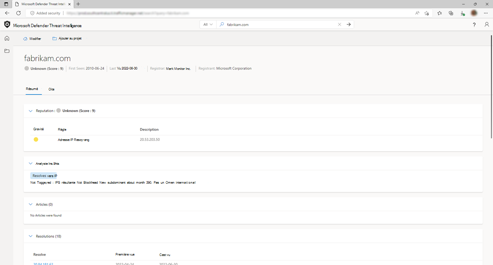

# Insights des analystes

Dans Microsoft Defender Threat Intelligence (Defender TI), la section Insights de l’analyste fournit des insights rapides sur l’artefact qui peuvent aider à déterminer l’étape suivante d’une investigation. Cette section répertorie tous les insights qui s’appliquent à l’artefact, ainsi que ceux qui ne s’appliquent pas pour une visibilité supplémentaire. Dans l’exemple ci-dessous, nous pouvons rapidement déterminer que l’adresse IP est routable, héberge un serveur web et a un port ouvert au cours des cinq derniers jours. En outre, le système affiche des règles qui n’ont pas été déclenchées, ce qui peut être également utile lors du démarrage d’une enquête.

## Types d’insights et questions d’analyste qu’ils peuvent résoudre

| Types d’insights d’analyste                      | Questions auxquelles ils peuvent répondre                                                                                                |
|--------------------------------------------|---------------------------------------------------------------------------------------------------------------------------|
| Liste bloquée                                | Quand le domaine, l’hôte ou l’adresse IP a-t-il été bloqué ?                                                                  |
|                                            | Combien de fois Defender TI a-t-il bloqué le domaine, l’hôte ou l’adresse IP ?                                                            |
| Inscription & mise à jour                       | Combien de jours, de mois, d’années le domaine a-t-il été inscrit ?                                                               |
|                                            | Quand l’enregistrement WHOIS du domaine a-t-il été mis à jour ?                                                                                 |
| Nombre d’adresses IP de sous-domaine                         | Combien d’adresses IP différentes sont associées aux sous-domaines du domaine ?                                                  |
| Nouvelles observations de sous-domaine                 | Quand Microsoft a-t-il observé pour la dernière fois un nouveau sous-domaine pour le domaine en question ?                                     |
| Résolution & inscrite | Le domaine interrogé existe-t-il ?                                                                                            |
|                                            | Le domaine est-il résolu en adresse IP ?                                                                                 |
| Nombre de domaines partageant l’enregistrement WHOIS | Quels autres domaines partagent le même enregistrement WHOIS ?                                                                           |
| Nombre de domaines partageant le serveur de noms  | Quels autres domaines partagent le même enregistrement de serveur de noms ?                                                                     |
| Analysé par RiskIQ                          | Quand cet hôte ou ce domaine a-t-il été analysé pour la dernière fois par Microsoft ?                                                                   |
| Domaine international                       | Le domaine est-il interrogé pour obtenir un nom de domaine international (IDN) ?                                                             |
| Bloqué par un tiers                 | Cet indicateur est-il bloqué par un tiers ?                                                                           |
| État du nœud de sortie tor                       | L’adresse IP dans les questions est-elle associée à The Onion Router Network (Tor) ?                                            |
| Ports ouverts détectés                        | Quand Microsoft a-t-il scané cette adresse IP lors du dernier port ?                                                                        |
| État du proxy                               | Quel est l’état du proxy de cet indicateur ?                                                                               |
| Hôte observé pour la dernière fois                         | L’adresse IP en question est-elle accessible sur Internet ?                                                                        |
| Héberge un serveur web                         | L’adresse IP a-t-elle un serveur DNS qui utilise ses ressources pour y résoudre le nom du serveur web approprié ? |

## Prochaines étapes

Pour plus d’informations, reportez-vous aux rubriques suivantes :

- [Score de réputation](reputation-scoring.md)
- [Utilisation de balises](using-tags.md)