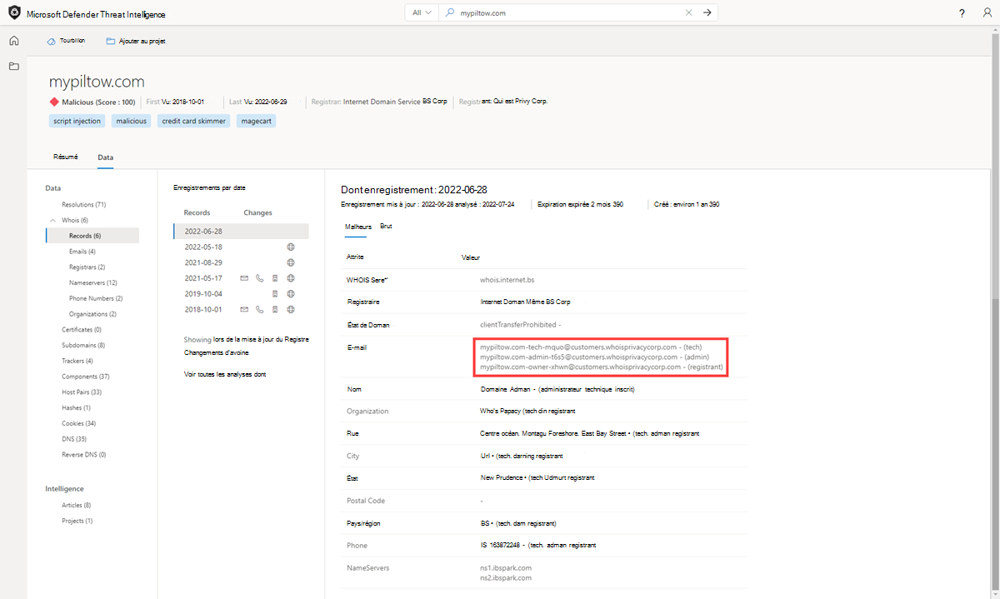
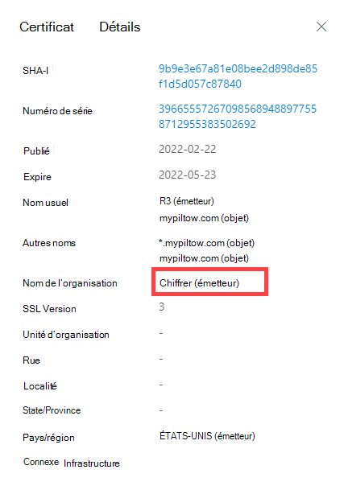
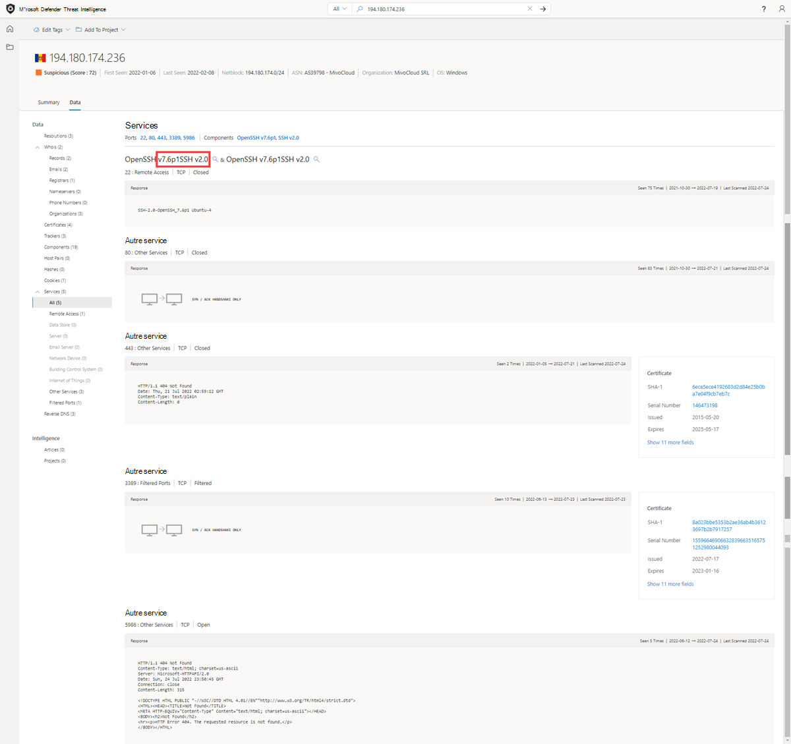
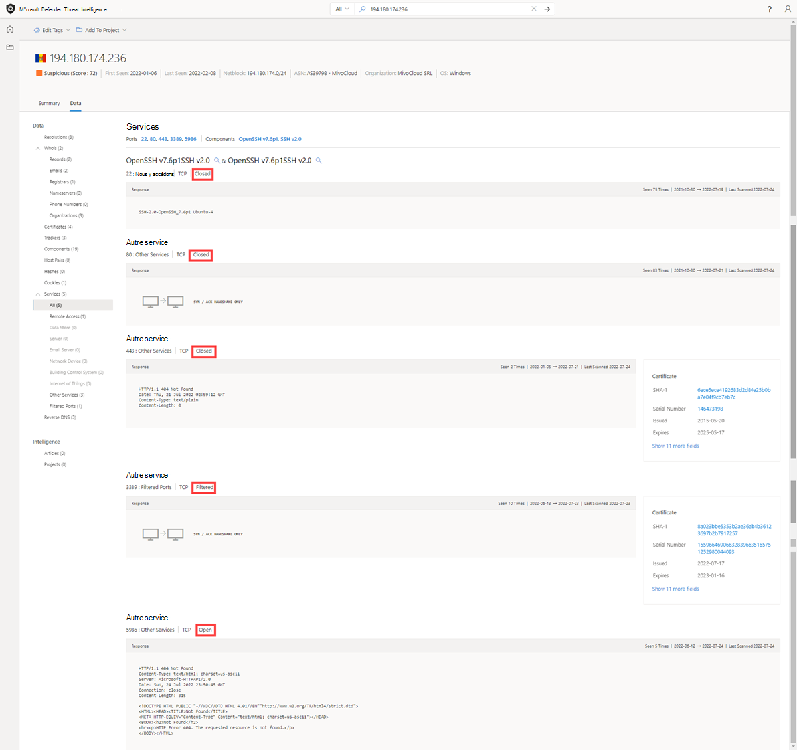

# Jeux de données

Microsoft centralise de nombreux jeux de données en une seule plateforme, Microsoft Defender Threat Intelligence (Defender TI), ce qui facilite l’analyse de l’infrastructure pour la communauté et les clients de Microsoft. L’objectif principal de Microsoft est de fournir autant de données que possible sur l’infrastructure Internet pour prendre en charge divers cas d’utilisation de la sécurité.

Microsoft collecte, analyse et indexe les données Internet pour aider les utilisateurs à détecter et à répondre aux menaces, à hiérarchiser les incidents et à identifier de manière proactive l’infrastructure des adversaires’ associée aux groupes d’acteurs ciblant leur organisation. Microsoft collecte des données Internet via son réseau de capteurs PDNS, un réseau proxy global d’utilisateurs virtuels, des analyses de port et tire parti de sources tierces pour les programmes malveillants et des données DNS (Domain Name System) ajoutées.

Ces données Internet sont classées en deux groupes distincts : traditionnel et avancé. Les jeux de données traditionnels incluent résolutions, whois, certificats SSL, sous-domaines, DNS, DNS inversé et services. Les jeux de données avancés incluent les dispositifs de suivi, les composants, les paires d’hôtes et les cookies. Les dispositifs de suivi, les composants, les paires d’hôtes et les jeux de données cookies sont collectés à partir de l’observation des Document Object Model (DOM) des pages web analysés. En outre, les composants et les dispositifs de suivi sont également observés à partir de règles de détection déclenchées en fonction des réponses de bannière des analyses de port ou des détails du certificat SSL.

## Résolutions

Le DNS passif (PDNS) est un système d’enregistrement qui stocke les données de résolution DNS pour un emplacement, un enregistrement et une période donnés. Ce jeu de données de résolution historique permet aux utilisateurs d’afficher les domaines résolus en adresse IP et inversement. Ce jeu de données permet une corrélation temporelle basée sur le chevauchement de domaine ou d’adresse IP.
PDNS peut permettre l’identification d’une infrastructure d’acteur de menace précédemment inconnue ou nouvellement levée. L’ajout proactif d’indicateurs aux listes de blocage peut couper les chemins de communication avant la tenue des campagnes. Les utilisateurs trouveront des données de résolution d’enregistrement dans l’onglet Jeu de données Résolutions et trouveront d’autres types d’enregistrements DNS dans l’onglet Jeu de données DNS.

Nos données de résolution PDNS incluent les éléments suivants :

- **Résoudre :** nom de l’entité de résolution (adresse IP ou domaine)
- **Emplacement :** emplacement dans lequel l’adresse IP est hébergée.
- **Réseau :** netblock ou sous-réseau associé à l’adresse IP.
- **ASN :** numéro de système autonome et nom de l’organisation
- **Première vue :** horodatage qui affiche la date à laquelle nous avons observé cette résolution pour la première fois.
- **Last Seen:** a timestamp that displays the date that we last observed this resolution.
- **Source :** source qui a activé la détection de la relation.
- **Balises :** toutes les balises appliquées à cet artefact dans le système Defender TI.

## Questions auxquelles ce jeu de données peut vous aider à répondre :

### Domaines
- Quand le domaine a-t-il été observé pour la première fois lors de la résolution d’une adresse IP par Defender TI ?

    

- Quand a été la dernière fois qu’il a été vu activement la résolution à une adresse IP par Defender TI?
    

- À quelles adresses IP s’adresse-t-il actuellement ?
    
  
### Adresses IP
- L’adresse IP est-elle routable ?

    

- De quel sous-réseau fait-il partie ?

    

- Y a-t-il un propriétaire associé au sous-réseau ?
  
    

- De quoi fait-il partie d’AS ?

    

- Quelle géolocalisation y a-t-il ?
    

## Whois

Des milliers de fois par jour, les domaines sont achetés et/ou transférés entre des individus et des organisations. Le processus pour que tout cela se produise est facile et ne prend que quelques minutes et environ 7 $ selon le fournisseur du bureau d’enregistrement. Au-delà des détails de paiement, vous devez fournir des informations supplémentaires sur vous-même, dont certaines sont stockées dans le cadre d’un enregistrement Whois une fois le domaine configuré. Il s’agirait d’une inscription de domaine public. Toutefois, il existe des services d’inscription de domaine privé, où vous pouvez masquer vos informations personnelles de l’enregistrement Whois de votre domaine. Dans ces situations, les informations du propriétaire du domaine sont sécurisées et remplacées par les informations de leur bureau d’enregistrement. Plus de groupes d’acteurs effectuent des inscriptions de domaine privé pour rendre plus difficile pour les analystes de trouver d’autres domaines qu’ils possèdent. Defender TI fournit une variété de jeux de données pour rechercher l’infrastructure partagée des acteurs lorsque les enregistrements Whois ne fournissent pas de prospects.

Whois est un protocole qui permet à quiconque d’interroger des informations sur un domaine, une adresse IP ou un sous-réseau. L’une des fonctions les plus courantes de Whois dans la recherche sur les infrastructures de menaces consiste à identifier ou à connecter des entités disparates basées sur des données uniques partagées dans les enregistrements Whois. Si vous lisez attentivement ou si vous avez acheté un domaine vous-même, vous avez peut-être remarqué que le contenu demandé auprès des bureaux d’enregistrement n’est jamais vérifié. En fait, vous auriez pu mettre n’importe quoi dans l’enregistrement (et beaucoup de gens font) qui serait alors affiché au monde.

Chaque enregistrement Whois comporte plusieurs sections différentes, qui peuvent toutes inclure des informations différentes. Les sections couramment trouvées incluent « bureau d’enregistrement », « inscrit », « administrateur » et « technique », chacune correspondant potentiellement à un contact différent pour l’enregistrement. La plupart du temps, ces données sont dupliquées dans plusieurs sections, mais dans certains cas, il peut y avoir de légères incohérences, en particulier si un acteur a commis une erreur. Lors de l’affichage des informations Whois dans Defender TI, vous verrez un enregistrement condensé qui déduplique toutes les données et note la partie de l’enregistrement d’où elles proviennent. Nous avons constaté que ce processus accélère considérablement le flux de travail de l’analyste et évite tout oubli des données. Les informations Whois de Defender TI sont alimentées par la base de données WhoisIQ™.

Nos données Whois incluent les éléments suivants :
- **Enregistrement mis à jour :** horodatage qui indique le jour de la dernière mise à jour d’un enregistrement Whois.
- **Dernière analyse :** date à laquelle le système Defender TI a analysé l’enregistrement pour la dernière fois.
- **Expiration :** date d’expiration de l’inscription, le cas échéant.
- **Créé :** l’âge de l’enregistrement Whois actuel.
- **Serveur Whois :** le serveur est configuré par un bureau d’enregistrement accrédité de l’ICANN pour acquérir des informations à jour sur les domaines qui y sont inscrits. 
- **Bureau d’enregistrement :** service de bureau d’enregistrement utilisé pour inscrire l’artefact.
- **État** du domaine : état actuel du domaine. Un domaine « actif » est en direct sur Internet. 
- **Email :** toutes les adresses e-mail trouvées dans l’enregistrement Whois et le type de contact auxquels chacune est associée (par exemple, administrateur, technologie).
- **Nom :** nom de tous les contacts dans l’enregistrement, et le type de contact avec lequel chacun est associé.
- **Organisation :** nom de toutes les organisations au sein de l’enregistrement, et le type de contact à laquelle chacune est associée.
- **Rue :** toutes les adresses postales associées à l’enregistrement et le type de contact à laquelle elle est associée.
- **Ville :** toute ville répertoriée dans une adresse associée à l’enregistrement et le type de contact à laquelle elle est associée.
- **État :** tous les états répertoriés dans une adresse associée à l’enregistrement et le type de contact à laquelle il est associé.
- **Code postal :** tous les codes postaux répertoriés dans une adresse associée à l’enregistrement et le type de contact à laquelle il est associé.
- **Pays :** tous les pays répertoriés dans une adresse associée à l’enregistrement et le type de contact à laquelle il est associé.
- **Téléphone :** tous les numéros de téléphone répertoriés dans l’enregistrement et le type de contact à laquelle il est associé.
- **Serveurs de noms :** serveurs de noms associés à l’entité inscrite.

## Recherches Whois actuelles

Le référentiel Whois actuel de Defender TI met en évidence tous les domaines de la collection Whois de Microsoft qui sont actuellement inscrits et associés à l’attribut Whois d’intérêt. Ces données mettent en évidence la date d’inscription et d’expiration du domaine, ainsi que l’adresse e-mail utilisée pour inscrire le domaine. Ces données sont affichées sous l’onglet Recherche Whois de la plateforme.

## Recherches historiques whois

Le référentiel Historique Whois de Defender TI permet aux utilisateurs d’accéder à toutes les associations de domaines historiques connues aux attributs Whois en fonction des observations du système. Ce jeu de données met en évidence tous les domaines associés à un attribut qu’un utilisateur ne peut pas afficher la première fois et la dernière fois que nous avons observé l’association entre le domaine et l’attribut interrogés. Ces données sont affichées dans un onglet distinct en regard de l’onglet Recherche Whois actuel.

**Questions auxquelles ce jeu de données peut vous aider à répondre :**

- Quel est l’âge du domaine ?

    

- Les renseignements semblent-ils protégés par la confidentialité ?

    

- L’une des données semble-t-elle unique ?

    

- Quels serveurs de noms sont utilisés ?

    

- S’agit-il d’un domaine de récepteur ?

    

- S’agit-il d’un domaine parqué ?

    

- S’agit-il d’un domaine honeypot ?

    

- Y a-t-il une histoire ?

    

- Y a-t-il de faux e-mails de protection de la vie privée ?

    

- Y a-t-il des faux noms dans le dossier Whois ?

- Avez-vous identifié d’autres E/S connexes à partir de la recherche sur des valeurs Whois potentiellement partagées entre domaines ?

    

## Certificats
Au-delà de la sécurisation de vos données, les certificats SSL constituent un excellent moyen pour les utilisateurs de connecter une infrastructure réseau disparate. Les techniques d’analyse modernes nous permettent d’effectuer des demandes de données sur chaque nœud sur Internet en quelques heures, ce qui signifie que nous pouvons facilement associer un certificat à une adresse IP qui l’héberge régulièrement.

Tout comme un enregistrement Whois, les certificats SSL nécessitent que l’utilisateur fournit des informations pour générer le produit final. En dehors du domaine, le certificat SSL est créé pour (sauf s’il est auto-signé), l’une des informations supplémentaires peut être composée par l’utilisateur. Lorsque les utilisateurs de Microsoft voient le plus de valeur à partir des certificats SSL, ce ne sont pas nécessairement les données uniques que quelqu’un peut utiliser lors de la génération du certificat, mais l’emplacement où il est hébergé.

Pour accéder à un certificat SSL, il doit être associé à un serveur web et exposé via un port particulier (le plus souvent 443). À l’aide d’analyses Internet de masse sur une base hebdomadaire, il est possible d’analyser toutes les adresses IP et d’obtenir n’importe quel certificat hébergé pour créer un référentiel historique de données de certificat. Le fait d’avoir une base de données d’adresses IP vers des mappages de certificats SSL permet aux utilisateurs d’identifier les chevauchements dans l’infrastructure.

Pour illustrer ce concept, imaginez qu’un acteur a configuré un serveur avec un certificat SSL auto-signé. Après plusieurs jours, les défenseurs deviennent sages dans leur infrastructure et bloquent le serveur web hébergeant du contenu malveillant. Au lieu de détruire tout leur travail, l’acteur copie simplement tout le contenu (y compris le certificat SSL) et les place sur un nouveau serveur. En tant qu’utilisateur, une connexion peut maintenant être établie à l’aide de la valeur SHA-1 unique du certificat pour indiquer que les deux serveurs web (un bloqué, un inconnu) sont connectés d’une manière ou d’une autre.

Ce qui rend les certificats SSL plus précieux, c’est qu’ils sont capables d’établir des connexions que les données DNS ou Whois passives peuvent manquer. Cela signifie plus de moyens de mettre en corrélation l’infrastructure malveillante potentielle et d’identifier les défaillances de sécurité opérationnelle potentielles des acteurs. Defender TI a collecté plus de 30 millions de certificats de 2013 à nos jours et fournit aux utilisateurs les outils nécessaires pour établir des corrélations sur le contenu et l’historique des certificats.

Les certificats SSL sont des fichiers qui lient numériquement une clé de chiffrement à un ensemble de détails fournis par l’utilisateur. À l’aide de techniques d’analyse Internet, Defender TI collecte des associations de certificats SSL à partir d’adresses IP sur différents ports. Ces certificats sont stockés à l’intérieur d’une base de données locale et nous permettent de créer une chronologie pour l’endroit où un certificat SSL donné est apparu sur Internet.

Nos données de certificat incluent les éléments suivants :

- **Sha1 :** Hachage de l’algorithme SHA1 pour une ressource de certificat SSL.
- **Première vue :** horodatage qui affiche la date à laquelle nous avons observé ce certificat pour la première fois sur un artefact.
- **Dernière vue :** horodatage qui affiche la date de la dernière observation de ce certificat sur un artefact.
- **Infrastructure :** toute infrastructure associée associée au certificat.

Lorsqu’un utilisateur développe un hachage SHA1, il peut voir des détails sur les éléments suivants, notamment :**
- **Numéro de série :** Numéro de série associé à un certificat SSL.
- **Délivré:** Date à laquelle un certificat a été émis.
- **Expire:** Date d’expiration d’un certificat.
- **Nom commun de l’objet :** Nom commun de l’objet pour tous les certificats SSL associés.
- **Nom commun de l’émetteur :** Nom commun de l’émetteur pour tous les certificats SSL associés.
- **Autre nom(s) de l’objet :** Tout autre nom commun pour le certificat SSL.
- **Autre nom(s) émetteur(s) :** Noms supplémentaires de l’émetteur.
- **Nom de l’organisation de l’objet :** Organisation liée à l’inscription de certificat SSL.
- **Nom de l’organisation de l’émetteur :** Nom de l’organisation qui a orchestré le problème d’un certificat.
- **Version SSL :** Version de SSL avec laquelle le certificat a été inscrit.
- **Unité d’organisation de l’objet :** Métadonnées facultatives qui indiquent le service au sein d’une organisation responsable du certificat.
- **Unité de l’organisation de l’émetteur :** Informations supplémentaires sur l’organisation qui émet le certificat.
- **Adresse de rue de l’objet :** Adresse postale où se trouve l’organisation.
- **Adresse de rue de l’émetteur :** Adresse postale où se trouve l’organisation émettrice.
- **Localité de l’objet :** Ville où se trouve l’organisation.
- **Localité de l’émetteur :** Ville où se trouve l’organisation émettrice.
- **État de l’objet/province :** État ou province où se trouve l’organisation.
- **État de l’émetteur/province :** État ou province où se trouve l’organisation émettrice.
- **Pays de l’objet :** Pays où se trouve l’organisation.
- **Pays émetteur :** Pays où se trouve l’organisation émettrice.
- **Infrastructure associée :** toute infrastructure associée associée au certificat.

**Questions auxquelles ce jeu de données peut vous aider à répondre :**

- À quelle autre infrastructure ce certificat a-t-il été associé ?

    

- Existe-t-il des points de données uniques dans le certificat qui serviraient de bons points de tableau croisé dynamique ?

    

- Le certificat est-il auto-signé ?

    

- Le certificat est-il fourni par un fournisseur gratuit ?

    

- Pendant quelle période le certificat a-t-il été observé en cours d’utilisation ?

    

## Sous-domaines

Un sous-domaine est un domaine Internet qui fait partie d’un domaine principal. Les sous-domaines sont également appelés « hôtes ». Par exemple,`docs.microsoft.com` est un sous-domaine de `microsoft.com`. Pour chaque sous-domaine, il peut y avoir un nouvel ensemble d’adresses IP auxquelles le domaine se résout. Il peut s’agir d’une excellente source de données pour la recherche d’une infrastructure associée.

Nos données de sous-domaine incluent les éléments suivants :

- **Nom d’hôte :** sous-domaine associé au domaine qui a fait l’objet d’une recherche.
- **Balises :** toutes les balises appliquées à cet artefact dans le système Defender TI.

**Questions auxquelles ce jeu de données peut vous aider à répondre :**

- Y a-t-il d’autres sous-domaines associés au domaine de niveau supérieur ?

    

- Des sous-domaines sont-ils associés à une activité malveillante ?

    

- S’il s’agit de votre domaine, les sous-domaines ne semblent-ils pas familiers ?

- Existe-t-il un modèle pour les sous-domaines répertoriés associés à d’autres domaines malveillants ?

- Le pivotage de chaque sous-domaine révèle-t-il un nouvel espace IP qui n’était pas précédemment associé à la cible ?

- Quelle autre infrastructure non liée ne correspond pas au domaine racine ?

## Trackers

Les suivis sont des codes ou des valeurs uniques trouvés dans les pages web et souvent utilisés pour suivre l’interaction utilisateur. Ces codes peuvent être utilisés pour mettre en corrélation un groupe disparate de sites web avec une entité centrale. Souvent, les acteurs copient le code source du site web d’une victime qu’ils cherchent à emprunter l’identité d’une campagne de hameçonnage. Rarement les acteurs prendront le temps de supprimer ces ID qui permettent aux utilisateurs d’identifier ces sites frauduleux à l’aide du jeu de données Trackers de Microsoft. Les acteurs peuvent également déployer des ID de suivi pour voir le succès de leurs campagnes de cyberattaques. Cela est similaire aux spécialistes du marketing lorsqu’ils tirent parti des ID d’authentification unique, tels qu’un ID de suivi Google Analytics, pour suivre le succès de leur campagne marketing.

Le jeu de données Tracker de Microsoft inclut des ID de fournisseurs tels que Google, Yandex, Mixpanel, New Relic, Clicky et continue de croître régulièrement.

Nos données de suivi incluent les éléments suivants :

- **Nom d’hôte :** nom d’hôte qui héberge l’infrastructure où le suivi a été détecté.
- **Première vue :** horodatage qui affiche la date à laquelle nous avons observé ce suivi pour la première fois sur l’artefact.
- **Last Seen:** a timestamp that displays the date that we last observed this tracker on the artifact.
- **Type :** type de suivi détecté (par exemple, GoogleAnalyticsID, JarmHash).
- **Valeur :** valeur d’identification pour le suivi.
- **Balises :** toutes les balises appliquées à cet artefact dans le système Defender TI.

**Questions auxquelles ce jeu de données peut vous aider à répondre :**

- Existe-t-il d’autres ressources utilisant les mêmes ID d’analyse ?

    

- Ces ressources sont-elles associées à l’organisation ou tentent-elles de mener une attaque en contrefaçon ?

- Existe-t-il un chevauchement entre les trackers : sont-ils partagés avec d’autres sites web ?

- Quels sont les types de suivis trouvés dans la page web ?

    

- Quelle est la durée des traceurs ?

    

- Quelle est la fréquence des modifications pour les valeurs de suivi : viennent-elles, vont-elles ou restent-elles ?

- Existe-t-il des traceurs liant des logiciels de clonage de site web (MarkOfTheWeb ou HTTrack) ?

    

- Existe-t-il des traceurs qui se lient à des programmes malveillants de serveur C2 (JARM) ?

    

## Composants

Les composants Web sont des détails décrivant une page web ou une infrastructure serveur extraite de Microsoft effectuant une analyse ou une analyse web. Ces composants permettent à un utilisateur de comprendre la composition d’une page web ou la technologie et les services qui pilotent une infrastructure spécifique.
Le pivoting sur des composants uniques peut trouver l’infrastructure des acteurs ou d’autres sites compromis. Les utilisateurs peuvent également comprendre si un site web peut être vulnérable à une attaque ou à une compromission spécifique en fonction des technologies qu’il exécute.

Nos données de composant incluent les éléments suivants :

- **Nom d’hôte :** nom d’hôte qui héberge l’infrastructure où le composant a été détecté.
- **Première vue :** horodatage de la date à laquelle nous avons observé ce composant pour la première fois sur l’artefact.
- **Last Seen:** a timestamp of the date that we last observed this component on the artifact.
- **Catégorie :** type de composant détecté (par exemple, système d’exploitation, framework, accès à distance, serveur).
- **Nom + Version :** nom du composant et version en cours d’exécution sur l’artefact (par exemple, Microsoft IIS (v8.5).
- **Balises :** toutes les balises appliquées à cet artefact dans le système Defender TI.

**Questions auxquelles ce jeu de données peut vous aider à répondre :**

- Quelle infrastructure vulnérable utilisez-vous ?

    

    

    Magento v1.9 est tellement daté que Microsoft n’a pas pu trouver de documentation fiable pour cette version particulière.

- Quels sont les composants web uniques utilisés par l’acteur de menaces qui peuvent les suivre vers d’autres domaines ?

- Les composants sont-ils marqués comme malveillants ?

- Quel est le nombre de composants web identifiés ?

    

- Y a-t-il des technologies uniques ou étranges que l’on ne voit pas souvent ?

    

- Existe-t-il de fausses versions de technologies spécifiques ?

- Quelle est la fréquence des modifications apportées aux composants web – souvent ou rarement effectuées ?

- Existe-t-il des bibliothèques suspectes connues pour être abusées ?

- Y a-t-il des technologies avec des vulnérabilités qui leur sont associées ?

## Paires d’hôtes

Les paires d’hôtes sont deux éléments d’infrastructure (un parent et un enfant) qui partagent une connexion observée à partir de l’analyse web d’un utilisateur virtuel. La connexion peut aller d’une redirection de niveau supérieur (HTTP 302) à quelque chose de plus complexe comme une référence de source d’iframe ou de script.

Nos données de paire d’hôtes incluent les éléments suivants :

- **Nom d’hôte parent :** hôte qui fait référence à une ressource ou qui « tend la main » à l’hôte enfant
- **Nom d’hôte enfant :** hôte appelé par l’hôte parent
- **Première vue :** horodatage de la date à laquelle nous avons observé une relation avec l’hôte.
- **Last Seen:** a timestamp of the date that we last observed a relationship with the host.
- **Cause :** type de connexion entre le nom d’hôte parent et le nom d’hôte enfant. Les causes potentielles incluent les connexions script.src, link.href, redirect, img.src, unknown, xmlhttprequest, a.href, finalRedirect, css.import ou parentPage.
- **Balises :** toutes les balises appliquées à cet artefact dans le système Defender TI.

**Questions auxquelles ce jeu de données peut vous aider à répondre :**

- L’un des artefacts connectés a-t-il été bloqué ?
- L’un des artefacts connectés a-t-il été marqué (hameçonnage, APT, malveillant, suspect, nom de l’acteur de menace) ?
- Cet hôte redirige-t-il les utilisateurs vers du contenu malveillant ?

    

- Les ressources qui extrayent des images ou des CSS pour configurer des attaques en violation ?

    

- Les ressources extraient-elles un script ou font-elles référence à un link.href pour configurer une attaque Magecart ou écrémage ?
    

- Où les utilisateurs sont-ils redirigés depuis/vers ?

- Quel type de redirection a lieu ?

## Cookies

Les cookies sont de petits éléments de données envoyés d’un serveur à un client lorsque l’utilisateur parcourt Internet. Ces valeurs contiennent parfois un état pour l’application ou de petits bits de données de suivi. Defender TI met en évidence et indexe les noms de cookies observés lors de l’analyse d’un site web et permet aux utilisateurs d’explorer partout où nous avons observé des noms de cookies spécifiques dans son analyse et sa collecte de données. Les cookies sont également utilisés par les acteurs malveillants pour effectuer le suivi des victimes infectées ou stocker les données à utiliser ultérieurement.

Nos données de cookie incluent les éléments suivants :

- **Nom d’hôte :** infrastructure hôte associée au cookie.
- **Première vue :** horodatage de la date à laquelle nous avons observé ce cookie sur l’artefact.
- **Last Seen:** a timestamp of the date that we last observed this cookie on the artifact.
- **Nom :** nom du cookie (par exemple, JSESSIONID, SEARCH_NAMESITE).
- **Domaine :** domaine associé au cookie.
- **Balises :** toutes les balises appliquées à cet artefact dans le système Defender TI.

**Questions auxquelles ce jeu de données peut vous aider à répondre :**

- Quels autres sites web émettent les mêmes cookies ?

    

- Quels autres sites web font le suivi des mêmes cookies ?
    

- Le domaine de cookie correspond-il à votre requête ?

- Quel est le nombre de cookies associés à l’artefact ?

    

- Existe-t-il des noms de cookies ou des domaines uniques ?

- Quelles sont les périodes associées aux cookies ?

- Quelle est la fréquence des cookies récemment observés ou des modifications associées aux cookies ?

## Services

Les noms de service et les numéros de port sont utilisés pour faire la distinction entre les différents services qui s’exécutent sur des protocoles de transport tels que TCP, UDP, DCCP et SCTP. Les numéros de port peuvent suggérer le type d’application en cours d’exécution sur un port particulier. Toutefois, les applications ou services peuvent être modifiés pour utiliser un port différent pour masquer ou masquer le service ou l’application sur une adresse IP. Connaître le port et les informations d’en-tête/bannière peut identifier la véritable application/service et la combinaison des ports utilisés. Defender TI affiche 14 jours d’historique dans l’onglet Services, affichant la dernière réponse de bannière associée à un port observé.

Nos données de services incluent les éléments suivants :

- Ports ouverts observés
- Numéros de port
- Composants
- Nombre de fois où le service a été observé
- Lors de la dernière analyse du port
- Connexion de protocole
- État du port
  - Ouvrir
  - Filtrée
  - Fermé
- Réponse de bannière

**Questions auxquelles ce jeu de données peut vous aider à répondre :**

- Quelles applications s’exécutent sur un port particulier pour une adresse IP donnée ?

    

- Quelle version des applications sont utilisées ?

    

- Des modifications récentes ont-elles été apportées à l’état ouvert, filtré ou fermé pour un port donné ?

    

- Un certificat a-t-il été associé à la connexion ?

    

- Les technologies vulnérables ou dépréciées sont-elles utilisées sur un bien donné ?

    

    

- Les informations exposées par un service en cours d’exécution peuvent-ils être utilisées à des fins néfastes ?

- Les meilleures pratiques de sécurité sont-ils suivies ?

## DNS

Microsoft a collecté des enregistrements DNS au fil des ans, fournissant aux utilisateurs des informations sur les enregistrements DNS (Mail Exchange), les enregistrements de serveur de noms (NS), les enregistrements de texte (TXT), les enregistrements SOA (Start of Authority), les enregistrements CNAME (Canonical Name) et les enregistrements de pointeur (PTR). L’examen des enregistrements DNS peut être utile pour identifier l’infrastructure partagée utilisée par les acteurs dans les domaines qu’ils possèdent. Par exemple, les groupes d’acteurs ont tendance à utiliser les mêmes serveurs de noms pour segmenter leur infrastructure ou les mêmes serveurs d’échange de courrier pour administrer leur commande et leur contrôle.

Nos données DNS incluent les éléments suivants :

- **Valeur :** enregistrement DNS associé à l’hôte.
- **Première vue :** horodatage qui affiche la date à laquelle nous avons observé cet enregistrement pour la première fois sur l’artefact.
- **Last Seen:** a timestamp that displays the date that we last observed this record on the artifact.
- **Type :** type d’infrastructure associé à l’enregistrement. Les options possibles incluent les serveurs de messagerie (MX), les fichiers texte (TXT), les serveurs de noms (NS), CNAMES et les enregistrements SOA (Start of Authority).
- **Balises :** toutes les balises appliquées à cet artefact dans le système Defender TI.

 

**Questions auxquelles ce jeu de données peut vous aider à répondre :**

- Quels autres éléments d’infrastructure sont directement liés à l’indicateur que je recherche ?
- Comment l’infrastructure a-t-elle changé au fil du temps ?
- Le propriétaire du domaine utilise-t-il les services d’un réseau de distribution de contenu ou d’un service de protection de marque ?
- Quelles autres technologies l’organisation associée peut-elle utiliser au sein de son réseau ?

## DNS inversé

Alors qu’une recherche DNS vers l’avant interroge l’adresse IP d’un certain nom d’hôte, une recherche DNS inversée interroge un nom d’hôte spécifique d’une adresse IP. Ce jeu de données affiche des résultats similaires au jeu de données DNS. L’examen des enregistrements DNS peut être utile pour identifier l’infrastructure partagée utilisée par les acteurs dans les domaines qu’ils possèdent. Par exemple, les groupes d’acteurs ont tendance à utiliser les mêmes serveurs de noms pour segmenter leur infrastructure ou les mêmes serveurs d’échange de courrier pour administrer leur commande et leur contrôle.

Nos données DNS inversées incluent les éléments suivants :

- **Valeur :** valeur de l’enregistrement DNS inversé.
- **Première vue :** horodatage de la date à laquelle nous avons observé cet enregistrement sur l’artefact.
- **Last Seen:** a timestamp of the date that we first observed this record on the artifact.
- **Type :** type d’infrastructure associé à l’enregistrement. Les options possibles incluent les serveurs de messagerie (MX), les fichiers texte (TXT), les serveurs de noms (NS), CNAMES et les enregistrements SOA (Start of Authority).
- **Balises :** toutes les balises appliquées à cet artefact dans le système Defender TI.

**Questions Auxquelles ce jeu de données peut aider à répondre :**

- Quels enregistrements DNS ont observé cet hôte ?
- Comment l’infrastructure qui a observé cet hôte a-t-elle changé au fil du temps ?

## Prochaines étapes

Pour plus d’informations, reportez-vous aux rubriques suivantes :

- [Recherche et pivotage](searching-and-pivoting.md)
- [Tri, filtrage et téléchargement de données](sorting-filtering-and-downloading-data.md)
- [Chaînage d’infrastructure](infrastructure-chaining.md)
- [Tutoriel : Collecte des informations sur les menaces et du chaînage d’infrastructure](gathering-threat-intelligence-and-infrastructure-chaining.md)
