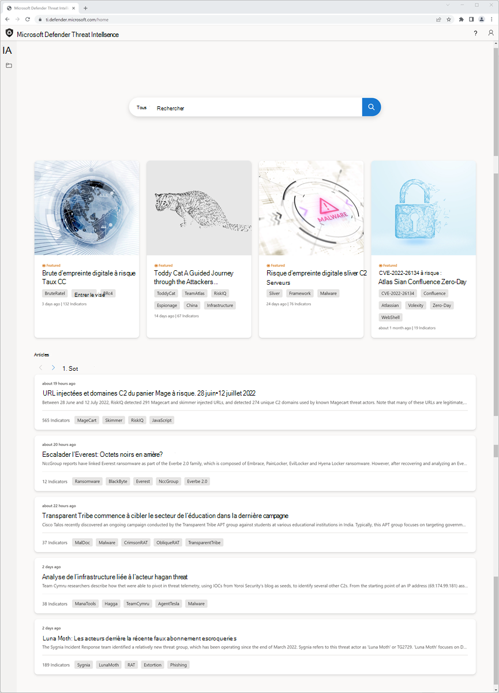
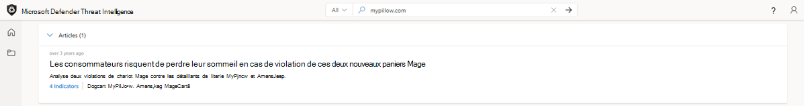
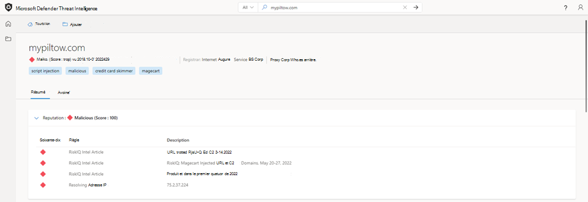
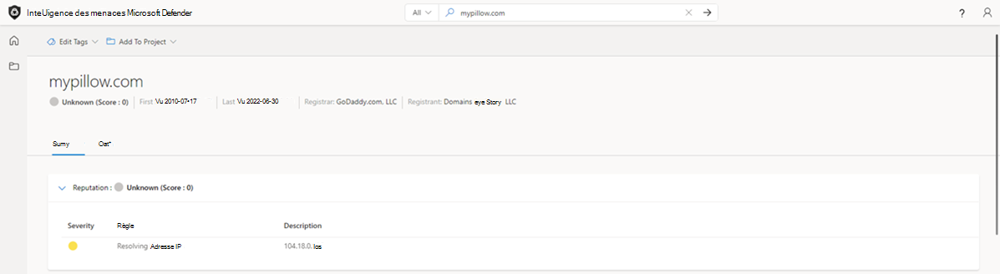
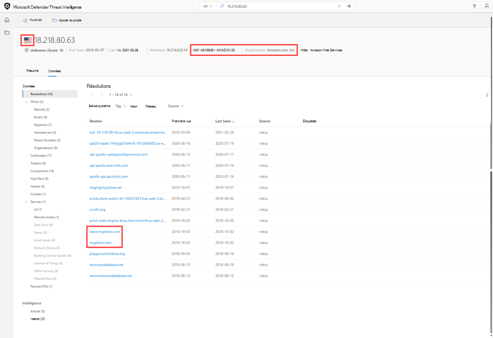
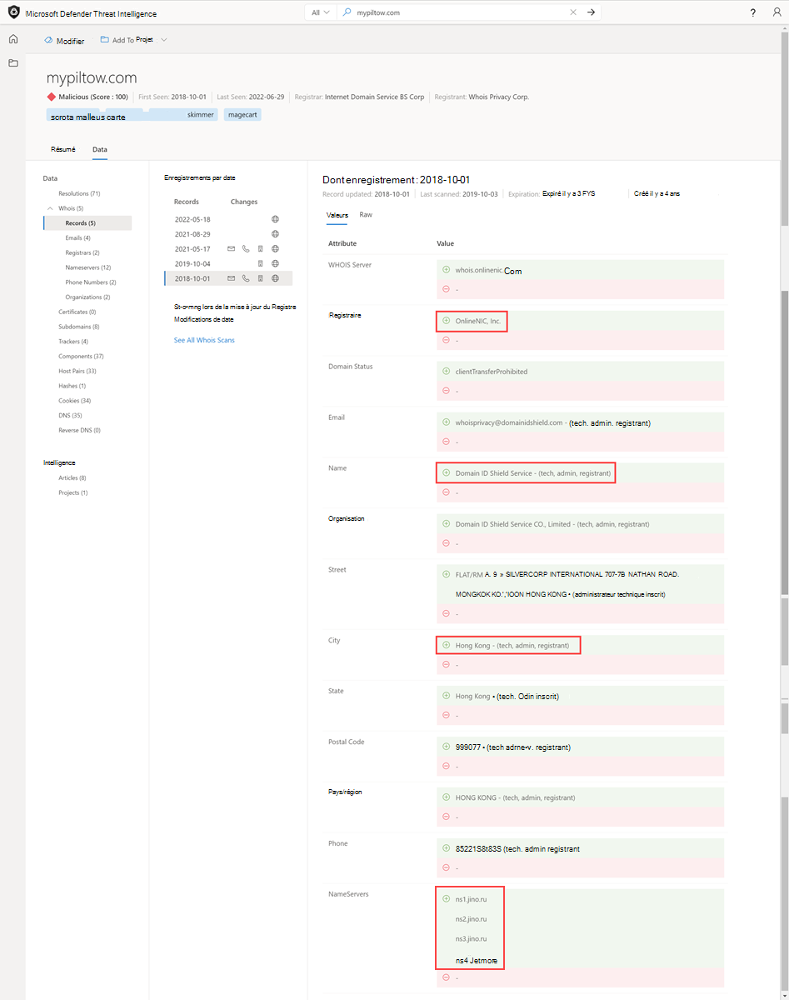
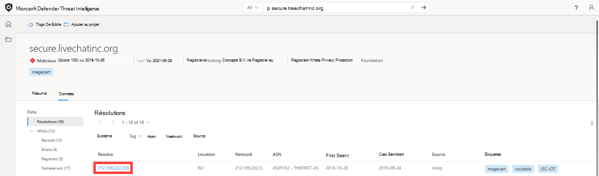
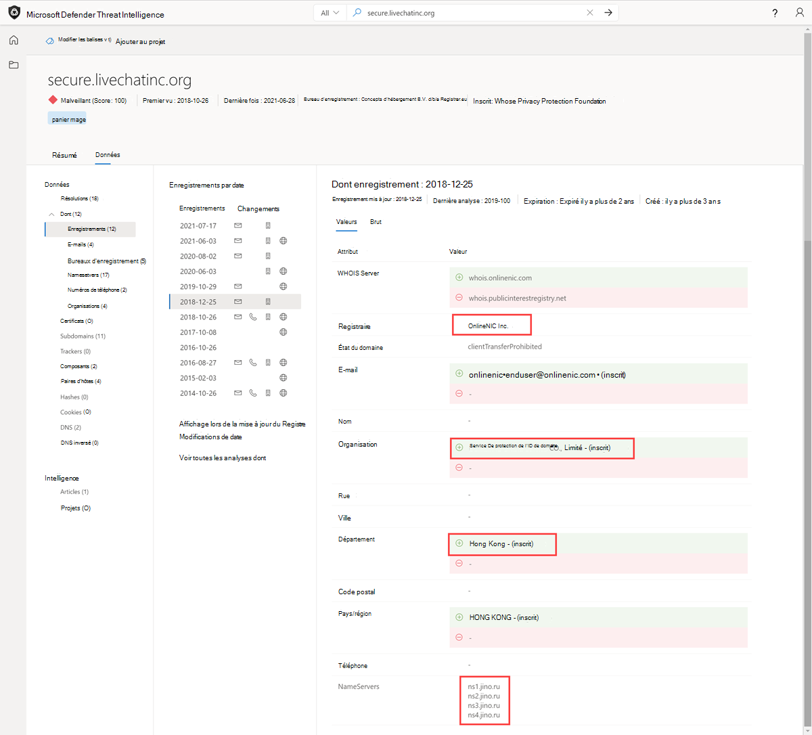
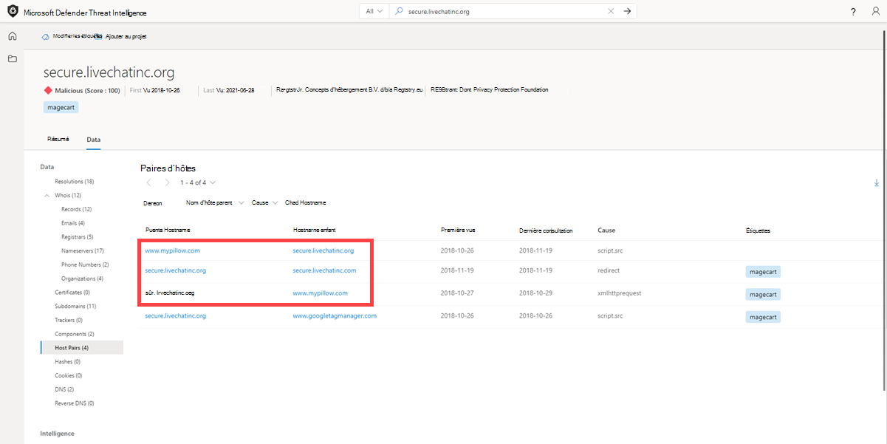

# Tutoriel : Collecte des informations sur les menaces et du chaînage d’infrastructure

Dans ce didacticiel, vous allez apprendre à :
- Effectuer plusieurs types de recherches d’indicateurs et collecter des informations sur les menaces et les adversaires

  

## Prerequisites

- Un compte Microsoft Azure Active Directory ou personnel. [Connexion ou création d’un compte](https://signup.microsoft.com/)
- Une licence Premium Microsoft Defender Threat Intelligence (Defender TI).

    > [!NOTE]
    > Les utilisateurs sans licence Defender TI Premium pourront toujours se connecter au portail Defender Threat Intelligence et accéder à notre offre Defender TI gratuite.

## Clause d’exclusion de responsabilité

Microsoft Defender Threat Intelligence (Defender TI) peut inclure des observations en temps réel et des indicateurs de menace en temps réel, y compris l’infrastructure malveillante et les outils d’attaque contre les menaces. Toute recherche d’adresse IP et de domaine au sein de notre plateforme Defender TI est sécurisée.

Microsoft partagera des ressources en ligne (par exemple, des adresses IP, des noms de domaine) qui doivent être considérées comme des menaces réelles présentant un danger clair et présent.

Nous demandons aux utilisateurs d’utiliser leur meilleur jugement et de réduire les risques inutiles lors de l’interaction avec des systèmes malveillants lors de l’exécution du didacticiel ci-dessous. Notez que Microsoft a travaillé pour réduire les risques en désactivation des adresses IP malveillantes, des hôtes et des domaines.

## Avant de commencer
Comme l’indique la clause d’exclusion de responsabilité ci-dessus, les indicateurs suspects et malveillants ont été refusés pour votre sécurité. Supprimez les crochets des adresses IP, des domaines et des hôtes lors de la recherche dans Defender TI. Ne recherchez pas ces indicateurs directement dans votre navigateur.

## Effectuer plusieurs types de recherches d’indicateurs et collecter des informations sur les menaces et les adversaires

Dans ce didacticiel, vous allez effectuer une série d’étapes pour [chaîner l’infrastructure](infrastructure-chaining.md) ensemble des indicateurs de compromission (IOC) liés à une violation Magecart et collecter des informations sur les menaces et les adversaires en cours de route. Le chaînage d’infrastructure tire parti de la nature hautement connectée d’Internet pour étendre un IOC en plusieurs en fonction des détails qui se chevauchent ou des caractéristiques partagées. La création de chaînes d’infrastructure permet aux chasseurs de menaces ou aux intervenants en cas d’incident de profiler la présence numérique d’un adversaire, ce qui lui permet de pivoter rapidement sur ces jeux de données pour créer un contexte autour d’un incident ou d’une enquête, ce qui permet un tri plus efficace des alertes et des actions en cas d’incident au sein d’une organisation.

**Personnages pertinents :** Analyste du renseignement sur les menaces, Chasseur de menaces, Répondeur d’incidents, Analyste des opérations de sécurité

### Violation de Magecart

Microsoft a profilé et suivi les activités de Magecart, un syndicat de cybergroupes criminels derrière des centaines de violations de plateformes de vente au détail en ligne en plaçant des écumeurs numériques sur des sites d’e-commerce compromis.

Pour ce faire, ils injectent un script conçu pour voler des données sensibles que les consommateurs entrent dans des formulaires de paiement en ligne sur des sites web d’e-commerce directement ou par le biais de fournisseurs tiers compromis dont les sites web peuvent dépendre pour faire fonctionner leurs sites.

En octobre 2018, ils ont infiltré le site web en ligne de MyPillow, mypillow.com, pour voler des informations de paiement en injectant un script dans leur magasin web hébergé sur un domaine typo-squat contenant le skimmer, mypiltow.com.

La violation de MyPillow était une attaque en deux étapes, le premier écumeur n’étant actif que pendant une courte période avant d’être identifié comme illicite et supprimé, mais les attaquants avaient toujours accès au réseau de MyPillow et, le 26 octobre 2018, Microsoft a observé qu’ils avaient inscrit un nouveau domaine, livechatinc[.] Org

Les acteurs Magecart enregistrent généralement une violation de domaine pour le rendre aussi similaire que possible au domaine légitime, de sorte que si vous examinez le code JavaScript, sauf si vous regardez vraiment attentivement, vous ne remarquerez peut-être pas qu’ils ont injecté leur propre script qui capture les informations de paiement par carte de crédit et les envoie à leur propre infrastructure,  comme un moyen de se cacher essentiellement.
Toutefois, étant donné que nos utilisateurs virtuels capturent le DOM et trouvent tous les liens dynamiques et les modifications apportées par JavaScript à partir des analyses sur le serveur principal, nous avons pu détecter cette activité et identifier ce faux domaine qui hébergeait le script injecté dans le webstore MyPillow.

1. Accédez au [portail Defender Threat Intelligence](https://ti.defender.microsoft.com/).
2. Effectuez l’authentification Microsoft pour accéder au portail.
3. Recherchez « mypillow.com » dans la page d’accueil threat intelligence de Defender TI.
    a. Quels articles sont associés à ce domaine ?
    - Les consommateurs peuvent perdre le sommeil de ces deux violations Magecart

      

4. Sélectionnez l’article « Les consommateurs peuvent perdre le sommeil au cours de ces deux violations Magecart ».
    a. Quelles informations sont disponibles sur cette campagne connexe ?
      - Cet article a été publié le 20 mars 2019 et fournit des insights sur la façon dont MyPillow a été violé par le groupe d’acteurs de menace Magecart en octobre 2018. L’article détaille la façon dont l’attaque a été exécutée.
5. Sélectionnez l’onglet Indicateurs publics. a. Quels sont les E/S répertoriées en lien avec cette campagne ?
      - amerisleep.github[.] Io
      - cmytuok[.] Retour au début
      - livechatinc[.] Org
      - mypiltow[.] Com
6. Sélectionnez Tout dans la liste déroulante de la barre de recherche et interrogez « mypillow.com ». Accédez ensuite à l’onglet Données. a. a. Quel jeu de données peut être utile pour trouver des preuves d’une injection de script ?
     - Les paires d’hôtes révèlent les connexions entre les sources de données traditionnelles des sites web (pDNS, Whois) et vous permettent de voir où vos ressources sont utilisées et inversement.
7. Sélectionnez le panneau Données des paires d’hôtes, triez par premier aperçu et filtrez par script.src comme cause. Effectuez une page jusqu’à ce que vous trouviez les relations de paire d’hôtes qui ont eu lieu en octobre 2018.
    a. Remarquez-vous des domaines typosquat mypillow ?
      - Notez que mypillow[.] com extrait du contenu via un script à partir du typosquat, mypiltow.com (du 3 au 5 octobre) comme preuve de la violation de l’injection de script

          
8. Pivoter sur 'mypiltow[.] com'.
    a. À première vue, qu’est-ce qui semble différent de ce domaine par rapport au domaine de mypillow.com ?
      - Réputation : malveillante, alors que la réputation de mypillow.com est inconnue

        

        
9. Accédez à l’onglet Données et, à partir des résultats des résolutions, désactivez l’adresse IP que mypiltow[.] com résolu au cours du mois d’octobre 2018. Répétez cette étape pour mypillow.com également.
    a. Que remarquez-vous au sujet des différences d’adresses IP entre mypillow.com et mypiltow[.] com en octobre 2018 ?
      - Adresse IP, 195.161.41[.] 65, mypiltow[.] com avait résolu à, est hébergé en Russie.
      - ASN différent utilisé.

          

          
10. Faites défiler jusqu’à la section Articles.
    a. Quels autres articles ont été publiés en rapport avec mypiltow.com ?
    - RiskIQ: Magecart Injected URLs and C2 Domains, 3-14 juin 2022
    - RiskIQ: Magecart injected URLs and C2 Domains, 20-27 mai 2022
    - Tendances de l'& Magecart des matières premières au premier trimestre de 2022
    - RiskIQ : Activité Magecart Group 8 début 2022
    - Magecart Group 8 Immobilier : Modèles d’hébergement associés au groupe Skimming
    - Kit inter-écrémage utilisé dans les attaques par homoglyphe
    - Le groupe Magecart 8 se fond dans NutriBullet.com s’ajoutant à leur liste croissante de victimes

     
11. Passez en revue chacun des articles supplémentaires de l’étape 9.
    a. Quelles informations supplémentaires pouvez-vous trouver sur le groupe d’acteurs de menace Magecart ? (cibles, TTP, IOC supplémentaires, etc.)
12. Accédez à l’onglet Données, sélectionnez le panneau Données Whois et comparez les informations Whois entre « mypillow.com » et « mypiltow[.] com' a. Quelles sont les valeurs Whois différentes ?
      - mypillow.com
        1. Si vous sélectionnez l’enregistrement Whois à partir d’octobre 2011, vous constaterez que le domaine appartient clairement à My Pillow Inc.

            
        2. mypiltow[.] Com
        3. Si vous sélectionnez l’enregistrement Whois à partir d’octobre 2018, vous constaterez que mypiltow[.] com a été enregistré à Hong Kong, chine et est protégé par la confidentialité par Domain ID Shield Service CO.
        4. mypiltow[.] bureau d’enregistrement de com est OnlineNIC, Inc.

            

    b. Ce qui semble suspect jusqu’à présent au sujet de mypiltow[.] com donné les enregistrements A et whois détails que nous avons analysés?
      - Lors de l’évaluation si mypiltow[.] com peut être une infrastructure d’entreprise légitime, un analyste devrait trouver étrange qu’une adresse IP russe est principalement protégée par un service de confidentialité chinois pour une société basée aux États-Unis.
13. Rechercher 'livechatinc[.] dans la page d’accueil threat intelligence de Defender TI.
    a. Quels sont les nouveaux articles associés à ce domaine que nous n’avons pas vus lors de la recherche mypillow.com dans la partie 1 ?
      - Le groupe Magecart 8 se fond dans NutriBullet.com s’ajoutant à leur liste croissante de victimes
14. Sélectionnez l’article Magecart Group 8 Blends in NutriBullet.com Adding To Their Growing List of Victims.
    a. Quelles informations sont disponibles sur cette campagne connexe ?
      - L’article « Magecart Group 8 Blends into NutriBullet.com Adding To Their Growing List of Victims » a été publié le 18 mars 2020. Dans cet article, nous découvrons que Nutribullet, Amerisleep, ABS-CBN ont également été victimes du groupe d’acteurs Magecart threat.
15. Sélectionnez l’onglet Indicateurs publics. a. Quels sont les E/S répertoriées en lien avec cette campagne ?
      - URL
        1. hxxps://coffemokko[.] com/tr/, hxxps://freshdepor[.] com/tr/, hxxps://prodealscenter[.] com/tr/, hxxps://scriptoscript[.] com/tr/, hxxps://swappastore[.] com/tr/
        2. Domaines
            - 3lift[.] org, abtasty[.] net, adaptivecss[.] org, adorebeauty[.] org, all-about-baskets[.] org, amerisleep.github[.] io, ar500arnor[.] com, authorizecdn[.] com, bannerbuzz[.] info, battery-force[.] org, batterynart[.] com, blackriverimaging[.] org, braincdn[.] org, btosports[.] net, cdnassels[.] com, cdnmage[.] com, chicksaddlery[.] net, childsplayclothing[.] org, christohperward[.] org, citywlnery[.] org, closetlondon[.] org, cmytuok[.] top, coffemokko[.] com, coffetea[.] org, configsysrc[.] info, dahlie[.] org, davidsfootwear[.] org, dobell[.] su, elegrina[.] com, energycoffe[.] org, energytea[.] org, etradesupply[.] org, exrpesso[.] org, foodandcot[.] com, freshchat[.] info, freshdepor[.] com, greatfurnituretradingco[.] org, info-js[.] link, jewsondirect[.] com, js-cloud[.] com, kandypens[.] net, kikvape[.] org, labbe[.] biz, lamoodbighats[.] net, link js[.] link, livechatinc[.] org, londontea[.] net, mage-checkout[.] org, magejavascripts[.] com, magescripts[.] pw, magesecuritys[.] com, majsurplus[.] com, map-js[.] link, mcloudjs[.] com, mechat[.] info, melbounestorm[.] com, misshaus[.] org, mylrendyphone[.] com, mypiltow[.] com, nililotan[.] org, oakandfort[.] org, ottocap[.] org, parks[.] su, paypaypay[.] org, pmtonline[.] su, prodealscenter[.] com, replacemyremote[.] org, sagecdn[.] org, scriptoscript[.] com, security-payment[.] su, shop-rnib[.] org, slickjs[.] org, slickmin[.] com, smart-js[.] link, swappastore[.] com, teacoffe[.] net, top5value[.] com, track-js[.] link, ukcoffe[.] com, verywellfitnesse[.] com, walletgear[.] org, webanalyzer[.] net, zapaljs[.] com, zoplm[.] Com

16. Recherchez mypillow.com dans la page d’accueil Threat Intelligence de Defender TI et sélectionnez l’onglet Données. Sélectionnez le panneau Données des paires d’hôtes. Triez par first seen et localisez les relations de paire d’hôtes qui se sont produites en octobre 2018.

    a. Remarquez-vous une relation de script similaire entre mypillow.com et secure.livechatinc[.] organisation qui reflète la même relation mypillow.com eue avec mypiltow[.] Com?
      - Remarquez comment www.mypillow.com a été observé pour la première fois en atteignant secure.livechatinc[.] org le 26/10/2018, car une requête GET de script a été observée de www.mypillow.com à secure.livechatinc[.] Org. Cette relation a duré jusqu’au 19/11/2018.

            ii. En outre, secure.livechatinc[.] l’organisation a contacté www.mypillow.com pour accéder au serveur www.mypillow.com (xmlhttprequest).
17. Passez en revue les relations de paire d’hôtes de mypillow.com.
    a. N mypillow.com a-t-il des relations de paire d’hôtes avec un nom de domaine similaire à secure.livechatinc[.] Org?
      - Oui. Il existe plusieurs types de relations observées mypillow.com hôtes avec les domaines suivants :
        1. cdn.livechatinc[.] com, secure.livechatinc[.] com, api.livechatinc[.] Com
     - Les causes de la relation sont les suivantes :
        1. script.src
        2. iframe.src
        3. unknown
        4. topLevelRedirect
        5. img.src
        6. xmlhttprequest
      - Livechat est un service de conversation de support en direct que les détaillants en ligne peuvent ajouter à leurs sites web. Il s’agit donc d’une ressource tierce et elle est utilisée par de nombreuses plateformes de commerce électronique, y compris MyPillow. Ce faux domaine est un peu plus intéressant parce que leur site officiel est en fait livechatinc.com. Par conséquent, dans ce cas, ils ont utilisé un typosquat de domaine de niveau supérieur pour masquer le fait qu’ils ont placé un deuxième écumeur sur le site Web MyPillow.
18. Go back et trouver une relation de paire d’hôtes avec « secure.livechatinc[.] org' et pivotez sur ce nom d’hôte.
    a. À quelle adresse IP cet hôte s’est-il résolu en octobre 2018 ?
      - 212.109.222[.] 230

        
      - Notez que cette adresse IP est également hébergée en Russie et que l’organisation ASN est JSC IOT.

        
19. Rechercher « secure.livechatinc[.] org' dans la page d’accueil Threat Intelligence de Defender TI, sélectionnez l’onglet Données, puis cliquez sur le panneau Whois. Sélectionnez l’enregistrement du 25/12/2018.
    a. Quel bureau d’enregistrement a été utilisé pour cet enregistrement ?
      - OnlineNIC Inc.
            1. Il s’agit du même bureau d’enregistrement que celui utilisé pour inscrire mypiltow[.] com au cours de la même campagne.
                2. Si vous sélectionnez l’enregistrement à partir du 25/12/2018, vous remarquerez que le domaine utilisait également le même service chinois de protection de la vie privée, domain ID Shield Service, que mypiltow[.] com avait également utilisé.
    b. Quels serveurs de noms ont été utilisés pour cet enregistrement ?
      - ns1.jino.ru
      - ns2.jino.ru
      - ns3.jino.ru
      - ns4.jino.ru
        1. Il s’agissait des mêmes serveurs de noms que ceux utilisés dans l’enregistrement du 10/01/2018 pour mypiltow[.] Com. Les adversaires utilisent souvent les mêmes serveurs de noms pour segmenter leur infrastructure.

            

            
20. Sélectionnez le panneau Données des paires d’hôtes.
    a. Quelles relations de paires d’hôtes voyez-vous à partir d’octobre et de novembre 2018 ?
      - secure.livechatinc[.] l’organisation a redirigé les utilisateurs vers secure.livechatinc.com le 19/11/2022. Il s’agit plus que probablement d’une technique d’obfuscation pour échapper à la détection.
      - www.mypillow.com extrayait un script hébergé sur secure.livechatinc[.] org (le faux site LiveChat) du 26/10/2018 au 11/19/2022. Au cours de cette période, les achats d’utilisateurs de www.mypillow.com ont été potentiellement compromis.
      - secure.livechatinc[.] l’organisation demandait des données au serveur, www.mypillow.com, hébergeant le site web MyPillow réel (xmlhttprequest) entre le 27/10/2018 et le 29/10/2018.

           d’hôtes d’organisation Infra Chain Secure Live Chat Inc b. Que signifient ces relations ?

## Nettoyer les ressources
Il n’existe aucune ressource à nettoyer dans cette section.

## Étapes suivantes
Dans ce didacticiel, vous avez appris à rassembler les informations sur les menaces et la chaîne d’infrastructure ensemble des indicateurs de compromission.