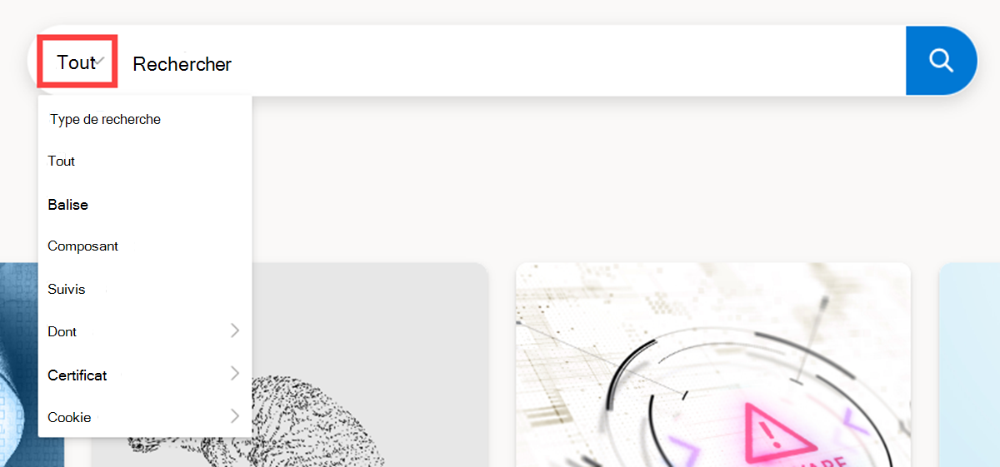
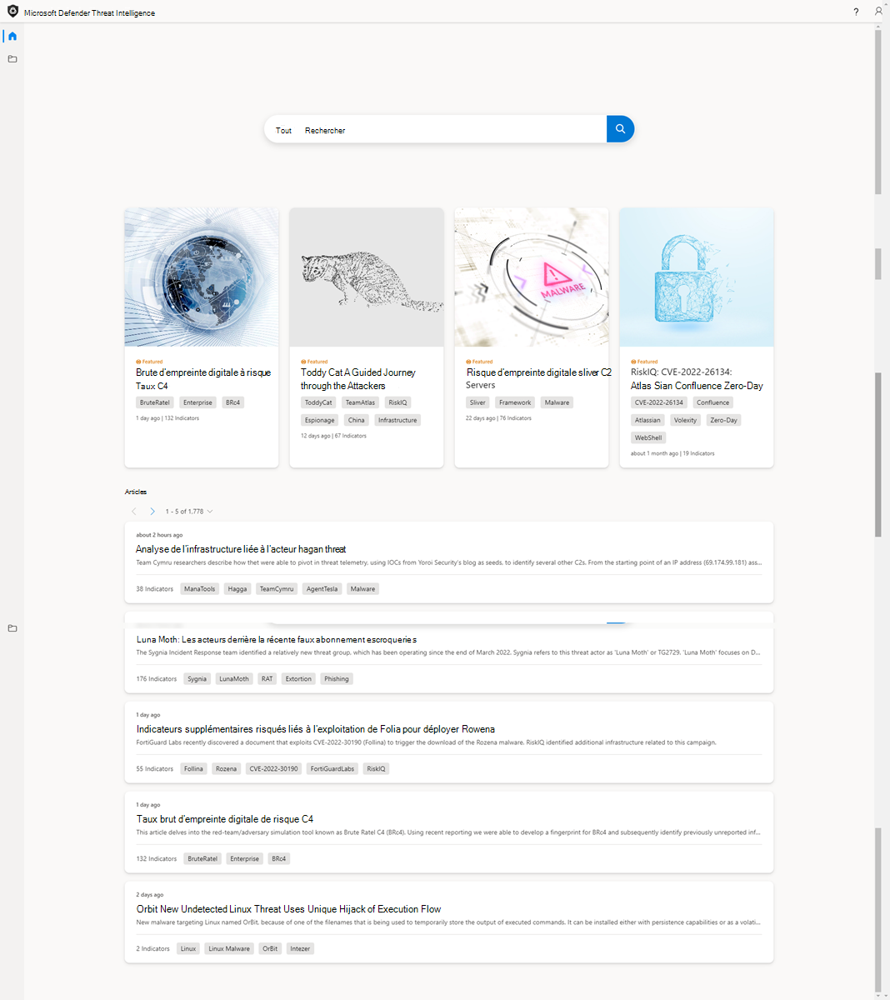

# Tutoriel : Collecte d’informations sur les vulnérabilités

## Dans ce didacticiel, vous allez apprendre à :

- En savoir plus sur les fonctionnalités de la page d’accueil threat intelligence de Microsoft Defender Threat Intelligence (Defender TI)
- Effectuer plusieurs types de recherches d’indicateurs pour collecter des informations sur les vulnérabilités

## Prerequisites

- Un compte Microsoft Azure Active Directory ou personnel. [Connexion ou création d’un compte](https://signup.microsoft.com/)
- Une licence Premium Microsoft Defender Threat Intelligence (Defender TI).

    > [!NOTE]
    > Les utilisateurs sans licence Defender TI Premium pourront toujours se connecter au portail Defender Threat Intelligence et accéder à notre offre Defender TI gratuite.

## Clause d’exclusion de responsabilité

Microsoft Defender Threat Intelligence (Defender TI) peut inclure des observations en temps réel et des indicateurs de menace en temps réel, y compris l’infrastructure malveillante et les outils d’attaque contre les menaces. Toute recherche d’adresse IP et de domaine au sein de notre plateforme Defender TI est sécurisée.
Microsoft partagera des ressources en ligne (par exemple, des adresses IP, des noms de domaine) qui doivent être considérées comme des menaces réelles présentant un danger clair et présent.
Nous demandons aux utilisateurs d’utiliser leur meilleur jugement et de réduire les risques inutiles lors de l’interaction avec des systèmes malveillants lors de l’exécution du didacticiel ci-dessous. Notez que Microsoft a travaillé pour réduire les risques en désactivation des adresses IP malveillantes, des hôtes et des domaines.

## Avant de commencer

Comme l’indique la clause d’exclusion de responsabilité ci-dessus, les indicateurs suspects et malveillants ont été refusés pour votre sécurité. Supprimez les crochets des adresses IP, des domaines et des hôtes lors de la recherche dans Defender TI. Ne recherchez pas ces indicateurs directement dans votre navigateur.

## Ouvrir la page d’accueil threat intelligence de Defender TI

- Accédez au [portail Defender Threat Intelligence](https://ti.defender.microsoft.com/).
- Effectuez l’authentification Microsoft pour accéder au portail.

## En savoir plus sur les fonctionnalités de la page d’accueil threat intelligence de Defender TI

1. Passez en revue les options de la barre de recherche en sélectionnant la barre de recherche et en cliquant sur l’option de liste déroulante Tout.

    

2. Passez en revue les articles et articles proposés dans la page d’accueil threat intelligence.

    

## Effectuer plusieurs types de recherches d’indicateurs pour collecter des informations sur les vulnérabilités

1. Recherchez « CVE-2020-1472 » et passez en revue l’article sur la vulnérabilité associé, « CVE-2020-1472 ».   

    

2. L’onglet « Articles connexes » affiche l’article intitulé « Détections RiskIQ dans les composants et les indicateurs liés à la divulgation et aux contre-mesures de violation de FireEye ». Cliquez sur l’article pour examiner. 

    

3. Passez en revue les indicateurs publics de l’article.

    

4. Recherche '173.234.155[.] Adresse IP de 208' dans la barre de recherche Threat Intelligence.

      

5. Passez en revue les résultats de l’onglet Résumé qui retournent : réputation, insights d’analyste, articles, services, résolutions, certificats et projets.

      

6. Accédez à l’onglet Données et passez en revue les jeux de données et d’intelligence : résolutions, Whois, certificats, suivis, composants, cookies, services, dns et articles.

    

    

7. Revenez au panneau de données Résolutions et pivotez sur « myaeroplan[.] com'.

    

8. Accédez à l’onglet Données et passez en revue les résolutions, whois, certificats, sous-domaines, suivis, composants, cookies, DNS et jeux de données DNS inversés.

    

9. Notez les artefacts suivants des étapes 5 et 7 :

    |&nbsp;|&nbsp;|
    | --- | --- |
    | Adresse Whois | 1928 E. Highland Ave. Ste F104 PMB# 255 |
    | Whois City | Phoenix |
    | État whois | az |
    | Whois Postal Code | 85016 |
    | Pays Whois | États-Unis |
    | Whois Phone | 13478717726 |
    | Serveur de noms Whois | ns0.1984[.] Est |
    | Serveur de noms Whois | ns1.1984[.] Est |
    | Serveur de noms Whois | ns2.1984[.] Est |
    | Serveur de noms Whois | ns1.1984hosting[.] Com |
    | Serveur de noms Whois | ns2.1984hosting[.] Com |
    | Certificat Sha1 | [ead5b033ed4fd342261f389f0930aa7de1fba33d](https://ti.defender.microsoft.com/search/certificates?query=ead5b033ed4fd342261f389f0930aa7de1fba33d&field=sha1) |
    | Numéro de série du certificat | 236976486488328334603103229327145294996 |
    | Nom commun de l’émetteur de certificat | Autorité de certification du serveur sécurisé de validation de domaine COMODO RSA |
    | Nom commun de l’objet de certificat | myaeroplan[.] Com |
    | Autre nom de l’objet du certificat | [myaeroplan[.] Com](https://ti.defender.microsoft.com/search/trackers/hosts?query=www.aeroplan.com&field=MarkOfTheWebSourceHost) |
    | Autre nom de l’objet du certificat | www.myaeroplan[.] Com |
    | Type de suivi | MarkOfTheWebSourceHost |
    | Valeur de suivi | [www.aeroplan.com](https://ti.defender.microsoft.com/search/trackers/hosts?field=MarkOfTheWebSourceHost&query=www.aeroplan.com) |
    | Nom du composant + version | [Apache (v2.4.29)](https://ti.defender.microsoft.com/search/components/hosts?category=Server&query=Apache&version=2.4.29) |
    | Nom du cookie | [PHPSESSID](https://ti.defender.microsoft.com/search/cookies/hosts?query=PHPSESSID&field=name) |
    | Domaine de cookie | [myaeroplan[.] Com](https://ti.defender.microsoft.com/search/cookies/hosts?query=myaeroplan.com&field=domain) |
    | Articles sur les menaces | [Points Guys: Aeroplan Frequent Flyer Program Credential Harvesting Campaign](https://ti.defender.microsoft.com/articles/99527909)|

10. Effectuez les recherches d’artefacts correspondantes à l’étape 8. Remarque : Vous souhaiterez référencer les options de recherche que vous avez apprises dans la section Découvrir les fonctionnalités de la page d’accueil Threat Intelligence de Defender TI.

## Nettoyer les ressources

Il n’existe aucune ressource à nettoyer dans cette section.
