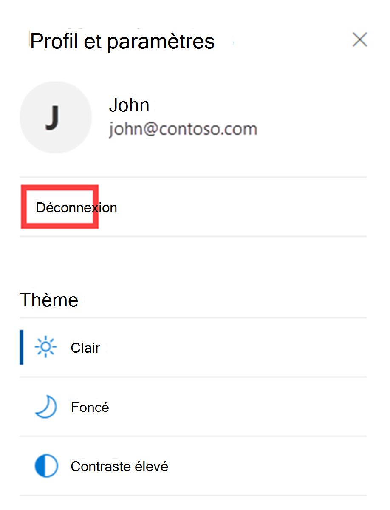

# Démarrage rapide : Découvrez comment accéder à Microsoft Defender Threat Intelligence et effectuer des personnalisations dans votre portail

Comprendre comment ajuster votre thème dans le portail de Microsoft Defender Threat Intelligence (Defender TI) vous facilitera la tâche lors de l’utilisation de notre plateforme. En outre, ce guide vous guidera tout au long de l’activation des sources pour l’enrichissement, afin que vous puissiez voir plus de résultats lors de l’exécution de recherches dans notre plateforme. Vous allez également apprendre à vous connecter et à déconnexion de Defender TI.

## Prerequisites

- Un compte Microsoft Azure Active Directory ou personnel. [Connexion ou création d’un compte](https://signup.microsoft.com/)
- Une licence Premium Microsoft Defender Threat Intelligence (Defender TI).

    > [!NOTE]
    > Les utilisateurs sans licence Defender TI Premium pourront toujours se connecter au portail Defender Threat Intelligence et accéder à notre offre Defender TI gratuite.

## Ouvrir la page d’accueil threat intelligence de Defender TI

- Accédez au [portail Defender Threat Intelligence](https://ti.defender.microsoft.com/).
- Effectuez l’authentification Microsoft pour accéder au portail.

## Accéder au profil et aux préférences de Defender TI pour ajuster votre thème

1. Cliquez sur l’icône « Profil et préférences » dans le coin supérieur droit du portail Defender Threat Intelligence.

    

2. Sélectionnez le thème « Sombre ». Notez que « Light » est votre thème par défaut.

    

3. Répétez l’étape 1 et sélectionnez le thème « Contraste élevé ».

    

4. Répétez l’étape 1 et sélectionnez le thème « Light ».

    

## Icône « Aide » d’Access Defender TI pour en savoir plus sur vos ressources Defender TI pomoc techniczna firmy Microsoft

1. Cliquez sur l’icône « Aide » dans le coin supérieur droit à gauche de l’icône « Profil et préférences ».

    

2. Passez en revue vos ressources pomoc techniczna firmy Microsoft Defender TI.

      - Vous trouverez ici l’adresse e-mail du support technique de Defender TI ainsi qu’un lien vers notre déclaration de confidentialité.

## Accéder au profil et aux préférences de Defender TI pour se déconnecter du portail Defender Threat Intelligence

1. Cliquez sur l’icône « Profil et préférences » dans le coin supérieur droit du portail Defender Threat Intelligence.

2. Sélectionnez « Déconnexion ».

    

## Nettoyer les ressources
Il n’existe aucune ressource à nettoyer dans cette section.

## Prochaines étapes

Pour plus d’informations, reportez-vous aux rubriques suivantes :

[« Qu’est-ce que Microsoft Defender Threat Intelligence (Defender TI)? »](index.md)
