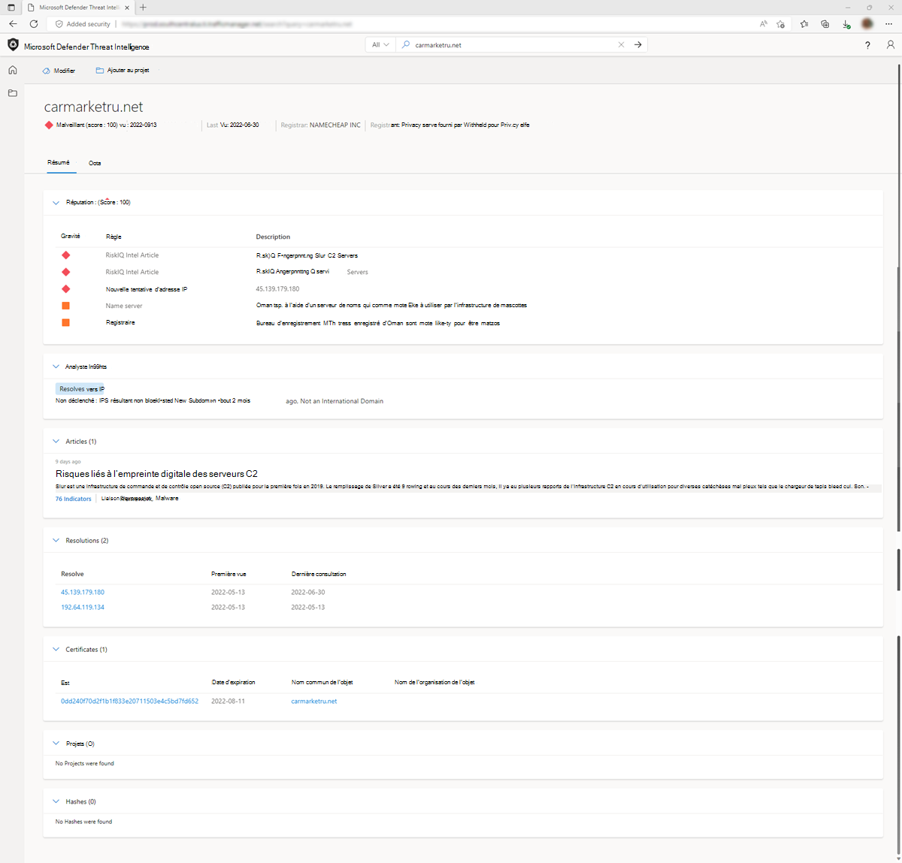
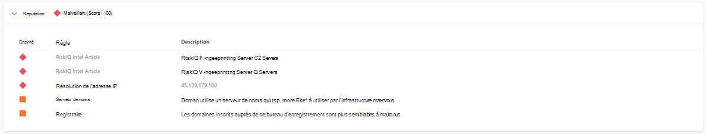

# Score de réputation

Microsoft Defender Threat Intelligence (Defender TI) fournit des scores de réputation propriétaires pour n’importe quel hôte, domaine ou adresse IP. Qu’il s’agisse de valider la réputation d’une entité connue ou inconnue, ce score permet aux utilisateurs de comprendre rapidement les liens détectés avec une infrastructure malveillante ou suspecte. La plateforme fournit des informations rapides sur l’activité de ces entités (par exemple, les horodatages First et Last Seen, ASN, country, associated infrastructure) et une liste de règles qui ont un impact sur le score de réputation le cas échéant.

Les données de réputation sont importantes pour comprendre la fiabilité de votre propre surface d’attaque et sont également utiles lors de l’évaluation d’hôtes, de domaines ou d’adresses IP inconnus qui apparaissent dans les investigations. Ces scores découvriront toute activité malveillante ou suspecte antérieure qui a affecté l’entité, ou d’autres indicateurs connus de compromission qui doivent être pris en compte.

## Présentation des scores de réputation

Les scores de réputation sont déterminés par une série d’algorithmes conçus pour quantifier rapidement le risque associé à une entité. Nous développons des scores de réputation basés sur nos données propriétaires en tirant parti de notre infrastructure d’analyse, ainsi que des informations d’adresse IP collectées à partir de sources externes.

## Méthodes de détection
Les scores de réputation sont déterminés par une série de facteurs, notamment les associations connues d’entités bloquées et une série de règles de Machine Learning utilisées pour évaluer les risques.

## Crochets de scoring
Les scores de réputation sont affichés sous forme de score numérique avec une plage comprise entre 0 et 100. Une entité avec un score de « 0 » n’a pas d’associations connues à une activité suspecte ou des indicateurs connus de compromission ; un score de « 100 » indique que l’entité est malveillante. Les hôtes, les domaines et les adresses IP sont regroupés dans les catégories suivantes en fonction de leur score numérique :

|     Niveau             |     Catégorie              |     Description                                                                                                                                                                          |
|-----------------------|---------------------------|------------------------------------------------------------------------------------------------------------------------------------------------------------------------------------------|
|     75+               |     Malveillant             |     L’entité a confirmé les associations à l’infrastructure malveillante connue qui apparaît sur notre liste de blocage et correspond aux règles d’apprentissage automatique qui détectent les activités suspectes.      |
|     50   – 74         |     Suspect            |     L’entité est probablement associée à une infrastructure suspecte en fonction de correspondances à trois règles de Machine Learning ou plus.                                                           |
|     25   – 49         |     Neutre               |     L’entité correspond à au moins deux règles de Machine Learning.                                                                                                                            |
|     0   – 24          |     Inconnu (vert)     |     Si le score est « Inconnu » et vert, l’entité a retourné au moins une règle correspondante.                                                                                          |
|     0   – 24          |     Inconnu (gris)      |     Si le score est « Inconnu » et gris, l’entité n’a retourné aucune correspondance de règle.                                                                                                |  

## Règles de détection

Les scores de réputation sont basés sur de nombreux facteurs qu’un analyste peut référencer pour déterminer la qualité relative d’un domaine ou d’une adresse. Ces facteurs sont reflétés dans les règles de Machine Learning qui comprennent les scores de réputation. Par exemple, les domaines de niveau supérieur (TLL) « .xyz » ou « .cc » sont généralement plus suspects que les TLL « .com » ou « .org ». Un asn (numéro de système autonome) hébergé par un fournisseur d’hébergement gratuit ou à faible coût est plus susceptible d’être associé à une activité malveillante, tout comme un certificat SSL auto-signé. Ce modèle de réputation a été développé en examinant les occurrences relatives de ces fonctionnalités parmi les indicateurs malveillants et bénins pour évaluer la réputation globale d’une entité.

Reportez-vous à la liste ci-dessous pour obtenir des exemples de règles utilisées pour déterminer le caractère suspect d’un hôte, d’un domaine ou d’une adresse IP. Veuillez noter que cette liste n’est pas complète et change constamment; notre logique de détection et nos fonctionnalités correspondantes sont dynamiques, car elles reflètent le paysage des menaces en constante évolution. Pour cette raison, nous ne publions pas de liste complète des règles de Machine Learning utilisées pour évaluer la réputation d’une entité.

Consultez l’exemple de règles de scoring de réputation ci-dessous :

|     Nom de la règle                    |     Description                                                                                        |
|------------------------------------|--------------------------------------------------------------------------------------------------------|
|     SSL-Certificate Self-Signed    |     Les certificats auto-signés peuvent indiquer un comportement malveillant                                         |
|     Marqué comme malveillant            |     Marqué comme malveillant par un membre au sein de votre organisation                                         |
|     Pays                        |     L’infrastructure hébergée dans ce pays est plus susceptible d’être malveillante                             |
|     Composants web observés        |     Le nombre de composants web observés peut indiquer un caractère malveillant                                 |
|     Serveur de noms                    |     Le domaine utilise un serveur de noms qui est plus susceptible d’être utilisé par une infrastructure malveillante         |
|     Registraire                      |     Les domaines inscrits auprès de ce bureau d’enregistrement sont plus susceptibles d’être malveillants                           |
|     Fournisseur de messagerie inscrit      |     Le domaine est inscrit auprès d’un fournisseur de messagerie qui est plus susceptible d’inscrire des domaines malveillants    |

Il est important de se rappeler que ces facteurs doivent être évalués de manière holistique pour effectuer une évaluation précise de la réputation d’une entité. La combinaison spécifique d’indicateurs, plutôt que n’importe quel indicateur individuel, peut prédire si une entité est susceptible d’être malveillante ou suspecte.

## Severity

Lors de la création de règles pour le système de détection machine learning, une évaluation de gravité lui est appliquée. Chaque règle reçoit la gravité « Élevé », « Moyen » ou « Faible » en fonction du niveau de risque associé à la règle.

## Cas d'utilisation

### Triage des incidents, réponse et repérage des menaces
Le score de réputation, la classification, les règles et la description des règles de Defender TI peuvent être utilisés pour évaluer rapidement si une adresse IP ou un indicateur de domaine est bon, suspect ou malveillant. Dans d’autres cas, nous n’avons peut-être pas observé suffisamment d’infrastructure associée à une adresse IP ou à un domaine pour déduire si l’indicateur est bon ou mauvais. Si un indicateur a une classification inconnue ou neutre, les utilisateurs sont encouragés à effectuer une investigation plus approfondie en examinant nos jeux de données pour déduire si l’indicateur est bon ou mauvais. Si la réputation d’un indicateur inclut une association d’articles, les utilisateurs sont encouragés à passer en revue ces articles répertoriés pour en savoir plus sur la façon dont l’indicateur est lié à la campagne d’un acteur de menace potentiel, les industries ou les nations qu’ils peuvent cibler, les TTP associés et identifier d’autres indicateurs connexes de compromission pour élargir l’étendue de la réponse de l’incident et les efforts de chasse.

### Collecte de renseignements

Tous les articles associés peuvent être partagés avec l’équipe de renseignement sur les cybermenaces de l’analyste, afin qu’ils comprennent plus clairement qui peut cibler leur organisation.

## Prochaines étapes
Pour plus d’informations, consultez [Insights de l’analyste](analyst-insights.md).