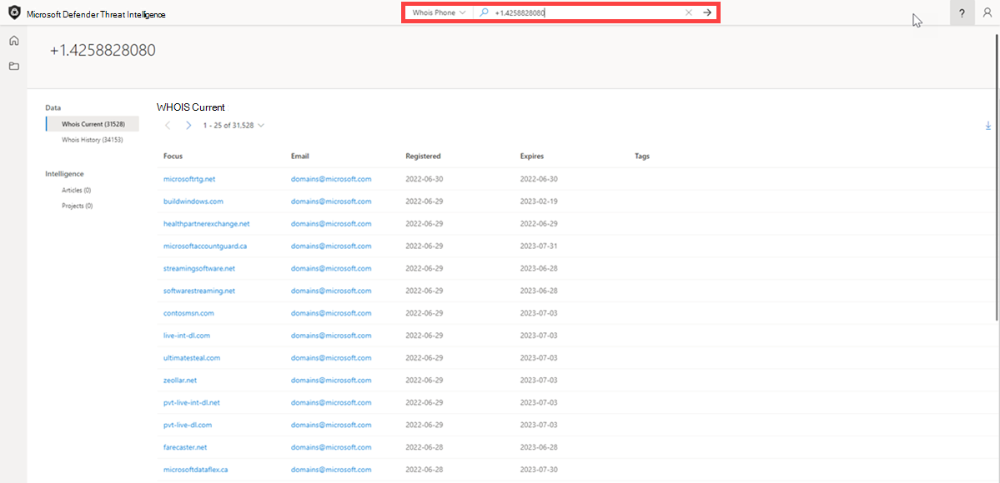
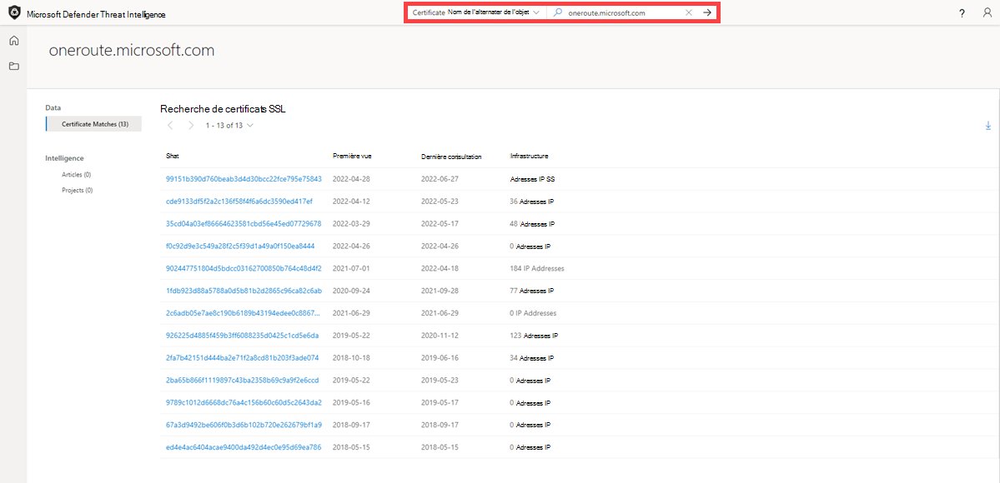
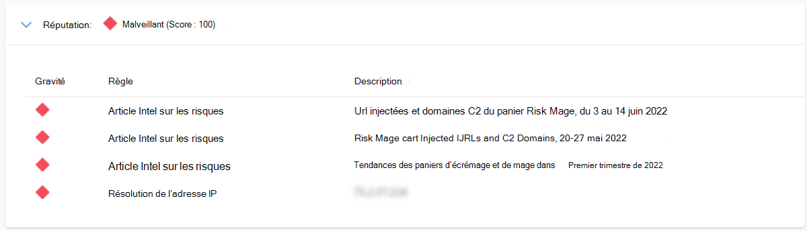

# Recherche et sélection dynamique

Microsoft Defender Threat Intelligence (Defender TI) offre un moteur de recherche robuste et flexible pour simplifier le processus d’investigation. La plateforme est conçue pour permettre aux utilisateurs de pivoter sur un large éventail d’indicateurs provenant de différentes sources de données, ce qui facilite plus que jamais la découverte des relations entre une infrastructure disparate. Cet article aidera les utilisateurs à comprendre comment effectuer une recherche et effectuer un pivot sur différents jeux de données pour découvrir les relations entre différents artefacts.

## Configuration requise

- Un compte Microsoft Azure Active Directory ou personnel. [Connexion ou création d’un compte](https://signup.microsoft.com/)
- Une licence Premium Microsoft Defender Threat Intelligence (Defender TI).
    > [!Note]
    > Les utilisateurs sans licence Defender TI Premium pourront toujours se connecter au portail Defender Threat Intelligence et accéder à notre offre Defender TI gratuite.

## Ouvrir la page d’accueil threat intelligence de Defender TI

1. Accédez au [portail Defender Threat Intelligence](https://defender.microsoft.com/).
2. Effectuez l’authentification Microsoft pour accéder au portail.

## Exécution de recherches et de tableaux croisés dynamiques de renseignement sur les menaces

La recherche Threat Intelligence de Defender TI est à la fois simple et puissante, conçue pour exposer des insights clés immédiats tout en permettant aux utilisateurs d’interagir directement avec les jeux de données qui composent ces insights. La barre de recherche prend en charge une grande variété d’entrées différentes ; les utilisateurs peuvent rechercher des artefacts spécifiques ainsi que des noms d’article ou de projet.

### Rechercher des types d’artefacts
1. **Adresse IP:** Recherche '195.161.141[.] 65 pouces dans la barre de recherche Threat Intelligence. Cette action entraîne une recherche d’adresse IP.

    

2. **Domaine:** Effectuez une recherche `fabrikam.com` dans la barre de recherche Threat Intelligence. Cette action entraîne une recherche de domaine.

    

3. **Hôte:** Effectuez une recherche `canary.fabrikam.com` dans la barre de recherche Threat Intelligence. Cette action entraîne une recherche d’hôte.

    

4. **Mot-clé:** Recherchez « apt29 » dans la barre de recherche Threat Intelligence. Cette action entraîne une recherche par mot clé. Les recherches de mots clés couvrent n’importe quel type de mot clé, qui peut inclure un terme, une adresse e-mail, etc. Les recherches de mots clés entraînent des associations avec des articles, des projets et des jeux de données.

    

5. **CVE-ID :** Recherchez « CVE-2021-40444 » dans la barre de recherche Threat Intelligence. Cette action entraîne une recherche de mot clé CVE-ID.

6. **Article:** Recherchez « Commodity Skimming & Magecart Trends in First Quarter of 2022 » dans la barre de recherche Threat Intelligence. Cette action entraîne une recherche d’article.

    

7. **Étiquette:** Sélectionnez « Tag » dans la liste déroulante Recherche Threat Intelligence et tapez « magecart » dans la barre de recherche Threat Intelligence. Appuyez sur Entrée ou sélectionnez la flèche droite pour effectuer la recherche. Cette action entraîne une recherche de balises.

    > [!NOTE]
    > Cela ne retourne pas d’articles qui partagent cette valeur de balise.

    

8. **Composant:** Sélectionnez « Composant » dans la liste déroulante Recherche d’informations sur les menaces et tapez « attaque cobalt » dans la barre de recherche Threat Intelligence. Appuyez sur Entrée ou sélectionnez la flèche droite pour effectuer la recherche. Cette action entraîne une recherche de composant.

    

9. **Pisteur:** Sélectionnez « Trackers » dans la liste déroulante Recherche Threat Intelligence et tapez « 07d14d16d21d21d00042d41d00041d47e4e0ae17960b2a5b4fd6107fbb0926 » dans la barre de recherche Threat Intelligence. Appuyez sur Entrée ou sélectionnez la flèche droite pour effectuer la recherche. Cette action entraîne une recherche de suivi. Remarque : dans cet exemple, il s’agissait d’un type JarmHash Tracker.

    > [!NOTE]
    > Dans cet exemple, il s’agissait d’un type JarmHash Tracker.

    

10. **WHOIS Email :** Sélectionnez « WHOIS » > « Email » dans la liste déroulante Recherche sur le renseignement sur les menaces et tapez domains@microsoft.com dans la barre de recherche Threat Intelligence. Appuyez sur Entrée ou sélectionnez la flèche droite pour effectuer la recherche. Cette action entraîne une recherche whois Email.

    

11. **Nom WHOIS :** Sélectionnez « WHOIS » > « Name » dans la liste déroulante Recherche Threat Intelligence et tapez « MSN Hostmaster » dans la barre de recherche Threat Intelligence. Appuyez sur Entrée ou sélectionnez la flèche droite pour effectuer la recherche. Cette action entraîne une recherche de nom WHOIS.

    

12. **Organisation WHOIS :** Sélectionnez « WHOIS » > « Organisation » dans la liste déroulante Recherche d’informations sur les menaces et tapez « Microsoft Corporation » dans la barre de recherche Threat Intelligence. Appuyez sur Entrée ou sélectionnez la flèche droite pour effectuer la recherche. Cette action entraîne une recherche dans l’organisation WHOIS.

    

13. **Adresse WHOIS :** Sélectionnez « WHOIS » > « Adresse » dans la liste déroulante Recherche d’informations sur les menaces et tapez « One Microsoft Way » dans la barre de recherche Threat Intelligence. Appuyez sur Entrée ou sélectionnez la flèche droite pour effectuer la recherche. Cette action entraîne une recherche d’adresse WHOIS.

    

14. **VILLE WHOIS :** Sélectionnez « WHOIS » > « City » dans la liste déroulante Recherche d’informations sur les menaces et tapez « Redmond » dans la barre de recherche Threat Intelligence. Appuyez sur Entrée ou sélectionnez la flèche droite pour effectuer la recherche. Cette action entraîne une recherche whois city.

    

15. **État WHOIS :** Sélectionnez « WHOIS » > « État » dans la liste déroulante Recherche d’informations sur les menaces et tapez « WA » dans la barre de recherche Threat Intelligence. Appuyez sur Entrée ou sélectionnez la flèche droite pour effectuer la recherche. Cette action entraîne une recherche d’état WHOIS.

    

16. **Code postal WHOIS :** Sélectionnez « WHOIS » > « Code postal » dans la liste déroulante Recherche d’informations sur les menaces et tapez « 98052 » dans la barre de recherche Threat Intelligence. Appuyez sur Entrée ou sélectionnez la flèche droite pour effectuer la recherche. Cette action entraîne une recherche dans le code postal WHOIS.

    

17. **Pays WHOIS :** Sélectionnez « WHOIS » > « Country » dans la liste déroulante De recherche Sur le renseignement sur les menaces et tapez « US » dans la barre de recherche Threat Intelligence. Appuyez sur Entrée ou sélectionnez la flèche droite pour effectuer la recherche. Cette action entraîne une recherche whois country.

    

18. **Téléphone WHOIS :** Sélectionnez « WHOIS » > « Téléphone » dans la liste déroulante Recherche d’informations sur les menaces et tapez « +1.4258828080 » dans la barre de recherche Threat Intelligence. Appuyez sur Entrée ou sélectionnez la flèche droite pour effectuer la recherche. Cette action entraîne une recherche par téléphone WHOIS.

    

19. **Serveur de noms WHOIS :** Sélectionnez « WHOIS » > « Nameserver » dans la liste déroulante Recherche d’informations sur les menaces et tapez-le dans `ns1-03.azure-dns.com` la barre de recherche Threat Intelligence. Appuyez sur Entrée ou sélectionnez la flèche droite pour effectuer la recherche. Cette action entraîne une recherche whois nameserver.

    

20. **Certificat SHA-1 :** Sélectionnez « Certificat » > « SHA-1 » dans la liste déroulante Recherche d’informations sur les menaces et tapez « 35cd04a03ef86664623581cbd56e45ed07729678 » dans la barre de recherche Threat Intelligence. Appuyez sur Entrée ou sélectionnez la flèche droite pour effectuer la recherche. Cette action entraîne une recherche SHA-1 de certificat.

    

21. **Numéro de série du certificat :** Sélectionnez « Certificat » > « Numéro de série » dans la liste déroulante Recherche Threat Intelligence et tapez « 1137354899731266880939192213383415094395905558 » dans la barre de recherche Threat Intelligence. Appuyez sur Entrée ou sélectionnez la flèche droite pour effectuer la recherche. Cette action entraîne une recherche de numéro de série de certificat.

    

22. **Nom commun de l’émetteur de certificat :** Sélectionnez « Certificat » > « Nom commun de l’émetteur » dans la liste déroulante Recherche Threat Intelligence et tapez « Microsoft Azure TLS Émission CA 05 » dans la barre de recherche Threat Intelligence. Appuyez sur Entrée ou sélectionnez la flèche droite pour effectuer la recherche. Cette action entraîne une recherche de nom commun de l’émetteur de certificat.

    

23. **Autre nom de l’émetteur de certificat :** Sélectionnez « Certificat » > « Autre nom de l’émetteur » dans la liste déroulante Recherche Threat Intelligence et tapez un autre nom d’émetteur de certificat dans la barre de recherche Threat Intelligence. Appuyez sur Entrée ou sélectionnez la flèche droite pour effectuer la recherche. Cette action entraîne une recherche de nom alternatif de l’émetteur de certificat.

24. **Nom commun de l’objet de certificat :** Sélectionnez « Certificat » > « Nom commun de l’objet » dans la liste déroulante Recherche Threat Intelligence et tapez-le dans `*.oneroute.microsoft.com` la barre de recherche Threat Intelligence. Appuyez sur Entrée ou sélectionnez la flèche droite pour effectuer la recherche. Cette action entraîne une recherche de nom commun de l’objet de certificat.

    

25. **Autre nom de l’objet du certificat :** Sélectionnez « Certificat » > « Autre nom de l’objet » dans la liste déroulante Recherche d’informations sur les menaces et tapez-le dans `oneroute.microsoft.com` la barre de recherche Threat Intelligence. Appuyez sur Entrée ou sélectionnez la flèche droite pour effectuer la recherche. Cette action entraîne une recherche de nom de remplacement de l’objet de certificat.

    

26. **Nom du cookie :** Sélectionnez « Cookie » > « Nom » dans la liste déroulante Recherche d’informations sur les menaces et tapez « ARRAffinity » dans la barre de recherche Threat Intelligence. Appuyez sur Entrée ou sélectionnez la flèche droite pour effectuer la recherche. Cette action entraîne une recherche de nom de cookie.

    

27. **Domaine de cookie :** Sélectionnez « Cookie » > « Domaine » dans la liste déroulante Recherche d’informations sur les menaces et tapez-le dans `portal.fabrikam.com` la barre de recherche Threat Intelligence. Appuyez sur Entrée ou sélectionnez la flèche droite pour effectuer la recherche. Cette action entraîne une recherche dans un domaine de cookie.

    

28. **Pivots:** Pour toutes les recherches effectuées dans les étapes ci-dessus, il existe des artefacts avec des liens hypertexte que vous pouvez désactiver pour découvrir d’autres résultats enrichis associés à ces indicateurs. N’hésitez pas à l’expérimenter vous-même.

## Résultats de la recherche

### Insights clés

En haut de la page, la plateforme fournit des informations de base sur l’artefact. Ces informations peuvent inclure les éléments suivants, en fonction du type d’artefact :  

- **Pays :** l’indicateur en regard de l’adresse IP indique le pays d’origine de l’artefact, ce qui peut aider à déterminer sa capacité de débit ou sa posture de sécurité. Cette adresse IP est hébergée sur l’infrastructure dans le États-Unis.
- **Réputation :** dans cet exemple, l’adresse IP est marquée avec « Malveillant », ce qui indique que la plateforme a détecté des connexions entre cet artefact et l’infrastructure de conseil connue. Les artefacts peuvent également être étiquetés « Suspect », « Neutre » ou « Inconnu ».
- **Première vue :** cet horodatage indique quand l’artefact a été observé pour la première fois par le système de détection de la plateforme. Comprendre la durée de vie d’un artefact peut aider à déterminer sa capacité de débit.
- **Dernière vue :** cet horodatage indique quand l’artefact a été observé pour la dernière fois par le système de détection de la plateforme. Cela permet de déterminer si l’artefact est toujours utilisé activement.
- **Bloc IP :** bloc IP qui inclut l’artefact d’adresse IP interrogée.
- **Bureau d’enregistrement :** bureau d’enregistrement associé à l’enregistrement WHOIS pour l’artefact de domaine interrogé.
- **Inscrit :** nom de l’inscrit dans les données WHOIS pour un artefact.
- **ASN :** ASN associé à l’artefact.
- **Système d’exploitation :** système d’exploitation associé à l’artefact.
- **Hôte :** fournisseur d’hébergement pour l’artefact. Certains fournisseurs d’hébergement étant plus réputés que d’autres, cette valeur peut aider à indiquer la validité d’un artefact.

Cette section affiche également toutes les balises appliquées à l’artefact ou tous les projets qui l’incluent. Les utilisateurs peuvent également ajouter une balise ou ajouter l’artefact à un projet.

## Onglet Résumé

### Vue d’ensemble

Les résultats d’une recherche Threat Intelligence sont regroupés en deux onglets : « Résumé » et « Données ». L’onglet Résumé fournit des insights clés sur un artefact que la plateforme a dérivé de nos jeux de données étendus. Cette section est conçue pour exposer les principales conclusions qui peuvent aider à lancer une enquête.

### Réputation

Defender TI fournit des scores de réputation propriétaires pour n’importe quel hôte, domaine ou adresse IP. Qu’il s’agisse de valider la réputation d’une entité connue ou inconnue, ce score permet aux utilisateurs de comprendre rapidement les liens détectés avec une infrastructure malveillante ou suspecte. Les scores de réputation sont affichés sous forme de score numérique avec une plage comprise entre 0 et 100. Une entité avec un score de « 0 » n’a pas d’associations connues à une activité suspecte ou des indicateurs connus de compromission ; un score de « 100 » indique que l’entité est malveillante. La plateforme fournit une liste de règles avec une description et une évaluation de gravité. Dans l’exemple ci-dessous, quatre règles de « gravité élevée » s’appliquent à ce domaine.

Pour plus d’informations, consultez [Scoring de réputation](reputation-scoring.md).

### Insights des analystes

La section Insights de l’analyste fournit des insights rapides sur l’artefact qui peuvent aider à déterminer l’étape suivante d’une investigation. Cette section répertorie tous les insights qui s’appliquent à l’artefact et ceux qui ne s’appliquent pas pour une visibilité supplémentaire. Dans l’exemple ci-dessous, nous pouvons rapidement déterminer que l’adresse IP est routable, héberge un serveur web et a un port ouvert au cours des cinq derniers jours. En outre, le système affiche des règles qui n’ont pas été déclenchées, ce qui peut être également utile lors du démarrage d’une enquête.

Pour plus d’informations, consultez [Insights de l’analyste](analyst-insights.md).

### Articles

La section Articles affiche tous les articles qui peuvent fournir des insights sur la meilleure façon d’examiner et de désarmer l’artefact impacté. Ces articles sont écrits par des chercheurs qui étudient le comportement des acteurs connus des menaces et de leur infrastructure, présentant des résultats clés qui peuvent aider d’autres personnes à atténuer les risques pour leur organisation. Dans cet exemple, l’adresse IP recherchée a été identifiée comme un IOC lié aux résultats de l’article.

Pour plus d’informations, consultez [Qu’est-ce que Microsoft Defender Threat Intelligence (Defender TI) ?](what-is-microsoft-defender-threat-intelligence-defender-tI.md)

### Services

Cette section répertorie tous les services détectés exécutés sur l’artefact d’adresse IP. Cela est utile lorsque vous essayez de comprendre l’utilisation prévue de l’entité. Lors de l’examen d’une infrastructure malveillante, ces informations peuvent aider à déterminer les fonctionnalités d’un artefact, ce qui permet aux utilisateurs de défendre de manière proactive leur organisation en fonction de ces informations.

### Résolutions

Les résolutions sont des enregistrements DNS individuels capturés à l’aide de capteurs passifs distribués dans le monde entier. Ces valeurs révèlent un historique de la façon dont un domaine ou une adresse IP modifie l’infrastructure au fil du temps. Ils peuvent être utilisés pour découvrir une infrastructure supplémentaire et mesurer les risques en fonction des niveaux de connexion. Pour chaque résolution, nous fournissons des horodatages « first seen » et « last seen » pour présenter le cycle de vie des résolutions.

### Certificats

Au-delà de la sécurisation de vos données, les certificats SSL constituent un excellent moyen pour les utilisateurs de connecter une infrastructure réseau disparate. Les certificats SSL peuvent établir des connexions que des données DNS ou WHOIS passives peuvent manquer. Cela signifie plus de moyens de mettre en corrélation l’infrastructure malveillante potentielle et d’identifier les défaillances de sécurité opérationnelle potentielles des acteurs. Pour chaque certificat SSL, nous fournissons le nom du certificat, la date d’expiration, le nom commun de l’objet et le nom de l’organisation de l’objet.

### Projets

La plateforme Defender TI permet aux utilisateurs de créer des projets pour organiser des indicateurs d’intérêt ou de compromis à partir d’une enquête. Des projets sont également créés pour surveiller les artefacts de connexion afin d’améliorer la visibilité. Les projets contiennent une liste de tous les artefacts associés et un historique détaillé qui conserve les noms, les descriptions, les collaborateurs et les profils de surveillance.

Lorsqu’un utilisateur recherche une adresse IP, un domaine ou un hôte, si cet indicateur est répertorié dans un projet auquel l’utilisateur a accès, il peut sélectionner l’onglet Projets et accéder aux détails du projet pour plus de contexte sur l’indicateur avant de consulter les autres jeux de données pour plus d’informations.

Pour plus d’informations, consultez [Utilisation de projets](using-projects.md).

### Hashes

Microsoft collabore avec plusieurs référentiels commerciaux et open source de données de programmes malveillants pour les associer à l’infrastructure interrogée pour remplir le jeu de données de hachage. Les dépôts de programmes malveillants incluent aujourd’hui les menaces émergentes de Proofpoint, l’analyse hybride et VirusTotal. Ces données aident les utilisateurs à comprendre les capacités d’acteur, l’intention et les motivations d’un attaquant, tout en aidant à connecter l’infrastructure. Chaque résultat contient un hachage unique. Nos données de hachage incluent la source de détection, l’exemple et la date de collecte.

## Onglet Données

### Vue d’ensemble

L’onglet Données aide les utilisateurs à approfondir les connexions tangibles observées par la plateforme Defender TI. Bien que l’onglet Résumé expose les principales conclusions pour fournir un contexte immédiat sur un artefact, l’onglet Données permet aux analystes d’étudier ces connexions beaucoup plus granulairement. Les utilisateurs peuvent cliquer sur n’importe quelle valeur retournée pour pivoter sur toutes les métadonnées associées.

### Types de données

Les jeux de données suivants sont disponibles dans Defender TI :

- Résolutions
- WHOIS
- Certificats
- Trackers
- Sous-domaines
- Composants
- Paires d’hôtes
- Hashes
- Cookies
- Services
- DNS
- DNS inversé

Ces jeux de données distincts s’affichent dans des onglets distincts après l’envoi d’une recherche. Les résultats sont cliquables, ce qui permet à un utilisateur de pivoter rapidement dans l’infrastructure associée pour dévoiler des insights qui ont peut-être été manqués avec les méthodes d’investigation traditionnelles.

### Résolutions

Le DNS passif est un système d’enregistrement qui stocke les données de résolution DNS pour un emplacement, un enregistrement et une période donnés. Ce jeu de données de résolution historique permet aux utilisateurs d’afficher les domaines résolus en adresse IP et inversement. Ce jeu de données permet une corrélation temporelle basée sur le chevauchement de domaine ou d’adresse IP.

PDNS peut permettre l’identification d’une infrastructure d’acteur de menace précédemment inconnue ou nouvellement levée. L’ajout proactif d’indicateurs aux listes de blocage peut couper les chemins de communication avant la tenue des campagnes. Les utilisateurs trouveront des données de résolution d’enregistrement dans l’onglet Jeu de données Résolutions et trouveront d’autres types d’enregistrements DNS dans l’onglet Jeu de données DNS.

Nos données de résolution PDNS incluent les éléments suivants :
- **Résoudre :** nom de l’entité de résolution (adresse IP ou domaine)
- **Emplacement :** emplacement dans lequel l’adresse IP est hébergée.
- **Réseau :** netblock ou sous-réseau associé à l’adresse IP.
- **ASN :** numéro de système autonome et nom de l’organisation
- **Première vue :** horodatage qui affiche la date à laquelle nous avons observé cette résolution pour la première fois.
- **Last Seen:** a timestamp that displays the date that we last observed this resolution.
- **Source :** source qui a activé la détection de la relation.
- **Balises :** toutes les balises appliquées à cet artefact dans le système Defender TI.

### WHOIS

WHOIS est un protocole qui permet à quiconque d’interroger des informations sur la propriété d’un domaine, d’une adresse IP ou d’un sous-réseau. L’une des fonctions les plus courantes de WHOIS dans la recherche sur les infrastructures de menaces consiste à identifier ou à connecter des entités disparates basées sur des données uniques partagées dans les enregistrements WHOIS.

Chaque enregistrement WHOIS comporte plusieurs sections différentes, qui peuvent toutes inclure des informations différentes. Les sections couramment trouvées incluent « bureau d’enregistrement », « inscrit », « administrateur » et « technique », chacune correspondant potentiellement à un contact différent pour l’enregistrement. La plupart du temps, ces données sont dupliquées dans plusieurs sections, mais dans certains cas, il peut y avoir de légères incohérences, en particulier si un acteur a commis une erreur. Lors de l’affichage des informations WHOIS dans Defender TI, vous verrez un enregistrement condensé qui déduplique toutes les données et note la partie de l’enregistrement d’où elles proviennent.

Les utilisateurs peuvent également afficher les enregistrements WHOIS historiques pour comprendre comment les données d’inscription ont changé au fil du temps.

Nos données WHOIS incluent les éléments suivants :

- **Enregistrement mis à jour :** horodatage qui indique le jour de la dernière mise à jour d’un enregistrement WHOIS.
- **Dernière analyse :** date à laquelle le système Defender TI a analysé l’enregistrement pour la dernière fois.
- **Expiration :** date d’expiration de l’inscription, le cas échéant.
- **Créé :** âge de l’enregistrement OMSIS actuel.
- **Serveur WHOIS :** le serveur est configuré par un bureau d’enregistrement accrédité de l’ICANN pour acquérir des informations à jour sur les domaines qui y sont inscrits.
- **Bureau d’enregistrement :** service de bureau d’enregistrement utilisé pour inscrire l’artefact.
- **État** du domaine : état actuel du domaine. Un domaine « actif » est en direct sur Internet.
- **Email :** toutes les adresses e-mail trouvées dans l’enregistrement WHOIS et le type de contact auxquels chacune d’elles est associée (par exemple, administrateur, technologie).
- **Nom :** nom de tous les contacts dans l’enregistrement, et le type de contact avec lequel chacun est associé.
- **Organisation :** nom de toutes les organisations au sein de l’enregistrement, et le type de contact à laquelle chacune est associée.
- **Rue :** toutes les adresses postales associées à l’enregistrement et le type de contact à laquelle elle est associée.
- **Ville :** toute ville répertoriée dans une adresse associée à l’enregistrement et le type de contact à laquelle elle est associée.
- **État :** tous les états répertoriés dans une adresse associée à l’enregistrement et le type de contact à laquelle il est associé.
- **Code postal :** tous les codes postaux répertoriés dans une adresse associée à l’enregistrement et le type de contact à laquelle il est associé.
- **Pays :** tous les pays répertoriés dans une adresse associée à l’enregistrement et le type de contact à laquelle il est associé.
- **Téléphone :** tous les numéros de téléphone répertoriés dans l’enregistrement et le type de contact à laquelle il est associé.
- **Serveurs de noms :** serveurs de noms associés à l’entité inscrite.

### Certificats

Au-delà de la sécurisation de vos données, les certificats SSL constituent un excellent moyen pour les utilisateurs de connecter une infrastructure réseau disparate. Les techniques d’analyse modernes nous permettent d’effectuer des demandes de données sur chaque nœud sur Internet en quelques heures, ce qui signifie que nous pouvons facilement associer un certificat à une adresse IP qui l’héberge régulièrement.

Tout comme un enregistrement WHOIS, les certificats SSL nécessitent que l’utilisateur fournit des informations pour générer le produit final. En dehors du domaine, le certificat SSL est créé pour (sauf s’il est auto-signé), l’une des informations supplémentaires peut être composée par l’utilisateur. Lorsque nos utilisateurs voient la valeur la plus élevée des certificats SSL, ce ne sont pas nécessairement les données uniques que quelqu’un peut utiliser lors de la génération du certificat, mais l’emplacement où il est hébergé.

Ce qui rend les certificats SSL plus précieux, c’est qu’ils peuvent établir des connexions que des données DNS ou WHOIS passives peuvent manquer. Cela signifie plus de moyens de mettre en corrélation l’infrastructure malveillante potentielle et d’identifier les défaillances de sécurité opérationnelle potentielles des acteurs. Microsoft a collecté plus de 30 millions de certificats de 2013 à nos jours et fournit aux utilisateurs les outils nécessaires pour établir des corrélations sur le contenu et l’historique des certificats.

Nos données de certificat incluent les éléments suivants :

- **Sha1 :** Hachage de l’algorithme SHA1 pour une ressource de certificat SSL.
- **Première vue :** horodatage qui affiche la date à laquelle nous avons observé ce certificat pour la première fois sur un artefact.
- **Dernière vue :** horodatage qui affiche la date de la dernière observation de ce certificat sur un artefact.
- **Infrastructure :** toute infrastructure associée associée au certificat.

Lorsqu’un utilisateur clique sur un hachage Sha1, il peut voir des détails sur le certificat dans le volet droit, notamment :

- **Matricule:** Numéro de série associé à un certificat SSL.
- **Délivré:** Date à laquelle un certificat a été émis.
- **Expire:** Date d’expiration d’un certificat.
- **Nom commun de l’objet :** Nom commun de l’objet pour tous les certificats SSL associés.
- **Nom commun de l’émetteur :** Nom commun de l’émetteur pour tous les certificats SSL associés.
- **Autre nom(s) de l’objet :** Tout autre nom commun pour le certificat SSL.
- **Autre nom(s) émetteur(s) :** Noms supplémentaires de l’émetteur.
- **Nom de l’organisation de l’objet :** Organisation liée à l’inscription de certificat SSL.
- **Nom de l’organisation de l’émetteur :** Nom de l’organisation qui a orchestré le problème d’un certificat.
- **Version SSL :** Version de SSL avec laquelle le certificat a été inscrit.
- **Unité d’organisation de l’objet :** Métadonnées facultatives qui indiquent le service au sein d’une organisation responsable du certificat.
- **Unité de l’organisation de l’émetteur :** Informations supplémentaires sur l’organisation qui émet le certificat.
- **Adresse de rue de l’objet :** Adresse postale où se trouve l’organisation.
- **Adresse de rue de l’émetteur :** Adresse postale où se trouve l’organisation émettrice.
- **Localité de l’objet :** Ville où se trouve l’organisation.
- **Localité de l’émetteur :** Ville où se trouve l’organisation émettrice.
- **État de l’objet/province :** État ou province où se trouve l’organisation.
- **État de l’émetteur/province :** État ou province où se trouve l’organisation émettrice.
- **Pays de l’objet :** Pays où se trouve l’organisation.
- **Pays émetteur :** Pays où se trouve l’organisation émettrice.
- **Infrastructure associée :** toute infrastructure associée associée au certificat.

### Sous-domaines

Un sous-domaine est un domaine Internet qui fait partie d’un domaine principal. Les sous-domaines sont également appelés « hôtes ». Par exemple, `docs.microsoft.com` est un sous-domaine de `microsoft.com`. Pour chaque sous-domaine, il peut y avoir un nouvel ensemble d’adresses IP auxquelles le domaine se résout. Il peut s’agir d’une excellente source de données pour la recherche d’une infrastructure associée.

Nos données de sous-domaine incluent les éléments suivants :

- **Nom d’hôte :** sous-domaine associé au domaine qui a fait l’objet d’une recherche.
- **Balises :** toutes les balises appliquées à cet artefact dans le système Defender TI.

### Trackers

Les suivis sont des codes ou des valeurs uniques trouvés dans les pages web et souvent utilisés pour suivre l’interaction utilisateur. Ces codes peuvent être utilisés pour mettre en corrélation un groupe disparate de sites web avec une entité centrale. Souvent, les acteurs copient le code source du site web d’une victime qu’ils cherchent à emprunter l’identité d’une campagne de hameçonnage. Rarement les acteurs prendront le temps de supprimer ces ID qui permettent aux utilisateurs d’identifier ces sites frauduleux à l’aide de nos jeux de données Trackers.

Le jeu de données Tracker de Microsoft inclut des ID de fournisseurs tels que Google, Yandex, Mixpanel, New Relic, Clicky et continue de croître régulièrement.

Nos données de suivi incluent les éléments suivants :

- **Nom d’hôte :** nom d’hôte qui héberge l’infrastructure où le suivi a été détecté.
- **Première vue :** horodatage qui affiche la date à laquelle nous avons observé ce suivi pour la première fois sur l’artefact.
- **Last Seen:** a timestamp that displays the date that we last observed this tracker on the artifact.
- **Type :** type de suivi détecté (par exemple, GoogleAnalyticsID, JarmHash).
- **Valeur :** valeur d’identification pour le suivi.
- **Balises :** toutes les balises appliquées à cet artefact dans le système Defender TI.

### Composants

Les composants Web sont des détails décrivant une page web ou une infrastructure serveur extraite de Microsoft effectuant une analyse ou une analyse web. Ces composants permettent à un utilisateur de comprendre la composition d’une page web ou la technologie et les services qui pilotent une infrastructure spécifique.

Le pivoting sur des composants uniques peut trouver l’infrastructure des acteurs ou d’autres sites compromis. Les utilisateurs peuvent également comprendre si un site web peut être vulnérable à une attaque ou à une compromission spécifique en fonction des technologies qu’il exécute.

Nos données de composant incluent les éléments suivants :

- **Nom d’hôte :** nom d’hôte qui héberge l’infrastructure où le composant a été détecté.
- **Première vue :** horodatage de la date à laquelle nous avons observé ce composant pour la première fois sur l’artefact.
- **Last Seen:** a timestamp of the date that we last observed this component on the artifact.
- **Catégorie :** type de composant détecté (par exemple, système d’exploitation, framework, accès à distance, serveur).
- **Nom + Version :** nom du composant et version en cours d’exécution sur l’artefact (par exemple, Microsoft IIS (v8.5).
- **Balises :** toutes les balises appliquées à cet artefact dans le système Defender TI.

### Paires d’hôtes

Les paires d’hôtes sont deux éléments d’infrastructure (un parent et un enfant) qui partagent une connexion observée à partir de l’analyse web d’un utilisateur virtuel de Microsoft. La connexion peut aller d’une redirection de niveau supérieur (HTTP 302) à quelque chose de plus complexe comme une référence de source d’iframe ou de script.

Nos données de paire d’hôtes incluent les éléments suivants :

- **Nom d’hôte parent :** nom d’hôte qui redirige ou se connecte à tous les noms d’hôte enfants.
- **Nom d’hôte enfant :** nom d’hôte qui se connecte au nom d’hôte parent. Cette valeur est le résultat d’une redirection ou d’une autre connexion plus complexe.
- **Première vue :** date à laquelle nous avons observé pour la première fois cette relation de paire d’hôtes sur l’artefact.
- **Dernière vue :** date à laquelle nous avons observé pour la dernière fois cette relation de paire d’hôtes sur l’artefact.
- **Cause :** type de connexion entre le nom d’hôte parent et le nom d’hôte enfant. Les causes potentielles sont les redirections, les connexions img.src, css.import ou script.src.
- **Balises :** toutes les balises appliquées à cet artefact dans le système Defender TI.

### Hashes

Microsoft collabore avec plusieurs référentiels commerciaux et open source de données de programmes malveillants pour les associer à l’infrastructure interrogée pour remplir le jeu de données de hachage. Les dépôts de programmes malveillants incluent aujourd’hui les menaces émergentes de Proofpoint, l’analyse hybride et VirusTotal. Ces données aident les utilisateurs à comprendre les capacités d’acteur, l’intention et les motivations d’un attaquant, tout en aidant à connecter l’infrastructure. Chaque résultat contient un hachage unique.

Nos données de hachage incluent les éléments suivants :

1. **Source :** source utilisée pour détecter le hachage.
2. **Exemple :** code d’identification unique pour le hachage détecté.
3. **Date de collecte :** jour où l’échantillon de hachage a été collecté par la source désignée.

### Cookies

Les cookies sont de petits éléments de données envoyés d’un serveur à un client lorsque l’utilisateur parcourt Internet. Ces valeurs contiennent parfois un état pour l’application ou de petits bits de données de suivi. Nous mettons en surbrillance et indexons les noms de cookies observés lors de l’analyse d’un site web et nous permettons aux utilisateurs d’explorer partout où le système a observé des noms de cookies spécifiques dans son analyse et sa collecte de données.

Nos données de cookie incluent les éléments suivants :

- **Nom d’hôte :** infrastructure hôte associée au cookie.
- **Première vue :** horodatage de la date à laquelle nous avons observé ce cookie sur l’artefact.
- **Last Seen:** a timestamp of the date that we last observed this cookie on the artifact.
- **Nom :** nom du cookie (par exemple, JSESSIONID, SEARCH_NAMESITE).
- **Domaine :** domaine associé au cookie.
- **Balises :** toutes les balises appliquées à cet artefact dans le système Defender TI.

### Services
Les noms de service et les numéros de port sont utilisés pour faire la distinction entre les différents services qui s’exécutent sur des protocoles de transport tels que TCP, UDP, DCCP et SCTP. Les numéros de port peuvent suggérer le type d’application en cours d’exécution sur un port particulier. Toutefois, les applications ou services peuvent être modifiés pour utiliser un port différent pour masquer ou masquer le service ou l’application sur une adresse IP. Connaître le port et les informations d’en-tête/bannière peut identifier la véritable application/service et la combinaison des ports utilisés. Defender TI affiche 14 jours d’historique dans l’onglet Services, affichant la dernière réponse de bannière associée à un port observé.

Nos données de services incluent les éléments suivants :

- Ports ouverts observés
- Numéros de port
- Composants
- Nombre de fois où le service a été observé
- Lors de la dernière analyse du port
- Connexion de protocole
- État du port
   - Ouvrir
   - Filtré
   - Fermé
- Réponse de bannière

### DNS

Microsoft a collecté des enregistrements DNS au fil des ans, fournissant aux utilisateurs des informations sur les enregistrements DNS (Mail Exchange), les enregistrements de serveur de noms (NS), les enregistrements de texte (TXT), les enregistrements SOA (Start of Authority), les enregistrements CNAME (Canonical Name) et les enregistrements de pointeur (PTR). L’examen des enregistrements DNS peut être utile pour identifier l’infrastructure partagée utilisée par les acteurs dans les domaines qu’ils possèdent. Par exemple, les groupes d’acteurs ont tendance à utiliser les mêmes serveurs de noms pour segmenter leur infrastructure ou les mêmes serveurs d’échange de courrier pour administrer leur commande et leur contrôle. 

Nos données DNS incluent les éléments suivants :

- **Valeur :** valeur de l’enregistrement DNS.
- **Première vue :** horodatage de la date à laquelle nous avons observé cet enregistrement sur l’artefact.
- **Last Seen:** a timestamp of the date that we last observed this record on the artifact.
- **Type :** type d’infrastructure associé à l’enregistrement. Les options possibles incluent les serveurs de messagerie (MX), les fichiers texte (TXT), les serveurs de noms (NS), CNAMES et les enregistrements SOA (Start of Authority).
- **Balises :** toutes les balises appliquées à cet artefact dans le système Defender TI.

### DNS inversé

Alors qu’une recherche DNS vers l’avant interroge l’adresse IP d’un certain nom d’hôte, une recherche DNS inversée interroge un nom d’hôte spécifique d’une adresse IP. Ce jeu de données affiche des résultats comparables en tant que jeu de données DNS. L’examen des enregistrements DNS peut être utile pour identifier l’infrastructure partagée utilisée par les acteurs dans les domaines qu’ils possèdent. Par exemple, les groupes d’acteurs ont tendance à utiliser les mêmes serveurs de noms pour segmenter leur infrastructure ou les mêmes serveurs d’échange de courrier pour administrer leur commande et leur contrôle.

Nos données DNS inversées incluent les éléments suivants :

- **Valeur :** valeur de l’enregistrement DNS inversé.
- **Première vue :** horodatage de la date à laquelle nous avons observé cet enregistrement sur l’artefact.
- **Last Seen:** a timestamp of the date that we last observed this record on the artifact.
- **Type :** type d’infrastructure associé à l’enregistrement. Les options possibles incluent les serveurs de messagerie (MX), les fichiers texte (TXT), les serveurs de noms (NS), CNAMES et les enregistrements SOA (Start of Authority).
- **Balises :** toutes les balises appliquées à cet artefact dans le système Defender TI.

### Intelligence

La section « Intelligence » met en évidence les insights organisés dans la plateforme Defender TI, qu’ils soient dérivés de notre équipe de recherche par le biais d’articles ou de votre propre équipe par le biais de projets. La section Intelligence aide les utilisateurs à comprendre le contexte supplémentaire clé derrière un artefact interrogé ; les analystes peuvent tirer des enseignements des efforts d’investigation de la communauté de sécurité dans son ensemble pour lancer leur propre projet.

### Articles

La section Articles affiche tous les articles qui peuvent fournir des insights sur la meilleure façon d’examiner et de désarmer l’artefact impacté. Ces articles sont écrits par des chercheurs qui étudient le comportement des acteurs connus des menaces et de leur infrastructure, présentant des résultats clés qui peuvent aider d’autres personnes à atténuer les risques pour leur organisation. Dans cet exemple, l’adresse IP recherchée a été identifiée comme un IOC lié aux résultats de l’article.

Pour plus d’informations, consultez [Qu’est-ce que Microsoft Defender Threat Intelligence (Defender TI) ?](what-is-microsoft-defender-threat-intelligence-defender-tI.md)

### Projets

L’un des principaux sous-produits de l’analyse de l’infrastructure est presque toujours un ensemble d’indicateurs qui se rattachent à un acteur de menace ou à un groupe d’acteurs. Ces indicateurs servent à identifier les acteurs de menace lorsqu’ils lancent une campagne d’attaque. Développement d’insights sur les tactiques, techniques et procédures de l’adversaire (TTP) sur le fonctionnement des acteurs de menace. Les projets fournissent une méthode permettant d’identifier les adversaires par leurs TTP et de suivre l’évolution de l’infrastructure de l’adversaire au fil du temps.

Lorsqu’un utilisateur recherche une adresse IP, un domaine ou un hôte dans Defender TI, si cet indicateur est répertorié dans un projet auquel l’utilisateur a accès, il peut sélectionner le panneau Projets dans la section Intelligence et accéder aux détails du projet pour plus de contexte sur l’indicateur avant de consulter les autres jeux de données pour plus d’informations.

La visite des détails d’un projet présente une liste de tous les artefacts associés et un historique détaillé qui conserve tout le contexte décrit ci-dessus. Les utilisateurs de la même organisation n’ont plus besoin de passer du temps à communiquer entre eux. Les profils d’acteur de menace peuvent être générés dans Defender TI et servir d’ensemble « vivant » d’indicateurs. À mesure que de nouvelles informations sont découvertes ou trouvées, elles peuvent être ajoutées à ce projet.

La plateforme Defender TI permet aux utilisateurs de développer plusieurs types de projets pour organiser des indicateurs d’intérêt et des indicateurs de compromission à partir d’une enquête.

Pour plus d’informations, consultez [Utilisation de projets](using-projects.md).

## Prochaines étapes

Pour plus d’informations, reportez-vous aux rubriques suivantes :

- [Tri, filtrage et téléchargement de données](sorting-filtering-and-downloading-data.md)
- [Jeux de données](data-sets.md)
- [Scoring de réputation](reputation-scoring.md)
- [Insights des analystes](analyst-insights.md)
- [Qu’est-ce que Microsoft Defender Threat Intelligence (Defender TI) ?](what-is-microsoft-defender-threat-intelligence-defender-tI.md)
- [Utilisation de projets](using-projects.md)