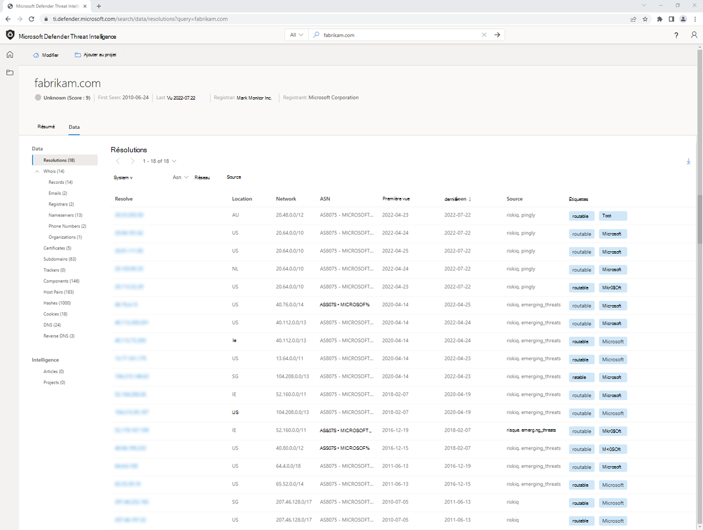
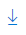

# Tri, filtrage et téléchargement de données

La plateforme Microsoft Defender Threat Intelligence (Defender TI) permet aux analystes d’accéder à notre vaste collection de données d’analyse dans un format de tableau indexé et dynamique.  Ces jeux de données peuvent être très volumineux, renvoyant des quantités étendues de données historiques et récentes. Ainsi, en permettant aux analystes de trier et de filtrer les données de manière appropriée, vous pouvez facilement exposer les connexions intéressantes.

Dans cet article pratique, vous allez apprendre à trier et filtrer des données pour les jeux de données suivants :

- Résolutions
- WHOIS
- Certificats
- Sous-domaines
- Trackers
- Composants
- Paires d’hôtes
- Hashes
- Cookies
- Services
- DNS
- DNS inversé

Pour plus d’informations, consultez [Jeux de données](data-sets.md).

Dans cet article pratique, vous allez également apprendre à télécharger des indicateurs/artefacts à partir des fonctionnalités suivantes :

- Projets
- Articles
- Jeux de données

## Conditions préalables

- Un compte Microsoft Azure Active Directory ou personnel. [Connexion ou création d’un compte](https://signup.microsoft.com/)
- Une licence Premium Microsoft Defender Threat Intelligence (Defender TI).
    > [!NOTE]
    > Les utilisateurs sans licence Defender TI Premium pourront toujours se connecter au portail Defender Threat Intelligence et accéder à notre offre Defender TI gratuite.

## Ouvrir la page d’accueil threat intelligence de Defender TI

1. Accédez au [portail Defender Threat Intelligence](https://ti.defender.microsoft.com/).
2. Effectuez l’authentification Microsoft pour accéder au portail.

## Tri des données

La fonction de tri sous l’onglet Données permet aux utilisateurs de trier rapidement nos jeux de données en fonction des valeurs de colonne. Par défaut, la plupart des résultats sont triés par « Last Seen » (décroissant) afin que les derniers résultats observés apparaissent en haut de la liste ; cela expose les données les plus récentes pour fournir immédiatement des informations sur l’infrastructure actuelle d’un artefact. Actuellement, tous les jeux de données sont triables selon les valeurs « First Seen » et « Last Seen » suivantes :

- Last Seen Descending (Default)
- Dernier affichage croissant
- Premier affichage croissant
- Première vue décroissante

Les données peuvent être triées dans chaque panneau de jeu de données dans l’onglet Données pour chaque adresse IP, domaine ou entité hôte sur laquelle une recherche ou un pivot est effectuée.

1. Recherchez un domaine, une adresse IP ou un hôte dans la barre de recherche Defender TI Threat Intelligence et accédez à l’onglet Données.
2. Appliquez les préférences de tri aux colonnes First Seen et Last Seen dans le panneau Resolutions Data.

## Filtrage des données

Le filtrage des données permet aux analystes d’accéder à un groupe de données sélectionné en fonction d’une valeur de métadonnées particulière. Par exemple, un analyste peut choisir d’afficher uniquement les résolutions IP découvertes à partir d’une source sélectionnée ou les composants d’un type particulier (par exemple, serveurs, frameworks). Cela permet aux utilisateurs de limiter les résultats de la requête aux éléments d’intérêt particulier. Étant donné que la plateforme Threat Intelligence fournit des métadonnées spécifiques qui coïncident avec des types de données particuliers, les options de filtre sont différentes pour chaque jeu de données.

## Filtres de résolution

Les filtres suivants s’appliquent aux données de résolution :

- **Balise système** : ces balises sont créées par le système Threat Intelligence en fonction des insights découverts par notre équipe de recherche.
- **Balise** : balises qui ont été appliquées par les utilisateurs threat intelligence.
- **ASN** : résultats relatifs à un numéro de système autonome (ASN) désigné.
- **Réseau** : résultats liés au réseau désigné.
- **Source** : source de données qui a produit le résultat (par exemple, riskiq, emerging_threats).

1. Recherchez un domaine, une adresse IP ou un hôte dans la barre de recherche Defender TI Threat Intelligence et accédez à l’onglet Données.
2. Appliquez des filtres à chacun des types d’options de filtre indiqués ci-dessus dans le panneau Résolutions de données.

## Filtres de suivi

Les filtres suivants s’appliquent aux données de suivi :

- **Type** : type de suivi identifié pour chaque artefact (par exemple, JarmFuzzyHash, GoogleAnalyticsID).
- **Adresse** : adresse IP qui a observé directement le suivi ou a un hôte de résolution qui a observé le suivi. (Apparaît lors de la recherche d’une adresse IP)
- **Nom d’hôte** : hôte qui a observé cette valeur de suivi. (Apparaît lors de la recherche dans un domaine ou un hôte)

1. Recherchez un domaine, une adresse IP ou un hôte dans la barre de recherche Defender TI Threat Intelligence et accédez à l’onglet Données.
2. Accédez au panneau Suivis de données.
3. Appliquez des filtres à chacun des types d’options de filtre indiqués ci-dessus dans le panneau Trackers Data.

## Filtres de composants

Les filtres suivants s’appliquent aux données de composant :

- **Ipaddressraw :** adresse IP qui coïncide avec le nom d’hôte retourné.
- **Type :** type de composant désigné (par exemple, accès à distance, système d’exploitation).
- **Nom :** nom du composant détecté (par exemple, Cobalt Strike, PHP).

1. Recherchez un domaine, une adresse IP ou un hôte dans la barre de recherche Defender TI Threat Intelligence et accédez à l’onglet Données.
2. Accédez au panneau Données des composants.
3. Appliquez des filtres à chacun des types d’options de filtre indiqués ci-dessus dans le panneau Données des composants.

## Filtres de paire d’hôtes

Les filtres suivants s’appliquent aux données de paire d’hôtes :

- **Direction :** direction de la connexion observée. Cela indique si le parent redirige vers l’enfant ou inversement.
- **Nom d’hôte parent :** nom d’hôte de l’artefact parent.
- **Cause :** cause détectée de la relation parent/enfant hôte (par exemple, redirection, iframe.src).
- **Nom d’hôte enfant :** nom d’hôte de l’artefact enfant.

1. Recherchez un domaine, une adresse IP ou un hôte dans la barre de recherche Defender TI Threat Intelligence et accédez à l’onglet Données.
2. Accédez au panneau Données des paires d’hôtes.
3. Appliquez des filtres à chacun des types d’options de filtre indiqués ci-dessus dans le panneau Données des paires d’hôtes.

## Filtres DNS & Inverse DNS

Les filtres suivants s’appliquent aux données DNS et DNS inversées :

- **Type d’enregistrement :** type d’enregistrement détecté dans l’enregistrement DNS (par exemple, NS, CNAME).
- **Valeur :** valeur désignée de l’enregistrement (par exemple, nameserver.host.com).

1. Recherchez un domaine, une adresse IP ou un hôte dans la barre de recherche Defender TI Threat Intelligence et accédez à l’onglet Données.
2. Accédez aux panneaux DNS et versions ultérieures, données DNS inversées.
3. Appliquez des filtres à chacun des types d’options de filtre indiqués ci-dessus dans les panneaux données DNS et Inverse DNS.

## Téléchargement de données

Dans Defender TI, il existe différentes sections qu’un utilisateur peut télécharger des données en tant qu’exportation csv.   Les utilisateurs doivent rechercher l’icône de téléchargement pour exporter des données en tant que csv.

Les données peuvent être téléchargées dans les sections suivantes :

- La plupart des panneaux de jeu de données
- Project
- Article sur le renseignement sur les menaces

Les en-têtes suivants sont exportés à la suite du téléchargement de résolutions, de DNS et de données DNS inversées :

| &nbsp;                     | &nbsp;                     |
|----------------------------|----------------------------|
| **Resolve**                | Enregistrement associé au domaine recherché (résolution de l’adresse IP) ou au domaine qui a été résolu en adresse IP lorsqu’une adresse IP est recherchée |
| **Emplacement**               | Pays dans lequel l’adresse IP est hébergée |
| **Réseau**                | Netblock ou sous-réseau |
| **autonomousSystemNumber** | Numéro de système autonome |
| **firstSeen**              | Date/heure à laquelle Microsoft a observé la résolution pour la première fois (format : mm/dd/aaaa hh:mm) |
| **lastSeen**               | Date/heure à laquelle Microsoft a observé la résolution pour la dernière fois (format : mm/dd/aaaa hh:mm) |
| **Source**                 | Source qui a observé cette résolution |
| **Tags**                   | Balises personnalisées ou système associées à l’artefact |

Les en-têtes suivants sont exportés suite au téléchargement des données des sous-domaines :

| &nbsp;                     | &nbsp;                     |
|----------------------------|----------------------------|
| **nom d’hôte**               | Sous-domaine du domaine recherché |
| **étiquettes**                   | Balises personnalisées ou système associées à l’artefact |

Les en-têtes suivants sont exportés à la suite du téléchargement des données Trackers :

| &nbsp;                     | &nbsp;                     |
|----------------------------|----------------------------|
| **nom d’hôte**               | Nom d’hôte qui a observé ou observe actuellement le suivi |
| **firstSeen**              | Date/heure à laquelle Microsoft a observé pour la première fois que le nom d’hôte utilisait le suivi (format : mm/dd/aaaa hh:mm) |
| **lastSeen**               | Date/heure à laquelle Microsoft a observé pour la première fois que le nom d’hôte utilisait le suivi (format : mm/dd/aaaa hh:mm) |
| **Attributetype**          | Type de suivi |
| **attributeValue**         | Valeur de suivi |
| **Tags**                   | Balises personnalisées ou système associées à l’artefact |

Les en-têtes suivants sont exportés à la suite du téléchargement des données composants :

| &nbsp;                     | &nbsp;                     |
|----------------------------|----------------------------|
| **nom d’hôte**               | Nom d’hôte qui a observé ou observe actuellement le composant |
| **firstSeen**              | Date/heure à laquelle Microsoft a observé pour la première fois que le nom d’hôte utilisait le suivi (format : mm/dd/yyyy hh:mm |
| **lastSeen**               | Date/heure à laquelle Microsoft a observé la dernière fois que le nom d’hôte utilisait le composant (format : mm/dd/aaaa hh:mm |
| **Catégorie**               | Type de composant |
| **name**                   | Nom du composant |
| **version**                | Version du composant |
| **Tags**                   | Balises personnalisées ou système associées à l’artefact |

Les en-têtes suivants sont exportés à la suite du téléchargement des données de paires d’hôtes :

| &nbsp;                     | &nbsp;                     |
|----------------------------|----------------------------|
| **parentHostname**         | Nom d’hôte qui tend la main au nom d’hôte enfant |
| **childHostname**          | Nom d’hôte qui alimente les ressources qu’ils hébergent au nom d’hôte parent. |
| **firstSeen**              | Date/heure à laquelle Microsoft a observé pour la première fois la relation entre le nom d’hôte parent et le nom d’hôte enfant (format : mm/dd/aaaa hh:mm) |
| **lastSeen**               | Date/heure à laquelle Microsoft a observé pour la dernière fois la relation entre le nom d’hôte parent et le nom d’hôte enfant (format : mm/dd/aaaa hh:mm) |
| **attributeCause**         | Cause de la relation entre le nom d’hôte parent et le nom d’hôte enfant |
| **Tags**                   | Balises personnalisées ou système associées à l’artefact |

Les en-têtes suivants sont exportés à la suite du téléchargement des données hashes :

| &nbsp;             | &nbsp;                     |
|--------------------|----------------------------|
| **source**         | Source qui a observé l’exemple de hachage MD5 |
| **Échantillon**                  | Hachage MD5 |
| **date de collecte**         | Date de collecte capturée par la source |

Les en-têtes suivants sont exportés suite au téléchargement des données cookies :

| &nbsp;                     | &nbsp;                     |
|----------------------------|----------------------------|
| **nom d’hôte**               | Nom d’hôte qui a observé le nom du cookie |
| **firstSeen**              | Lorsque le nom du cookie a été observé pour la première fois dans le nom d’hôte provenant du domaine cookie (format : mm/dd/aaaa hh:mm) |
| **lastSeen**               | Date/heure à laquelle le nom du cookie a été observé pour la dernière fois dans le nom d’hôte provenant du domaine cookie (format : mm/dd/aaaa hh:mm) |
| **cookieName**             | Nom du cookie |
| **cookieDomain**           | Serveur du nom de domaine d’où provient le nom du cookie |
| **Tags**                   | Balises personnalisées ou système associées à l’artefact |

Les en-têtes suivants sont exportés à la suite du téléchargement de listes de projets pour mes projets, mon équipe et mes projets partagés :

| &nbsp;                     | &nbsp;                     |
|----------------------------|----------------------------|
| **name**                   | Nom du projet |
| **artefacts (nombre)**      | Nombre d’artefacts dans le projet |
| **créé par (utilisateur)**      | Utilisateur qui a créé le projet |
| **créé le**             | Lors de la création du projet |
| **étiquettes**                   | Balises personnalisées ou système associées à l’artefact |
| **Collaborateurs**          | Qui a été ajouté en tant que collaborateur(s) au projet. Ceci est visible uniquement pour les projets qui ont été téléchargés à partir des pages Mes projets et projets partagés. |

Les en-têtes suivants sont exportés à la suite du téléchargement des détails du projet (artefacts) à partir d’un projet :

| &nbsp;                     | &nbsp;                     |
|----------------------------|----------------------------|
| **Artefact**               | Valeur d’artefact (par exemple, adresse IP, domaine, hôte, valeur WHOIS, certificat SHA-1, etc.) |
| **type**                   | Type d’artefact (par exemple, IP, domaine, hôte, organisation WHOIS, téléphone WHOIS, certificat SHA-1, etc.) |
| **Créé**                | Date/heure à laquelle l’artefact a été ajouté au projet (format : mm/dd/aaaa hh:mm) |
| **Créateur**                | Email adresse de l’utilisateur qui a ajouté l’artefact |
| **context**                | Comment l’artefact a été ajouté au projet |
| **étiquettes**                   | Balises personnalisées ou système associées à l’artefact |
| **Collaborateurs**          | Qui a été ajouté en tant que collaborateur(s) au projet. Ceci est visible uniquement pour les projets qui ont été téléchargés à partir des pages Mes projets et projets partagés. |

Les en-têtes suivants sont exportés à la suite du téléchargement d’indicateurs public ou riskiq de renseignement sur les menaces :

| &nbsp;                     | &nbsp;                     |
|----------------------------|----------------------------|
| **type**                | Type d’indicateur (par exemple, ip, certificat, domaine, hash_sha256) |
| **value**               | Valeur de l’indicateur (par exemple, adresse IP, domaine, nom d’hôte) |
| **source**              | Source de l’indicateur (RiskIQ ou OSINT) |

## Prochaines étapes

Pour plus d’informations, consultez [Jeux de données](data-sets.md).
