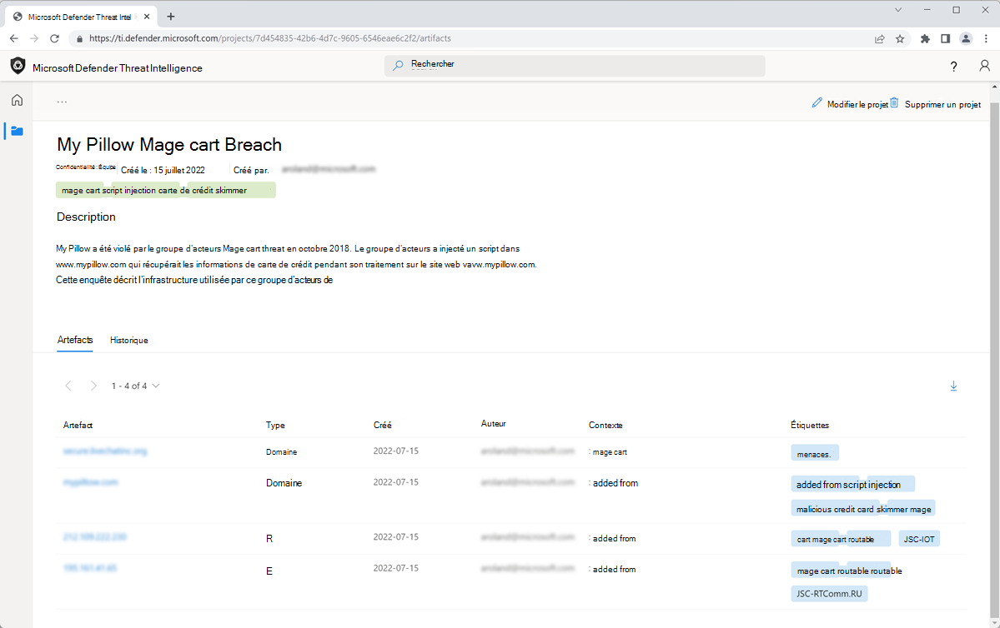
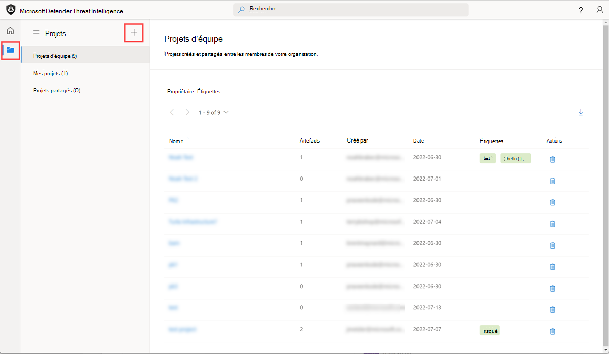
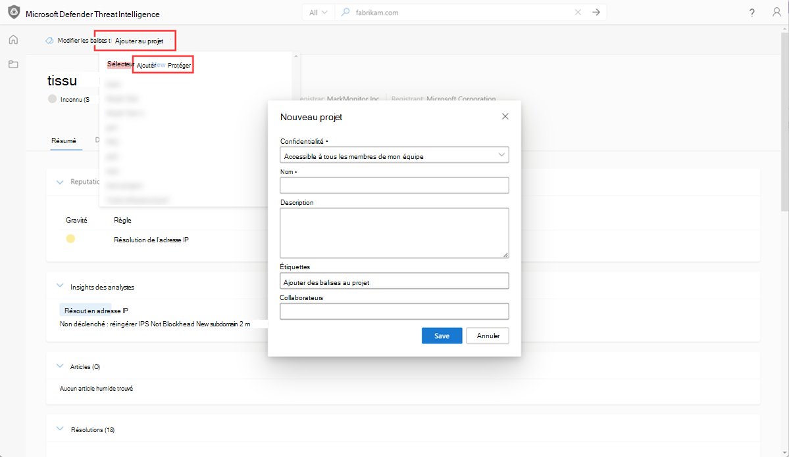
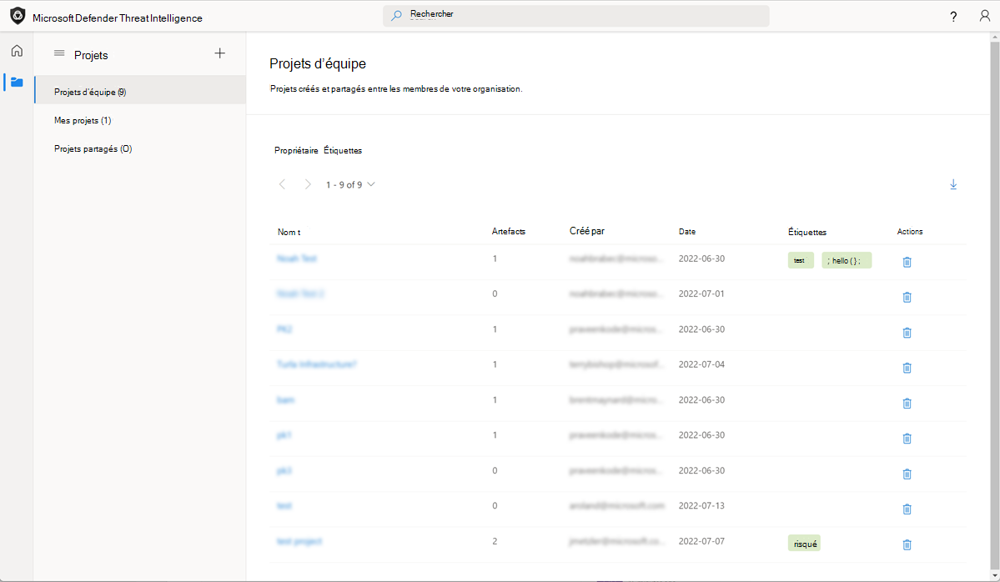

# Utilisation de projets

La plateforme Microsoft Defender Threat Intelligence (Defender TI) permet aux utilisateurs de développer des types de projets personnels ou d’équipe privés pour organiser des indicateurs d’intérêt et des indicateurs de compromission à partir d’une enquête. Les projets contiennent une liste de tous les artefacts associés et un historique détaillé qui conserve les noms, les descriptions, les collaborateurs et les profils de surveillance.

Lorsqu’un utilisateur recherche une adresse IP, un domaine ou un hôte dans Defender TI, si cet indicateur est répertorié dans un projet auquel l’utilisateur a accès, il peut sélectionner le panneau Projets dans la section Intelligence et accéder aux détails du projet pour plus de contexte sur l’indicateur avant de consulter les autres jeux de données pour plus d’informations. Les utilisateurs peuvent également afficher leurs projets d’équipe privé en sélectionnant l’icône Projets dans le volet de menu de gauche.

La visite des détails d’un projet présente une liste de tous les artefacts associés et un historique détaillé qui conserve tout le contexte décrit ci-dessus. Les utilisateurs de la même organisation n’ont plus besoin de passer du temps à communiquer entre eux. Les profils d’acteur de menace peuvent être générés dans Defender TI et servir d’ensemble « vivant » d’indicateurs. À mesure que de nouvelles informations sont découvertes ou trouvées, elles peuvent être ajoutées à ce projet.

La plateforme Defender TI permet aux utilisateurs de développer plusieurs types de projets pour organiser des indicateurs d’intérêt et des indicateurs de compromission à partir d’une enquête.

Le propriétaire d’un projet peut ajouter des collaborateurs (utilisateurs répertoriés dans leur locataire Azure avec une licence Defender TI Premium). Cela permet aux collaborateurs d’apporter des modifications au projet comme s’ils étaient le propriétaire du projet. L’exception est que les collaborateurs ne peuvent pas supprimer de projets. Les collaborateurs verront les projets qui ont été partagés avec eux dans la section Projets partagés de la page d’accueil des projets.

Les utilisateurs peuvent également télécharger des artefacts dans un projet en sélectionnant l’icône de téléchargement. Il s’agit d’un excellent moyen pour les équipes de repérage des menaces d’utiliser leurs résultats d’une enquête pour bloquer les indicateurs de compromission ou créer des règles de détection supplémentaires dans leur SIEM.

**Questions auxquelles les projets peuvent vous aider :**

- Un membre de mon équipe a-t-il créé un projet d’équipe qui inclut cet indicateur ?

   - Si c’est le cas, quels autres indicateurs de compromission le membre de l’équipe a-t-il capturé et quelle description et quelles balises ont-ils inclus pour décrire le type d’enquête ?

- Quand ce membre de l’équipe a-t-il modifié le projet pour la dernière fois ?

    

## Configuration requise

- Un compte Microsoft Azure Active Directory ou personnel. [Connexion ou création d’un compte](https://signup.microsoft.com/)
- Une licence Premium Microsoft Defender Threat Intelligence (Defender TI).
    > [!NOTE]
    > Les utilisateurs sans licence Defender TI Premium pourront toujours se connecter au portail Defender Threat Intelligence et accéder à notre offre Defender TI gratuite.

## Ouvrir la page d’accueil threat intelligence de Defender TI

1. Accédez au [portail Defender Threat Intelligence](https://ti.defender.microsoft.com/).
2. Effectuez l’authentification Microsoft pour accéder au portail.

## Création d’un projet

Les utilisateurs peuvent créer un projet de deux manières différentes, par le biais de la page d’accueil des projets ou lors de l’examen des résultats.

Lors de la connexion à la page d’accueil des projets Defender TI, les utilisateurs reçoivent un tableau de bord montrant les projets qu’ils possèdent ou qui ont été partagés avec d’autres utilisateurs Defender TI dans leur locataire. Directement à partir de cette vue, les utilisateurs peuvent décider de créer un projet, simplement en sélectionnant l’icône « + » ou en visitant la page du projet à l’aide du menu à tiroir de gauche.

1. Pour créer un projet à partir de la page d’accueil du projet, accédez à l’icône « Projets », puis sélectionnez l’icône « Ajouter un nouveau projet » dans la page d’accueil des projets.

    

    Lorsque vous effectuez des recherches dans Defender TI, les utilisateurs peuvent sélectionner « Ajouter au projet » pour ajouter l’artefact (indicateur de compromission) à un projet existant ou créer un projet auquel ajouter l’artefact.

2. Pour créer un projet par le biais d’une enquête, effectuez une recherche d’indicateur à partir de la barre de recherche Threat Intelligence, puis cliquez sur l’icône « Ajouter au projet ».

3. Si vous créez un projet, sélectionnez le lien « Ajouter un nouveau projet », renseignez les champs requis et « Enregistrez » votre nouveau projet. Si vous avez déjà un projet existant auquel vous souhaitez ajouter l’artefact, sélectionnez ou faites défiler vers le bas, puis sélectionnez le projet souhaité.

    

## Gestion des projets

Une fois qu’un utilisateur a créé des projets, il peut les gérer dans la partie Projets de la plateforme. La page d’accueil initiale du projet met en évidence tous les projets que l’utilisateur peut voir et fournit des méthodes de filtrage en fonction des propriétés du projet. La page d’accueil du projet utilise par défaut les projets d’équipe associés aux utilisateurs Defender TI dans leur locataire. Ils ont la possibilité de sélectionner les projets personnels qu’ils ont créés, ainsi que les projets qui ont été partagés avec eux pour y contribuer.

1. Les utilisateurs peuvent afficher les détails d’un projet simplement en cliquant sur le nom du projet.
2. Selon le niveau d’accès, les utilisateurs peuvent ensuite apporter des modifications au projet directement en cliquant sur le bouton Modifier dans le coin supérieur droit.
3. Les utilisateurs peuvent également supprimer un projet s’ils sont le propriétaire du projet. Ils peuvent également choisir d’ajouter manuellement des artefacts à l’aide du bouton « Ajouter des artefacts » dans le coin supérieur droit.

## Meilleures pratiques

Quand il s’agit d’utiliser Defender TI pour examiner les menaces potentielles, nous vous recommandons d’exécuter les flux de travail suivants, car ces étapes vous permettront de recueillir des informations stratégiques et opérationnelles avant de vous plonger dans le renseignement tactique.

Les utilisateurs peuvent effectuer différents types de recherches dans Defender TI. Par conséquent, il est important d’aborder votre méthode de collecte de renseignements d’une manière qui vous présente des résultats généraux avant de vous plonger dans l’examen d’indicateurs spécifiques. Par exemple, si vous recherchez une adresse IP sur la page d’accueil Defender TI, quels articles ont une association avec cette adresse IP ? Quelles informations ces articles présentent sur l’adresse IP que vous ne trouveriez pas autrement en accédant directement à l’onglet Données de l’adresse IP pour l’enrichissement du jeu de données. Par exemple, cette adresse IP a-t-elle été identifiée comme étant un C2 possible, qui est l’acteur de menace, quels autres indicateurs connexes de compromission sont répertoriés dans l’article, quels sont les TTP utilisés par l’acteur de menace et qui ciblent-ils ?

En plus d’effectuer différents types de recherches avec Defender TI, les utilisateurs peuvent collaborer sur des investigations ensemble. Cela dit, les utilisateurs sont encouragés à créer des projets, à ajouter des indicateurs liés à une enquête à un projet et à ajouter des collaborateurs à un projet si plusieurs personnes travaillent sur la même enquête. Cela permet de réduire le temps consacré à l’analyse des mêmes E/S par E/S et devrait entraîner un flux de travail plus rapide observé.