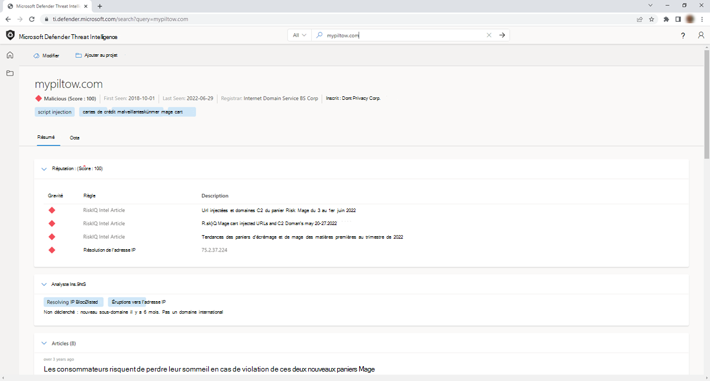

# Utilisation de balises
Microsoft Defender Threat Intelligence balises (Defender TI) sont utilisées pour fournir un aperçu rapide d’un artefact, qu’il soit dérivé par le système ou généré par d’autres utilisateurs. Les balises aident les analystes à connecter les points entre les incidents et investigations actuels et leur contexte historique pour une analyse améliorée.

La plateforme Defender TI offre deux types de balises : les balises système et personnalisées.

## Prerequisites

- Un compte Microsoft Azure Active Directory ou personnel. [Connexion ou création d’un compte](https://signup.microsoft.com/)
- Une licence Premium Microsoft Defender Threat Intelligence (Defender TI).
    > [!NOTE]
    > Les utilisateurs sans licence Defender TI Premium pourront toujours se connecter au portail Defender Threat Intelligence et accéder à notre offre Defender TI gratuite.

## Balises système

Ces balises sont générées automatiquement par la plateforme pour que les utilisateurs guident leur analyse et ne nécessitent aucune entrée ou effort de la part de l’utilisateur.

Les balises système peuvent inclure :

- **Routable :** indique que l’artefact est accessible.
- **ASN :** extrait une partie abrégée d’une description ASN d’adresse IP dans une balise pour fournir aux analystes le contexte dans lequel l’adresse IP appartient.
- **Dynamique :** indique si un domaine appartient à un service DNS dynamique tel que No-IP ou Change IP.
- **Sinkhole :** indique qu’une adresse IP est un puits de recherche utilisé par les organisations de sécurité pour enquêter sur les campagnes d’attaques. Par conséquent, les domaines associés ne seront pas directement connectés les uns aux autres.

## Indicateurs personnalisés

Balises personnalisées à l’intérieur de Defender TI pour mettre en contexte les indicateurs de compromission (IOC) et simplifier encore l’analyse en identifiant les domaines qui sont connus comme étant incorrects dans les rapports publics ou qui ont été classés par les analystes de votre entreprise. Ces balises sont créées manuellement par les utilisateurs en fonction de leurs propres investigations. Ces balises permettent aux utilisateurs de partager des insights clés sur un artefact avec d’autres utilisateurs de licence Defender TI Premium au sein de leur locataire.

## Ajout, modification et suppression de balises

Les utilisateurs ont la possibilité d’ajouter leurs propres balises personnalisées au cluster de balises en les entrant dans la barre de balises. Ces balises sont visibles par l’utilisateur individuel et les membres de l’équipe de l’utilisateur si son organisation est un client Defender TI. Les balises entrées dans le système sont privées et ne sont pas partagées avec l’ensemble de la communauté.

Tout comme les utilisateurs peuvent ajouter des balises, ils peuvent également les modifier ou les supprimer. Une fois qu’une balise est ajoutée par un utilisateur, elle peut être modifiée ou supprimée par ce même utilisateur ou par un autre utilisateur sous licence payant au sein de son organisation d’entreprise. Cela permet une collaboration facile entre l’équipe de sécurité.

1. Accédez au [portail Defender Threat Intelligence](https://ti.defender.microsoft.com/) .
2. Effectuez l’authentification Microsoft pour accéder au portail.
3. Recherchez un indicateur dans la barre de recherche Threat Intelligence pour laquelle vous souhaitez ajouter des balises.

    

4. Sélectionnez la liste déroulante « Modifier les étiquettes » dans le coin supérieur gauche du portail Defender TI.

    

5. Ajoutez toutes les balises que vous souhaitez associer à cet indicateur.

    > [!Note]
    > Appuyez sur Tab pour ajouter un nouvel indicateur.

    

6. Une fois toutes vos balises ajoutées, enregistrez vos modifications en sélectionnant le bouton Enregistrer.

    

7. Pour modifier des balises, répétez l’étape 3. Supprimez toutes les balises en sélectionnant « X » à la fin du nom de la balise ou ajoutez de nouvelles balises comme vous l’avez fait à l’étape 4.

8. Enregistrez vos modifications.

    

## Affichage et recherche de balises

Les utilisateurs peuvent afficher les balises qui ont été ajoutées par eux-mêmes ou d’autres personnes au sein de leur locataire après avoir recherché une adresse IP, un domaine ou un artefact d’hôte.

1. Accédez au [portail Defender Threat Intelligence](https://ti.defender.microsoft.com/).
2. Effectuez l’authentification Microsoft pour accéder au portail.
3. Les utilisateurs peuvent rechercher des balises personnalisées via la recherche Threat Intelligence de Defender TI en sélectionnant le type de recherche d’étiquettes dans la liste déroulante de la barre de recherche Threat Intelligence et en effectuant une recherche sur la valeur de balise pour identifier tous les autres indicateurs qui partagent cette même valeur de balise.

    

Common Tag Use Case Workflow Supposons qu’un analyste de triage examine un incident et trouve qu’il est lié au hameçonnage. Cet analyste peut ajouter « phish » comme balise aux indicateurs de compromission liés à cet incident. Par la suite, l’équipe chargée de la réponse aux incidents et de la chasse aux menaces pourra analyser plus en détail ces indicateurs de compromission et collaborer avec leurs homologues du renseignement sur les cybermenaces pour identifier le groupe d’acteurs responsable de leur incident de hameçonnage. Ils peuvent ensuite ajouter une autre balise « [nom d’acteur] » à ces indicateurs de compromission ou à l’infrastructure qui les a connectés à d’autres indicateurs de compromission connexes, tels qu’une balise personnalisée « [hachage SHA-1] ».

## Prochaines étapes

Pour plus d’informations, reportez-vous aux rubriques suivantes :

- [Qu’est-ce que Microsoft Defender Threat Intelligence (Defender TI) ?](index.md)
- [Jeux de données](data-sets.md)
- [Tri, filtrage et téléchargement de données](sorting-filtering-and-downloading-data.md)
- [Score de réputation](reputation-scoring.md)
- [Insights des analystes](analyst-insights.md)
- [Utilisation de projets](using-projects.md)
