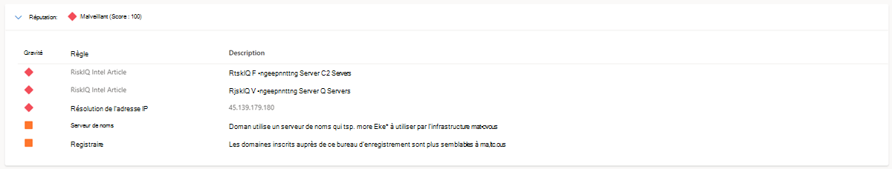

# Qu’est-ce que Microsoft Defender Threat Intelligence (Defender TI) ?

Microsoft Defender Threat Intelligence (Defender TI) est une plateforme qui simplifie le triage, la réponse aux incidents, la chasse aux menaces, la gestion des vulnérabilités et les flux de travail des analystes de cybermenaces lors de l’analyse de l’infrastructure des menaces et de la collecte de renseignements sur les menaces. Les analystes consacrent beaucoup de temps à la découverte, à la collecte et à l’analyse des données, au lieu de se concentrer sur ce qui aide réellement leur organisation à se défendre, en dérivant des insights sur les acteurs par l’analyse et la corrélation.

Souvent, les analystes doivent accéder à plusieurs référentiels pour obtenir les jeux de données critiques dont ils ont besoin pour évaluer un domaine, un hôte ou une adresse IP suspects. Les données DNS, les informations WHOIS, les programmes malveillants et les certificats SSL fournissent un contexte important pour les indicateurs de compromission , mais ces référentiels sont largement distribués et ne partagent pas toujours une structure de données commune, ce qui rend difficile la garantie que les analystes disposent de toutes les données pertinentes nécessaires pour effectuer une évaluation appropriée et en temps opportun de l’infrastructure suspecte.

L’interaction avec ces jeux de données peut être fastidieuse et le pivotage entre ces référentiels prend du temps, drainant les ressources des groupes d’opérations de sécurité qui doivent constamment hiérarchiser leurs efforts de réponse.

Les analystes de cyber-renseignement sur les menaces ont du mal à trouver un équilibre entre l’ingestion de renseignements sur les menaces et l’analyse de laquelle les renseignements sur les menaces représentent les plus grandes menaces pour leur organisation et/ou leur industrie.

Dans la même étendue, les analystes de l’intelligence des vulnérabilités se battent pour mettre en corrélation leur inventaire des ressources avec les informations CVE pour hiérarchiser l’examen et la correction des vulnérabilités les plus critiques associées à leur organisation.

L’objectif de Microsoft est de ré-imaginer le flux de travail de l’analyste en développant une plateforme, Defender TI, qui agrège et enrichit les sources de données critiques et affiche les données dans une interface innovante et facile à utiliser pour mettre en corrélation les indicateurs liés à des articles et des vulnérabilités, à la chaîne d’infrastructure entre les indicateurs de compromission (IOC), et à collaborer sur des investigations avec d’autres utilisateurs sous licence Defender TI au sein de leur locataire. Avec les organisations de sécurité qui prennent des mesures de plus en plus importantes en matière de renseignement et d’alertes dans leur environnement, il est important de disposer d’une plateforme d’analyse des menaces & intelligence qui permet des évaluations précises et opportunes des alertes.

Vous trouverez ci-dessous une capture d’écran de la page d’accueil threat intelligence de Defender TI. Les analystes peuvent analyser rapidement les nouveaux articles proposés, ainsi que commencer leur collecte d’informations, le triage, la réponse aux incidents et les efforts de chasse en effectuant une recherche par mot clé, artefact ou CVE-ID.

## Articles Defender TI
Les articles sont des narrations de Microsoft qui fournissent des insights sur les acteurs des menaces, les outils, les attaques et les vulnérabilités. Defender TI proposé et les articles ne sont pas des billets de blog sur le renseignement sur les menaces; bien qu’ils résument les différentes menaces, ils sont également liés à du contenu exploitable et à des indicateurs clés de compromission pour aider les utilisateurs à prendre des mesures. En incluant ces informations techniques dans les résumés des menaces, nous permetons aux utilisateurs de suivre en permanence les acteurs des menaces, les outils, les attaques et les vulnérabilités à mesure qu’ils changent.

## Articles proposés

La section article proposée de la page d’accueil Defender TI Threat Intelligence (juste en dessous de la barre de recherche) vous présente le contenu Microsoft proposé :

Cliquer sur l’article vous permet d’accéder au contenu de l’article sous-jacent. Le synopsis de l’article donne à l’utilisateur une compréhension rapide de l’article. L’appel d’indicateurs indique le nombre d’indicateurs TI publics et Defender associés à l’article.

## Articles

Tous les articles (y compris les articles proposés) sont répertoriés dans la section Page d’accueil de Microsoft Defender TI Threat Intelligence, classée par date de création (décroissant) :

## Descriptions de l’article

La section description de l’écran détaillé de l’article contient des informations sur l’attaque ou l’attaquant profilé. Le contenu peut aller de très court (dans le cas des bulletins OSINT) ou assez long (pour les rapports de formulaire long , en particulier lorsque Microsoft a augmenté le rapport avec du contenu). Les descriptions plus longues peuvent contenir des images, des liens vers le contenu sous-jacent, des liens vers des recherches dans Defender TI, des extraits de code d’attaquant et des règles de pare-feu pour bloquer l’attaque :

## Indicateurs publics

La section Indicateurs publics de l’écran affiche les indicateurs précédemment publiés liés à l’article. Les liens dans les indicateurs publics en prennent une aux données Defender TI sous-jacentes ou aux sources externes pertinentes (par exemple, VirusTotal pour les hachages).

## Indicateurs Defender TI

La section Des indicateurs Defender TI couvre les indicateurs que l’équipe de recherche de Defender TI a trouvés et ajoutés aux articles.

Ces liens pivotent également dans les données Defender TI pertinentes ou la source externe correspondante.

## Articles sur les vulnérabilités

Defender TI offre des recherches CVE-ID pour aider les utilisateurs à identifier les informations critiques sur le CVE. Les recherches CVE-ID génèrent des articles sur les vulnérabilités.

Les articles sur les vulnérabilités fournissent un contexte clé derrière les CVE d’intérêt. Chaque article contient une description du CVE, une liste des composants affectés, des procédures et des stratégies d’atténuation personnalisées, des articles d’intelligence connexes, des références dans deep & Dark Web chatter, et d’autres observations clés. Ces articles fournissent des insights contextuels et actionnables plus approfondis derrière chaque CVE, ce qui permet aux utilisateurs de comprendre plus rapidement ces vulnérabilités et de les atténuer rapidement.

Les articles sur les vulnérabilités incluent également un score de priorité Defender TI et un indicateur de gravité. Le score de priorité Defender TI est un algorithme unique qui reflète la priorité d’un CVE en fonction du score CVSS, des exploits, des bavardages et de la liaison aux programmes malveillants. En outre, le score de priorité Defender TI évalue la récurrence de ces composants afin que les utilisateurs puissent comprendre quels CVE doivent être corrigés en premier.

## Scoring de réputation

Defender TI fournit des scores de réputation propriétaires pour n’importe quel hôte, domaine ou adresse IP. Qu’il s’agisse de valider la réputation d’une entité connue ou inconnue, ce score permet aux utilisateurs de comprendre rapidement les liens détectés avec une infrastructure malveillante ou suspecte. La plateforme fournit des informations rapides sur l’activité de ces entités, telles que les horodatages First et Last Seen, ASN, country, associated infrastructure, and a list of rules that impact the reputation score when applicable.

Les données de réputation IP sont importantes pour comprendre la fiabilité de votre propre surface d’attaque et sont également utiles lors de l’évaluation d’hôtes, de domaines ou d’adresses IP inconnus qui apparaissent dans les enquêtes. Ces scores révèlent toute activité malveillante ou suspecte antérieure ayant un impact sur l’entité, ou d’autres indicateurs connus de compromission qui doivent être pris en compte.

Pour plus d’informations, consultez [Scoring de réputation](reputation-scoring.md).

## Insights des analystes

Les insights des analystes distillent le vaste jeu de données de Microsoft en quelques observations qui simplifient l’investigation et la rendent plus accessible aux analystes de tous niveaux.

Les insights sont destinés à être de petits faits ou observations sur un domaine ou une adresse IP et permettent aux utilisateurs Defender TI d’effectuer une évaluation sur l’artefact interrogé et d’améliorer la capacité d’un utilisateur à déterminer si un indicateur faisant l’objet d’une enquête est malveillant, suspect ou bénin.

Pour plus d’informations, consultez [Insights de l’analyste](analyst-insights.md).

## Jeux de données
Microsoft centralise de nombreux jeux de données dans une plateforme unique, Defender TI, ce qui facilite l’analyse de l’infrastructure pour la communauté et les clients de Microsoft. L’objectif principal de Microsoft est de fournir autant de données que possible sur l’infrastructure Internet afin de prendre en charge divers cas d’utilisation de la sécurité.

Microsoft collecte, analyse et indexe les données Internet pour aider les utilisateurs à détecter et à répondre aux menaces, à hiérarchiser les incidents et à identifier de manière proactive l’infrastructure des adversaires associée aux groupes d’acteurs ciblant leur organisation. Microsoft collecte des données Internet via son réseau de capteurS PDNS, un réseau proxy global d’utilisateurs virtuels, des analyses de port et tire parti de sources tierces pour les programmes malveillants et des données DNS (Domain Name System) ajoutées.

Ces données Internet sont classées en deux groupes distincts : traditionnel et avancé. Les jeux de données traditionnels incluent les résolutions, WHOIS, certificats SSL, sous-domaines, hachages, DNS, DNS inversé et services. Les jeux de données avancés incluent trackers, composants, paires d’hôtes et cookies. Les jeux de données Trackers, Components, Host Pairs et Cookies sont collectés à partir de l’observation du modèle DOM (Document Object Model) des pages web analysés. En outre, les composants et les suivis sont également observés à partir de règles de détection déclenchées en fonction des réponses de bannière des analyses de port ou des détails du certificat SSL. La plupart de ces jeux de données ont différentes méthodes pour trier, filtrer et télécharger des données, ce qui facilite l’accès aux informations qui peuvent être associées à un type d’artefact ou à une heure spécifique dans l’historique.

Pour plus d’informations, voir :

- [Tri, filtrage et téléchargement de données](sorting-filtering-and-downloading-data.md)
- [Jeux de données](data-sets.md)

## Balises

Les balises Defender TI sont utilisées pour fournir un aperçu rapide d’un artefact, qu’il soit dérivé par le système ou généré par d’autres utilisateurs. Les balises aident les analystes à connecter les points entre les incidents et les investigations actuels et leur contexte historique pour une analyse améliorée.

La plateforme Defender TI offre deux types de balises : les balises système et les balises personnalisées.

Pour plus d’informations, consultez [Utilisation de balises](using-tags.md).

## Projets

La plateforme Defender TI de Microsoft permet aux utilisateurs de développer plusieurs types de projets pour organiser des indicateurs d’intérêt et des indicateurs de compromission à partir d’une enquête. Les projets contiennent une liste de tous les artefacts associés et un historique détaillé qui conserve les noms, les descriptions et les collaborateurs.

Lorsqu’un utilisateur recherche une adresse IP, un domaine ou un hôte dans Defender TI, si cet indicateur est répertorié dans un projet auquel l’utilisateur a accès, il peut voir un lien vers le projet à partir des sections Projets sous l’onglet Résumé ainsi que dans l’onglet Données. À partir de là, l’utilisateur peut accéder aux détails du projet pour plus de contexte sur l’indicateur avant de consulter les autres jeux de données pour plus d’informations. Cela permet aux analystes d’éviter de réinventer la roue d’une enquête que l’un de leurs utilisateurs de locataire Defender TI a peut-être déjà commencé ou ajouté à cette enquête en ajoutant de nouveaux artefacts (indicateurs de compromission) liés à ce projet (s’ils ont été ajoutés en tant que collaborateurs au projet).

Pour plus d’informations, consultez [Utilisation de projets](using-projects.md).

## Résidence, disponibilité et confidentialité des données

Microsoft Defender Threat Intelligence contient des données globales et des données spécifiques au client. Les données Internet sous-jacentes sont des données Microsoft globales ; les étiquettes appliquées par les clients sont considérées comme des données client. Toutes les données client sont stockées dans la région de votre choix.

À des fins de sécurité, Microsoft collecte les adresses IP des utilisateurs lorsqu’ils se connectent. Ces données sont stockées jusqu’à 30 jours, mais peuvent être stockées plus longtemps si nécessaire pour enquêter sur l’utilisation potentielle frauduleuse ou malveillante du produit.

Dans le cas d’un scénario d’arrêt de région, les clients ne doivent pas voir de temps d’arrêt, car Defender TI utilise des technologies qui répliquent des données dans une région de sauvegarde.

Defender TI traite les données client. Par défaut, les données client sont répliquées dans la région jumelée.

## Prochaines étapes

Pour plus d’informations, reportez-vous aux rubriques suivantes :

- [Démarrage rapide : Découvrez comment accéder à Microsoft Defender Threat Intelligence et effectuer des personnalisations dans votre portail](learn-how-to-access-microsoft-defender-threat-intelligence-and-make-customizations-in-your-portal.md)
- [Jeux de données](data-sets.md)
- [Recherche et sélection dynamique](searching-and-pivoting.md)
- [Tri, filtrage et téléchargement de données](sorting-filtering-and-downloading-data.md)
- [Chaînage d’infrastructure](infrastructure-chaining.md)
- [Scoring de réputation](reputation-scoring.md)
- [Insights des analystes](analyst-insights.md)
- [Utilisation de projets](using-projects.md)
- [Utilisation de balises](using-tags.md)