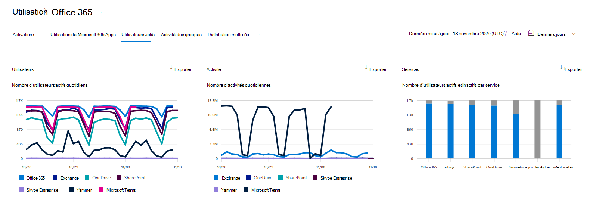

# Évaluer le rapport Microsoft 365 utilisateurs actifs

Le tableau de bord Microsoft 365 **rapports de** gestion des données vous présente la vue d’ensemble de l’activité sur les produits de votre organisation. Il vous permet d'explorer les rapports au niveau de chaque produit afin d'offrir des informations plus précises sur les activités pour chaque produit. Consultez [la rubrique Présentation des rapports](activity-reports.md).
  
Par exemple, vous pouvez utiliser le rapport **Utilisateurs actifs** pour déterminer le nombre des licences de produit utilisées par les membres de votre organisation, et approfondir votre recherche pour obtenir des informations sur les utilisateurs et les produits utilisés. Ce rapport peut aider les administrateurs à identifier les produits sous-utilisés ou les utilisateurs nécessitant une formation ou des informations supplémentaires. 
  
> [!NOTE]
> Vous devez être administrateur général, lecteur général ou lecteur de rapports dans Microsoft 365 ou administrateur Exchange, SharePoint, service Teams, Teams Communications ou administrateur Skype Entreprise pour consulter les rapports.  

## Accéder au rapport Utilisateurs actifs

1. Dans le centre d’administration, accédez à la page **Rapports** \> <a href="https://go.microsoft.com/fwlink/p/?linkid=2074756" target="_blank">Utilisation</a>. 
2. Dans la page d’accueil  du tableau de bord, cliquez sur le bouton Afficher plus sur la carte Utilisateurs actifs Microsoft 365 Services.

## Interpréter le rapport Utilisateurs actifs

Vous pouvez afficher les utilisateurs actifs dans le rapport Office 365 en choisissant **l’onglet Utilisateurs** actifs. 

- Le rapport Utilisateurs actifs peut être consulté pour connaître les tendances enregistrées au cours des 7, 30, 90 ou 180 derniers jours. Toutefois, si vous affichez un jour particulier dans le rapport, le tableau (7) affiche les données pendant 28 jours au plus à partir de la date actuelle (et non la date à laquelle le rapport a été généré).

- Les données de chaque rapport couvrent généralement jusqu’aux dernières 24 à 48 heures.

- Le graphique Utilisateurs affiche les utilisateurs actifs quotidiens dans la période de rapport, séparés par le produit.
Le graphique d’activité vous montre le nombre d’activités quotidiennes dans la période de rapport, séparés par produit.
Le graphique Services présente le nombre d'utilisateurs par type d'activité et service.

- Dans le graphique Utilisateurs, l’axe x affiche la période de rapports sélectionnée et l’axe y affiche les utilisateurs actifs quotidiens séparés et codés en couleur par type de licence.
Dans le graphique d’activité, l’axe x affiche la période de rapports sélectionnée et l’axe y affiche le nombre d’activités quotidiennes séparés et la couleur codée par type de licence.
Sur le graphique d'activités Services, l'axe X indique les services individuels que vos utilisateurs sont autorisés à utiliser au cours de la période spécifiée, tandis que l'axe Y indique le nombre d'utilisateurs en fonction de l'état de l'activité, avec un codage couleur selon l'état de l'activité.

- Vous pouvez filtrer les séries que vous voyez sur le graphique en sélectionnant un élément dans la légende. Cette sélection ne modifie nullement les informations figurant dans le tableau grille.

- Vous pouvez également exporter les données du rapport dans un Excel .csv, en sélectionnant le lien Exporter. Cela a pour effet d'exporter les données de tous les utilisateurs afin d'effectuer un tri et un filtrage simples à des fins d'analyse approfondie. Si vous avez moins de 2000 utilisateurs, vous pouvez trier et filtrer dans le tableau, au sein du rapport proprement dit. Si vous avez plus de 2000 utilisateurs, pour filtrer et trier les données, vous devez préalablement les exporter.

- Vous pouvez modifier les informations affichées dans la grille à l'aide de contrôles de colonnes.
Si votre abonnement est géré par 21Vianet, les Yammer.

Si la politique de votre organisation vous empêche de consulter les rapports sur lesquels figurent des informations propres aux utilisateurs, vous pouvez modifier les paramètres de confidentialité de tous ces rapports. Consultez la section **Comment puis-je masquer les détails** au niveau de l’utilisateur ? dans rapports d’activité [dans le Centre d’administration Microsoft 365](activity-reports.md).  
