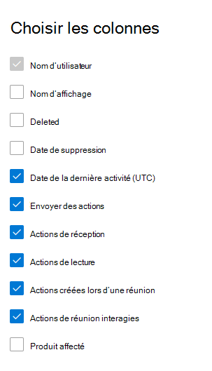

# Rapports Microsoft 365 dans le Centre d’administration - activité Email

Le tableau de bord Rapports Microsoft 365 affiche la vue d’ensemble de l’activité sur les produits de votre organisation. Il vous permet d'explorer les rapports au niveau de chaque produit afin d'offrir des informations plus précises sur les activités pour chaque produit. Consultez [la rubrique Présentation des rapports](activity-reports.md).
  
Par exemple, vous pouvez obtenir une vue d'ensemble du trafic de courrier au sein de votre organisation à partir de la page Rapports, puis utiliser le widget Activité de courrier électronique pour mieux comprendre les tendances et les détails de l'activité de courrier de l'utilisateur.

## Comment accéder au rapport d'activité de courrier

1. Dans le centre d’administration, accédez à la page **Rapports** \> <a href="https://go.microsoft.com/fwlink/p/?linkid=2074756" target="_blank">Utilisation</a>.
2. Sélectionnez **Afficher plus** sous **Email activité**. 
3. Dans la liste **déroulante Email activité**, sélectionnez **l’activité Exchange** \> **Email**.
  
## Interpréter le rapport d'activité de courrier

Vous pouvez visualiser l'activité de courrier d'un utilisateur à l'aide des graphiques **Activité** et **Utilisateurs**. 
  

Le rapport **Activité de courrier** permet d'observer des tendances sur les 7, 30, 90 ou 180 derniers jours. Toutefois, si vous sélectionnez un jour particulier dans le rapport, le tableau affiche les données jusqu’à 28 jours à partir de la date actuelle (et non la date à laquelle le rapport a été généré). Les données de chaque rapport couvrent généralement jusqu’aux dernières 24 à 48 heures.

Le graphique **Activité** permet de comprendre la tendance quantitative de l'activité de courrier au sein de votre organisation. Vous pouvez comprendre le fractionnement de l’envoi de messages électroniques, de la lecture des e-mails, de l’e-mail reçu, de la réunion créée ou des activités interagissant avec une réunion. 

Le graphique **Utilisateur** vous permet de comprendre la tendance du nombre d’utilisateurs uniques qui génèrent les activités de messagerie. Vous pouvez examiner la tendance des utilisateurs qui envoient des e-mails, lisent des e-mails, reçoivent des messages électroniques, créent des réunions ou interagissent avec des activités. 

Dans le graphique d’activité, l’axe Y correspond au nombre d’activités du type d’e-mail envoyé, de courrier reçu, de lecture d’e-mail, de réunion créée et de réunion interagi. 

Dans le graphique d’activité Utilisateurs, l’axe Y est l’activité de l’utilisateur du type d’e-mail envoyé, d’e-mail reçu, de lecture d’e-mail, de réunion créée ou de réunion interagi. 

L'axe X sur les deux graphiques représente la plage de dates sélectionnée pour ce rapport particulier. 

Vous pouvez filtrer la série que vous voyez sur le graphique en sélectionnant un élément dans la légende.

 Le tableau présente la répartition des activités de courrier par utilisateur. Il répertorie tous les utilisateurs auxquels un produit Exchange est affecté, ainsi que les activités de courrier de chacun d'eux.

  
|Élément|Description|
|:-----|:-----|
|Nom d’utilisateur  |Adresse e-mail de l’utilisateur. |
|Nom |Nom complet de l’utilisateur. |
|Deleted |Fait référence à l’utilisateur dont l’état actuel est supprimé, mais qui a été actif pendant une partie de la période de création de rapports du rapport. |
|Date de suppression |Date à laquelle l’utilisateur a été supprimé. |
|Date de la dernière activité  | La dernière fois que l’utilisateur a effectué une activité de lecture ou d’envoi de courrier électronique. |
|Envoyer des actions |Nombre de fois où une action d’envoi d’e-mail a été enregistrée pour l’utilisateur.  |
|Recevoir des actions  |Nombre de fois où une action reçue par e-mail a été enregistrée pour l’utilisateur. |
|Lire les actions |Nombre de fois où une action de lecture d’e-mail a été enregistrée pour l’utilisateur. |
|Actions créées par la réunion  |Nombre de fois où une action d’envoi de demande de réunion a été enregistrée pour l’utilisateur. |
|Actions de réunion interagies |Nombre de fois qu’une action d’acceptation, de tentative, de refus ou d’annulation d’une demande de réunion a été enregistrée pour l’utilisateur. |
|Produit affecté  |Produits affectés à cet utilisateur.  |

Si la politique de votre organisation vous empêche de consulter les rapports sur lesquels figurent des informations propres aux utilisateurs, vous pouvez modifier les paramètres de confidentialité de tous ces rapports. Consultez la **Comment faire masquer les détails au niveau de l’utilisateur dans** les [rapports d’activité du Centre d'administration Microsoft 365](activity-reports.md).

**Sélectionnez Choisir des colonnes** pour ajouter ou supprimer des colonnes du rapport.  

Vous pouvez également exporter les données du rapport dans un fichier Excel .csv, en sélectionnant le lien **Exporter** . Cela a pour effet d'exporter les données de tous les utilisateurs afin d'effectuer un tri et un filtrage simples à des fins d'analyse approfondie. 
   
> [!NOTE]
> Le rapport d’activité Email est disponible uniquement pour les boîtes aux lettres associées aux utilisateurs disposant de licences.
