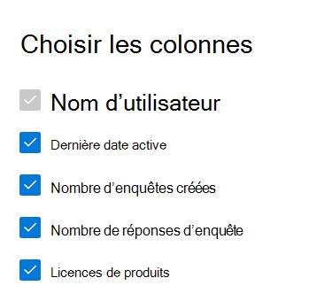

# Microsoft 365 dans le Centre d’administration - Activité Voix Client Dynamics 365

Le tableau Microsoft 365 de rapports de gestion des données vous présente la vue d’ensemble de l’activité sur les produits de votre organisation. Il vous permet d'explorer des rapports au niveau de chaque produit afin d'obtenir des informations plus précises sur les activités au sein de chaque produit. Consultez [la rubrique Présentation des rapports](activity-reports.md).
  
Par exemple, vous pouvez comprendre l’activité de chaque utilisateur titulaire d’une licence d’utilisation de Microsoft Dynamics 365 Customer Voice en regardant leurs interactions avec Dynamics 365 Customer Voice. Il vous permet également de comprendre le niveau de collaboration en cours en regardant le nombre d’enquêtes Pro créées et d’enquêtes Pro à laquelle les utilisateurs ont répondu. 
  
## Comment obtenir le rapport d’activité Dynamics 365 Customer Voice

1. Dans le centre d’administration, accédez à la page **Rapports** \> <a href="https://go.microsoft.com/fwlink/p/?linkid=2074756" target="_blank">Utilisation</a>. 
2. Dans la page d’accueil du tableau de bord, cliquez sur le bouton **Afficher plus sur** la carte Dynamics 365 Customer Voice.
  
## Interpréter le rapport d’activité de Dynamics 365 Customer Voice

Vous pouvez afficher les activités dans le rapport Dynamics 365 Customer Voice en choisissant **l’onglet** Activité. 

**Sélectionnez Sélectionner des colonnes** pour ajouter ou supprimer des colonnes dans le rapport.    

Vous pouvez également exporter les données du rapport dans un Excel .csv en sélectionnant le lien **Exporter**. Cela a pour effet d'exporter les données de tous les utilisateurs afin d'effectuer un tri et un filtrage simples à des fins d'analyse approfondie. Si vous avez moins de 2000 utilisateurs, vous pouvez trier et filtrer dans le tableau, au sein du rapport proprement dit. Si vous avez plus de 2000 utilisateurs, pour filtrer et trier les données, vous devez préalablement les exporter. 

Le rapport d’activité de **Dynamics 365 Customer Voice** permet d’afficher les tendances des 7, 30, 90 ou 180 derniers jours. Toutefois, si vous sélectionnez un jour particulier dans le rapport, le tableau affiche les données jusqu’à 28 jours à partir de la date du jour (et non la date à laquelle le rapport a été généré).
  
|Item|Description|
|:-----|:-----|
|**Métrique**|**Définition**|
|Nom d’utilisateur    |Adresse de messagerie de l’utilisateur qui a effectué l’activité sur Microsoft Forms.    |
|Date de la dernière activité (UTC)    |Date la plus récente à laquelle une activité de formulaire a été effectuée par l’utilisateur pour la plage de dates sélectionnée. Pour voir l'activité qui s'est produite à une date spécifique, sélectionnez celle-ci directement dans le graphique. Cela permet de filtrer le tableau pour afficher les données d’activité des fichiers uniquement pour les utilisateurs qui ont effectué l’activité ce jour-là.    |
|Nombre d’enquêtes créées    |Nombre d’enquêtes créées par l’utilisateur.     |
|Nombre de réponses d’enquête    |Nombre de réponses des répondeurs auxquels l’enquête a été distribuée.|
|||