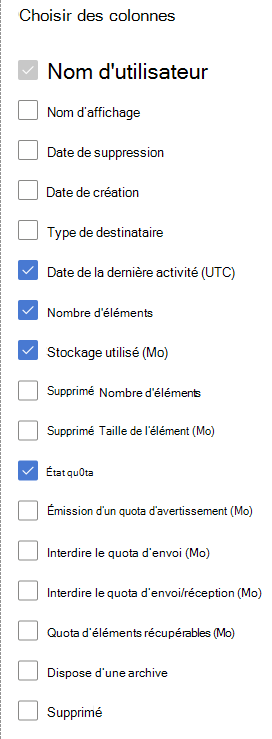

# Microsoft 365 Rapports dans le Centre d’administration - Utilisation des boîtes aux lettres

Le  rapport d’utilisation de la boîte aux lettres fournit des informations sur les utilisateurs ayant une boîte aux lettres utilisateur et le niveau d’activité de chacun d’entre eux en fonction de l’envoi, de la lecture, de la création d’un rendez-vous, de l’envoi d’une réunion, de l’acceptation d’une réunion, du refus de la réunion et de l’annulation de l’activité de réunion. Il fournit également des informations sur l'espace de stockage utilisé par chaque boîte aux lettres utilisateur et sur le nombre de boîtes aux lettres proches de leurs quotas de stockage. 
  
> [!NOTE]
> Vous devez être administrateur général, lecteur général ou lecteur de rapports dans Microsoft 365 ou administrateur Exchange, SharePoint, service Teams, Teams Communications ou administrateur Skype Entreprise pour voir les rapports. 
 
## Comment accéder au rapport Utilisation des boîtes aux lettres ?

1. Dans le centre d’administration, accédez à la page **Rapports** \> <a href="https://go.microsoft.com/fwlink/p/?linkid=2074756" target="_blank">Utilisation</a>.
2. Sélectionnez **Afficher plus sous** Activité de **messagerie.** 
3. Dans la liste de **listes** de listes des activités de messagerie, sélectionnez  \> **Exchange’utilisation de la boîte aux lettres.**

## Interpréter le rapport Utilisation des boîtes aux lettres

Pour obtenir un aperçu de l' **utilisation des boîtes aux lettres** de votre organisation, consultez les graphiques **Boîte aux lettres**, **Stockage** et **Quota**. 
  

|Élément|Description|
|:-----|:-----|
|1.    |Le rapport **Utilisation des boîtes aux lettres** permet d'observer les tendances des 7, 30, 90 ou 180 derniers jours. Toutefois, si vous sélectionnez un jour particulier dans le rapport, le tableau affiche les données jusqu’à 28 jours à partir de la date du jour (et non la date à laquelle le rapport a été généré).    |
|2.    |Les données de chaque rapport couvrent généralement jusqu’aux dernières 24 à 48 heures.    |
|3.    |Le graphique Boîte aux lettres vous montre le nombre total de boîtes aux lettres utilisateur au sein de votre organisation ainsi que le nombre total de boîtes aux lettres actives pour un jour donné de la période de rapport. Une boîte aux lettres utilisateur est considérée comme active si elle a reçu un message électronique pour envoyer, lire, créer un rendez-vous, envoyer une réunion, accepter une réunion, refuser une réunion et annuler une activité de réunion.    |
|4.    |Le graphique **Stockage** présente l'espace de stockage utilisé au sein de votre organisation. Stockage Le graphique n’inclut pas les boîtes aux lettres d’archivage. Pour plus d’informations sur l’archivage à extension automatique, voir Vue d’ensemble de l’archivage illimité [dans Microsoft 365](../../compliance/unlimited-archiving.md).  |
|5.    | Le graphique **Quota** présente le nombre de boîtes aux lettres utilisateur dans chaque catégorie de quota. Il existe quatre catégories de quota :     Satisfaisante - Nombre d'utilisateurs dont l'espace de stockage utilisé est inférieur au quota d'émission d'avertissement.     Avertissement - Nombre d'utilisateurs dont l'espace de stockage utilisé est supérieur ou égal au quota d'émission d'avertissement, mais inférieur au quota d'interdiction d'envoi.     Envoi impossible - Nombre d'utilisateurs dont l'espace de stockage utilisé est supérieur ou égal au quota d'interdiction d'envoi, mais inférieur au quota d'interdiction d'envoi et de réception.     Envoi/réception impossible - Nombre d'utilisateurs dont l'espace de stockage utilisé est supérieur ou égal au quota d'interdiction d'envoi et de réception.    |
|6.    | Sur le graphique **Boîte aux lettres**, l'axe Y représente le nombre de boîtes aux lettres utilisateur.     Dans le graphique **Stockage**, l'axe Y indique la quantité d'espace de stockage utilisée par les boîtes aux lettres utilisateur au sein de votre organisation.     Sur le graphique **Quota**, l'axe Y représente le nombre de boîtes aux lettres utilisateur appartenant à chaque catégorie de quota de stockage.     L'axe X sur les graphiques Boîte aux lettres et Stockage indique la plage de dates sélectionnée pour ce rapport particulier.     L'axe X sur le graphique Quota indique la catégorie du quota.    |
|7.    |Vous pouvez filtrer les graphiques que vous voyez en sélectionnant un élément dans la légende.    |
|8.    | Le tableau offre le détail de l'utilisation des boîtes aux lettres au niveau des utilisateurs. Vous pouvez y ajouter des colonnes.    **Nom d'utilisateur** est l'adresse de courrier de l'utilisateur.    **Nom d'affichage** est le nom complet de l'utilisateur.    **Supprimé** se réfère aux boîtes aux lettres dont l'état actuel est Supprimé, mais qui ont été actives durant une partie de la période du rapport.    **Date de suppression** représente la date à laquelle la boîte aux lettres a été supprimée.    **Date de création** représente la date à laquelle la boîte aux lettres a été créée.    **Date de la dernière activité** fait référence à la date à laquelle la boîte aux lettres a enregistré une activité d'envoi ou de lecture de courrier électronique.    **Nombre d'éléments** fait référence au nombre total d'éléments dans la boîte aux lettres.    **Stockage utilisé (Mo)** fait référence à la quantité totale d'espace de stockage utilisée.    **Le nombre d’éléments** supprimés fait référence au nombre total d’éléments supprimés dans la boîte aux lettres.   La taille des éléments **supprimés (Mo)** fait référence à la taille totale de tous les éléments supprimés dans la boîte aux lettres.   **Quota d'émission d'avertissement (Mo)** fait référence à la limite de stockage atteinte lorsque le propriétaire de la boîte aux lettres reçoit un avertissement indiquant qu'il est sur le point d'atteindre le quota de stockage.    **Quota d'interdiction d'envoi (Mo)** fait référence à la limite de stockage atteinte lorsque la boîte aux lettres ne peut plus envoyer de courriers électroniques.    **Quota d'interdiction d'envoi/de réception (Mo)** fait référence à la limite de stockage atteinte lorsque la boîte aux lettres ne peut plus envoyer ou recevoir de courriers électroniques.     Si la politique de votre organisation vous empêche de consulter les rapports sur lesquels figurent des informations propres aux utilisateurs, vous pouvez modifier les paramètres de confidentialité de tous ces rapports. Consultez la **section Masquer les détails de l’utilisateur** dans la section Rapports d’activité de [la Centre d’administration Microsoft 365](activity-reports.md).    |
|9.    |Sélectionnez **Choisir des colonnes** pour ajouter ou supprimer des colonnes dans le rapport.    |
|10.    |Vous pouvez également exporter les données du rapport dans un Excel .csv, en sélectionnant le lien **Exporter.**    |
|||
