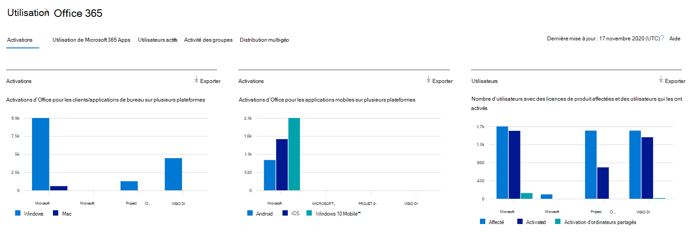
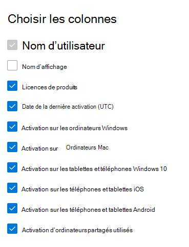

# Microsoft 365 rapports dans le Centre d’administration - Activations Microsoft Office utilisateurs

Le tableau Microsoft 365 de rapports de gestion des données vous présente la vue d’ensemble de l’activité sur les produits de votre organisation. Il vous permet d'explorer les rapports au niveau de chaque produit afin d'offrir des informations plus précises sur les activités pour chaque produit. Consultez [la rubrique Présentation des rapports](activity-reports.md).
  
Le rapport Activation d'Office vous offre un aperçu des utilisateurs ayant activé leur abonnement Office sur au moins un appareil. Il fournit une répartition des activations des abonnements Applications Microsoft 365 pour les grandes entreprises, Project et Visio Pro pour Office 365, ainsi que la répartition des activations sur les ordinateurs de bureau et les appareils. Ce rapport peut vous permettre d'identifier les utilisateurs qui pourraient avoir besoin d'assistance pour activer leur abonnement Office.
  
## Accès au rapport Activations d'Office

1. Dans le centre d’administration, accédez à la page **Rapports** \> <a href="https://go.microsoft.com/fwlink/p/?linkid=2074756" target="_blank">Utilisation</a>. 
2. Dans la page d’accueil du tableau de  bord, cliquez sur le bouton Afficher plus sur la Office activations.
  
## Interprétation du rapport Activations d'Office
  
Vous pouvez afficher les activations dans le rapport Office 365 en choisissant **l’onglet Activations**. 

**Sélectionnez Sélectionner des colonnes** pour ajouter ou supprimer des colonnes dans le rapport.    

Vous pouvez également exporter les données du rapport dans un Excel .csv en sélectionnant le lien **Exporter**. Cela a pour effet d'exporter les données de tous les utilisateurs afin d'effectuer un tri et un filtrage simples à des fins d'analyse approfondie. Si vous avez moins de 2000 utilisateurs, vous pouvez trier et filtrer dans le tableau, au sein du rapport proprement dit. Si vous avez plus de 2000 utilisateurs, pour filtrer et trier les données, vous devez préalablement les exporter. 

|Item|Description|
|:-----|:-----|
|**Métrique**|**Définition**|
|Nom d’utilisateur    |Adresse e-mail de l’utilisateur.    |
|Nom d’affichage    |Nom complet de l’utilisateur.    |
|Licences de produit    |Produits affectés à cet utilisateur.    |
|Date de la dernière activation (UTC)    |Date à laquelle l’utilisateur a Office sur un ordinateur de bureau ou un appareil.    |
|Activation sur Windows ordinateurs    |Nombre de bureaux Windows qu’un utilisateur a Office activés.    |
|Activation sur les ordinateurs Mac   |Nombre de bureaux Mac activés par un utilisateur Office activés.|
|Activation sur Windows 10 et tablettes    |Nombre d’appareils Windows 10 qu’un utilisateur a Office activés.    |
|Activation sur les téléphones et tablettes iOS    |Nombre d’appareils iOS sur Office activés par un utilisateur.|
|Activation sur les téléphones et tablettes Android    |Nombre d’appareils Android sur Office activés par un utilisateur.    |
|Activation d’ordinateurs partagés utilisée |Cela est vrai si l’utilisateur a utilisé Office l’activation d’ordinateurs partagés.|
|||
   