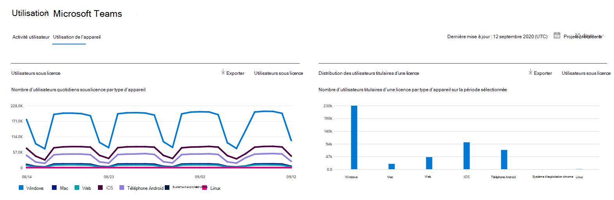
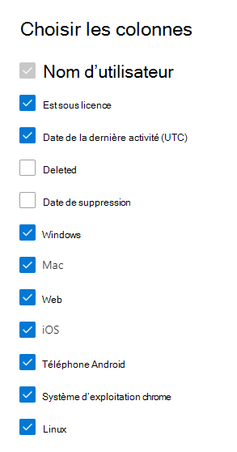

# Microsoft 365 Rapports dans le Centre d’administration - Utilisation Microsoft Teams appareil

Le tableau Microsoft 365 de rapports d’entreprise vous présente la vue d’ensemble de l’activité sur les produits de votre organisation. Il vous permet d'explorer les rapports au niveau de chaque produit afin d'offrir des informations plus précises sur les activités pour chaque produit. Consultez la rubrique [Présentation des rapports](activity-reports.md). Dans le rapport Utilisation des applications Microsoft Teams, vous pouvez obtenir des informations sur les applications Microsoft Teams utilisées dans votre organisation.
  
## Accéder au rapport Utilisation des applications Microsoft Teams

1. Dans le centre d’administration, accédez à la page **Rapports** \> <a href="https://go.microsoft.com/fwlink/p/?linkid=2074756" target="_blank">Utilisation</a>. 
2. Dans la page d’accueil  du tableau de bord, cliquez sur le bouton Afficher plus sur la Microsoft Teams’activité.
  
## Interpréter le rapport Utilisation des applications Microsoft Teams

Vous pouvez afficher l’utilisation de l’appareil dans Teams rapport en choisissant l’onglet **Utilisation de l’appareil.** 

Sélectionnez **Sélectionner des colonnes** pour ajouter ou supprimer des colonnes dans le rapport.    

Vous pouvez également exporter les données du rapport dans un Excel .csv en sélectionnant **le** lien Exporter. Cela a pour effet d'exporter les données de tous les utilisateurs afin d'effectuer un tri et un filtrage simples à des fins d'analyse approfondie. Si vous avez moins de 2000 utilisateurs, vous pouvez trier et filtrer dans le tableau, au sein du rapport proprement dit. Si vous avez plus de 2000 utilisateurs, pour filtrer et trier les données, vous devez préalablement les exporter. 

Le rapport **Utilisation de Microsoft Teams sur des appareils** permet d'observer les tendances des 7, 30, 90 ou 180 derniers jours. Toutefois, si vous sélectionnez un jour particulier dans le rapport, le tableau affiche les données jusqu’à 28 jours à partir de la date actuelle (et non la date à laquelle le rapport a été généré).
  
|Item|Description|
|:-----|:-----|
|**Métrique**|**Définition**|
|Nom d'utilisateur    |Nom d’affichage de l’utilisateur.    |
|Windows    |Sélectionné si l’utilisateur était actif dans le client Teams de bureau sur un ordinateur Windows de bureau.    |
|Mac    |Sélectionné si l’utilisateur était actif dans le client Teams de bureau sur un ordinateur macOS.    |
|iOS    |Sélectionné si l’utilisateur était actif sur le Teams client mobile pour iOS.    |
|Téléphone Android    | Sélectionné si l’utilisateur était actif sur le Teams client mobile pour Android.    |
|Système d’exploitation Chrome    |Sélectionné si l’utilisateur était actif dans le client Teams bureau sur un ordinateur ChromeOS.|
|Linux    | Sélectionné si l’utilisateur était actif dans le client Teams de bureau sur un ordinateur Linux.    |
|Web    |Sélectionné si l’utilisateur était actif dans le client Teams web sur les appareils.|
|Date de la dernière activité (UTC)    |Dernière date (UTC) à laquelle l’utilisateur a participé à une activité Teams'    |
|Est titulaire d’une licence|Sélectionné si l’utilisateur est titulaire d’une licence d’utilisation Teams.|
|||