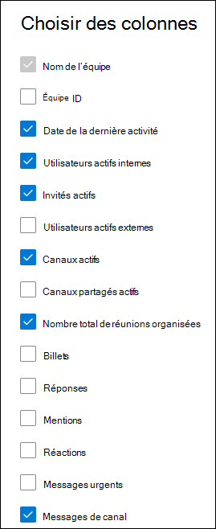

# Rapports Microsoft 365 dans le centre d’administration - Activité d’utilisation de Microsoft Teams

Le tableau de bord Rapports Microsoft 365 vous montre la vue d’ensemble de l’activité dans les produits de votre organisation. Il vous permet d'explorer les rapports au niveau de chaque produit afin d'offrir des informations plus précises sur les activités pour chaque produit. Voir [la rubrique Présentation des rapports](activity-reports.md).

Le tout nouveau **rapport d’utilisation de Teams** vous donne une vue d’ensemble de l’activité d’utilisation dans Teams, y compris le nombre d’utilisateurs actifs, les canaux et les messages afin que vous puissiez rapidement voir combien d’utilisateurs au sein de votre organisation utilisent Teams pour communiquer et collaborer.  Il inclut également d’autres activités spécifiques à Teams, telles que le nombre d’invités actifs, les réunions et les messages.

## Comment accéder au rapport d’activité d’utilisation de Microsoft Teams

1. Dans le Centre d’administration, accédez aux **Rapports**, puis sélectionnez **Utilisation**.
2. Dans la page d’accueil du tableau de bord, cliquez sur le bouton **Afficher plus** de la carte **d’activité Microsoft Teams** .

    

3. Dans la page Rapports **Microsoft Teams** , sélectionnez l’onglet **Utilisation de Teams** .

## Interpréter le rapport d’activité d’utilisation de Microsoft Teams

Vous pouvez afficher l’activité de l’utilisateur dans le rapport Teams en choisissant l’onglet **Utilisation de Teams** . Les graphiques suivants s’affichent :

- **Utilisation du canal** : effectue le suivi du nombre d’utilisations de canal, par type d’activité, au fil du temps.

  

- **Utilisation de l’équipe** : suit le nombre d’équipes, par type et activité, au fil du temps.

  

En outre, le graphique inclut les détails d’utilisation des équipes individuelles, telles que la date de la dernière activité, les utilisateurs actifs, les canaux actifs et d’autres données.

Dans le tableau, sélectionnez **Choisir des colonnes** pour ajouter ou supprimer des colonnes du rapport.

Vous pouvez également exporter les données du rapport dans un fichier .csv Excel en sélectionnant le lien **Exporter** . Cela a pour effet d'exporter les données de tous les utilisateurs afin d'effectuer un tri et un filtrage simples à des fins d'analyse approfondie.  Le format exporté pour **l’heure audio**, **l’heure vidéo** et le **temps de partage d’écran** suit le format de durée ISO8601.

Le rapport **d’activité d’utilisation de Microsoft Teams** peut être consulté pour connaître les tendances des 7 derniers jours, 30 jours, 90 jours ou 180 jours. Toutefois, si vous sélectionnez un jour particulier dans le rapport, la table affiche les données pendant jusqu’à 28 jours à partir de la date actuelle (et non la date à laquelle le rapport a été généré).

Pour garantir la qualité des données, nous effectuons des vérifications quotidiennes de validation des données au cours des trois derniers jours et nous comblerons les lacunes détectées. Vous remarquerez peut-être des différences dans les données historiques pendant le processus.

> [!Important]
> Les données d’un jour donné s’affichent dans les 48 heures. Par exemple, les données du 10 janvier doivent apparaître dans le rapport avant le 12 janvier.

### Métriques d’utilisation des canaux

Le graphique Utilisation du canal affiche des données sur les métriques suivantes.

|Élément|Description|
|:-----|:-----|
|**Métrique**|**Définition**|
|Utilisateurs de canal actifs|Il s’agit du total des utilisateurs actifs internes, des invités actifs et des utilisateurs actifs externes.     **Utilisateurs actifs internes** : utilisateurs qui ont au moins une action de panneau dans la période spécifiée. Cela exclut les invités.     **Invités actifs** : invités qui ont au moins une action de panneau dans la période spécifiée. Un invité est une personne extérieure à votre organisation qui accède à des ressources partagées en se connectant à un compte invité dans mon annuaire.    **Utilisateur actif externe** : participants externes qui ont au moins une action de panneau dans la période spécifiée. Un participant externe est une personne extérieure à votre organisation qui participe à une ressource( par exemple, un canal partagé) à l’aide de sa propre identité et non d’un compte invité dans votre annuaire.|
|Canaux actifs|Canaux valides dans les équipes actives qui ont au moins un utilisateur actif dans la période spécifiée. Cela inclut les canaux publics, privés ou partagés.|
|Messages de canal|Nombre de messages uniques que l’utilisateur a publiés dans une conversation privée pendant la période spécifiée.|

### Métriques d’utilisation de l’équipe

Le graphique d’utilisation de Teams affiche des données sur les métriques suivantes.

|Élément|Description|
|:-----|:-----|
|**Métrique**|**Définition**|
|Équipes privées|Une équipe privée active ou inactive.|
|Équipes publiques|Une équipe publique active ou inactive.|
|Équipes privées actives|Une équipe privée et active.|
|Équipes publiques actives|Une équipe publique et active.|

### Détails de Teams

Les données des métriques suivantes sont disponibles pour les équipes individuelles.

|Élément|Description|
|:-----|:-----|
|**Métrique**|**Définition**|
|ID d’équipe|Identificateur d’équipe|
|Utilisateurs actifs internes|Utilisateurs qui ont au moins une action de panneau dans la période spécifiée, y compris les invités.     Utilisateurs internes et invités qui résident dans le même locataire. Les utilisateurs internes excluent les invités.|
|Invités actifs|Invités qui ont au moins une action de panneau dans la période spécifiée.     Un invité est défini comme étant des personnes extérieures à votre organisation qui accèdent à des ressources partagées en se connectant à un compte invité dans mon annuaire.|
|Utilisateurs actifs externes|Participants externes qui ont au moins une action de panneau dans la période spécifiée.   Un participant externe est défini comme une personne extérieure à votre organisation qui participe à une ressource ( par exemple, un canal partagé) à l’aide de sa propre identité et non d’un compte invité dans votre annuaire.|
|Canaux actifs|Canaux valides dans les équipes actives qui ont au moins un utilisateur actif dans la période spécifiée. Cela inclut les canaux publics, privés ou partagés.|
|Canaux partagés actifs|Canaux partagés valides dans les équipes actives qui ont au moins un utilisateur actif dans le délai spécifié.    Un canal partagé est défini comme un canal Teams qui peut être partagé avec des personnes extérieures à l’équipe. Ces personnes peuvent être au sein de votre organisation ou d’autres organisations Azure AD.|
|Nombre total de réunions organisées|Somme des réunions planifiées, périodiques, ad hoc et non classifiées qu’un utilisateur a organisées pendant la période spécifiée.|
|Posts|Nombre de tous les messages postés dans les canaux au cours de la période spécifiée.|
|Replies|Nombre de tous les messages de réponse dans les canaux au cours de la période spécifiée.|
|Mentions|Nombre de toutes les mentions faites au cours de la période spécifiée.|
|Réactions|Nombre de réactions effectuées par un utilisateur actif au cours de la période spécifiée.|
|Messages urgents|Nombre de messages urgents dans la période spécifiée.|
|Messages de canal|Nombre de messages uniques que l’utilisateur a publiés dans une conversation d’équipe pendant la période spécifiée.|
|Date de la dernière activité|Date la plus récente à laquelle un membre de l’équipe a commis une action.|

## Rendre les données spécifiques à l’utilisateur anonymes

Pour que les données du rapport d’activité utilisateur Teams soient anonymes, vous devez être administrateur général. Cela masque les informations d’identification (à l’aide de hachages MD5), telles que le nom d’affichage, l’e-mail et l’ID d’objet Azure Active Directory dans le rapport et leur exportation.

1. Dans Centre d'administration Microsoft 365, accédez à **Paramètres Paramètres** > **Paramètres de l’organisation**, puis sous l’onglet **Services**, choisissez **Rapports**.

2. Sélectionnez **Rapports**, puis **afficher les identificateurs anonymes**. Ce paramètre est appliqué aux rapports d’utilisation dans Centre d'administration Microsoft 365 et dans le centre d’administration Teams.

3. Sélectionnez **Enregistrer les modifications**.

## Voir aussi

[Rapport d’utilisation des périphériques de Microsoft Teams](../activity-reports/microsoft-teams-device-usage-preview.md)

[Rapport d’activité des utilisateurs de Microsoft Teams](../activity-reports/microsoft-teams-user-activity-preview.md)
