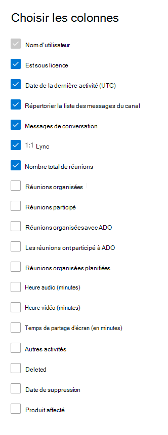

# Rapports Microsoft 365 dans le centre d’administration-activité de l’utilisateur Microsoft teams

Le tableau de bord **rapports** Microsoft 365 affiche une vue d’ensemble de l’activité sur les produits de votre organisation. Il vous permet d'explorer les rapports au niveau de chaque produit afin d'offrir des informations plus précises sur les activités pour chaque produit. Consultez la rubrique [Présentation des rapports](activity-reports.md). Dans le rapport Activité de l'utilisateur sur Microsoft Teams, vous pouvez obtenir des informations sur l'activité dans Microsoft Teams au sein de votre organisation.
  
> [!NOTE]
> Vous devez être un administrateur général, un lecteur global ou un lecteur de rapports dans Microsoft 365 ou un administrateur Exchange, SharePoint, teams, Team communications ou Skype entreprise pour afficher des rapports.  
 
## Accéder au rapport Activité de l'utilisateur sur Microsoft Teams

1. Dans le centre d’administration, accédez à la page **Rapports** \> <a href="https://go.microsoft.com/fwlink/p/?linkid=2074756" target="_blank">Utilisation</a>.
2. À partir de la page d’accueil du tableau de bord, cliquez sur le bouton **afficher plus** sur la fiche d’activité Microsoft Teams.
  
## Interpréter le rapport Activité de l'utilisateur sur Microsoft Teams

Vous pouvez afficher l’activité de l’utilisateur dans le rapport teams en sélectionnant l’onglet activité de l' **utilisateur** .  

Sélectionnez **choisir les colonnes** pour ajouter ou supprimer des colonnes dans le rapport.    

Vous pouvez également exporter les données du rapport dans un fichier. csv Excel en sélectionnant le lien **Exporter** . Cela a pour effet d'exporter les données de tous les utilisateurs afin d'effectuer un tri et un filtrage simples à des fins d'analyse approfondie. Si vous avez moins de 2000 utilisateurs, vous pouvez trier et filtrer dans le tableau, au sein du rapport proprement dit. Si vous avez plus de 2000 utilisateurs, pour filtrer et trier les données, vous devez préalablement les exporter. Le format exporté pour l’heure **audio**, l' **heure vidéo** et le **partage d’écran** suit le format de date ISO8601.

|Item|Description|
|:-----|:-----|
|**Métrique**|**Définition**|
|Nom d'utilisateur    |Adresse e-mail de l’utilisateur. Vous pouvez afficher l'adresse de courrier réelle ou rendre ce champ anonyme.     |
|Messages de canal     |Nombre de messages uniques publiés par l’utilisateur dans une conversation d’équipe pendant la période spécifiée.    |
|Messages de conversation     |Nombre de messages uniques publiés par l’utilisateur dans une conversation privée pendant la période spécifiée.    |
|Nombre total de réunions     |Nombre de réunions en ligne auxquelles l’utilisateur a participé pendant la période spécifiée.    |
|1:1 appels     | Nombre d’appels de 1:1 auxquels l’utilisateur a participé pendant la période spécifiée.    |
|Date de la dernière activité (UTC)    |Dernière date à laquelle l’utilisateur a participé à une activité Microsoft Teams.  |
|Les réunions ont participé à la adhoc     | Nombre de réunions non planifiées sur le calendrier auquel l’utilisateur a participé pendant la période spécifiée.    |
|Réunions organisées ad hoc   |Nombre de réunions non planifiées dans le calendrier que l’utilisateur a organisées pendant la période spécifiée.  |
|Réunions organisées planifiées    |Nombre de réunions planifiées qu’un utilisateur a organisé pendant la période spécifiée.    |
|Est sous licence |Sélectionné si l’utilisateur est titulaire d’une licence pour utiliser Teams.|
|Autres activités|l’utilisateur est considéré comme actif mais a une valeur nulle pour les messages de conversation, les appels 1:1, les messages de canal, le nombre total de réunions et les réunions. Voici quelques exemples d’actions lorsqu’un utilisateur ouvre un message de canal, mais ne répond pas ou lorsqu’un message privé est reçu et qu’il est lu mais qu’il n’y répond pas. |
|||