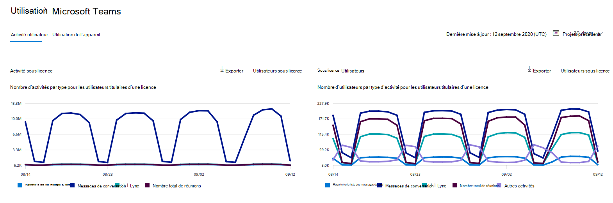

# Rapports Microsoft 365 dans le Centre d’administration - Activité des utilisateurs Microsoft Teams

Le tableau de bord Microsoft 365 **rapports de** gestion des données vous présente la vue d’ensemble de l’activité sur les produits de votre organisation. Il vous permet d'explorer les rapports au niveau de chaque produit afin d'offrir des informations plus précises sur les activités pour chaque produit. Consultez la rubrique [Présentation des rapports](activity-reports.md). Dans le rapport Activité de l'utilisateur sur Microsoft Teams, vous pouvez obtenir des informations sur l'activité dans Microsoft Teams au sein de votre organisation.
  
> [!NOTE]
> Vous devez être administrateur général, lecteur général ou lecteur de rapports dans Microsoft 365 ou administrateur Exchange, SharePoint, service Teams, Teams Communications ou administrateur Skype Entreprise pour consulter les rapports.  
 
## Accéder au rapport Activité de l'utilisateur sur Microsoft Teams

1. Dans le centre d’administration, accédez à la page **Rapports** \> <a href="https://go.microsoft.com/fwlink/p/?linkid=2074756" target="_blank">Utilisation</a>.
2. Dans la page d’accueil  du tableau de bord, cliquez sur le bouton Afficher plus sur la Microsoft Teams’activité.

## Interpréter le rapport Activité de l'utilisateur sur Microsoft Teams

Vous pouvez afficher l’activité de l’utilisateur dans Teams rapport en choisissant l’onglet **Activité de l’utilisateur.**  

Sélectionnez **Choisir des colonnes** pour ajouter ou supprimer des colonnes dans le rapport.    

Vous pouvez également exporter les données du rapport dans un Excel .csv en sélectionnant **le** lien Exporter. Cela a pour effet d'exporter les données de tous les utilisateurs afin d'effectuer un tri et un filtrage simples à des fins d'analyse approfondie. Si vous avez moins de 2000 utilisateurs, vous pouvez trier et filtrer dans le tableau, au sein du rapport proprement dit. Si vous avez plus de 2000 utilisateurs, pour filtrer et trier les données, vous devez préalablement les exporter. Le format exporté pour l’heure  **audio,** l’heure **vidéo** et le partage d’écran suit le format de durée ISO8601.

Le rapport **Activité de l'utilisateur sur Microsoft Teams** permet d'observer les tendances des 7, 30, 90 ou 180 derniers jours. Toutefois, si vous sélectionnez un jour particulier dans le rapport, le tableau (7) affiche les données jusqu’à 28 jours à partir de la date actuelle (et non la date à laquelle le rapport a été généré).

Pour garantir la qualité des données, nous apportons quotidiennement des vérifications de validation des données au cours des trois derniers jours et nous remplissons les lacunes détectées. Vous remarquerez peut-être des différences dans les données historiques au cours du processus.

|Item|Description|
|:-----|:-----|
|**Métrique**|**Définition**|
|Nom d'utilisateur    |Adresse e-mail de l’utilisateur. Vous pouvez afficher l'adresse de courrier réelle ou rendre ce champ anonyme.     |
|Messages de canal     |Nombre de messages uniques publiés par l’utilisateur dans une conversation d’équipe pendant la période spécifiée.    |
|Messages de conversation     |Nombre de messages uniques publiés par l’utilisateur dans une conversation privée pendant la période spécifiée.    |
|Nombre total de réunions     |Nombre de réunions en ligne à qui l’utilisateur a participé pendant la période spécifiée.    |
|Appels 1:1     | Nombre d’appels de 1:1 que l’utilisateur a participé pendant la période spécifiée.    |
|Date de la dernière activité (UTC)    |Date à laquelle l’utilisateur a participé à une activité Microsoft Teams de travail.  |
|Réunions ayant participé ad hoc     | Nombre de réunions ad hoc à qui un utilisateur a participé pendant la période spécifiée.    |
|Réunions organisées ad hoc   |Nombre de réunions ad hoc qu’un utilisateur a organisées pendant la période spécifiée.  |
|Nombre total de réunions organisées    |Somme des réunions ponctuelles, périodiques, ad hoc et non classifiées qu’un utilisateur a organisées pendant la période spécifiée.    |
|Nombre total de réunions participées    |Somme des réunions ponctuelles, périodiques, ad hoc et non classifiées d’un utilisateur au cours de la période spécifiée.    |
|Réunions organisées en une seule fois    |Nombre de réunions programmées à une seule heure qu’un utilisateur a organisées pendant la période spécifiée.    |
|Réunions organisées périodiques    |Nombre de réunions périodiques qu’un utilisateur a organisées pendant la période spécifiée.    |
|Participations prévues à une seule fois    |Nombre de réunions prévues à une seule heure pour un utilisateur au cours de la période spécifiée.    |
|Réunions ayant participé à des réunions périodiques    |Nombre de réunions périodiques pendant la période spécifiée.    |
|Est titulaire d’une licence    |Sélectionné si l’utilisateur est titulaire d’une licence d’utilisation Teams.  |
|Autre activité   |L’utilisateur est actif, mais a effectué d’autres activités que les types d’actions exposés proposés dans le rapport (envoi ou réponse aux messages de canal et aux messages de conversation, planification ou participation à des appels et réunions en une fois). Exemples d’actions : lorsqu’un utilisateur modifie l’état Teams ou le message d’état Teams ou ouvre un billet de message de canal, mais ne répond pas.   |
|réunions non classifiées  |Celui qui ne peut pas être classé comme planning, périodique ou ad hoc. Leur nombre est court et ne peuvent principalement pas être identifiés en raison d’informations de télémétrie falsifiées. |
|||