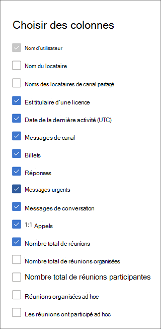

# Rapports Microsoft 365 dans le Centre d’administration - Activité des utilisateurs Microsoft Teams

Le tableau de bord Microsoft 365 Rapports vous montre la vue d’ensemble de l’activité sur les produits de votre organisation. Il vous permet d'explorer les rapports au niveau de chaque produit afin d'offrir des informations plus précises sur les activités pour chaque produit. Consultez la rubrique [Présentation des rapports](activity-reports.md). Dans le rapport Activité de l'utilisateur sur Microsoft Teams, vous pouvez obtenir des informations sur l'activité dans Microsoft Teams au sein de votre organisation.
 
## Accéder au rapport Activité de l'utilisateur sur Microsoft Teams

1. Dans le centre d’administration, accédez à la page **Rapports** \> <a href="https://go.microsoft.com/fwlink/p/?linkid=2074756" target="_blank">Utilisation</a>.
2. Dans la page d’accueil du tableau de bord, cliquez sur le bouton **Afficher plus** sur la carte d’activité Microsoft Teams.

## Interpréter le rapport Activité de l'utilisateur sur Microsoft Teams

Vous pouvez afficher l’activité de l’utilisateur dans le rapport Teams en choisissant l’onglet **Activité de l’utilisateur**.  

**Sélectionnez Choisir des colonnes** pour ajouter ou supprimer des colonnes du rapport.    

Vous pouvez également exporter les données du rapport dans un fichier Excel .csv en sélectionnant le lien **Exporter**. Cela a pour effet d'exporter les données de tous les utilisateurs afin d'effectuer un tri et un filtrage simples à des fins d'analyse approfondie. Si vous avez moins de 2000 utilisateurs, vous pouvez trier et filtrer dans le tableau, au sein du rapport proprement dit. Si vous avez plus de 2000 utilisateurs, pour filtrer et trier les données, vous devez préalablement les exporter. Le format exporté pour **le temps audio**, **le temps vidéo** et le **temps de partage d’écran** suit le format de durée ISO8601.

Le rapport **Activité de l'utilisateur sur Microsoft Teams** permet d'observer les tendances des 7, 30, 90 ou 180 derniers jours. Toutefois, si vous sélectionnez un jour particulier dans le rapport, le tableau affiche les données jusqu’à 28 jours à partir de la date actuelle (et non la date à laquelle le rapport a été généré).

Pour garantir la qualité des données, nous effectuons des vérifications quotidiennes de validation des données au cours des trois derniers jours et nous comblerons les lacunes détectées. Vous remarquerez peut-être des différences dans les données historiques pendant le processus.

|Item|Description|
|:-----|:-----|
|**Métrique**|**Définition**|
|Nom d'utilisateur    |Adresse e-mail de l’utilisateur. Vous pouvez afficher l'adresse de courrier réelle ou rendre ce champ anonyme.     |
|Nom du locataire    |Nom d’un locataire interne ou externe auquel appartient un utilisateur.       Si un utilisateur appartient à un locataire externe, les métriques de données correspondantes (par exemple, les messages postaux, les messages de réponse, etc.) sont calculées en fonction de leurs interactions dans les canaux partagés du locataire de l’administrateur. Les interactions effectuées par l’utilisateur dans son propre locataire (en dehors des canaux partagés du locataire donné) ne sont pas prises en compte pour le rapport d’utilisation administrateur d’un locataire donné.  |
|Noms des locataires de canal partagé     |Noms des locataires internes ou externes des canaux partagés auxquels l’utilisateur a participé.     |
|Messages de canal     |Nombre de messages uniques que l’utilisateur a publiés dans une conversation d’équipe pendant la période spécifiée.    |
|Posts     |Nombre de messages postaux dans tous les canaux pendant la période spécifiée   |
|Replies     |Nombre de messages répondus dans tous les canaux pendant la période spécifiée.   |
|Messages urgents      |Nombre de messages urgents pendant la période spécifiée.   |
|Messages de conversation     |Nombre de messages uniques que l’utilisateur a publiés dans une conversation privée pendant la période spécifiée.    |
|Nombre total de réunions     |Nombre de réunions en ligne auxquelles l’utilisateur a participé pendant la période spécifiée.    |
|Appels 1:1     | Nombre d’appels 1:1 auxquels l’utilisateur a participé pendant la période spécifiée.    |
|Date de la dernière activité (UTC)    |Dernière date à laquelle l’utilisateur a participé à une activité de Microsoft Teams.  |
|Les réunions ont participé ad hoc     | Nombre de réunions ad hoc aux laquelle un utilisateur a participé pendant la période spécifiée.    |
|Réunions organisées ad hoc   |Nombre de réunions ad hoc organisées par un utilisateur pendant la période spécifiée.  |
|Nombre total de réunions organisées    |Somme des réunions ponctuelles planifiées, périodiques, ad hoc et non classifiées qu’un utilisateur a organisées pendant la période spécifiée.    |
|Nombre total de réunions participantes    |Somme des réunions planifiées, périodiques, ad hoc et non classifiées à laquelle un utilisateur a participé pendant la période spécifiée.    |
|Réunions organisées en une seule fois    |Nombre de réunions planifiées uniques qu’un utilisateur a organisées pendant la période spécifiée.    |
|Réunions organisées périodiquement    |Nombre de réunions périodiques organisées par un utilisateur pendant la période spécifiée.    |
|Les réunions ont participé à des réunions planifiées à usage unique    |Nombre de réunions planifiées uniques aux laquelle un utilisateur a participé pendant la période spécifiée.    |
|Les réunions ont participé à des réunions périodiques planifiées    |Nombre de réunions périodiques aux laquelle un utilisateur a participé pendant la période spécifiée.    |
|Est titulaire d’une licence    |Sélectionné si l’utilisateur dispose d’une licence pour utiliser Teams.  |
|Autre activité   |L’utilisateur est actif, mais a effectué d’autres activités que les types d’actions exposés proposés dans le rapport (envoi ou réponse à des messages de canal et des messages de conversation, planification ou participation à des appels et réunions 1:1). Des exemples d’actions sont lorsqu’un utilisateur modifie l’état Teams ou le message d’état Teams ou ouvre un message de canal, mais ne répond pas.   |

## Rendre les données spécifiques à l’utilisateur anonymes

Pour rendre les données dans Teams rapport d’activité utilisateur anonyme, vous devez être administrateur général. Cela masque les informations d’identification (à l’aide de hachages MD5) telles que le nom d’affichage, l’e-mail et l’ID d’objet Azure Active Directory dans le rapport et leur exportation.

1. Dans Centre d'administration Microsoft 365, accédez à **l’Paramètres Paramètres** >  **Org** et, sous l’onglet **Services**, sélectionnez **Rapports**.

2. Sélectionnez **Rapports**, puis choisissez **d’afficher les identificateurs anonymes**. Ce paramètre est appliqué aux rapports d’utilisation dans Centre d'administration Microsoft 365 et au Centre d’administration Teams.

3. Sélectionnez **Enregistrer les modifications**.

## Voir aussi
[Rapport d’utilisation des périphériques de Microsoft Teams](../activity-reports/microsoft-teams-device-usage-preview.md)

[rapport d’activité d’utilisation Microsoft Teams](../activity-reports/microsoft-teams-usage-activity.md) 
