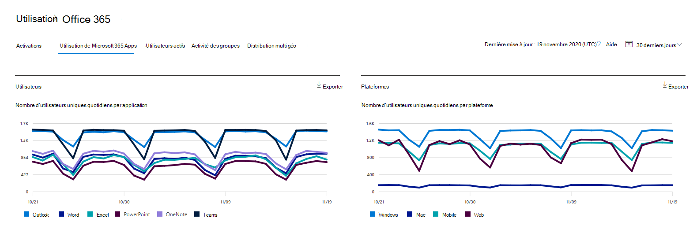

# Microsoft 365 Rapports dans le Centre d’administration : Microsoft 365 Apps’utilisation

Le tableau Microsoft 365 de rapports d’entreprise vous présente la vue d’ensemble de l’activité sur les produits de votre organisation. Il vous permet d'explorer les rapports au niveau de chaque produit afin d'offrir des informations plus précises sur les activités pour chaque produit. Voir [la rubrique Présentation des rapports](activity-reports.md).

 Par exemple, vous pouvez comprendre l’activité de chaque utilisateur titulaire d’une licence d’utilisation des applications Microsoft 365 Apps en regardant leur activité dans les applications et la façon dont elles sont utilisées sur les plateformes.

## Comment obtenir le rapport d’Microsoft 365 Apps d’utilisation

1. Dans le centre d’administration, accédez à la page **Rapports** \> <a href="https://go.microsoft.com/fwlink/p/?linkid=2074756" target="_blank">Utilisation</a>. 
2. Dans la page d’accueil  du tableau de bord, cliquez sur le bouton Afficher plus sur la carte Utilisateurs Microsoft 365 Apps active.

## Interpréter le rapport d Microsoft 365 Apps d’utilisation

Vous pouvez obtenir une vue de l’activité Microsoft 365 Apps utilisateur en regardant **les** graphiques **Utilisateurs et** plateforme.

> [!div class="mx-imgBorder"]
> 

|Item|Description|
 |:-----|:-----|
 |1.   |Le **rapport Microsoft 365 Apps’utilisation** des données peut être pris en compte pour les tendances des 7, 30, 90 ou 180 derniers jours. Toutefois, si vous sélectionnez un jour particulier dans le rapport, le tableau affiche les données jusqu’à 28 jours à partir de la date du jour (et non la date à laquelle le rapport a été généré).   |
 |2.   |Les données de chaque rapport couvrent généralement jusqu’aux deux derniers jours. Tous les six jours, nous actualisons le rapport avec des mises à jour mineures pour garantir la qualité des données.   |
 |3.   |La  vue Utilisateurs montre la tendance du nombre d’utilisateurs actifs pour chaque application ( Outlook, Word, Excel, PowerPoint, OneNote et Teams. Les « utilisateurs actifs » sont les personnes qui effectuent des actions intentionnelles au sein de ces applications.   |
 |4.   |**L’affichage Plateformes** affiche la tendance des utilisateurs actifs sur toutes les applications pour chaque plateforme ( Windows, Mac, Web et Mobile.   |
 |5. |Dans le **graphique Utilisateurs,** l’axe Y indique le nombre d’utilisateurs actifs uniques pour l’application respective. Dans le **graphique Plateformes,** l’axe Y est le nombre d’utilisateurs   uniques pour la plateforme respective. L’axe X des deux graphiques est la date à laquelle une application a été utilisée sur une plateforme donnée. |
 6. |Vous pouvez filtrer les séries que vous voyez sur le graphique en sélectionnant un élément dans la légende. Par exemple,  dans le graphique Utilisateurs, sélectionnez Outlook, Word, Excel, PowerPoint, OneDrive ou Teams pour voir uniquement les informations relatives à chacun d’eux. La modification de cette sélection ne modifie pas les informations du tableau de grille en dessous.|
 |7. |Le tableau présente une répartition des données au niveau utilisateur. Vous pouvez ajouter ou supprimer des colonnes.    **Le nom** d’utilisateur est l’adresse e-mail de l’utilisateur qui a effectué l’activité Microsoft Apps.  La date de dernière **activation (UTC)** est la date la plus récente à laquelle l’utilisateur a activé son abonnement Microsoft 365 Apps sur un ordinateur ou se connecte à un ordinateur partagé et démarre l’application avec son compte.   **La date de la dernière activité (UTC)** est la date la plus récente à laquelle une activité intentionnelle a été effectuée par l’utilisateur. Pour voir l'activité qui s'est produite à une date spécifique, sélectionnez celle-ci directement dans le graphique.  Les autres colonnes déterminent si l’utilisateur était actif sur cette plateforme pour cette application (dans Microsoft 365 Apps) pendant la période sélectionnée. |
 |8. |Sélectionnez **l’icône** Choisir des colonnes pour ajouter ou supprimer des colonnes dans le rapport.|
 |9. |Vous pouvez également exporter les données du rapport dans un Excel .csv en sélectionnant **le** lien Exporter. Cela exporte les données pour tous les utilisateurs et vous permet d’obtenir une agrégation, un tri et un filtrage simples pour une analyse plus approfondie. Si vous avez moins de 100 utilisateurs, vous pouvez trier et filtrer dans le tableau dans le rapport lui-même. Si vous avez plus de 100 utilisateurs, pour filtrer et trier, vous devez exporter les données.|
