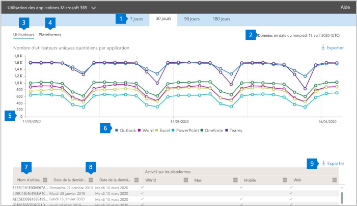

# Rapports Microsoft 365 dans le centre d’administration-utilisation des applications Microsoft 365

Le tableau de bord **rapports** Microsoft 365 affiche une vue d’ensemble de l’activité sur les produits de votre organisation. Il vous permet d'explorer les rapports au niveau de chaque produit afin d'offrir des informations plus précises sur les activités pour chaque produit. Voir [la rubrique Présentation des rapports](activity-reports.md).

 Par exemple, vous pouvez comprendre l’activité de chaque utilisateur titulaire d’une licence pour utiliser les applications Microsoft 365 apps en examinant leur activité dans les applications et leur utilisation sur les plateformes.

 > [!NOTE]
 > Vous devez être un administrateur général, un lecteur global ou un lecteur de rapports dans Microsoft 365 ou un administrateur Exchange, SharePoint ou Skype entreprise pour afficher des rapports.

## Comment accéder au rapport d’utilisation des applications Microsoft 365

1. Dans le centre d’administration, accédez à la page **Rapports** \> <a href="https://go.microsoft.com/fwlink/p/?linkid=2074756" target="_blank">Utilisation</a>.

 2. Dans la liste déroulante **Sélectionner un rapport** , sélectionnez utilisation des applications **Office 365**   \>  **Microsoft 365** .

## Interpréter le rapport d’utilisation des applications Microsoft 365

Vous pouvez obtenir une vue d’ensemble de l’activité Microsoft 365 apps de votre utilisateur en examinant les graphiques **utilisateurs** et **plateforme** .

|Item|Description|
 |:-----|:-----|
 |1.   |Le rapport d' **utilisation des applications Microsoft 365** peut être consulté pour connaître les tendances des 7, 30, 90 ou 180 derniers jours. Toutefois, si vous sélectionnez un jour particulier dans le rapport, le tableau (7) affiche les données jusqu’à 28 jours après la date actuelle (pas la date de génération du rapport).   |
 |2.   |Les données de chaque rapport couvrent généralement les sept derniers jours.   |
 |3.   |La vue **utilisateurs** affiche la tendance du nombre d’utilisateurs actifs pour chaque application : Outlook, Word, Excel, PowerPoint, OneNote et Teams. « Les utilisateurs actifs » sont les personnes qui effectuent des actions intentionnelles au sein de ces applications.   |
 |4.   |L’affichage **plates-formes** illustre la tendance des utilisateurs actifs dans toutes les applications pour chaque plateforme (Windows, Mac, Web et mobile).   |
 |5. |Sur le graphique **utilisateurs** , l’axe Y indique le nombre d’utilisateurs actifs uniques pour l’application concernée. Sur le graphique **plates-formes**   , l’axe Y indique le nombre d’utilisateurs uniques pour la plateforme correspondante. L’axe X sur les deux graphiques correspond à la date à laquelle une application a été utilisée sur une plateforme donnée. |
 6. |Vous pouvez filtrer la série que vous voyez sur le graphique en sélectionnant un élément dans la légende. Par exemple, dans le graphique **utilisateurs** , sélectionnez Outlook, Word, Excel, PowerPoint, OneDrive ou teams pour afficher uniquement les informations relatives à chacun d’eux. La modification de cette sélection ne modifie pas les informations dans le tableau de grille en dessous.|
 |7. |Le tableau présente une répartition des données au niveau utilisateur. Vous pouvez ajouter ou supprimer des colonnes.   **Username** est l’adresse de messagerie de l’utilisateur qui a effectué l’activité sur les applications Microsoft.  **Date de la dernière activation (UTC)** est la dernière date à laquelle l’utilisateur a activé son abonnement aux applications Microsoft 365.  **Date de la dernière activité (UTC)** indique la dernière date à laquelle une activité intentionnelle a été effectuée par l’utilisateur. Pour voir l'activité qui s'est produite à une date spécifique, sélectionnez celle-ci directement dans le graphique.  Les colonnes suivantes correspondent à chaque application qui identifie si l’utilisateur était actif sur cette application pendant la période sélectionnée :   **Outlook**  **Word**  **Excel** **PowerPoint**  **OneNote**   Les colonnes suivantes correspondent à chaque plateforme qui identifie si l’utilisateur était actif sur cette plateforme pour n’importe quelle application (dans les applications Microsoft 365) pendant la période sélectionnée :  **Outlook (Windows)** **Outlook (Mac)** **Outlook (Web)**  **Outlook (mobile)**  **Word (Windows)**  **Word (Mac)**  **Word (Web)**  **Word (mobile)**  **Excel (Windows)**  **Excel (Mac)**  **Excel (Web)**  **Excel (mobile)**  **PowerPoint (Windows)**  **PowerPoint (Mac)** **PowerPoint (Web)**  **PowerPoint (mobile)**  **OneNote (Windows)**  **OneNote (Mac)**  **OneNote (Web)** **OneNote (mobile)**  **Teams (Windows)**  **Teams (Mac)**  **Teams (Web)** **Équipes (mobile)** |
 |8. |Sélectionnez l’icône **gérer les colonnes** pour ajouter ou supprimer des colonnes dans le rapport.|
 |9. |Vous pouvez également exporter les données du rapport dans un fichier. csv Excel en sélectionnant le lien **Exporter** . Cette opération exporte les données de tous les utilisateurs et vous permet d’effectuer une agrégation, un tri et un filtrage simples à des fins d’analyse approfondie. Si vous avez moins de 100 utilisateurs, vous pouvez trier et filtrer dans le tableau du rapport proprement dit. Si vous avez plus de 100 utilisateurs, pour filtrer et trier les données, vous devez les exporter.|
