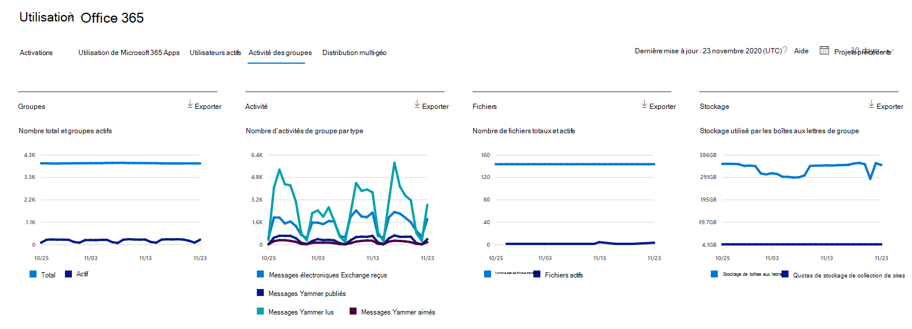
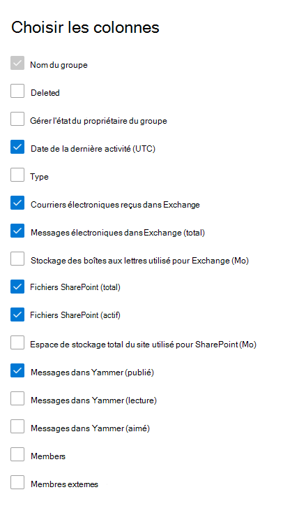

# Microsoft 365 Rapports dans le Centre d’administration : Microsoft 365 groupes

Le tableau de bord Microsoft 365 **rapports de** gestion des données vous présente la vue d’ensemble de l’activité sur les produits de votre organisation. Il vous permet d'explorer les rapports au niveau de chaque produit afin d'offrir des informations plus précises sur les activités pour chaque produit. Voir [la rubrique Présentation des rapports](activity-reports.md). Dans le rapport Microsoft 365 groupes, vous pouvez obtenir des informations sur l’activité des groupes dans votre organisation et voir combien de groupes sont créés et utilisés.
  
> [!NOTE]
> Vous devez être administrateur général, lecteur général ou lecteur de rapports dans Microsoft 365 ou administrateur Exchange, SharePoint, service Teams, Teams Communications ou administrateur Skype Entreprise pour consulter les rapports.  
  
## Comment obtenir le rapport des groupes

1. Dans le centre d’administration, accédez à la page **Rapports** \> <a href="https://go.microsoft.com/fwlink/p/?linkid=2074756" target="_blank">Utilisation</a>. 
2. Dans la page d’accueil  du tableau de bord, cliquez sur le bouton Afficher plus sur les utilisateurs actifs (Microsoft 365 Apps ou utilisateurs actifs) Microsoft 365 Services pour obtenir la page de rapport Office 365.
  
## Interpréter le rapport des groupes

Vous pouvez afficher les activations dans le rapport Office 365 en choisissant l’onglet **Activité groupes.** 

Sélectionnez **Choisir des colonnes** pour ajouter ou supprimer des colonnes dans le rapport.    

Vous pouvez également exporter les données du rapport dans un Excel .csv en sélectionnant **le** lien Exporter. Cela a pour effet d'exporter les données de tous les utilisateurs afin d'effectuer un tri et un filtrage simples à des fins d'analyse approfondie. Si vous avez moins de 2000 utilisateurs, vous pouvez trier et filtrer dans le tableau, au sein du rapport proprement dit. Si vous avez plus de 2000 utilisateurs, pour filtrer et trier les données, vous devez préalablement les exporter. 

|Élément|Description|
|:-----|:-----|
|**Métrique**|**Définition**|
|Nom du groupe    |Nom du groupe.    |
|Deleted    |Nombre de groupes supprimés. Si le groupe est supprimé, mais qu'il a connu une activité dans la période du rapport, il apparaît dans la grille avec cet indicateur défini sur true.    |
|Propriétaire du groupe    |Nom du propriétaire du groupe.    |
|Date de la dernière activité (UTC)    |Date à laquelle un message a été reçu au plus tard par le groupe. Il s'agit de la date la plus récente à laquelle une activité a eu lieu dans une conversation par courrier, dans Yammer ou sur le site.    |
|Type    |Type de groupe. Il peut être privé ou public.    |
|Courriers électroniques reçus dans Exchange    |Nombre de messages reçus par le groupe.|
|E-mails en Exchange (total)    |Nombre total d’éléments dans la boîte aux lettres du groupe.    |
|Stockage de boîtes aux lettres utilisé pour Exchange (Mo)    |Stockage utilisé par la boîte aux lettres du groupe.  |
|SharePoint fichiers (total)    |Nombre de fichiers stockés dans SharePoint sites de groupe.    |
|SharePoint fichiers (actifs)    |Nombre de fichiers du site de groupe SharePoint qui ont été modifiés (vues ou modifiées, synchronisés, partagés en interne ou en externe) pendant la période de rapport.    |
|Stockage total du site utilisé pour SharePoint (Mo)    |Quantité de stockage en Mo utilisée pendant la période de rapport.    |
|Messages dans Yammer (publié)    |Nombre de messages publiés dans le groupe Yammer au cours de la période de rapport.    |
|Messages en Yammer (lecture)    |Nombre de conversations lues dans le groupe Yammer au cours de la période de rapport.    |
|Messages en Yammer (aimé)    |Nombre de messages aimés dans le groupe Yammer au cours de la période de rapport.    |
|Members    |Nombre de membres du groupe.    |
|Membres externes |Nombre d’utilisateurs externes dans le groupe.|
|||

## Contenu associé

[Microsoft 365 rapports dans le Centre d’administration](activity-reports.md) (article)\
[Rapports dans le Centre de sécurité & conformité](../../compliance/reports-in-security-and-compliance.md) (article)\
[Microsoft 365 rapports dans le Centre d’administration - Utilisateurs actifs](../../admin/activity-reports/active-users-ww.md) (article)

