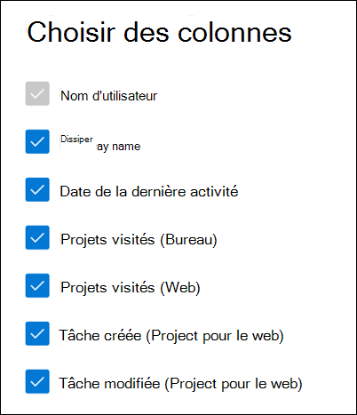

# Rapports Microsoft 365 dans le Centre d’administration - Activité project

Le tableau de bord Rapports Microsoft 365 affiche la vue d’ensemble de l’activité sur les produits de votre organisation. Il vous permet d'explorer les rapports au niveau de chaque produit afin d'offrir des informations plus précises sur les activités pour chaque produit. Voir [la rubrique Présentation des rapports](activity-reports.md).

Dans le **rapport d’activité Project**, vous pouvez comprendre l’activité de chaque utilisateur sous licence pour utiliser Microsoft Project en examinant son interaction avec Project. Il vous aide également à comprendre le niveau de collaboration en cours en examinant le nombre de projets visités et les tâches créées ou modifiées.

## Comment accéder au rapport d’activité project

1. Dans le centre d’administration, accédez à la page **Rapports** \> <a href="https://go.microsoft.com/fwlink/p/?linkid=2074756" target="_blank">Utilisation</a>.
2. Dans la page d’accueil du tableau de bord, cliquez sur le bouton **Afficher plus** sur la carte Projet.

## Interpréter le rapport d’activité project

Vous pouvez utiliser ce rapport pour voir l’activité et l’utilisation de Project dans votre environnement. Quatre graphiques récapitulatifs s’affichent dans ce rapport :   

- **Utilisateurs actifs** : affiche les utilisateurs actifs quotidiens chaque jour au fil du temps. Actuellement, cela inclut uniquement Project pour le web et Project Online client de bureau.
- **Utilisateurs actifs (par client)** : affiche les utilisateurs actifs quotidiens au fil du temps, répartis par client (Project pour le Web et Project Online client de bureau).
- **Activité de projet** : affiche le nombre de sessions quotidiennes de Project au fil du temps, pour chaque client (Project pour le web et Project Online client de bureau).
- **Activité des tâches** : affiche le nombre quotidien de tâches créées ou modifiées au fil du temps dans Project pour le web

Le rapport comporte également un tableau qui affiche l’activité de chaque utilisateur de projet dans votre environnement.

**Sélectionnez Choisir des colonnes** pour ajouter ou supprimer des colonnes de la table.

Vous pouvez également exporter les données du rapport dans un fichier Excel .csv en sélectionnant le lien **Exporter** . Cela a pour effet d'exporter les données de tous les utilisateurs afin d'effectuer un tri et un filtrage simples à des fins d'analyse approfondie.

Le rapport **d’activité du projet** peut être consulté pour les tendances des 7 derniers jours, 30 jours, 90 jours ou 180 jours. Si vous sélectionnez un jour particulier dans le rapport, la table de données par utilisateur est mise à jour en conséquence pour afficher l’utilisation des utilisateurs ce jour-là. Toutefois, cette fonctionnalité ne fonctionne que pour les 28 derniers jours.

### Impact des paramètres de confidentialité sur le tableau de bord

Si les utilisateurs ou les administrateurs définissent leurs paramètres de confidentialité sur **Ni,** nous n’avons pas de métriques précises pour le graphique **d’activité Project** pour le client de bureau Project Online. Les nombres affichés sont sous-comptabilisés. Pour plus d’informations sur les paramètres de confidentialité, consultez [Utiliser les paramètres de stratégie pour gérer les contrôles de confidentialité pour Applications Microsoft 365 pour les grandes entreprises](/deployoffice/privacy/manage-privacy-controls.md).

## Table d’activité utilisateur

Voici des définitions pour chaque métrique de la table d’activité utilisateur.

|Item|Description|
|:-----|:-----|
|**Métrique**|**Définition**|
|Nom d'utilisateur|Nom principal de l’utilisateur.|
|Nom|Nom complet de l’utilisateur.|
|Date de la dernière activité|Date la plus récente à laquelle l’utilisateur de cette ligne a eu une activité dans Project, y compris l’une des activités dans les rapports récapitulatifs.|
|Projets visités (Bureau)|Nombre de projets ouverts par l’utilisateur dans le client de bureau Project Online pendant l’intervalle de temps sélectionné en haut à droite de la page.|
|Projets visités (Web)| Nombre de tâches créées par l’utilisateur dans Project pour le Web pendant l’intervalle de temps sélectionné en haut à droite de la page.|
|Tâches créées (Web)|Nombre de tâches créées par l’utilisateur dans Project pour le Web pendant l’intervalle de temps sélectionné en haut à droite de la page.|
|Tâches modifiées (Web)|Nombre de tâches modifiées par l’utilisateur dans Project pour le Web pendant l’intervalle de temps sélectionné en haut à droite de la page.|
|Autre|Cette valeur est true si l’utilisateur a effectué une activité dans Project Online client de bureau ou dans Project pour le web (qui n’est pas couvert par les autres colonnes) dans l’intervalle de temps sélectionné en haut à droite de la page. Si ce n’est pas le cas, cette valeur est false.|
