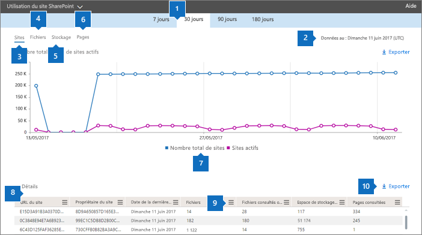

# Rapports Microsoft 365 dans le centre d’administration-utilisation du site SharePoint

En tant qu’administrateur Microsoft 365, le tableau de bord **rapports** vous montre l’activité vue d’ensemble des différents produits de votre organisation. Il vous permet d'explorer pour obtenir des informations plus précises sur les activités spécifiques de chaque produit. Par exemple, vous pouvez obtenir une vue d'ensemble de la valeur que vous apporte SharePoint, en termes de nombre total de fichiers que les utilisateurs stockent sur les sites SharePoint, de nombre de fichiers activement utilisés, et de stockage utilisé sur ces sites. Ensuite, vous pouvez explorer le rapport de l'utilisation du site SharePoint pour comprendre les tendances et les détails par niveau de site pour tous les sites. 
  
> [!NOTE]
> Vous devez être un administrateur général, un lecteur global ou un lecteur de rapports dans Microsoft 365 ou un administrateur Exchange, SharePoint, teams, Team communications ou Skype entreprise pour afficher des rapports.
Les rapports Microsoft 365 dans le centre d’administration ne sont pas pris en charge pour les locataires GCC High et DoD.
 
## Comment accéder au Rapport Utilisation du site SharePoint

1. Dans le centre d’administration, accédez à **rapports** - \> <a href="https://go.microsoft.com/fwlink/p/?linkid=2074756" target="_blank">utilisation</a>.
    
2. Sous **fichiers SharePoint** , cliquez sur **afficher plus**. 

3. En regard de **activité SharePoint**, cliquez sur la flèche vers le bas pour ouvrir le menu.

4. Sélectionnez  \> **utilisation du site** SharePoint.
  
## Interprétation du rapport Utilisation du site SharePoint

  
|Item|Description|
|:-----|:-----|
|1.    |Le rapport **Utilisation du site SharePoint** permet d'observer les tendances des 7, 30, 90 ou 180 derniers jours. Toutefois, si vous sélectionnez un jour particulier dans le rapport, le tableau (7) affiche les données jusqu’à 28 jours après la date actuelle (pas la date de génération du rapport).    |
|2.    |Les données de chaque rapport couvrent généralement les 24 à 48 heures.   |
|3.    |Le graphique **sites** indique le nombre de sites total et actifs, y compris tous les sites dans lesquels les utilisateurs avaient consulté, modifié, téléchargé, téléchargé, partagé ou synchronisé un fichier ou affichaient une page pendant la période de création de rapport.    |
|4.    |Le graphique **Fichiers** affiche le nombre total de fichiers sur l'ensemble des sites et le nombre de fichiers actifs. Le nombre total de fichiers inclut les fichiers des utilisateurs et les fichiers système. Un fichier est considéré comme étant actif s'il a été enregistré, synchronisé, modifié ou partagé au cours de la période spécifique.  |
|5.    |Le graphique **Stockage** présente la tendance de stockage alloué et utilisé pendant la période de rapport.    |
|6.    |Le graphique **Pages** présente le nombre de pages affichées sur tous les sites.    |
|7.    |Vous pouvez filtrer les graphiques que vous voyez en sélectionnant un élément dans la légende. Par exemple, dans le graphique **fichiers** , sélectionnez **fichiers** ou **fichiers actifs**. Dans le graphique **sites** , vous pouvez sélectionner le **nombre total de sites** ou de **sites actifs**. Dans le graphique **stockage** , vous pouvez sélectionner le **stockage alloué** ou **consommé.** La modification de cette sélection ne modifie pas les informations du tableau grille.    |
|8.    | Le tableau montre une répartition des activités au niveau du site.                 **URL du site** indique l'URL complète du site.    **Supprimé** est l'état de suppression du site. La suppression effective des sites prend au minimum 7 jours.    **Propriétaire du site** indique le nom d'utilisateur du propriétaire principal du site.   **Nom principal du propriétaire du site** est l’adresse de messagerie du propriétaire du site.    **Date de la dernière activité (UTC)** indique la date à laquelle une activité de fichier a été détectée ou une page affichée pour la dernière fois sur le site.    **Fichiers** indique le nombre de fichiers sur le site.    **Fichiers actifs** indique le nombre de fichiers actifs sur le site.  Remarque : si des fichiers ont été supprimés pendant la période spécifiée pour le rapport, le nombre de fichiers actifs affichés dans le rapport peut être supérieur au nombre actuel de fichiers sur le site. **Espace de stockage utilisé (Mo)** indique le volume de stockage utilisé sur le site.    **Espace de stockage alloué (Mo)** indique le volume maximal de stockage alloué pour le site.    **Affichages de page** indique le nombre de fois où des pages ont été affichées sur le site.    **Pages visitées** indique le nombre de pages uniques visitées sur le site.    **Modèle web racine** indique le modèle utilisé pour créer le site.    Remarque : Si vous souhaitez filtrer les données par différents types de sites, exportez les données et utilisez la colonne de modèle Web racine.  Si les stratégies de votre organisation vous empêchent d’afficher des rapports où les informations utilisateur sont identifiables, vous pouvez modifier le paramètre de confidentialité de tous ces rapports. Consultez la section **comment masquer les détails au niveau de l’utilisateur ?** dans les [rapports d’activité du centre d’administration 365 de Microsoft](activity-reports.md).    |
|9.    |Sélectionnez **gérer**  les colonnes pour gérer les colonnes afin d’ajouter ou de supprimer des colonnes dans le rapport.      |
|10.    |Vous pouvez également exporter les données du rapport dans un fichier. csv Excel en sélectionnant **le lien exporter l'**  . Cela a pour effet d'exporter les données de tous les sites afin d'effectuer un tri et un filtrage simples à des fins d'analyse approfondie. Si vous avez moins de 2000 sites, vous pouvez trier et filtrer dans le tableau, au sein du rapport proprement dit. Si vous avez plus de 2000 sites, pour filtrer et trier les données, vous devez préalablement les exporter.    Remarque : lorsque les données sont exportées vers un fichier Excel, Notez que la date à laquelle le rapport de contenu a été généré est reflétée dans le fichier dans les **données à partir de** la colonne.          |
|||
