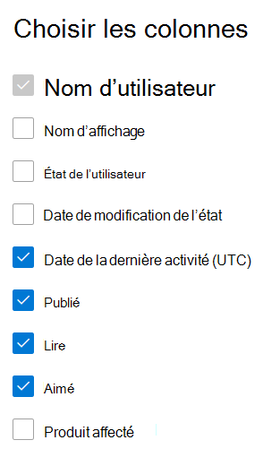

# Microsoft 365 Rapports dans le Centre d’administration - Rapport Yammer activité de gestion

En Microsoft 365, le tableau de bord Rapports vous présente les données sur l’utilisation des produits au sein de votre organisation. Consultez les [rapports d’activité dans le Centre d’administration.](activity-reports.md) Le **rapport d'activité Yammer** vous permet de comprendre le niveau d'engagement de votre organisation avec Yammer en consultant le nombre d'utilisateurs utilisant Yammer pour publier, aimer ou lire un message, et le volume d'activité généré dans l'ensemble de l'organisation. 
 
## Comment puis-je obtenir le rapport Yammer’activité de l’entreprise ?

1. Dans le centre d’administration, accédez à la page **Rapports** \> <a href="https://go.microsoft.com/fwlink/p/?linkid=2074756" target="_blank">Utilisation</a>. 
2. Dans la page d’accueil du tableau de bord, cliquez sur **le** bouton Afficher plus sur Yammer carte.

  
## Interpréter le rapport d'activité Yammer

Vous pouvez afficher les activités dans le rapport Yammer en choisissant **l’onglet** Activité. 

Sélectionnez **Sélectionner des colonnes** pour ajouter ou supprimer des colonnes dans le rapport.    

Vous pouvez également exporter les données du rapport dans un Excel .csv en sélectionnant **le** lien Exporter. Cela a pour effet d'exporter les données de tous les utilisateurs afin d'effectuer un tri et un filtrage simples à des fins d'analyse approfondie. Si vous avez moins de 2000 utilisateurs, vous pouvez trier et filtrer dans le tableau, au sein du rapport proprement dit. Si vous avez plus de 2000 utilisateurs, pour filtrer et trier les données, vous devez préalablement les exporter. 

Le **Yammer d’activité** de l’entreprise peut être pris en compte pour les tendances des 7, 30, 90 ou 180 derniers jours. Toutefois, si vous sélectionnez un jour particulier dans le rapport, le tableau affiche les données jusqu’à 28 jours à partir de la date actuelle (et non la date à laquelle le rapport a été généré).
  
|Item|Description|
|:-----|:-----|
|**Métrique**|**Définition**|
|Nom d’utilisateur    |Adresse e-mail de l’utilisateur. Vous pouvez afficher l'adresse de courrier réelle ou rendre ce champ anonyme. Cette grille affiche les utilisateurs qui se sont connectés Yammer à l’aide du compte Microsoft 365 ou qui se sont connectés au réseau à l’aide de l' sign-on unique.   |
|Nom d’affichage    |Nom complet de l’utilisateur. Vous pouvez afficher l'adresse de courrier réelle ou rendre ce champ anonyme.    |
|État de l’utilisateur    |L’une des trois valeurs : Activé, Supprimé ou Suspendu. Ces rapports affichent des données pour les utilisateurs actifs, suspendus et supprimés. Ils ne reflètent pas les utilisateurs en attente, car ceux-ci ne peuvent pas publier, lire ou aimer un message.    |
|Date de changement d’état (UTC)    |Date à laquelle l’état de l’utilisateur a été modifié Yammer.    |
|Date de la dernière activité (UTC)    | Date de la dernière fois que l’utilisateur a publié, lu ou aimé un message.    |
|Publié    |Nombre de messages publiés par l’utilisateur pendant la période que vous avez spécifiée.  |
|Lecture    |Nombre de conversations lues par l’utilisateur pendant la période que vous avez spécifiée.    |
|Aimé    |Nombre de messages que l’utilisateur a aimés pendant la période que vous avez spécifiée.   |
|Produit affecté    |Produits affectés à cet utilisateur.|
|||