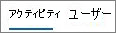

# Rapports Microsoft 365 dans le Centre d’administration - Rapport Yammer activité

En tant qu’administrateur Microsoft 365, le tableau de bord **Rapports** vous présente les données sur l’utilisation des produits au sein de votre organisation. Consultez les [rapports d’activité dans le Centre d’administration.](activity-reports.md) Le **rapport d'activité Yammer** vous permet de comprendre le niveau d'engagement de votre organisation avec Yammer en consultant le nombre d'utilisateurs utilisant Yammer pour publier, aimer ou lire un message, et le volume d'activité généré dans l'ensemble de l'organisation. 
  
> [!NOTE]
> Vous devez être un administrateur général, un lecteur global ou un lecteur de rapports dans Microsoft 365 ou un administrateur Exchange, SharePoint, Teams Service, Teams Communications ou Skype Entreprise pour voir les rapports. 
 
## Comment accéder au rapport d'activité Yammer

1. Dans le centre d’administration, accédez à la page **Rapports** \> <a href="https://go.microsoft.com/fwlink/p/?linkid=2074756" target="_blank">Utilisation</a>.

    
2. Dans la **drop-down Sélectionner un** rapport, sélectionnez **Yammer** \> **Activité.**
  
## Interpréter le rapport d'activité Yammer

Vous pouvez visualiser l'activité Yammer d'un utilisateur en examinant les graphiques Activité et Utilisateurs.
  

  
Le rapport d'activité contient les informations suivantes.
  
- Utilisez les onglets de jour pour afficher les tendances du rapport **Activité Yammer** sur les 7, 30, 90 ou 180 derniers jours. Toutefois, si vous sélectionnez un jour particulier dans le rapport, le tableau affiche les données jusqu’à 28 jours à partir de la date du jour (et non la date à laquelle le rapport a été généré). 
    
- Chaque rapport mentionne la date à laquelle il a été généré. Les rapports reflètent généralement une latence de 24 à 48 heures par rapport à l'heure de l'activité rapportée.
    
- Le graphique **Activité** permet de comprendre la tendance quantitative de l'activité Yammer au sein de votre organisation. Vous pouvez comprendre la répartition des messages publiés, lus ou aimés. 
    
    
  
  - Sur le graphique **Activité**, l'axe Y indique le volume d'activité exprimé en nombre de messages publiés, lus ou aimés. 
    
- Le graphique **Utilisateur** permet de comprendre la tendance du nombre d'utilisateurs qui génèrent les activités Yammer. Vous pouvez voir l'évolution des utilisateurs qui publient, lisent ou aiment des messages Yammer. 
    
    
  
  - Sur le graphique d'activité **Utilisateurs**, l'axe Y représente l'utilisateur qui publie, lit ou aime des messages Yammer. 
    
  - L'axe X sur les deux graphiques représente la plage de dates sélectionnée pour ce rapport particulier.
    
- Vous pouvez filtrer les séries que vous voyez sur le graphique en sélectionnant un élément dans la légende. Par exemple, dans le graphique **d’activité,** sélectionnez **Publié,** **Lu** ou Aimé **pour** voir uniquement les informations associées à chacun d’eux. 
    
    
  
    La modification de cette sélection ne modifie pas les informations du tableau grille.
    
- Le tableau sous le graphique affiche une répartition des activités Yammer ventilées par utilisateur.
    
    Vous pouvez utiliser le menu pour filtrer et trier les données.
    
    
  
    Vous pouvez également ajouter et supprimer des colonnes. Les colonnes disponibles sont les suivantes :
    
  - **Nom d'utilisateur** indique l'adresse de courrier de l'utilisateur. Vous pouvez afficher l'adresse de courrier réelle ou rendre ce champ anonyme. 
    
    Cette grille affiche les utilisateurs qui se sont connectés Yammer à l’aide du compte Microsoft 365 ou qui se sont connectés au réseau à l’aide de l' sign-on unique.
    
  - **Nom complet** indique le nom complet de l'utilisateur. Vous pouvez afficher l'adresse électronique réelle ou rendre ce champ anonyme. 
    
  - **État de l'utilisateur** indique l'une des trois valeurs suivantes : Activé, Supprimé ou Suspendu. 
    
    Ces rapports affichent des données pour les utilisateurs actifs, suspendus et supprimés. Ils ne reflètent pas les utilisateurs en attente, car ceux-ci ne peuvent pas publier, lire ou aimer un message.
    
  - **Date de modification de l'état (UTC)** indique la date à laquelle l'état de l'utilisateur a changé dans Yammer. 
    
  - **Date de la dernière activité (UTC)** indique la dernière date à laquelle l'utilisateur a publié, lu ou aimé un message. 
    
  - **Publications** indique le nombre de courriers que l'utilisateur a publiés au cours de la période que vous avez spécifiée. 
    
  - **Lu** indique le nombre de conversations que l'utilisateur a lus au cours de la période que vous avez spécifiée. 
    
  - **Mentions J'aime** indique le nombre de messages que l'utilisateur a aimés au cours de la période que vous avez spécifiée. 
    
  - **Le produit affecté** est les produits qui sont affectés à cet utilisateur. 
    
    Si la politique de votre organisation vous empêche de consulter les rapports sur lesquels figurent des informations propres aux utilisateurs, vous pouvez modifier les paramètres de confidentialité de tous ces rapports. Consultez la section **Comment puis-je masquer les détails** au niveau de l’utilisateur ? dans rapports d’activité dans le Centre d’administration [Microsoft 365.](activity-reports.md)
    
- Vous pouvez également exporter les données du rapport dans un fichier .csv Excel en sélectionnant le lien **Exporter.** Cela a pour effet d'exporter les données de tous les utilisateurs afin d'effectuer un tri et un filtrage simples à des fins d'analyse approfondie. Si vous avez moins de 2000 utilisateurs, vous pouvez trier et filtrer dans le tableau, au sein du rapport proprement dit. Si vous avez plus de 2000 utilisateurs, pour filtrer et trier les données, vous devez préalablement les exporter. 
    
## Quelles données figurent dans ces rapports ?

- **Tous les clients** Ces rapports agrègent les données de tous les clients, notamment l'utilisation de Yammer dans un navigateur ou sur une application iOS ou Android. 
    
- **Aucune donnée de réseau externe** Les données de réseaux externes ne sont pas incluses dans ces rapports. 
    
- **Réseaux activés** Ces rapports indiquent les données du réseau Yammer qui fait partie de votre abonnement Microsoft 365. Le graphique regroupe l’utilisation de tous les utilisateurs qui se sont connectés au réseau Yammer, qu’ils utilisent Microsoft 365 ou Yammer pour se connecter. 
    

