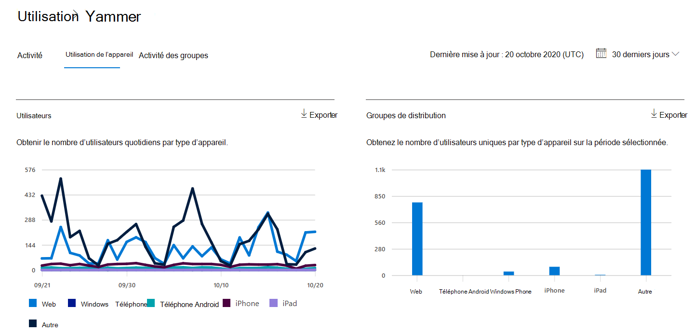
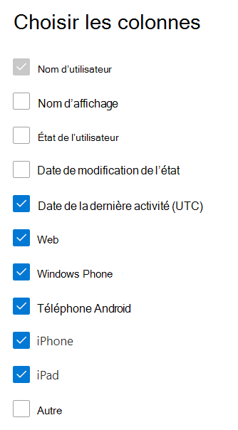

# rapports Microsoft 365 dans le Centre d’administration - rapport d’utilisation de l’appareil Yammer

Le tableau de bord Microsoft 365 Rapports vous montre la vue d’ensemble de l’activité sur les produits de votre organisation. Il vous permet d'explorer les rapports au niveau de chaque produit afin d'offrir des informations plus précises sur les activités pour chaque produit. Consultez [la rubrique Présentation des rapports](activity-reports.md).
  
Les rapports d'utilisation de Yammer sur les appareils vous donnent des informations sur les appareils sur lesquels vos utilisateurs utilisent Yammer. Vous pouvez afficher le nombre d'utilisateurs quotidiens par type d'appareil et le nombre d'utilisateurs par type d'appareil. Vous pouvez afficher les deux sur une période donnée. Vous pouvez également consulter les détails par utilisateur.
 
## Comment accéder au rapport d'utilisation de Yammer sur les appareils ?

1. Dans le centre d’administration, accédez à la page **Rapports** \> <a href="https://go.microsoft.com/fwlink/p/?linkid=2074756" target="_blank">Utilisation</a>. 
2. Dans la page d’accueil du tableau de bord, cliquez sur le bouton **Afficher plus** sur la carte Yammer.
  
## Interpréter le rapport d’utilisation de l’appareil Yammer

Vous pouvez afficher l’utilisation dans le rapport OneDrive en choisissant l’onglet **Utilisation de l’appareil**. 

**Sélectionnez Choisir des colonnes** pour ajouter ou supprimer des colonnes du rapport.    

Vous pouvez également exporter les données du rapport dans un fichier Excel .csv en sélectionnant le lien **Exporter**. Cela a pour effet d'exporter les données de tous les utilisateurs afin d'effectuer un tri et un filtrage simples à des fins d'analyse approfondie. Si vous avez moins de 2000 utilisateurs, vous pouvez trier et filtrer dans le tableau, au sein du rapport proprement dit. Si vous avez plus de 2000 utilisateurs, pour filtrer et trier les données, vous devez préalablement les exporter. 

Le **rapport Yammer sur l’utilisation des appareils** peut être consulté pour les tendances des 7 derniers jours, 30 jours, 90 ou 180 jours. Toutefois, si vous sélectionnez un jour particulier dans le rapport, le tableau affiche les données jusqu’à 28 jours à partir de la date actuelle (et non la date à laquelle le rapport a été généré).
  
|Élément|Description|
|:-----|:-----|
|**Métrique**|**Définition**|
|Nom d’utilisateur    |Adresse e-mail de l’utilisateur. Vous pouvez afficher l'adresse de courrier réelle ou rendre ce champ anonyme. Cette grille affiche les utilisateurs qui se sont connectés à Yammer à l’aide du compte Microsoft 365 ou qui se sont connectés au réseau à l’aide de l’authentification unique.   |
|Nom d’affichage    |Nom complet de l’utilisateur. Vous pouvez afficher l'adresse de courrier réelle ou rendre ce champ anonyme.    |
|État de l’utilisateur    |L’une des trois valeurs suivantes : Actif, Supprimé ou Suspendu. Ces rapports affichent des données pour les utilisateurs actifs, suspendus et supprimés. Ils ne reflètent pas les utilisateurs en attente, car ceux-ci ne peuvent pas publier, lire ou aimer un message.     |
|Date de modification de l’état (UTC)    |Date à laquelle l’état de l’utilisateur a été modifié dans Yammer.    |
|Date de la dernière activité (UTC)    |Dernière date (UTC) à laquelle l’utilisateur a participé à une activité Yammer.    |
|Web    |Indique si l’utilisateur a utilisé Yammer sur le web.    |
|téléphone Windows    | Indique si l’utilisateur a utilisé Yammer sur un téléphone Windows.    |
|Téléphone Android    |Indique si l’utilisateur a utilisé Yammer sur un téléphone Android.  |
|Iphone   | Indique si l’utilisateur a utilisé Yammer sur un iPhone.    |
|Ipad    |Indique si l’utilisateur a utilisé Yammer sur un iPad.  |
|Autres    |Indique si l’utilisateur a utilisé Yammer sur un autre appareil, non répertorié précédemment.  |
|||