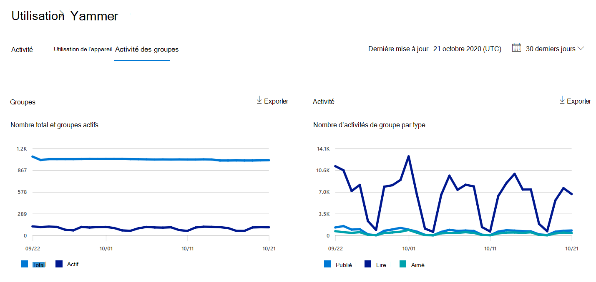
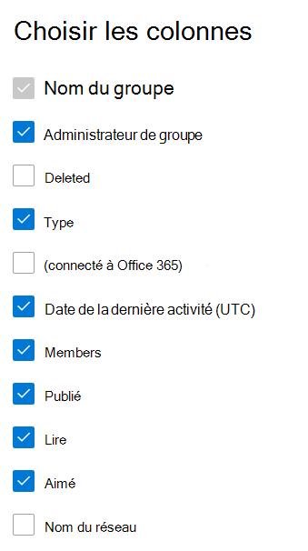

# Rapports Microsoft 365 dans le Centre d’administration - Rapport d’activité des groupes Yammer

Le tableau de bord Rapports Microsoft 365 affiche la vue d’ensemble de l’activité sur les produits de votre organisation. Il vous permet d'explorer les rapports au niveau de chaque produit afin d'offrir des informations plus précises sur les activités pour chaque produit. Voir [la rubrique Présentation des rapports](activity-reports.md). Dans le rapport d'activité des groupes Yammer, vous pouvez obtenir des informations sur l'activité des groupes Yammer de votre organisation et voir combien de groupes Yammer sont créés et utilisés.
 
## Comment faire accéder au rapport d’activité des groupes Yammer ?

1. Dans le centre d’administration, accédez aux **rapports**, puis sélectionnez **Utilisation**. 
2. Dans la page d’accueil du tableau de bord, cliquez sur le bouton **Afficher plus** sur la carte Yammer.
  
## Interpréter le rapport d'activité des groupes Yammer

Vous pouvez afficher les activités des groupes dans le rapport Yammer en choisissant l’onglet **Activité groupes** .

**Sélectionnez Choisir des colonnes** pour ajouter ou supprimer des colonnes du rapport.  

Vous pouvez également exporter les données du rapport dans un fichier Excel .csv en sélectionnant le lien **Exporter** . Cela a pour effet d'exporter les données de tous les utilisateurs afin d'effectuer un tri et un filtrage simples à des fins d'analyse approfondie. 

Le rapport **Activité des groupes Yammer** permet d'observer les tendances des 7, 30, 90 ou 180 derniers jours. Toutefois, si vous sélectionnez un jour particulier dans le rapport, le tableau affiche les données jusqu’à 28 jours à partir de la date actuelle (et non la date à laquelle le rapport a été généré).
  
|Élément|Description|
|:-----|:-----|
|**Métrique**|**Définition**|
|Nom du groupe  |Nom du groupe. |
|Administrateur de groupe  |Nom de l’administrateur ou du propriétaire du groupe.  |
|Deleted  |Nombre de groupes Yammer supprimés. Si le groupe est supprimé, mais qu'il a connu une activité dans la période du rapport, il apparaît dans la grille avec cet indicateur défini sur true.  |
|Type |Type de groupe, public ou privé. |
|Connecté à Office 365  |Indique si le groupe Yammer est également un groupe Microsoft 365. |
|Date de la dernière activité (UTC)  | Date la plus récente à laquelle un message a été lu, publié ou aimé par le groupe.  |
|Members  | Nombre de membres dans le groupe.  |
|Publié |Nombre de messages publiés dans le groupe Yammer au cours de la période de rapport. |
|Lecture   |Nombre de conversations lues dans le groupe Yammer au cours de la période de rapport.   |
|Aimé  |Nombre de messages aimés dans le groupe Yammer au cours de la période de rapport. |
|Nom du réseau   |Nom complet du réseau auquel appartient le groupe. |
