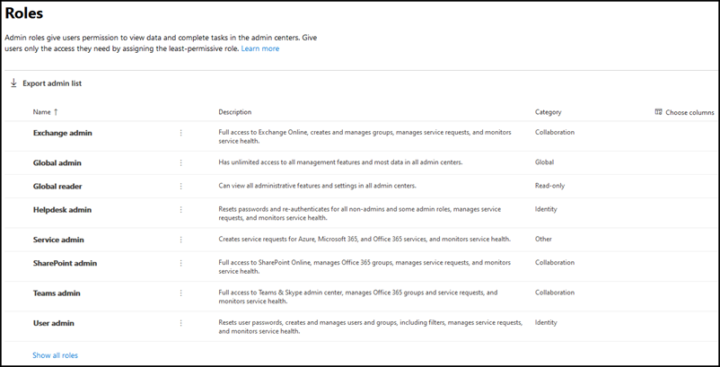

# Mise en place de la page rôles

Dans la page Rôles, vous pouvez accorder aux utilisateurs des autorisations pour effectuer des tâches dans les centres d’administration. Cela permet à votre organisation de répartir les tâches aux personnes appropriées et de sécuriser vos données.

> [!TIP]
> Vous recherchez des descriptions de rôles détaillées ? Consultez les [autorisations de rôle d’administrateur dans Azure Active Directory](/azure/active-directory/users-groups-roles/directory-assign-admin-roles#available-roles) et [à propos des rôles d’administrateur.](/microsoft-365/admin/add-users/about-admin-roles)

## À propos de la page rôles d’administrateur

Vous pouvez exporter la liste des administrateurs, ainsi que rechercher et filtrer par rôle.

- Utilisez la liste d’administration Exportation pour obtenir la liste complète de tous les utilisateurs administrateurs de votre organisation. La liste est stockée dans un Excel .csv de données.

- Utilisez la recherche pour rechercher un rôle d’administrateur et voir vos utilisateurs qui sont affectés à ce rôle.

- Utilisez Filter pour modifier votre affichage des rôles d’administrateur affichés.

## Obtenir le meilleur des rôles

Lisez le contenu ci-dessous pour en savoir plus sur les différents rôles d’administrateur et les tâches que les rôles peuvent effectuer dans votre organisation.

> [!NOTE]
Il ne s’agit pas d’une liste exhaustive de toutes les autorisations dont ces rôles ont. Sélectionnez **le lien En savoir plus** pour plus d’informations sur chaque rôle.

### Administrateur Exchange

Attribuez le Exchange administrateur principal aux utilisateurs qui ont besoin d’afficher et de gérer les boîtes aux lettres de messagerie, les groupes Microsoft 365 utilisateurs et les Exchange Online. Ils peuvent également ouvrir et gérer les demandes de service au support Microsoft. [En savoir plus](/microsoft-365/admin/add-users/about-exchange-online-admin-role)

### Administrateur global

Attribuez le rôle d’administrateur global aux utilisateurs qui ont besoin d’un accès global à la plupart des fonctionnalités et données de gestion dans les services en ligne Microsoft. Le fait de donner un accès global à un grand nombre d’utilisateurs représente un risque pour la sécurité et nous vous recommandons de n’avoir que 2 à 4 administrateurs généraux. Seuls les administrateurs globaux peuvent réinitialiser les mots de passe de tous les utilisateurs et ajouter et gérer des domaines. Ils peuvent également ouvrir et gérer les demandes de service au support Microsoft. La personne qui s’est inscrite aux services en ligne Microsoft devient automatiquement un administrateur global. En [savoir plus](/microsoft-365/admin/add-users/about-admin-roles#roles-available-in-the-microsoft-365-admin-center)

### Lecteur général

Attribuez le rôle d’administrateur de lecteur global aux utilisateurs qui doivent afficher les fonctionnalités et paramètres d’administration dans tous les centres d’administration que l’administrateur global peut afficher. Le rôle d’administrateur de lecteur global ne peut modifier aucun paramètre. [En savoir plus](/microsoft-365/admin/add-users/about-admin-roles#roles-available-in-the-microsoft-365-admin-center)

### Administrateur du support technique

Attribuez le rôle d’administrateur du helpdesk aux utilisateurs qui souhaitent réinitialiser les mots de passe, forcer les utilisateurs à se résoquent pour tout problème de sécurité. Ils peuvent également ouvrir et gérer les demandes de service au support Microsoft. L’administrateur du service d’aide peut uniquement aider les utilisateurs non administrateurs et les utilisateurs affectés à ces rôles : lecteur d’annuaire, invite d’invités, administrateur du service d’aide, lecteur du centre de messages et lecteur de rapports. [En savoir plus](/microsoft-365/admin/add-users/about-admin-roles#roles-available-in-the-microsoft-365-admin-center)

### Administrateur de service

Attribuez le rôle d’administrateur de service aux utilisateurs qui doivent créer des demandes de service pour Azure, Microsoft 365 et Office 365 services. [En savoir plus](/microsoft-365/admin/add-users/about-admin-roles#roles-available-in-the-microsoft-365-admin-center)

### Administrateur SharePoint

Lorsque vous achetez un abonnement Microsoft 365, un site d’équipe est automatiquement créé et l’administrateur général est définie comme administrateur principal de la collection de sites. Attribuez le SharePoint administrateur principal aux utilisateurs qui souhaitent accéder au centre d SharePoint’administration. Les utilisateurs qui SharePoint rôle d’administrateur principal peuvent créer et gérer des collections de sites, désigner des administrateurs de collections de sites et gérer des profils utilisateur. Les utilisateurs ayant SharePoint rôle d’administrateur principal peuvent également gérer Microsoft 365 groupes et ouvrir des demandes de service via le support Microsoft. [En savoir plus](/sharepoint/sharepoint-admin-role)

### Administrateur du service Teams

Attribuez le Teams administrateur principal aux utilisateurs qui vous souhaitez accéder au centre d’administration Teams & Skype et les gérer. Les utilisateurs ayant Teams rôle d’administrateur principal peuvent également gérer Microsoft 365 groupes et ouvrir des demandes de service via le support Microsoft. [En savoir plus](/MicrosoftTeams/using-admin-roles)

### Administrateur d’utilisateurs

Attribuez le rôle d’administrateur utilisateur aux utilisateurs qui doivent accéder aux réinitialisations de mot de passe des utilisateurs et les gérer, ainsi que les groupes. Ils peuvent également ouvrir et gérer les demandes de service au support Microsoft. [En savoir plus](/microsoft-365/admin/add-users/about-admin-roles#roles-available-in-the-microsoft-365-admin-center)

## Comparer les rôles

Vous pouvez désormais comparer les autorisations pour jusqu’à 3 rôles à la fois afin de trouver le rôle le moins permissif à attribuer.

Dans le Centre d’administration :

- Sélectionnez jusqu’à 3 rôles et choisissez **Comparer les rôles** pour voir les autorisations de chaque rôle.

## Contenu associé

[À propos Microsoft 365 rôles d’administrateur](about-admin-roles.md) (article)\
[Attribuer des rôles administrateur](assign-admin-roles.md) (article)