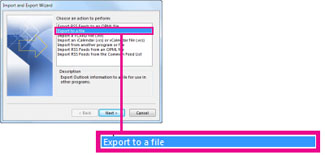

# Étape 5 : Accorder à un autre employé l’accès aux données OneDrive et Outlook

Lorsqu’un employé quitte votre organisation, vous pouvez accéder à ses données OneDrive et Outlook, les sauvegarder et choisir de les donner à un autre employé.
  
## Accéder aux documents OneDrive d’un ancien utilisateur

Si vous supprimez la licence d’un utilisateur mais que vous ne supprimez pas le compte, vous pouvez vous accorder l’accès au contenu dans le OneDrive de l’utilisateur. Si vous supprimez le compte de l’utilisateur, vous disposez par défaut de 30 jours pour accéder aux données OneDrive de l’ancien utilisateur. [Découvrez comment définir la rétention OneDrive pour les utilisateurs supprimés](/onedrive/set-retention). Si vous ne [restaurez pas de compte d’utilisateur](/office365/admin/add-users/restore-user) dans ce délai, son contenu OneDrive est supprimé.

Pour conserver les fichiers OneDrive d’un ancien utilisateur, commencez par vous accorder l’accès à leur OneDrive, puis déplacez les fichiers que vous souhaitez conserver.

1. Dans le Centre d’administration, accédez à la page **Utilisateurs** \> <a href="https://go.microsoft.com/fwlink/p/?linkid=834822" target="_blank">Utilisateurs actifs</a>.  

2. Sélectionnez un utilisateur.

3. Dans la page des propriétés de l’utilisateur, sélectionnez **OneDrive**. Sous **Obtenir l’accès aux fichiers**, sélectionnez **Créer un lien vers des fichiers**.

4. Sélectionnez le lien pour ouvrir l’emplacement du fichier. Téléchargez les fichiers sur votre ordinateur, ou sélectionnez **Déplacer vers** ou **Copier vers** pour les déplacer ou les copier vers votre propre OneDrive ou vers une bibliothèque partagée.

> [!NOTE]
> Vous pouvez déplacer ou copier jusqu’à 500 Mo de fichiers et dossiers à la fois. 
> Lorsque vous déplacez ou copiez des documents qui ont l’historique des versions, seule la dernière version est déplacée.  

Vous pouvez également accorder l’accès à un autre utilisateur pour accéder au OneDrive d’un ancien employé.

1. Connectez-vous au <a href="https://go.microsoft.com/fwlink/p/?linkid=2024339" target="_blank">Centre d’administration</a> en tant qu’administrateur général ou administrateur SharePoint.

    Si vous recevez un message indiquant que vous n’êtes pas autorisé à accéder au centre d’administration, vous ne disposez pas des autorisations d’administrateur dans votre organisation.

2. Dans le volet gauche, sélectionnez **Administration centres** \> **SharePoint**. (Vous devrez peut-être sélectionner **Afficher tout** pour afficher la liste des centres d’administration.)

3. Si le Centre d’administration SharePoint classique s’affiche, sélectionnez **Ouvrir maintenant** en haut de la page pour ouvrir le Centre d’administration SharePoint.

4. Dans le volet gauche, sélectionnez **Plus de fonctionnalités**.

5. Sous **Profils utilisateur**, sélectionnez **Ouvrir**.

6. Sous **Personnes**, sélectionnez **Gérer les profils utilisateur**.

7. Entrez le nom de l’ancien employé, puis sélectionnez **Rechercher**.

8. Cliquez avec le bouton droit sur l’utilisateur, puis choisissez **Gérer les propriétaires de collection de sites**.

9. Ajoutez l’utilisateur aux **administrateurs de collection** de sites et sélectionnez **OK**.

10. L’utilisateur peut désormais accéder au OneDrive de l’ancien employé à l’aide de l’URL OneDrive. 

### Révoquer l’accès administrateur au OneDrive d’un utilisateur

Vous pouvez vous accorder l’accès au contenu dans le OneDrive d’un utilisateur, mais vous pouvez supprimer votre accès lorsque vous n’en avez plus besoin.

1. Connectez-vous au <a href="https://go.microsoft.com/fwlink/p/?linkid=2024339" target="_blank">Centre d’administration</a> en tant qu’administrateur général ou administrateur SharePoint.

    Si vous recevez un message indiquant que vous n’êtes pas autorisé à accéder au centre d’administration, vous ne disposez pas des autorisations d’administrateur dans votre organisation.

2. Dans le volet gauche, sélectionnez **Administration centres** \> **SharePoint**. (Vous devrez peut-être sélectionner **Afficher tout** pour afficher la liste des centres d’administration.)

3. Si le Centre d’administration SharePoint classique s’affiche, sélectionnez **Ouvrir maintenant** en haut de la page pour ouvrir le Centre d’administration SharePoint.

4. Dans le volet gauche, sélectionnez **Plus de fonctionnalités**.

5. Sous **Profils utilisateur**, sélectionnez **Ouvrir**.

6. Sous **Personnes**, sélectionnez **Gérer les profils utilisateur**.

7. Entrez le nom de l’utilisateur, puis sélectionnez **Rechercher**.

8. Cliquez avec le bouton droit sur l’utilisateur, puis choisissez **Gérer les propriétaires de collection de sites**.

9. Supprimez la personne qui n’a plus besoin d’accéder aux données de l’utilisateur, puis sélectionnez **OK**.

## Accéder aux données Outlook d’un ancien utilisateur

Pour enregistrer les messages électroniques, le calendrier, les tâches et les contacts de l’ancien employé, exportez les informations dans un fichier de données Outlook (.pst).
  
1. [Ajoutez l’e-mail de l’ancien employé](https://support.microsoft.com/office/6e27792a-9267-4aa4-8bb6-c84ef146101b) à votre outlook. (Si vous [réinitialisez le mot de passe de l’utilisateur](reset-passwords.md), vous pouvez le définir sur quelque chose que vous seul connaissez.)

2. Dans Outlook, sélectionnez **Fichier**.

    
  
3. Sélectionnez **Ouvrir &amp; l’importation****/exportation d’exportation**\>.

    
  
4. Sélectionnez **Exporter vers un fichier**, puis **suivant**.

    
  
5. Sélectionnez **Fichier de données Outlook (.pst)**, puis cliquez sur **Suivant**.

6. Sélectionnez le compte que vous souhaitez exporter en sélectionnant le nom ou l’adresse e-mail, par exemple Boîte aux lettres - Anne Weiler ou anne@contoso.com. Si vous souhaitez exporter tout ce qui se trouve dans votre compte, y compris le courrier, le calendrier, les contacts, les tâches et les notes, vérifiez que la case **Inclure les sous-dossiers** est cochée.

    > [!NOTE]
    > Vous pouvez exporter un compte à la fois. Si vous souhaitez exporter plusieurs comptes, après l’exportation d’un compte, répétez ces étapes.
  
    
  
7. Sélectionnez **Suivant**.

8. Sélectionnez **Parcourir** pour sélectionner l’emplacement où enregistrer le fichier de données Outlook (.pst). Tapez un  *nom de fichier*, puis sélectionnez **OK** pour continuer.

    > [!NOTE]
    > Si vous avez déjà utilisé l’exportation, l’emplacement du dossier et le nom de fichier précédents s’affichent. Tapez un *autre nom de fichier* avant de sélectionner **OK**.
  
9. Si vous exportez vers un fichier de données Outlook existant (.pst), sous **Options**, spécifiez ce qu’il faut faire lors de l’exportation d’éléments qui existent déjà dans le fichier.

10. Sélectionnez **Terminer**.

Outlook commence immédiatement l’exportation, sauf si un nouveau fichier de données Outlook (.pst) est créé ou qu’un fichier protégé par mot de passe est utilisé.
  
- Si vous créez un fichier de données Outlook (.pst), un mot de passe facultatif peut vous aider à protéger le fichier. Lorsque la boîte de dialogue **Créer un fichier de données Outlook** s’affiche, tapez le *mot de passe* dans les zones **Mot de passe** et **Vérifier le mot de passe** , puis sélectionnez **OK**. Dans la boîte de dialogue **Mot de passe du fichier de données Outlook** , tapez le *mot de passe*, puis sélectionnez **OK**.

- Si vous exportez vers un fichier de données Outlook existant (.pst) protégé par mot de passe, dans la boîte de dialogue **Mot de passe du fichier de données Outlook** , tapez le *mot de passe*, puis sélectionnez **OK**.

Découvrez comment [exporter ou sauvegarder des e-mails, des contacts et un calendrier dans un fichier .pst Outlook](https://support.microsoft.com/office/14252b52-3075-4e9b-be4e-ff9ef1068f91) dans Outlook 2010.

  > [!NOTE]
  > Par défaut, votre adresse e-mail est disponible hors connexion pendant une période de 12 mois. Si nécessaire, découvrez comment [augmenter les données disponibles hors connexion](/outlook/troubleshoot/mailboxes/only-subset-items-synchronized).

### Accorder à un autre utilisateur l’accès à l’adresse e-mail d’un ancien utilisateur

Pour donner accès aux messages électroniques, au calendrier, aux tâches et aux contacts de l’ancien employé à un autre employé, importez les informations dans la boîte de réception Outlook d’un autre employé.

> [!NOTE]
> Vous pouvez également [convertir la boîte aux lettres de l’ancien utilisateur en boîte aux lettres partagée](/office365/admin/email/convert-user-mailbox-to-shared-mailbox) ou [transférer l’e-mail d’un ancien employé à un autre employé](/office365/admin/add-users/remove-former-employee#forward-a-former-employees-email-to-another-employee-or-convert-to-a-shared-mailbox).

1. Dans Outlook, accédez à **Fichier** \> **Ouvrir &amp; Exporter** \> **Import/Export**.

    L’Assistant Importation et Exportation démarre.

2. Sélectionnez **Importer depuis un autre programme ou fichier**, puis cliquez sur **Suivant**.

    
  
3. Sélectionnez **Fichier de données Outlook (.pst),** puis **Suivant**.

4. Accédez au fichier .pst que vous souhaitez importer.

5. Sous **Options**, choisissez la manière dont vous souhaitez gérer les doublons.

6. Sélectionnez **Suivant**.

7. Si un mot de passe a été attribué au fichier de données Outlook (.pst), entrez le mot de passe, puis sélectionnez **OK**.

8. Définissez les options d’importation des éléments. Les paramètres par défaut n’ont généralement pas besoin d’être modifiés.

9. Sélectionnez **Terminer**.

> [!NOTE]
> Les étapes restent les mêmes pour accéder aux données OneDrive et e-mail d’un utilisateur existant.

> [!TIP]
> Si vous souhaitez importer ou restaurer uniquement quelques éléments à partir d’un fichier de données Outlook (.pst), vous pouvez ouvrir le fichier de données Outlook. Ensuite, dans le volet de navigation, faites glisser les éléments des dossiers de fichiers de données Outlook vers vos dossiers Outlook existants.

## Contenu associé

[Ajouter et supprimer des administrateurs sur un compte OneDrive](/sharepoint/manage-user-profiles#add-and-remove-admins-for-a-users-onedrive) (article)

[Restaurer un OneDrive supprimé](/onedrive/restore-deleted-onedrive) (article)

[Conservation et suppression de OneDrive](/onedrive/retention-and-deletion) (article)

[Partager des fichiers et des dossiers OneDrive](https://support.microsoft.com/office/share-onedrive-files-and-folders-9fcc2f7d-de0c-4cec-93b0-a82024800c07)
