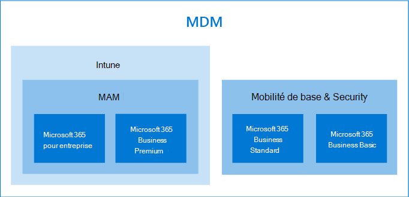

# Options de protection des périphériques et des données de l’application

Vous disposez de plusieurs méthodes pour sécuriser les appareils et les données de vos organisations à l’aide de Microsoft 365 for Business and Enterprise. Vous pouvez utiliser les plans autonomes suivants :

- Intune (une partie de la gestion des points de terminaison Microsoft)
- Les plans Azure Active Directory Premium.
- Sécurité et mobilité de base (inclus dans la plupart des offres Microsoft 365 pour les entreprises et les entreprises) ou utilisez les abonnements qui incluent certains ou tous les plans autonomes précédents.

- Un abonnement Microsoft 365 Business Premium, qui inclut la protection contre la sécurité et les menaces pour les petites entreprises sous 300 utilisateurs.
- Plans d’entreprise Microsoft 365 qui incluent la sécurité avancée et la protection contre les menaces.

## Options de gestion des appareils

- La **sécurité et la mobilité de base** sont proposées avec la plupart des plans Microsoft 365 et est le seul choix intégré offert pour Microsoft 365 Business standard et Microsoft 365 Business Basic. Pour plus d’informations, consultez la rubrique [disponibilité de la sécurité et de la sécurité de base](../basic-mobility-security/choose-between-basic-mobility-and-security-and-intune.md#availability-of-basic-mobility-and-security-and-intune). 

    Si vous disposez de Microsoft 365 Business Basic ou Microsoft 365 Business standard, vous pouvez également acheter Intune si votre organisation a des besoins plus complexes en matière de sécurité.
 
- **Microsoft Intune** est un plan autonome qui est également inclus dans certains plans Microsoft 365 for Business ou Enterprise. Si vous avez Intune en tant que serveur autonome ou partie de votre abonnement, il vous permet d’affiner la gestion de votre appareil et de vos données d’application. Pour plus d’informations sur la disponibilité avec Microsoft 365, consultez la rubrique [disponibilité d’Intune](../basic-mobility-security/choose-between-basic-mobility-and-security-and-intune.md#availability-of-basic-mobility-and-security-and-intune).

    Microsoft Intune est un service informatique axé sur la gestion des appareils mobiles (MDM) et la gestion des applications mobiles (MAM). Vous pouvez contrôler le mode d’utilisation des appareils de votre organisation, notamment des téléphones mobiles, des tablettes et des ordinateurs portables. Vous pouvez également configurer des stratégies spécifiques pour contrôler les applications. Pour plus d’informations, consultez [la documentation Microsoft Intune](https://docs.microsoft.com/mem/intune/).

- Les offres **Premium Azure Active Directory (AD)** sont des plans autonomes qui sont également inclus dans les offres de Microsoft 365 pour les entreprises et les entreprises. Pour plus d’informations, reportez-vous à [tarifs Azure ad](https://azure.microsoft.com/pricing/details/active-directory/).

     Azure AD Premium P1 et Azure AD Premium P2 vous permettent de définir des fonctionnalités d’accès conditionnel, de réinitialisation du mot de passe en libre-service, etc. Pour plus d’informations sur les fonctionnalités des plans Premium, voir page de [tarification Azure ad](https://azure.microsoft.com/pricing/details/active-directory/) .
- **Microsoft 365 Business Premium** inclut Intune et Azure Active Directory Premium P1 et Office 365 Advanced Threat Protection. 
 
    Microsoft 365 Business Premium propose un ensemble de modèles de stratégie pour sécuriser vos périphériques et vos données d’application. Il offre un niveau de sécurité et de protection contre les menaces approprié pour la plupart des entreprises sous 300 utilisateurs. Pour plus d’informations, reportez-vous à [la rubrique Configuration de microsoft 365 Business Premium dans l’Assistant Installation](../../business/set-up.md), [sécurisation des ordinateurs Windows 10](../../business/secure-win-10-pcs.md)et des [fonctionnalités de sécurité et de conformité de Microsoft 365 Business Premium](../../business/security-features.md).

- **Microsoft 365 pour** les abonnements d’entreprise incluent Microsoft Intune et E5 inclut également les plans Azure ad Premium 1 et 2.

    Microsoft 365 E5 offre le plus haut niveau de sécurité et de protection contre les menaces de tous les abonnements Microsoft 365. Pour plus d’informations, consultez la rubrique [vue d’ensemble de Microsoft 365 pour les entreprises](../../enterprise/microsoft-365-overview.md).
