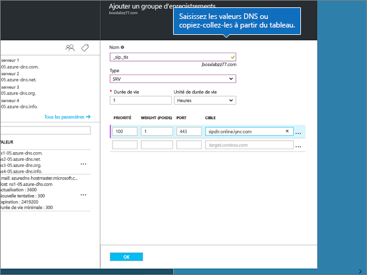

# Créer des enregistrements DNS pour les zones DNS Azure

 **[Consultez les Forums aux questions sur les domaines](../setup/domains-faq.yml)** si vous ne trouvez pas ce que vous recherchez. 
  
Si Azure est votre fournisseur d’hébergement DNS, suivez les étapes de cet article pour vérifier votre domaine et configurer les enregistrements DNS pour le courrier, Skype Entreprise Online, etc.
  
Voici les principaux enregistrements à ajouter. 
  
- [Modifier les enregistrements de serveur de noms (NS) de votre domaine](#change-your-domains-nameserver-ns-records)
    
- [Ajouter un enregistrement TXT à des fins de vérification](#add-a-txt-record-for-verification)

- [Ajouter un enregistrement MX afin que les courriers électroniques pour votre domaine soient transférés vers Microsoft](#add-an-mx-record-so-email-for-your-domain-will-come-to-microsoft)
    
- [Ajouter les quatre enregistrements CNAME requis pour Microsoft](#add-the-four-cname-records-that-are-required-for-microsoft)
    
- [Ajouter un enregistrement TXT pour SPF afin d'éviter le courrier indésirable](#add-a-txt-record-for-spf-to-help-prevent-email-spam)
    
- [Ajoutez les deux enregistrements SRV requis pour Microsoft](#add-the-two-srv-records-that-are-required-for-microsoft)
    
Une fois ces enregistrements ajoutés sur Azure, votre domaine est installé pour fonctionner avec les services Microsoft.
  
> [!NOTE]
> L'application des enregistrements DNS modifiés prend généralement 15 minutes. Il peut toutefois arriver que la répercussion d'une modification dans le système DNS sur Internet prenne davantage de temps. Si vous rencontrez des problèmes avec le flux de messages ou d'autres problèmes suite à l'ajout des enregistrements DNS, voir [Résolution des problèmes suite à la modification de votre nom de domaine ou des enregistrements DNS](../get-help-with-domains/find-and-fix-issues.md). 
  
## Modifier les enregistrements de serveur de noms (NS) de votre domaine

> [!IMPORTANT]
> Vous devez effectuer cette procédure au niveau du bureau d'enregistrement de domaines auprès duquel vous avez acheté et inscrit votre domaine. 
  
Lorsque vous vous êtes inscrit à Azure, vous avez créé un groupe de ressources dans une zone DNS, puis affecté votre nom de domaine à ce groupe de ressources. Ce nom de domaine est inscrit auprès d’un bureau d’enregistrement de domaines externe . Azure ne propose pas de services d’inscription de domaine.
  
Pour vérifier et créer des enregistrements DNS pour votre domaine dans Microsoft, vous devez d’abord modifier les serveurs de noms de votre bureau d’enregistrement de domaines afin qu’ils utilisent les serveurs de noms Azure affectés à votre groupe de ressources.
  
Pour modifier vous-même les serveurs de noms de votre domaine sur le site web de votre bureau d'enregistrement de domaines, procédez comme suit.
  
1. Identifiez la zone sur le site web du bureau d'enregistrement de domaines dans laquelle vous pouvez modifier les serveurs de noms pour votre domaine.
    
2. Créez deux enregistrements de nameserver à l’aide des valeurs du tableau suivant, ou modifiez les enregistrements de nameserver existants afin qu’ils correspondent à ces valeurs. Vous trouverez ci-dessous un exemple de serveurs de noms affectés à Azure.
    

**Premier nameserver :** Utilisez la valeur de serveur de noms attribuée par Azure.  
**Second nameserver:** Utilisez la valeur de serveur de noms attribuée par Azure.  

  
> [!TIP]
> You should use at least two name server records. Si d’autres serveurs de noms sont répertoriés sur le site web de votre bureau d’enregistrement de domaines, vous devez les supprimer. 
  
3. Enregistrez vos modifications.
    
> [!NOTE]
> Your nameserver record updates may take up to several hours to update across the Internet's DNS system. Ensuite, votre messagerie Microsoft et d’autres services seront tous définies pour fonctionner avec votre domaine. 
  
## Ajouter un enregistrement TXT à des fins de vérification

Avant que vous puissiez utiliser votre domaine avec Microsoft, nous devons vérifier qu’il vous appartient. Votre capacité à vous connecter à votre compte auprès de votre bureau d’enregistrement de domaines et à créer l’enregistrement DNS prouve à Microsoft que le domaine vous appartient.
  
> [!NOTE]
> Cet enregistrement sert uniquement à vérifier que vous êtes propriétaire du domaine. Vous pouvez éventuellement le supprimer ultérieurement. 
  
1. To get started, go to your domains page at Azure by using [this link](https://portal.azure.com ). Avant toute chose, vous serez invité à vous connecter.
    
    
  
2. À **l’aide de la barre de recherche** sur la page Tableau **de** bord, tapez dans les **zones DNS**. Dans l’affichage des résultats, sélectionnez les **zones DNS** sous la **partie Services.** Une fois que vous avez été redirigé, sélectionnez le domaine à mettre à jour.
    
    
  
3. Dans la page **Paramètres** de votre domaine, dans la zone **de zone DNS,** **sélectionnez + Jeu d’enregistrement**.
    
    
  
4. Dans la **zone Ajouter un jeu d’enregistrement,** dans les zones du nouveau jeu d’enregistrement, sélectionnez les valeurs du tableau suivant. 
    
    (Choisissez les **valeurs des** unités Type et **TTL** dans les listes de listes.) 
    
    |**Name**|**Type (Type)**|**TTL (Durée de vie)**|**Unité TTL**|**Value (Valeur)**|
    |:-----|:-----|:-----|:-----|:-----|
    |@    |TXT    |1    |Heures    |MS=ms *XXXXXXXX*    **Remarque :** il s'agit d'un exemple. Utilisez votre valeur spécifique d’**Adresse de destination ou de pointage** ici, à partir du tableau.           [Comment trouver cette valeur ?](../get-help-with-domains/information-for-dns-records.md)          |
   
    
  
5. Sélectionnez **OK**.
  
6. Patientez quelques minutes, le temps que l'enregistrement que vous venez de créer soit mis à jour sur Internet.
    
L’enregistrement étant désormais ajouté sur le site de votre bureau d’enregistrement de domaines, revenez sur Microsoft et demandez l’enregistrement.
  
Lorsque Microsoft trouve l’enregistrement TXT approprié, votre domaine est vérifié.
  
1. Dans le centre d’administration, accédez à la page **Paramètres** \> <a href="https://go.microsoft.com/fwlink/p/?linkid=834818" target="_blank">Domaines</a>.
    
2. Dans la page **Domaines**, sélectionnez le domaine que vous vérifiez. 
    
    
  
3. Dans la page **Configuration**, sélectionnez **Démarrer la configuration**.
    
    
  
4. Dans la page **Vérifier le domaine**, sélectionnez **Vérifier**.
    
    
  
> [!NOTE]
>  L'application des enregistrements DNS modifiés prend généralement 15 minutes. Il peut toutefois arriver que la répercussion d'une modification dans le système DNS sur Internet prenne davantage de temps. Si vous rencontrez des problèmes avec le flux de messages ou d'autres problèmes suite à l'ajout des enregistrements DNS, voir [Résolution des problèmes suite à la modification de votre nom de domaine ou des enregistrements DNS](../get-help-with-domains/find-and-fix-issues.md). 
  
## Ajouter un enregistrement MX afin que les courriers électroniques pour votre domaine soient transférés vers Microsoft

1. To get started, go to your domains page at Azure by using [this link](https://portal.azure.com ). Avant toute chose, vous serez invité à vous connecter.
    
    
  
2. Dans la page **Tableau de** bord, dans la zone **Toutes** les ressources, sélectionnez le domaine à mettre à jour. 
    
    
  
3. Dans la page **Paramètres** de votre domaine, dans la zone **de zone DNS,** **sélectionnez + Jeu d’enregistrement**.
    
    
  
4. Dans la **zone Ajouter un jeu d’enregistrement,** dans les zones du nouveau jeu d’enregistrement, sélectionnez les valeurs du tableau suivant. 
    
    (Choisissez les **valeurs des** unités Type et **TTL** dans les listes de listes.) 
    
    |**Name**|**Type (Type)**|**TTL (Durée de vie)**|**Unité TTL**|**Preference (Préférence)**|**Mail Exchange**|
    |:-----|:-----|:-----|:-----|:-----|:-----|
    |@    |MX    |1    |Heures    |10     Pour plus d'informations sur la priorité, voir [Qu'est-ce que la priorité MX ?](../setup/domains-faq.yml).   | *\<domain-key\>*  .mail.protection.outlook.com    **Remarque :** Obtenez votre *\<domain-key\>* depuis votre compte Microsoft.   [Comment trouver cette valeur ?](../get-help-with-domains/information-for-dns-records.md)  
   
    
  
5. Sélectionnez **OK**.
    
    
  
6. Si d’autres enregistrements MX sont répertoriés dans la section **Enregistrements MX,** vous devez les supprimer. 
    
    Tout d’abord, dans la **zone DNS,** sélectionnez le jeu d’enregistrement **MX**.
    
    
  
    Ensuite, sélectionnez l’enregistrement MX à supprimer.
    
    
  
7. Sélectionnez **le menu Context (...)**, puis choisissez **Supprimer.**
    
    
  
8. Sélectionnez **Enregistrer**.
    
    
  
## Ajouter les quatre enregistrements CNAME requis pour Microsoft

1. To get started, go to your domains page at Azure by using [this link](https://portal.azure.com ). Avant toute chose, vous serez invité à vous connecter.
    
    
  
2. Dans la page **Tableau de** bord, dans la zone **Toutes** les ressources, sélectionnez le domaine à mettre à jour. 
    
    
  
3. Dans la page **Paramètres** de votre domaine, dans la zone **de zone DNS,** **sélectionnez + Jeu d’enregistrement**.
    
    
  
4. Ajoutez le premier des quatre enregistrements CNAME.
    
    Dans la **zone Ajouter** un jeu d’enregistrement, dans les zones du nouveau jeu d’enregistrement, tapez ou copiez-collez les valeurs de la première ligne du tableau suivant. 
    
    (Choisissez les **valeurs des** unités Type et **TTL** dans les listes de listes.) 
    
    |**Name**|**Type (Type)**|**TTL (Durée de vie)**|**Unité TTL**|**Alias**|
    |:-----|:-----|:-----|:-----|:-----|
    |autodiscover    |CNAME    |1    |Heures    |autodiscover.outlook.com    |
    |sip    |CNAME    |1    |Heures    |sipdir.online.lync.com    |
    |lyncdiscover    |CNAME    |1    |Heures    |webdir.online.lync.com    |
    
   
    
  
5. Sélectionnez **OK**.
    
    
  
6. Ajoutez chacun des trois autres enregistrements CNAME.
    
    Dans la **zone de zone DNS,** sélectionnez **+ Jeu d’enregistrement.** Ensuite, dans le jeu d’enregistrement vide, créez un enregistrement en utilisant les valeurs de la ligne suivante du tableau, puis sélectionnez de nouveau **OK** pour terminer cet enregistrement. 
    
    Répétez ce processus jusqu’à ce que vous avez créé les quatre enregistrements CNAME.
    
7.  (Facultatif) Ajoutez 2 enregistrements CNAME pour la gestion des enregistrements de gestion des données.

> [!IMPORTANT]
> Si vous avez la gestion des périphériques mobiles (MDM) pour Microsoft, vous devez créer deux enregistrements CNAME supplémentaires. Suivez la procédure que vous avez utilisée pour les quatre autres enregistrements CNAME, mais fournissez les valeurs du tableau suivant. (Si vous n’avez pas de gestion des mdm, vous pouvez ignorer cette étape.) 
  
|**Name**|**Type (Type)**|**TTL (Durée de vie)**|**Unité TTL**|**Alias**|
|:-----|:-----|:-----|:-----|:-----|
|enterpriseregistration    |CNAME    |1    |Heures    |enterpriseregistration.windows.net    |
|enterpriseenrollment    |CNAME    |1    |Heures    |enterpriseenrollment-s.manage.microsoft.com    |
   
## Ajoutez un enregistrement TXT pour SPF afin d'éviter le courrier indésirable

> [!IMPORTANT]
> Vous ne pouvez avoir qu’un enregistrement TXT pour SPF pour un domaine. Si votre domaine comporte plusieurs enregistrements SPF, vous rencontrez des erreurs au niveau de la transmission du courrier électronique ainsi que des problèmes de remise du courrier et de classification en tant que courrier indésirable. Si vous avez déjà un enregistrement SPF pour votre domaine, il n’est pas nécessaire d’en créer un nouveau pour Microsoft. Ajoutez plutôt les valeurs Microsoft requises à l’enregistrement actuel de manière à n’avoir *qu’un seul* enregistrement SPF incluant les deux ensembles de valeurs. 
  
1. To get started, go to your domains page at Azure by using [this link](https://portal.azure.com ). Avant toute chose, vous serez invité à vous connecter.
    
    
  
2. Dans la page **Tableau de** bord, dans la zone **Toutes** les ressources, sélectionnez le domaine à mettre à jour. 
    
    
  
3. Dans la **zone de zone DNS,** sélectionnez le jeu d’enregistrement **TXT.**
    
    
  
4. Dans la **zone Propriétés du jeu** d’enregistrement, dans les zones du nouveau jeu d’enregistrement, sélectionnez les valeurs du tableau suivant. 
    
    (Choisissez les **valeurs des** unités Type et **TTL** dans les listes de listes.) 
    
    |**Name**|**Type (Type)**|**TTL (Durée de vie)**|**Unité TTL**|**Value (Valeur)**|
    |:-----|:-----|:-----|:-----|:-----|
    |@    |TXT    |1    |Heures    |v=spf1 include:spf.protection.outlook.com -all    **Remarque :** nous vous recommandons de copier et coller cette entrée, afin que l’espacement reste correcte.           

    
  
5. Sélectionnez **Enregistrer**.
    
    
  
## Ajoutez les deux enregistrements SRV requis pour Microsoft

1. To get started, go to your domains page at Azure by using [this link](https://portal.azure.com ). Avant toute chose, vous serez invité à vous connecter.
    
    
  
2. Dans la page **Tableau de** bord, dans la zone **Toutes** les ressources, sélectionnez le domaine à mettre à jour. 
    
    
  
3. Dans la page **Paramètres** de votre domaine, dans la zone **de zone DNS,** **sélectionnez + Jeu d’enregistrement**.
    
    
  
4. Ajoutez le premier des deux enregistrements SRV.
    
    Dans la **zone Ajouter un jeu d’enregistrement,** dans les zones du nouveau jeu d’enregistrement, sélectionnez les valeurs de la première ligne du tableau suivant. 
    
    (Choisissez les **valeurs des** unités Type et **TTL** dans les listes de listes.) 
    
    |**Name**|**Type (Type)**|**TTL (Durée de vie)**|**Unité TTL**|**Priority (Priorité)**|**Weight (Poids)**|**Port (Port)**|**Target (Cible)**|
    |:-----|:-----|:-----|:-----|:-----|:-----|:-----|:-----|
    |_sip._tls    |SRV    |1    |Heures    |100    |1    |443    |sipdir.online.lync.com    |
    |_sipfederationtls._tcp    |SRV    |1    |Heures    |100    |1    |5061    |sipfed.online.lync.com    

    
  
5. Sélectionnez **OK**.
    
    
  
6. Ajoutez l’autre enregistrement SRV.
    
    Dans les zones du nouvel enregistrement, tapez ou copiez-collez les valeurs de la deuxième ligne du tableau.
    
> [!NOTE]
> L'application des enregistrements DNS modifiés prend généralement 15 minutes. Il peut toutefois arriver que la répercussion d'une modification dans le système DNS sur Internet prenne davantage de temps. Si vous rencontrez des problèmes avec le flux de messages ou d'autres problèmes suite à l'ajout des enregistrements DNS, voir [Résolution des problèmes suite à la modification de votre nom de domaine ou des enregistrements DNS](../get-help-with-domains/find-and-fix-issues.md). 
