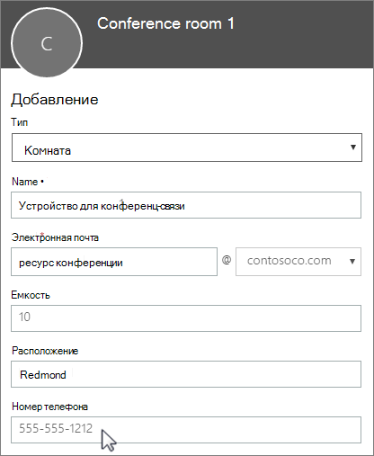

# Boîtes aux lettres de salle et de ressource

Si vous avez une salle de conférence, un véhicule de société ou un équipement que plusieurs personnes peuvent utiliser, vous devez mettre au point une méthode de réservation de ces ressources pour tout le monde. Il est recommandé de créer une boîte aux lettres de salle ou de ressource dans Microsoft 365 pour chaque ressource. Vous pouvez en créer une pour une salle de conférence, des équipements multimédia ou un véhicule utilitaire.
  
Une fois que vous avez créé une boîte aux lettres de salle ou de ressource, tous les membres de l’entreprise peuvent réserver la salle ou l’équipement pour des réunions ou des événements à l’aide d’Outlook. Vous allez découvrir **comment utiliser** et **configurer ce type de boîte aux lettres** dans les deux onglets suivants. Voici quelques questions fréquentes sur les boîtes aux lettres de salle et de ressource. 
  
## Utiliser les boîtes aux lettres de salle et de ressource

Pour utiliser les boîtes aux lettres de salle ou de ressource, ouvrez Outlook à partir de votre ordinateur ou connectez-vous à Outlook sur le web. Planifiez une réunion et ajoutez la salle ou la ressource à la réunion comme vous le feriez lorsque vous invitez d’autres employés ou des clients. Celle-ci est à présent réservée.
  
1. Ouvrez **Outlook** sur votre ordinateur. 
    
2. Dans l'onglet **Accueil**, sélectionnez **Nouveaux éléments** \> **Réunion**.  Vous pouvez également sélectionner **Nouvelle réunion** à partir de votre Calendrier.
    
3. Dans le champ À, tapez le nom de la salle de conférence ou de l’équipement que vous voulez réserver, ainsi que les participants que vous voulez inviter. Vous pouvez également sélectionner **Pour** puis double-cliquez sur la salle de conférence ou l’équipement dans la liste. Sélectionnez ensuite **OK**. 
  
4. Dans la ligne **Objet**, tapez l’objet de la réservation ou de la réunion. 
    
5. Modifiez l’**emplacement** (facultatif). 
    
6. Modifiez l'**heure de début** et l'**heure de fin**, ou sélectionnez **Journée entière**. Pour répéter la réunion ou la réservation, sélectionnez **Périodicité** dans la partie supérieure. 
  
7. Tapez un message décrivant le but et joignez des fichiers si nécessaire.
    
8. Pour autoriser d'autres personnes à participer en ligne ou par téléphone à la réunion, sélectionnez **Réunion Skype**.
    
9. Pour vous assurer que la salle, l’équipement et les personnes que vous avez invités sont disponibles, sélectionnez **Assistant Planification** en haut. Sélectionnez ensuite une heure disponible dans le calendrier.   ASTUCE : Dans le calendrier de programmation, le bleu signifie que la salle ou l'équipement est réservé ou occupé. Sélectionnez la zone blanche, ou libre, sur le calendrier. 
  
10. Lorsque vous avez terminé, cliquez sur **Envoyer**.
    
## Configurer les boîtes aux lettres de salle et de matériel

Pour configurer une boîte aux lettres de salle ou d'équipement, rendez-vous dans le <a href="https://go.microsoft.com/fwlink/p/?linkid=2024339" target="_blank">Centre d'administration de Microsoft 365</a>. (Vous devez avoir la permission de l’administrateur pour le faire). Créez la boîte aux lettres et faites savoir à tout le monde qu'ils peuvent commencer à la réserver pour des réunions et des événements.
  
1. Dans le centre d’administration, accédez à la page **Ressources** \> [Équipement &amp; de salle](https://go.microsoft.com/fwlink/p/?linkid=2067334).
  
2. Sélectionnez **Ajouter**.
    
3. Remplissez les champs de la salle ou de la ressource :  
  
  - **Salle** ou **Ressource** : type de boîte aux lettres que vous voulez créer.
    
  - **Nom** : nom convivial ou brève description.
    
  - **Adresse de courrier** : alias de courrier de la salle ou de la ressource. Celle-ci est nécessaire pour envoyer une demande de réunion à la salle ou la ressource.
    
  - **Capacité** : nombre de personnes que la salle peut accueillir ou qui peuvent utiliser l’équipement en même temps.
    
  - **Emplacement** : numéro ou emplacement de la salle dans un bâtiment ou une région.
    
  - **Numéro de téléphone** : numéro de téléphone de la salle. Celui-ci est différent du numéro de téléphone de la réunion généré lorsque Skype Entreprise est utilisé.
    
4. Sélectionnez **Ajouter**.
    
5. Sélectionnez la boîte aux lettres de salle ou de ressource que vous avez créée pour afficher ou en modifier les détails.
  
6. Si vous avez apporté des modifications, sélectionnez **Enregistrer** puis **Fermer**.

> [!Note]
> Pour maintenir la sécurité de vos boîtes aux lettres de salle et de matériel, bloquez la connexion à ces boîtes aux lettres. Pour plus d’informations, voir [Bloquer la connexion pour le compte de boîte aux lettres partagé](/office365/admin/email/create-a-shared-mailbox#block-sign-in-for-the-shared-mailbox-account).

## Questions fréquentes sur les boîtes aux lettres de salle et de ressource

### Comment savoir si une salle ou une ressource est disponible ?

Ouvrez Outlook et créez une réunion. Ajoutez la salle ou la ressource à la réunion comme s'il s'agissait d'une personne, puis sélectionnez l'option **Assistant Planification** pour afficher le calendrier actualisé de la disponibilité de la salle ou de la ressource. Si la plage horaire est libre, la salle ou la ressource est disponible. Si elle apparaît en bleu, elle est réservée. 
  
### Comment annuler une demande de réservation de salle ou de ressource ?

Ouvrez la réunion que vous avez programmée dans Outlook, puis supprimez la salle ou la ressource de la réunion comme vous le feriez avec un participant. Cela permet de libérer la salle ou la ressource et à d’autres personnes de la réserver.
  
### Une personne doit-elle accepter ou refuser les demandes de réservation de salle ou de ressource ?

 Non, il n’est pas nécessaire de désigner une personne pour accepter ou refuser les demandes. Vous pouvez décider si vous souhaitez que la salle ou l’équipement soit réservé automatiquement ou géré par un membre de votre entreprise. 
  
### Une boîte aux lettres de salle ou de ressource a-t-elle besoin d’une licence de produit ?

Non. Même si la plupart des membres de votre organisation ont besoin d’une licence pour utiliser Microsoft 365, vous n’avez pas besoin d’attribuer de licence à une boîte aux lettres de salle ou de ressource.
  
### Faut-il désigner un propriétaire chargé de la réservation des salles ou équipements ?

 Non. Il n’est pas utile qu’une personne se charge de la boîte aux lettres de salle ou de ressource.