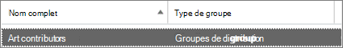

# <a name="upgrade-distribution-lists-to-microsoft-365-groups-in-exchange-online"></a>Mettre à niveau les listes de distribution pour Groupes Microsoft 365 dans Exchange Online

La mise à niveau d’une liste de distribution vers un groupe Microsoft 365 est un excellent moyen d’améliorer les fonctionnalités et les fonctionnalités des groupes de votre organisation. Pour plus d’informations, voir [Pourquoi mettre à niveau vos listes de distribution vers des groupes dans Outlook](https://support.microsoft.com/office/7fb3d880-593b-4909-aafa-950dd50ce188)

Vous pouvez mettre à niveau les listes de distribution une par une, ou plusieurs en même temps. Vous pouvez utiliser le Centre d’administration Exchange (EAC) ou Exchange Online PowerShell.

## <a name="upgrade-one-or-many-distribution-list-groups-to-microsoft-365-groups"></a>Mettre à niveau un ou plusieurs groupes de listes de distribution vers Groupes Microsoft 365

Vous devez être administrateur général ou administrateur Exchange pour mettre à niveau une liste de distribution. Pour effectuer une mise à niveau vers Groupes Microsoft 365, la liste de distribution doit avoir un propriétaire désigné et ce propriétaire doit être une boîte aux lettres.

### <a name="use-the-classic-eac-to-upgrade-one-or-many-distribution-list-groups-to-microsoft-365-groups-in-outlook"></a>Utiliser le Centre d’administration Exchange classique pour mettre à niveau un ou plusieurs groupes de listes de distribution vers Groupes Microsoft 365 dans Outlook

> [!NOTE]
> Les procédures décrites dans cette section ne sont pas disponibles dans le nouveau CAE.

1. Accédez au Centre d’administration Exchange > **Groupes de destinataires**\>.<a href="https://go.microsoft.com/fwlink/?linkid=2183233" target="_blank"></a>

   Vous verrez un avis indiquant que vous disposez de listes de distribution (également **appelées groupes de distribution**) qui peuvent être mises à niveau vers Groupes Microsoft 365.
   
   

1. Sélectionnez une ou plusieurs listes de distribution (également **appelées groupes de distribution**) dans la page **groupes** .

   

1. Sélectionnez l’icône de mise à niveau.

   

1. Dans la boîte de dialogue d’informations, sélectionnez **Oui** pour confirmer la mise à niveau. Le processus commence immédiatement. Selon la taille et le nombre de lits de distribution que vous mettez à niveau, le processus peut prendre des minutes ou des heures.

   Si la liste de distribution ne peut pas être mise à niveau, une boîte de dialogue s’affiche. Consultez [Quelles listes de distribution ne peuvent pas être mises à niveau ?](#which-distribution-lists-cant-be-upgraded).

1. Si vous mettez à niveau plusieurs listes de distribution, utilisez la liste déroulante pour filtrer les listes de distribution qui ont été mises à niveau. Si la liste n’est pas complète, patientez un certain temps, puis sélectionnez **Actualiser** pour voir ce qui a été correctement mis à niveau.

**Remarques** :

- Vous ne recevez pas de notification une fois les mises à niveau terminées. Au lieu de cela, consultez ce qui est répertorié sous **Dll disponibles pour la mise à niveau** ou **Mises à niveau**.

- Si vous avez sélectionné une liste de distribution pour la mise à niveau, mais qu’elle apparaît toujours dans la page comme **Disponible pour la mise à niveau**, la mise à niveau a échoué. Consultez [Que faire si la mise à niveau ne fonctionne pas](#what-to-do-if-the-upgrade-doesnt-work).

- L’e-mail de synthèse d’un groupe peut vous permettre de mettre à niveau toutes les listes de distribution éligibles dont vous êtes le propriétaire. Pour plus d’informations sur les e-mails de synthèse, voir [Avoir une conversation de groupe dans Outlook](https://support.microsoft.com/office/a0482e24-a769-4e39-a5ba-a7c56e828b22).

## <a name="what-to-do-if-the-upgrade-doesnt-work"></a>Que faire si la mise à niveau ne fonctionne pas

Les listes de distribution qui ne parviennent pas à mettre à niveau restent inchangées.

Si une ou plusieurs listes de distribution **éligibles** ne parviennent pas à être mises à niveau, procédez comme suit :

1. Utilisez [ce script](https://aka.ms/DLToM365Group) pour rechercher d’éventuels problèmes. Corrigez les problèmes signalés par le script et essayez de mettre à niveau la liste de distribution une fois de plus. 

2. Si le script ne vous aide pas, ouvrez un [ticket de support](../../business-video/get-help-support.md). Le problème doit être transmis à l’équipe d’ingénierie de groupes.

## <a name="how-to-use-exchange-online-powershell-to-upgrade-several-distribution-lists-at-the-same-time"></a>Comment utiliser Exchange Online PowerShell pour mettre à niveau plusieurs listes de distribution en même temps

Pour vous connecter à Exchange Online PowerShell, voir [Connexion à Exchange Online PowerShell](/powershell/exchange/connect-to-exchange-online-powershell).

### <a name="upgrade-a-single-distribution-list"></a>Mettre à niveau une liste de distribution unique

Pour mettre à niveau une liste de distribution unique, utilisez la syntaxe suivante :

```PowerShell
Upgrade-DistributionGroup -DLIdentities <EmailAddress>
```

Cet exemple met à niveau la liste de distribution marketing@contoso.com :

```PowerShell
Upgrade-DistributionGroup -DLIdentities marketing@contoso.com
```

Pour obtenir des informations détaillées sur la syntaxe et les paramètres, consultez [Upgrade-DistributionGroup](/powershell/module/exchange/upgrade-distributiongroup).

> [!NOTE]
> Vous pouvez également mettre à niveau une liste de distribution unique vers un groupe Microsoft 365 à l’aide de l’applet [de commande New-UnifiedGroup](/powershell/module/exchange/new-unifiedgroup) .

### <a name="upgrade-multiple-distribution-lists-at-the-same-time"></a>Mettre à niveau plusieurs listes de distribution en même temps

Pour mettre à niveau plusieurs listes de distribution en même temps, utilisez la syntaxe suivante :

```PowerShell
Upgrade-DistributionGroup -DLIdentities <EmailAddress1>,<EmailAddress2>,...
```

Cet exemple met à niveau les listes de distribution spécifiées vers Groupes Microsoft 365.

```powershell
Upgrade-DistributionGroup -DLIdentities marketing@contoso.com,finanace@contoso.com,hr@contoso.com
```

Pour obtenir des informations détaillées sur la syntaxe et les paramètres, consultez [Upgrade-DistributionGroup](/powershell/module/exchange/upgrade-distributiongroup).

### <a name="upgrade-all-eligible-distribution-lists"></a>Mettre à niveau toutes les listes de distribution éligibles

Utilisez l’une des méthodes suivantes pour mettre à niveau toutes les listes de distribution éligibles vers Groupes Microsoft 365 :

- Mettre à niveau toutes les listes de distribution éligibles :

   ```PowerShell
   $All = Get-EligibleDistributionGroupForMigration -ResultSize unlimited
   $All | Foreach-Object {Upgrade-DistributionGroup -DLIdentities $_.PrimarySMTPAddress}
   ```

- Essayez de mettre à niveau toutes les listes de distribution, qu’elles soient éligibles ou non :

   ```PowerShell
   $All Get-DistributionGroup -RecipientTypeDetails MailUniversalDistributionGroup -ResultSize unlimited
   $All | Foreach-Object {Upgrade-DistributionGroup -DLIdentities $_.PrimarySMTPAddress}
   ```

## <a name="faq-about-upgrading-distribution-lists-to-microsoft-365-groups-in-outlook"></a>FAQ sur la mise à niveau des listes de distribution vers Groupes Microsoft 365 dans Outlook

### <a name="which-distribution-lists-cant-be-upgraded"></a>Quelles listes de distribution ne peuvent pas être mises à niveau ?

Vous pouvez uniquement mettre à niveau des listes de distribution simples et non imbriquées gérées dans le cloud. Le tableau ci-dessous répertorie les listes de distribution qui **NE PEUVENT PAS** être mises à niveau.

|Propriété|Éligible ?|
|---|:---:|
|Liste de distribution gérée localement.|Non|
|Listes de distribution imbriquées. La liste de distribution a des groupes enfants ou est membre d’un autre groupe.|Non|
|Listes de distribution dans lesquelles un ou plusieurs membres sont autre chose qu’une boîte aux lettres utilisateur, une boîte aux lettres partagée, une boîte aux lettres d’équipe ou un utilisateur de messagerie. En d’autres termes, la valeur **RecipientTypeDetails** d’un membre de la liste de distribution n’est pas **UserMailbox**, **SharedMailbox**, **TeamMailbox** ou **MailUser**.|Non|
|Liste de distribution comportant plus de 100 propriétaires.|Non|
|Liste de distribution qui n’a que des membres, mais pas de propriétaire.|Non|
|Liste de distribution qui a un alias contenant des caractères spéciaux.|Non|
|La liste de distribution est configurée pour être une adresse de transfert pour une boîte aux lettres partagée.|Non|
|La liste de distribution fait partie de la **restriction de l’expéditeur** dans une autre liste de distribution.|Non|
|Groupes de sécurité à extension messagerie|Non|
|Groupes de distribution dynamique.|Non|
|Listes de distribution qui ont été converties en **RoomLists**.|Non|

### <a name="check-which-distribution-lists-are-eligible-for-upgrade"></a>Vérifier les listes de distribution éligibles à la mise à niveau

Pour vérifier si une liste de distribution spécifique est éligible pour la mise à niveau, exécutez la commande suivante :

```PowerShell
Get-DistributionGroup <EmailAddress> | Get-EligibleDistributionGroupForMigration
```

Pour afficher tous les groupes de distribution éligibles à la mise à niveau, exécutez la commande suivante :

```PowerShell
Get-EligibleDistributionGroupForMigration
```

### <a name="who-can-run-the-upgrade-scripts"></a>Qui peut exécuter les scripts de mise à niveau ?

Personnes avec des droits d’administrateur général ou d’administrateur Exchange.

### <a name="why-is-the-contact-card-still-showing-a-distribution-list-what-should-i-do-to-prevent-an-upgraded-distribution-list-from-showing-up-in-my-auto-suggest-list"></a>Pourquoi la carte de visite affiche-t-elle toujours une liste de distribution ? Que dois-je faire pour empêcher une liste de distribution mise à niveau de s’afficher dans ma liste de suggestions automatiques ?

- **Outlook** : après la mise à niveau d’une liste de distribution vers un groupe Microsoft 365, le cache de destinataires local de l’utilisateur (également appelé cache de noms nick) n’est pas conscient de la modification. Effectuez les étapes décrites dans l’article suivant pour réinitialiser le cache de destinataires local de l’utilisateur : [Informations sur la liste de saisie semi-automatique Outlook](/outlook/troubleshoot/contacts/information-about-the-outlook-autocomplete-list). 

  Si vous ne mettez pas à jour le cache de destinataires, tout e-mail envoyé au groupe Microsoft 365 sera remis avec succès, mais les problèmes suivants resteront :
  
  - Le destinataire du groupe est résolu en tant que liste de distribution au lieu du groupe Microsoft 365.
  - La carte de visite sera le contact de la liste de distribution au lieu du groupe Microsoft 365.

- **Outlook sur le web** : comme Outlook, la liste de distribution reste dans le cache des destinataires. Suivez les étapes décrites dans cet article pour actualiser le cache et afficher la carte de visite du groupe : [Supprimer le nom ou l’adresse e-mail suggérés de la liste de saisie semi-automatique](https://support.microsoft.com/office/9E1419D9-E88F-445B-B07F-F558B8A37C58).

### <a name="do-new-group-members-get-a-welcome-email-in-their-inbox"></a>Les nouveaux membres du groupe reçoivent-ils un e-mail de bienvenue dans leur boîte de réception ?

Non. Le paramètre permettant d’activer les messages d’accueil est défini sur false par défaut. Ce paramètre affecte les membres existants et nouveaux du groupe qui peuvent rejoindre une fois la migration terminée. Si le propriétaire du groupe autorise ultérieurement les utilisateurs invités, les utilisateurs invités ne recevront pas d’e-mail de bienvenue dans leur boîte de réception. Les membres invités peuvent continuer à travailler avec le groupe.

### <a name="what-if-one-or-some-of-the-dls-are-not-upgraded"></a>Que se passe-t-il si une ou certaines des DLL ne sont pas mises à niveau ?

Dans certains cas, les listes de distribution éligibles ne peuvent pas être mises à niveau. Par exemple :

- Un administrateur a appliqué une stratégie **d’adresse de Email de groupe**, et la liste de distribution ne répond pas aux exigences de la stratégie.

- Une liste de distribution a la valeur **MemberJoinRestriction** ou **MemberDepartRestriction** définie sur la valeur **Closed**.

- La création de groupes Microsoft 365 est limitée comme décrit dans cet article : [cet article](/microsoft-365/solutions/manage-creation-of-groups).

  Utilisez l’une des solutions de contournement suivantes pour ce problème spécifique :

  - Vérifiez que tous les propriétaires de la liste de distribution sont autorisés à créer Groupes Microsoft 365 (c’est-à-dire que les propriétaires sont membres du groupe de sécurité autorisé à créer Groupes Microsoft 365).

  - Remplacez temporairement le propriétaire de la liste de distribution par un utilisateur autorisé à créer Groupes Microsoft 365.

### <a name="what-happens-to-the-dl-if-the-upgrade-from-eac-fails"></a>Qu’advient-il de la DL si la mise à niveau à partir du CAE échoue ?

La mise à niveau se produit uniquement lorsque l’appel est envoyé au serveur. Si la mise à niveau échoue, vos listes de distribution restent et fonctionnent comme avant.

### <a name="what-happens-to-message-approval-moderation-settings-on-distribution-groups-after-upgrading"></a>Qu’advient-il des paramètres d’approbation (modération) des messages sur les groupes de distribution après la mise à niveau ?

Les paramètres d’approbation des messages (modération) sont conservés et continuent de fonctionner correctement après la mise à niveau du groupe de distribution vers un groupe Microsoft 365.

## <a name="related-content"></a>Contenu associé

[Comparer des groupes](../create-groups/compare-groups.md) (article)\
[Explication des Groupes Microsoft 365 à vos utilisateurs](../create-groups/explain-groups-knowledge-worker.md) (article)\
[Ajouter ou supprimer des membres de groupes Microsoft 365 à l’aide du Centre d’administration](../create-groups/add-or-remove-members-from-groups.md)
