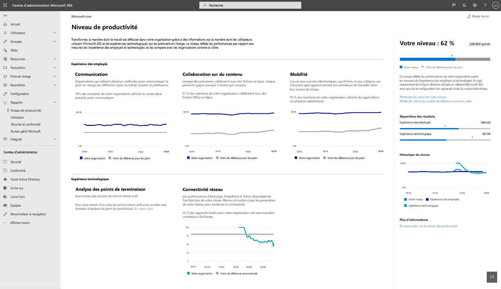

# Score de productivité Microsoft (aperçu)

Microsoft 365 propose des solutions de productivité qui permettent à votre organisation de respecter ses objectifs métiers. Score de productivité fournit des informations sur l’utilisation de ces solutions que vous pouvez transformer en mode d’exécution du travail.Il contient : 

- La **visibilité** en les aidant à comprendre comment les personnes travaillent sous la forme de leur score actuel avec une répartition entre les différentes catégories d’expériences des employés et de technologie (bientôt disponible). 
- **Insights** permettant d’identifier les opportunités pour améliorer les expériences. 
- **Actions** permettant de mettre à jour les compétences et les systèmes de sorte que tout le monde puisse faire son travail. 

Le score et les informations sont présents dans deux catégories :  

- **Expérience de l’employé :** explique comment Microsoft 365 contribue à la création d’un personnel productif et engagé en quantifiant la collaboration entre les utilisateurs sur le contenu, le travail n’importe où en maîtrisant les styles de communication (bientôt disponible) et en développant une culture de réunion (bientôt disponible). 

- **Expérience technologique** (bientôt disponible) : vous aide à optimiser les expériences des appareils, telles que la correction proactive des problèmes courants du service d’assistance et l’amélioration des temps de démarrage des PC et de votre réseau pour garantir le bon fonctionnement de vos applications.  

## Mode de fonctionnement

### Zones de notation 

Dans chaque catégorie de score, le score de productivité fournit des informations sur votre transformation de travail sur plusieurs zones. Les domaines couverts par l’expérience des employés sont les suivants :

- Collaboration sur le contenu  
- Utilisation de n’importe où 
- Présentation des styles de communication (bientôt disponible) 
- Développement d’une culture de réunion (bientôt disponible) 

### Évaluation des actions utilisateur 

Dans chaque domaine, nous mesurons les actions clés basées sur la recherche qui représentent les moyens de travail permettant aux organisations de transformer l’organisation hautement productive. Pour chaque zone, nous calculons le% des utilisateurs qui effectuent ces actions au cours des 28 derniers jours. 

Le score de l’expérience de l’employé est organisée comme un score moyen pour toutes les zones. Notez que nous allons continuer à ajouter des zones à l’expérience de l’employé et à l’expérience technologique au fil du temps. 

### Produits inclus dans le score de productivité 

La note de productivité inclut actuellement des signaux de la clé Microsoft 365 charges de travail OneDrive, SharePoint, Word, Excel, PowerPoint, OneNote, Outlook, Yammer, teams, Skype. 

Votre score est mis à jour quotidiennement et reflète les actions de l’utilisateur effectuées au cours des 28 derniers jours (y compris la date en cours).

## Autorisations d’accès et requises 

Pour l’expérience de l’employé, vous devez disposer d’un abonnement à un plan Office 365 pour les entreprises ou à un plan d’entreprise Microsoft 365 avec plusieurs utilisateurs. 

Pour avoir l’autorisation d’accéder à la note de productivité Microsoft, vous devez disposer des rôles suivants : 

- Administrateur global 
- Administrateurs Exchange 
- Administrateurs SharePoint 
- Administrateurs Skype Entreprise 
- Administrateur Teams 
- Lecteur général 
- Lecteur de rapports 

Vous pouvez accéder à l’expérience utilisateur à partir de la maison d’administration de Microsoft 365 en sélectionnant **rapports** > **productivité score** dans le volet de navigation de gauche.

## Interprétation de la note de productivité 

### En savoir plus sur le fonctionnement de votre organisation 

la page d’accueil des scores de productivité indique le score actuel et l’historique en pourcentage, les informations principales concernant les zones de chaque catégorie de score, complétées par les tests d’évaluation. 

1. la**note de productivité** est indiquée en pourcentage, ainsi que dans le <numerator> / <denominator> format, afin que vous puissiez également voir vos points absolus (numérateur) et les points les plus possibles.  
1. Ce tableau croisé dynamique vous permet de sélectionner la catégorie de score que vous souhaitez mettre en évidence. Dans l’aperçu, vous pouvez uniquement afficher l’expérience de l' **employé**, mais la sélection sera bientôt développée afin d’inclure l' **expérience technologique**. 
1. **Évaluation de l’homologue** vous permet de comparer votre score actuel avec des organisations comme vous. La mesure de test est calculée en tant que moyenne des mesures au sein d’un ensemble d’organisations similaires. L’ensemble est composé d’organisations qui ont le même nombre d’utilisateurs activés, de régions, des types de licences que vous possédez, de l’industrie et de leur usage dans Microsoft 365 ou Office 365. 
1. La section **catégories de score** fournit une répartition de votre score de productivité avec des benchmarks par catégorie.
1. **L’historique des scores** indique comment le score de chaque catégorie a été déplacé au cours des 6 derniers mois.
1. Le premier aperçu de la **collaboration sur le contenu** indique les mesures pertinentes avec des tests d’évaluation de cette zone qui contribuent au score. Sélectionnez **afficher les détails** pour afficher la page des détails de la zone.
1. Le principal aperçu de l' **utilisation de Anywhere** indique les mesures pertinentes avec des tests d’évaluation de cette zone qui contribuent au score. Sélectionnez **afficher les détails** pour afficher la page des détails de la zone.  

### Insights pour identifier les opportunités d’amélioration des expériences 

Pour chaque zone, sélectionnez **afficher les détails** dans la page principale vue d’ensemble pour afficher les détails de la zone qui affiche des informations supplémentaires, des recherches connexes et des actions pour améliorer votre score. .

Toutes les pages de détails de zone suivent la structure suivante : 

- En haut à gauche : connaissances principales conservées sur la page d’accueil.
- En bas à gauche : prise en charge des informations contextuelles.  
- Right : recherche académique illustrant la relation entre la zone et la productivité.

De plus, toutes les informations contiennent les éléments suivants : 

- En-tête : éléments clés de la touche ou des résultats suivis pour chaque vue ;
- Résumé : Expliquez pourquoi les mesures de l’analyse sont importantes pour la productivité de votre organisation. 
- Visualisation des données : quantifie visuellement la position de votre organisation en ce qui concerne les mesures en vue de l’analyse avec les benchmarks, selon le cas.
- Actions : action contextuelle qui peut aider à augmenter davantage les résultats souhaités par le biais de la fonction Insight et donc améliorer votre score.

### Page de détails de la zone : collaboration sur le contenu 

La page collaboration sur le contenu contient l’analyse principale de la page d’accueil des scores de productivité. Il comporte les composants suivants :

1. En-tête : quantifie le pourcentage d’utilisateurs collaborant sur le contenu (résultat clé).
1. Body : plus d’informations sur l’augmentation de la collaboration pour augmenter la productivité.
1. Visualisation : cela quantifie visuellement chaque élément qui contribue à la note de cette zone avec des benchmarks :

    - **Lecteurs**: quantifie les utilisateurs qui accèdent à des fichiers ou les téléchargent sur le Cloud (OneDrive et SharePoint) au sein d’une base de OneDrive et des utilisateurs à extension de SharePoint.
    - **Auteurs**: quantifie les utilisateurs qui modifient, chargent, synchronisent, archivent, copient ou déplacent des fichiers dans le Cloud (Onedrive et SharePoint) dans une base d’utilisateurs de OneDrive et de SharePoint.
    - **Collaborateurs**: quantifie les utilisateurs collaborant sur des fichiers sur le Cloud (OneDrive et SharePoint) au sein d’une base de onedrive et des utilisateurs à extension de SharePoint. Deux utilisateurs sont des collaborateurs qui lisent ou modifient un document Word, Excel, PowerPoint, OneNote ou un document Cloud PDF après l’autre créé ou modifié dans une fenêtre de 28 jours.

1. **Pourquoi elle** présente un résumé de la collaboration sur la collaboration sur les fichiers Cloud avec la productivité. **Lisez la recherche de Forrester** sur un article de recherche qui fournit davantage de contexte sur la façon dont la collaboration est favorable à l’augmentation de la productivité.
1. La prise en charge de la **collaboration sur plusieurs fichiers** quantifie la façon dont les utilisateurs de votre organisation collaborent dans différents fichiers. 
1. Prise en charge du **partage des fichiers Cloud** QUANTIFIES si les utilisateurs partagent du contenu sur le Cloud tout en dessinant une distinction entre le partage interne et externe.
1. Prise en charge des **fichiers Cloud de messagerie** les quantificateurs si les utilisateurs qui partagent des fichiers par courrier électronique utilisent des pièces jointes et des liens vers des fichiers Cloud.

Les types de fichiers pris en compte pour la collaboration sont Word/Excel/PowerPoint/OneNote/PDF.

### Page des détails de la zone : utilisation de n’importe où 

La page Working Anywhere quantifie les utilisateurs (sous la forme d’un pourcentage et de la valeur absolue) qui ont utilisé au moins une application de productivité sur deux ou plusieurs plateformes, qui sont des ordinateurs de bureau, des appareils mobiles et des sites Web. Les utilisateurs bénéficient d’un score plus élevé pour l’utilisation de plusieurs applications et plateformes. Les applications prises en compte sont Outlook, teams, Word, Excel, PowerPoint, OneNote, Yammer, Skype. La base du Insight est les utilisateurs activés pour Office 365 ProPlus, Exchange, Yammer, Skype ou Teams.

1. **Pourquoi elle** fournit un résumé de la recherche de la relation entre plusieurs plateformes et une meilleure productivité. **Lisez la recherche de Forrester** sur un article de recherche qui fournit davantage de contexte sur le fonctionnement de l’ensemble de la productivité.
1. La prise en charge de la fonction de **courrier électronique n'** est pas quantifiée du nombre d’utilisateurs de votre organisation à l’aide d’Outlook sur les plateformes de base des utilisateurs actifs sur Outlook.
1. La prise en charge de la **conversation sur n’importe quel** degré quantifie la façon dont les utilisateurs de votre organisation utilisent teams sur les plateformes de base d’utilisateurs actifs sur Teams.
1. Prise en charge de l' **accès aux documents Office Anywhere** quantifie la façon dont les utilisateurs de votre organisation utilisent Word, Excel, PowerPoint et OneNote sur les plateformes de base des utilisateurs actifs sur Word, Excel, PowerPoint ou OneNote.

### Actions pour les compétences et les systèmes de mise à jour 

Afin de promouvoir une action complémentaire, chaque vue d’ensemble de la prise en charge est fournie avec des actions inline qui peuvent vous aider à transformer votre expérience d’employé dont certaines peuvent être des modifications de configuration ou des campagnes de sensibilisation. Si vous cliquez sur ces appels, les appels à l’action s’ouvrent dans les options de panneau actions recommandées que vous pouvez envisager. Actuellement, les actions de **collaboration sur le contenu** sont activées.

1. Les **actions d’affichage** mènent à un volet répertoriant toutes les actions liées à la collaboration sur le contenu.
1. **Encouragez les utilisateurs à participer** à une liste de vidéos pédagogiques sur la collaboration avec des rubriques telles que la co-création et la @mentions. 
1. Personnaliser les paramètres de **partage externe** permet d’accéder à une page présentant une vue d’ensemble du partage externe décrivant ce qui se passe lorsque les utilisateurs partagent, en fonction de ce qu’ils partagent et avec qui.  
1. **Remplacer les pièces jointes par les liens partagés** : permet d’accéder à une page expliquant comment partager des liens OneDrive au lieu de pièces jointes par courrier électronique pour une meilleure collaboration.

La sélection de l’un des boutons d’action ouvre le volet **actions recommandé** sur la droite, qui contient un résumé de chaque action et un lien vers les pages de documentation.

## Nous souhaitons être informés 

Nous souhaitons utiliser le programme de préversion privé pour glaner des commentaires et utiliser les apprentissages pour co-créer le produit lors de votre transfert. Vous pouvez utiliser les sections de **Commentaires** dans le produit et/ou accéder à l’équipe de score de productivité sur ProductivityScorePreview@service.microsoft.com.

Pour demander l’accès à l’aperçu privé, remplissez le formulaire https://aka.ms/productivityscorepreview.  
