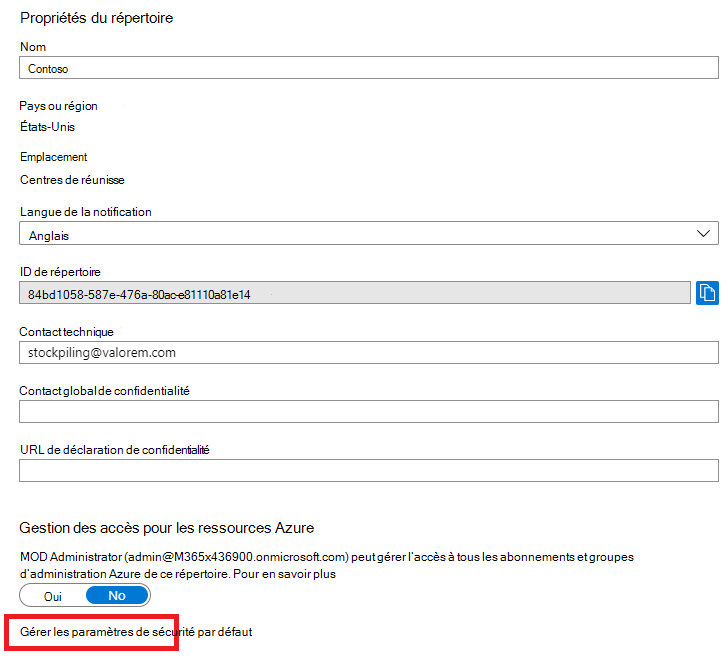
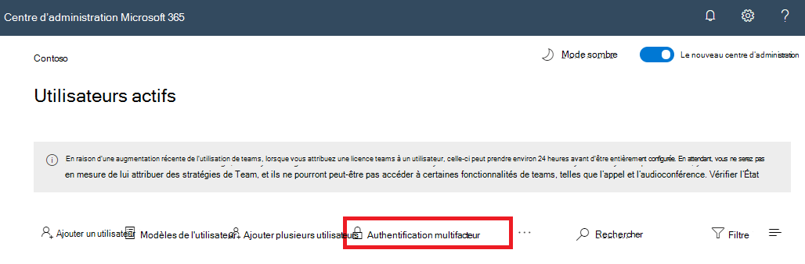

# Authentification multifacteur pour Microsoft 365

Les mots de passe sont la méthode la plus courante d’authentification d’une connectez-vous à un ordinateur ou un service en ligne, mais ils sont également les plus vulnérables. Les utilisateurs peuvent choisir des mots de passe simples et utiliser les mêmes mots de passe pour plusieurs connecteurs à différents ordinateurs et services.

Pour fournir un niveau de sécurité supplémentaire pour les sign-ins, vous devez utiliser l’authentification multifacteur (MFA), qui utilise à la fois un mot de passe, qui doit être fort, et une méthode de vérification supplémentaire basée sur :

- Ce que vous avez avec vous n’est pas facilement dupliqué, par exemple un smartphone.
- Quelque chose que vous avez de manière unique et err ment, par exemple vos empreintes digitales, votre visage ou tout autre attribut biométrique.

La méthode de vérification supplémentaire n’est utilisée qu’après la vérification du mot de passe de l’utilisateur. Avec l' portable, même si un mot de passe utilisateur fort est compromis, l’attaquant ne peut pas avoir votre smartphone ou votre empreinte digitale pour terminer la signature.

## Prise en charge de l’mf dans Microsoft 365

Par défaut, les deux Microsoft 365 et Office 365 l’famf pour les comptes d’utilisateur à l’aide des paramètres :

- Message texte envoyé à un téléphone qui oblige l’utilisateur à taper un code de vérification.
- Appel téléphonique.
- Application Microsoft Authenticator smartphone.

Dans les deux cas, la sign-in MFA utilise la méthode « Quelque chose que vous avez avec vous qui n’est pas facilement dupliqué » pour la vérification supplémentaire. Il existe plusieurs façons d’activer l' multi-facteur pour Microsoft 365 et Office 365 :

- Avec les paramètres de sécurité par défaut
- Avec des stratégies d’accès conditionnel
- Pour chaque compte d’utilisateur individuel (non recommandé)

Ces méthodes sont basées sur Microsoft 365 plan.

|Planification|Recommandation|Type de client|
|---|---|---|
|Toutes les Microsoft 365 plan|Utilisez les paramètres de sécurité par défaut, qui requièrent l’famf pour tous les comptes d’utilisateurs. 
 Vous pouvez également configurer l’mf par utilisateur sur des comptes d’utilisateur individuels, mais cela n’est pas recommandé.|Petite entreprise|
|Microsoft 365 Business Premium 
 Microsoft 365 E3 
 Azure Active Directory (Azure AD) Premium licences P1|Utilisez des stratégies d’accès conditionnel pour exiger une mf pour les comptes d’utilisateur en fonction de l’appartenance au groupe, des applications ou d’autres critères.|Petite entreprise à entreprise|
|Microsoft 365 E5 
 Azure AD Premium P2 licences|Utilisez Azure AD Identity Protection pour exiger une mffa en fonction des critères de risque de la signature.|Entreprise|
||||

### Paramètres de sécurité par défaut

Les paramètres de sécurité par défaut sont une nouvelle fonctionnalité pour Microsoft 365 et les abonnements Office 365 payants ou en version d’évaluation créés après le 21 octobre 2019. Ces abonnements ont des paramètres de sécurité par défaut, qui :

- Exige que tous vos utilisateurs utilisent l’famf avec l’Microsoft Authenticator app.
- Bloque l’authentification héritée.

Les utilisateurs disposent de 14 jours pour s’inscrire à l’authentification multifacteur de l’application Microsoft Authenticator sur leur smartphone, un délai qui commence dès la première connexion suivant l’activation des paramètres de sécurité par défaut. Lorsque les 14 jours sont écoulés, l’utilisateur ne peut pas se connecter tant que son inscription à l’authentification multifacteur n’est pas terminée.

Les paramètres de sécurité par défaut garantissent que toutes les organisations ont un niveau de sécurité de base qui est activé par défaut pour la connexion des utilisateurs. Vous pouvez désactiver les paramètres de sécurité par défaut au profit de l’mfmf avec les stratégies d’accès conditionnel.

Vous activez ou désactivez les paramètres de sécurité par défaut dans le volet **Propriétés** d’Azure AD dans le portail Azure.

Vous pouvez utiliser les paramètres de sécurité par défaut avec n’importe Microsoft 365 plan.

Pour plus d’informations, voir[Vue d’ensemble des paramètres de sécurité par défaut](/azure/active-directory/fundamentals/concept-fundamentals-security-defaults).

### Stratégies d’accès conditionnel

Les stratégies d’accès conditionnel sont un groupe de règles qui spécifient les conditions dans lesquelles les connexions sont évaluées et autorisées. Par exemple, vous pouvez créer une stratégie d’accès conditionnel qui indique :

- Si le nom du compte d’utilisateur concerne membre d’un groupe d’utilisateurs bénéficiant des rôles d’administrateur Exchange, utilisateur, mot de passe, sécurité, SharePoint ou global, exigez l’authentification multifacteur avant d’autoriser l’accès.

Cette stratégie vous permet de demander une authentification multifacteur basée sur l’appartenance au groupe, plutôt que d’essayer de configurer des comptes d’utilisateur individuels pour l’authentification multifacteur lorsqu’ils sont attribués ou non à des rôles d’administrateur.

Vous pouvez également utiliser des stratégies d’accès conditionnel pour des fonctionnalités plus avancées, telles que l’obligation d’une mf pour des applications spécifiques ou l’exécution de la connectez-vous à partir d’un appareil conforme, tel que votre ordinateur portable exécutant Windows 10.

Vous configurez les stratégies d’accès conditionnel à partir du **volet** Sécurité d’Azure AD dans le portail Azure.

Vous pouvez utiliser des stratégies d’accès conditionnel avec :

- Microsoft 365 Business Premium
- Microsoft 365 E3 et E5
- Azure AD Premium P1 et Azure AD Premium P2 licences

Pour les petites entreprises Microsoft 365 Business Premium, vous pouvez facilement utiliser des stratégies d’accès conditionnel en suivant les étapes suivantes :

1. Créez un groupe pour contenir les comptes d’utilisateur qui requièrent l’mf.
2. Activez la **stratégie Exiger l’mf pour les administrateurs** globaux.
3. Créez une stratégie d’accès conditionnel basée sur les groupes avec les paramètres ci-après :
    - Affectations > utilisateurs et groupes : nom de votre groupe de l’étape 1 ci-dessus.
    - Affectations > actions ou applications cloud : toutes les applications cloud.
    - Les contrôles d’accès > accorder > accorder l’accès > nécessite une authentification multifacteur.
4. Activez la stratégie.
5. Ajoutez un compte d’utilisateur au groupe créé à l’étape 1 ci-dessus et testez.
6. Pour exiger une mf pour des comptes d’utilisateurs supplémentaires, ajoutez-les au groupe créé à l’étape 1.

Cette stratégie d’accès conditionnel vous permet de déployer l’exigence de l’mfmf à vos utilisateurs à votre propre rythme.

Les entreprises doivent utiliser [des stratégies d’accès conditionnel courantes](/azure/active-directory/conditional-access/concept-conditional-access-policy-common) pour configurer les stratégies suivantes :

- [Exiger l’authentification multifacteur pour les administrateurs](/azure/active-directory/conditional-access/howto-conditional-access-policy-admin-mfa)
- [Exiger l’authentification multifacteur pour tous les utilisateurs](/azure/active-directory/conditional-access/howto-conditional-access-policy-all-users-mfa)
- [Bloquer l’authentification héritée](/azure/active-directory/conditional-access/howto-conditional-access-policy-block-legacy)

Si vous souhaitez en savoir plus, consultez [Présentation de l’accès conditionnel](/azure/active-directory/conditional-access/overview).

### Azure AD Identity Protection

Avec Azure AD Identity Protection, vous pouvez créer une stratégie d’accès conditionnel supplémentaire pour exiger l' approbation de la MFA lorsque le risque de se connecte [est moyen ou élevé.](../../security/office-365-security/identity-access-policies.md#require-mfa-based-on-sign-in-risk)

Vous pouvez utiliser Azure AD Identity Protection et les stratégies d’accès conditionnel basées sur les risques avec :

- Microsoft 365 E5
- Azure AD Premium P2 licences

Si vous souhaitez en savoir plus, consultez la page [Présentation de Azure AD Identity Protection](/azure/active-directory/identity-protection/overview-identity-protection).

### MFA héritée par utilisateur (non recommandé)

Vous devez utiliser les paramètres de sécurité par défaut ou les stratégies d’accès conditionnel pour exiger l' approbation de compte d’utilisateur pour les connecteurs de votre compte d’utilisateur. Toutefois, si l’un de ces éléments ne peut pas être utilisé, Microsoft recommande vivement l’mfmf pour les comptes d’utilisateurs qui ont des rôles d’administrateur, en particulier le rôle d’administrateur général, pour tout abonnement de taille.

Vous activez l’mf pour  les comptes d’utilisateur individuels à partir du volet Utilisateurs actifs du Centre d’administration Microsoft 365.

Une fois activé, la prochaine fois que l’utilisateur se sera inscrit, il sera invité à s’inscrire à l’mf et à choisir et tester la méthode de vérification supplémentaire.

### Utilisation combinée des méthodes

Ce tableau présente les résultats de l’activation de l’authentification multifacteur avec les paramètres de sécurité par défaut, les stratégies d’accès conditionnel et les paramètres de compte par utilisateur.

|*Élément*|Activé|Désactivé|Méthode d'authentification secondaire|
|---|---|---|---|
|**Paramètres de sécurité par défaut**|Ne peut pas utiliser les stratégies d’accès conditionnel|Peut utiliser les stratégies d’accès conditionnel|Application Microsoft Authenticator|
|**Stratégies d’accès conditionnel**|Si des paramètres sont activés, vous ne pouvez pas activer les paramètres de sécurité par défaut|Si tous ces éléments sont désactivés, vous pouvez activer les paramètres de sécurité par défaut|Utilisateur spécifié lors de l’inscription à l’authentification multifacteur|
|**MFA héritée par utilisateur (non recommandé)**|Remplace les paramètres de sécurité par défaut et les stratégies d’accès conditionnel nécessitant l’ation MFA à chaque signature|Overridden by security defaults and Conditional Access policies|Utilisateur spécifié lors de l’inscription à l’authentification multifacteur|
||||

Si les paramètres de sécurité par défaut sont activés, tous les nouveaux utilisateurs sont invités à s’inscrire à l’mf et à utiliser l’application Microsoft Authenticator lors de leur prochaine ouverture de contrat.

## Méthodes de gestion des paramètres mfa

Il existe deux façons de gérer les paramètres mfa.

Dans le portail Azure, vous pouvez :

- Activer et désactiver les paramètres de sécurité par défaut
- Configurer des stratégies d’accès conditionnel

Dans la Centre d’administration Microsoft 365, vous pouvez configurer les <a href="https://go.microsoft.com/fwlink/p/?linkid=2169174" target="_blank">paramètres MFA</a>par utilisateur et service.

## Prochaines étapes

[Configurer l’ment MFA pour Microsoft 365](set-up-multi-factor-authentication.md)

## Contenu connexe

[Activer l’authentification multi-facteurs](../../business-video/turn-on-mfa.md) (vidéo)\
[Activer l’authentification multi-facteurs sur votre téléphone](../../business-video/set-up-mfa.md) (vidéo)