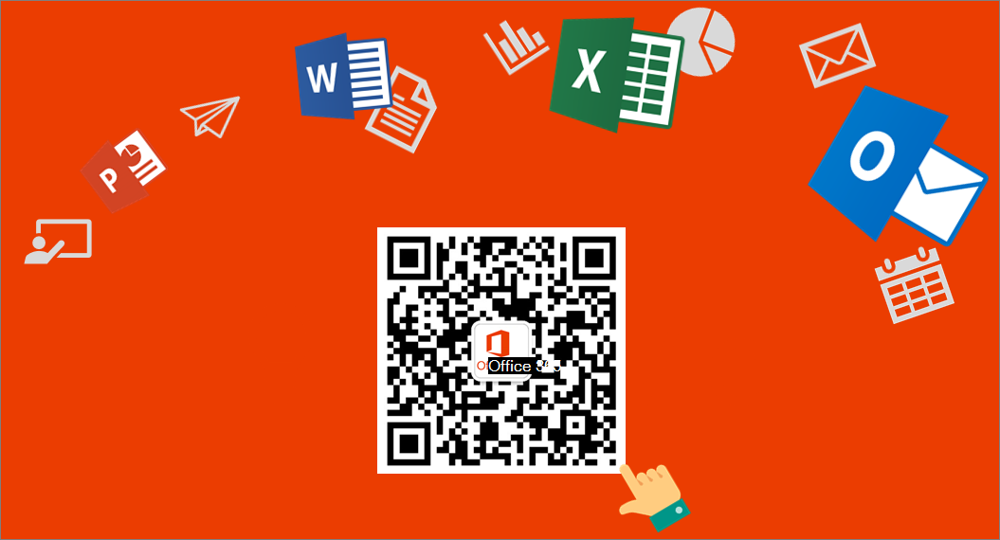

# Office 365 géré par 21Vianet

Office 365 géré par 21Vianet est conçu pour répondre aux besoins de services cloud sécurisés, fiables et évolutifs en Chine. Ce service fonctionne avec la technologie pour laquelle Microsoft a octroyé une licence à 21Vianet.
  
Microsoft n’utilise pas le service lui-même. 21Vianet fonctionne, fournit et gère la livraison du service. 21Vianet est le plus grand fournisseur de services de centre de données Internet neutre pour les opérateurs en Chine, fournissant des services d’hébergement, de réseau géré et d’infrastructure cloud computing. En accordant des licences aux technologies Microsoft, 21Vianet exploite des centres de données Office 365 locaux pour vous offrir la possibilité d’utiliser les services Office 365 tout en conservant vos données en Chine. 21Vianet fournit également vos services d’abonnement et de facturation, ainsi qu’un support.
  
> [!NOTE]
> Ces services sont soumis au droit chinois. 
  
 **Suivez-nous sur WeChat**
  
Scannez ce QR code pour suivre les discussions sur WeChat et obtenir les dernières mises à jour pour Office 365 géré par 21Vianet. 
  

  
 **À propos des services Office 365 gérés par 21Vianet**
  
Les sections ci-dessous mettent en évidence les différences pour chaque service. En fin de compte, notre objectif est d’atteindre la parité avec les services globaux. Toutefois, en raison de la nature unique des services en Chine (gérés par un partenaire de centres de données en Chine), certaines fonctionnalités n’ont pas encore été activées. Au fil du temps, les clients bénéficieront des fonctionnalités complètes. Pour obtenir une analyse plus détaillée des services disponibles pour chaque plan Office 365 géré par 21Vianet, consultez la description Office 365 [service.](/office365/servicedescriptions/office-365-platform-service-description/office-365-operated-by-21vianet)
  
    
Si vous souhaitez découvrir comment commencer avec les services d’Office 365 général, consultez [La mise en place.](../admin-overview/get-started-with-office-365.md)
  
## Suite Office 365

|||
|:-----|:-----|
|Domaines personnalisés    |Les administrateurs peuvent créer et/ou utiliser des domaines personnalisés enregistrés par le biais de fournisseurs de domaines spécifiques au chinois. Si vous n’avez pas de  domaine personnalisé, vous pouvez acheter un nom de domaine auprès d’un bureau d’enregistrement de noms de domaine. Si vous en avez déjà un, [recherchez votre bureau d’enregistrement de domaines ou votre fournisseur d’hébergement DNS.](../get-help-with-domains/find-your-domain-registrar.md)    En outre, si vous créez un site web public à l’aide du service Office 365 SharePoint Online, la stratégie de conformité Internet en Chine exige que vous receviez un numéro de fournisseur de contenu Internet (ICP).  **Remarque :** La validation automatique des mots non valides dans les noms de domaine personnalisés n’est pas disponible.           |
|Support technique, sur les abonnements et la facturation    |Fourni par 21Vianet. Pour plus d’informations sur la façon de contacter le support technique, consultez [la Office 365 contacter le support technique pour les entreprises.](../../business-video/get-help-support.md)    |
|Réinitialisation du mot de passe en libre-service    |Disponible uniquement pour les administrateurs. Pour plus d’informations, voir Modifier ou réinitialiser votre mot de [passe dans Office 365 géré par 21Vianet.](https://support.microsoft.com/office/d8eb5b62-9d0e-4267-a9bf-2aa491ee6d0b)    |
|Sécurité, confidentialité, conformité et détails sur les niveaux de support    |Fourni par 21Vianet.    |
|Office Configuration du bureau    |Office de bureau n’est pas disponible pour Office 2010 et Office 2007. Toutefois, les administrateurs peuvent configurer les applications Office bureau actuelles [pour qu’elles fonctionnent avec Office 365](https://support.microsoft.com/office/85646aba-7e6c-4e24-a047-8fd9ce4f9d2e).    |
|Prise en charge des appareils et des appareils mobiles\*    | Les fonctionnalités mobiles suivantes seront bientôt disponible :     Gestion des périphériques mobiles (MDM)     Blackberry Business Cloud Services (BBCS) n’est pas disponible, mais vous pouvez utiliser des appareils Exchange ActiveSync ou une offre de Research in Motion (RIM, la solution de messagerie sans fil BlackBerry) pour exécuter Blackberry Enterprise Server (BES).     Pour plus d’informations sur la prise en charge mobile, voir [Configurer et gérer l’accès mobile pour vos utilisateurs.](https://support.microsoft.com/office/01fff219-4492-40f2-82d3-fd2ffc0ad802)    |
|Office Lens    |Non disponible.    |
|Microsoft Planner    |À venir.    |
|Microsoft Teams    |Non disponible.    |
|Sway    |À venir.    |
|Aide dans plusieurs langues    |L’aide est disponible en chinois simplifié et en anglais uniquement.    |
|Community’aide fournie    |Community’aide fournie n’est pas encore disponible, mais vous pouvez sélectionner le bouton Aide ( **?** ) dans le coin supérieur droit de votre portail pour consulter les articles d’aide.    |
   
\*Services facultatifs fournis directement par Microsoft et soumis aux conditions d’utilisation et déclarations de confidentialité de Microsoft.
  
## SharePoint Online

|||
|:-----|:-----|
|Partage d’un document, d’une bibliothèque ou d’un site par courrier électronique avec une personne extérieure à votre organisation    |Cette fonctionnalité est disponible, mais par défaut, son utilisation pourrait rendre les fichiers partagés accessibles à l’extérieur de votre pays. Administrators do have the ability to turn it on, but will get a warning message indicating that it could make files shared accessible outside of your country. Les utilisateurs qui tentent de partager avec une personne extérieure à l’organisation recevront également un avertissement. Pour plus d’informations, [voir Partager SharePoint fichiers ou dossiers dans Office 365](https://support.microsoft.com/office/1fe37332-0f9a-4719-970e-d2578da4941c).    |
|Access Services    |Access 2013 est pris en charge, mais l’ajout de nouvelles applications Access risque de ne pas être disponible, car cette fonctionnalité sera retirée de Office 365 et SharePoint Online. La création d’applications web Access et de bases de données web Access dans Office 365 et SharePoint Online ne commence plus en juin 2017 et les autres applications web et bases de données web restantes d’avril 2018. En outre, la fonctionnalité Access 2010 n’est pas prise en charge et toute tentative d’utilisation d’une base de données Access 2010 entraîne des erreurs et peut entraîner une perte de données.    |
|Microsoft PowerApps    |À venir.    |
|Gestion des droits relatifs à l'information (IRM)    |La possibilité de définir des fonctionnalités IRM SharePoint pour votre organisation sera bientôt disponible.    |
|Possibilité de traduire du texte ou des pages    |Disponible, mais éteint par défaut. Les administrateurs clients peuvent activer cette possibilité, mais le service cloud de traduction peut se trouver à l’extérieur de votre pays. Si vous ne souhaitez pas que les utilisateurs envoient du contenu à un service cloud de traduction, vous pouvez désactiver ces fonctionnalités.    |
|Inscription ICP du site web public    |La stratégie de conformité Internet en Chine exige que vous receviez un numéro de fournisseur de contenu Internet (ICP) pour votre site web public.  |
|Fonctionnalités de site web public    |Les sites web publics sont disponibles uniquement si vous avez acheté Office 365 avant le 9 mars 2015. Toutefois, Bing cartes, le partage externe et les commentaires ne sont pas disponibles dans un site web public, car ces fonctionnalités peuvent envoyer des données à l’extérieur de votre pays.    |
|Newsfeed et Yammer (réseaux sociaux d’entreprise)    |Le newsfeed (le hub social où vous verrez les mises à jour des personnes, documents, sites et balises que vous êtes en train de suivre) est disponible. Yammer est indisponible.    |
|Applications auto-hosted    |Vous pouvez déployer une application hébergée par un fournisseur qui utilise SharePoint et SQL Azure. Pour plus d’informations, voir [Créer une application hébergée](/sharepoint/dev/sp-add-ins/get-started-creating-provider-hosted-sharepoint-add-ins)par un fournisseur de base pour SharePoint . La possibilité pour les développeurs de déployer une application qui utilise un site web auto-happé sera bientôt disponible.    |
|InfoPath    |Non disponible.    |
|SharePoint Store    |Les Office et SharePoint App Store sont des services facultatifs gérés par Microsoft Corporation ou ses affiliés de l’une des installations mondiales de Microsoft. Les applications disponibles dans le Windows Store sont fournies par différents éditeurs d’applications et sont soumises aux conditions générales et à la déclaration de confidentialité de l’éditeur de l’application. Votre utilisation de l’une de ces applications peut entraîner le transfert, le stockage ou le traitement de vos données dans n’importe quel pays où l’éditeur d’application, ses affiliés ou ses fournisseurs de services conservent des installations. Veuillez lire attentivement les conditions d'utilisation et les déclarations de confidentialité fournies par l'éditeur des applications avant de télécharger et d'utiliser ces dernières.    |
|Office 365 Site du développeur : publier dans SharePoint Store à l’aide du tableau de bord vendeur\*    |Découvrez les conditions [requises pour la](/office/dev/store/submit-sharepoint-add-ins-for-office-365-operated-by-21vianet-in-china) soumission d’applications pour SharePoint distribution aux utilisateurs de Office 365 gérés par 21Vianet.    |
   
\*Services facultatifs fournis directement par Microsoft et soumis aux conditions d’utilisation et déclarations de confidentialité de Microsoft.
  
## Outlook Web App

|||
|:-----|:-----|
|Blackberry Business Cloud Services (BBCS)    |Non disponible, mais vous pouvez utiliser des appareils Exchange ActiveSync ou une offre de Research in Motion (RIM, la solution de messagerie sans fil BlackBerry) pour exécuter Blackberry Enterprise Server (BES).    |
|Gestion des droits relatifs à l’information    |À venir.    |
|Informations de libre/occupé    |Des informations de libre/occupé entre les boîtes aux lettres Exchange Online sur site et les boîtes aux lettres sont disponibles.    |
|Partage de votre calendrier    |Le partage de calendrier entre les boîtes aux lettres Exchange Online locaux et locaux est disponible.    |
|Partage de contacts    |À venir.    |
|Suivi des messages    |À venir.    |
|Applications    |À venir.    |
|Fonctionnalité Places    |Cette fonctionnalité affiche des cartes d’adresses dans le courrier électronique . étant donné qu’elle peut autoriser des données en dehors de votre pays, elle n’est pas disponible.    |
|Comptes connectés    |La connexion à d’autres comptes tels que Hotmail (Outlook.com) sera bientôt disponible.    |
   
## Exchange

 Nouveauté de la mise à jour cumulative 5 (CU5) de Exchange 2013, les déploiements hybrides complets entre les organisations Exchange 2013 locales et les services Office 365 sont désormais pris en charge. Tirant parti des nouvelles améliorations apportées à l’Assistant Configuration hybride, Exchange 2013 CU5 prend en charge les fonctionnalités hybrides suivantes entre vos organisations locale et Exchange Online locale :  

- Sécurisation du routage des messages entre l'organisation locale et l'organisation Exchange Online. 
- Routage des messages avec espace de noms de domaine partagé. Par exemple, l'organisation locale et l'organisation Exchange Online utilisent le domaine SMTP @contoso.com. 
- Liste d'adresses globale (LAG) unifiée, également appelée « carnet d'adresses partagé »  
- Partage de calendrier et de disponibilité entre l'organisation locale et l'organisation Exchange Online.  
- Contrôle centralisé du flux des messages entrants et sortants. Vous pouvez configurer tous les messages Exchange Online entrants et sortants pour qu'ils soient acheminés via l'organisation Exchange locale. 
- Une url Office Outlook Web App unique pour les organisations locales et Exchange Online locales.  
- Possibilité de déplacer des boîtes aux lettres locales existantes vers l'organisation Exchange Online. Les boîtes aux lettres Exchange Online peuvent être redéplacées vers l'organisation locale si nécessaire.  
- Gestion centralisée des boîtes aux lettres à l'aide du Centre d'administration Exchange (CAE) local.  
- Les mailTips, la prise en charge des photos HD pour Outlook contacts et la recherche dans plusieurs boîtes aux lettres entre les organisations locales et Exchange Online locales. 
- Archivage dans le cloud des messages pour les boîtes aux lettres Exchange locales. 

Pour les organisations exécutant des versions plus anciennes ou mixtes de Exchange Server, certaines fonctionnalités hybrides ne sont pas entièrement pris en charge pour les Office 365 hébergés par 21Vianet. Utilisez le tableau suivant pour en savoir plus sur la prise en charge des fonctionnalités hybrides dans différents scénarios Exchange déploiement :    

|**Version Exchange local**|**Exchange Version du serveur hybride**|**Assistant Configuration hybride pris en charge ?**|**Fonctionnalités hybrides prise en charge**|
|:-----|:-----|:-----|:-----|
| 2016    | N/D    | Oui    | Tous    |
| CU5 2013    | N/D    | Oui    | Tous    |
| 2013 SP1    | CU5 2013    | Oui    | Tous    |
| 2013 SP1    | 2013 SP1    | Oui    | Tous    |
| Mixed 2013 SP1/2010 SP3    | CU5 2013    | Oui    | Tous, à l’exception de la découverte électronique/archivage sur place, OWA’accès (voir le tableau ci-dessous)    |
| Mixed 2013 SP1/2010 SP3    | 2013 SP1    | Oui    | Uniquement configuré manuellement la libre/occupé(s)    |
| 2010 SP3    | 2010 SP3    | Non    | Aucun    |
| 2007    | CU5 2013    | Oui    | Libre/occupé uniquement    |
| 2007    | 2013 SP1 ou 2010 SP3No    | N/A    | Non prise en charge    |
| 2003    | 2013 SP1/CU5    | N/A    | Non prise en charge    |
| 2003    | 2010 SP3    | Non    | Aucun    |

   
> [!IMPORTANT]
>  L’accès délégué au calendrier, lorsqu’un utilisateur ou un ensemble d’utilisateurs reçoit l’accès au calendrier d’un autre utilisateur, n’est pas pris en charge dans les déploiements hybrides avec des clients Office 365 hébergés par 21Vianet. 
  
 En outre, certaines fonctionnalités de Exchange de messagerie et de conformité ne sont pas entièrement pris en charge dans les déploiements hybrides avec des Office 365 hébergés par 21Vianet. Ces fonctionnalités incluent notamment :

- [Gestion des enregistrements de messagerie (MRM)](/exchange/security-and-compliance/messaging-records-management/messaging-records-management) 
- [Découverte électronique locale](/exchange/security-and-compliance/in-place-ediscovery/in-place-ediscovery) 
- [In-Place Hold](/exchange/security-and-compliance/in-place-and-litigation-holds) 
- [Archivage local](/exchange/in-place-archiving-in-exchange-2013-exchange-2013-help)
- [Audit de boîte aux lettres](/exchange/security-and-compliance/exchange-auditing-reports/exchange-auditing-reports)
- Accès aux archives en ligne [avec Outlook Web App (OWA)](/exchange/clients-and-mobile-in-exchange-online/outlook-on-the-web/outlook-on-the-web) 

Utilisez le tableau suivant pour en savoir plus sur la prise en charge des fonctionnalités dans différents Exchange de déploiement : 

|**Version Exchange local**|**MRM (archivage fractioné)**|**OWA’accès (archive fractionner)**|**Découverte électronique locale**|**Audit de boîte aux lettres**|**Archive/archive sur place**|
|:-----|:-----|:-----|:-----|:-----|:-----|
| Toutes les cu5 2013    | Pris en charge    | Non pris en charge    | Pris en charge    | Pris en charge    | Pris en charge   |
| Tous les 2010 SP3    | Non pris en charge    | Non pris en charge    | Priseen charge 1   | Pris en charge    | Pris en charge    |
| Au moins un serveur de la cu5 d’avant 2013    | Prisen charge 2   | Non pris en charge    | Non pris en charge   | Pris en charge    | Pris en charge   |
|||

1 Des recherches distinctes sont requises pour les boîtes aux lettres Exchange Online et sur site.    2 stratégies de déplacement vers l’archive MRM peuvent être utilisées pour les boîtes aux lettres situées sur un serveur Exchange CU5 2013 ou supérieur. 

Pour en savoir plus sur la configuration d’un déploiement hybride avec des Office 365 hébergés par 21Vianet, consultez les rubriques suivantes : 
- [Conditions préalables au déploiement hybride](/exchange/hybrid-deployment-prerequisites)
- [Conditions requises pour les certificats pour les déploiements hybrides](/exchange/certificate-requirements) 
- [Créer un déploiement hybride avec l’Assistant Configuration hybride](/exchange/hybrid-deployment/deploy-hybrid)

> [!IMPORTANT]
>  [L’Assistant](https://go.microsoft.com/fwlink/?LinkId=506768) déploiement Exchange Server est un outil web gratuit qui vous permet de configurer un déploiement hybride entre votre organisation sur site et Office 365, ou de migrer complètement vers Office 365. L'outil vous pose une petite série de questions simples, puis, en fonction de vos réponses, crée une liste de contrôle personnalisée avec des instructions pour configurer votre déploiement hybride. Nous vous recommandons vivement d’utiliser l’Assistant Déploiement pour configurer un déploiement hybride. > Pour les organisations qui ne souhaitent pas mettre à niveau vers ou ajouter des serveurs EXCHANGE 2013 CU5, les organisations Exchange 2013 SP1 peuvent configurer le partage de la libre/occupé du calendrier partagé entre leurs organisations locales et Exchange Online. Pour configurer cette fonctionnalité de déploiement hybride, voir [Configuring Exchange hybrid deployment features with Office 365 operated by 21Vianet](https://support.microsoft.com/office/26e7cc26-c980-4cc5-a082-c333de544b6d). 

|||  
|---|---|
|Coexistence et partage des informations de libre/occupé|Le partage d’informations de libre/occupé de calendrier entre deux ou plusieurs organisations Exchange locales ou le partage entre deux locataires Office 365 21Vianet n’est pas pris en charge. Cette fonctionnalité sera bientôt disponible ! | 
|Partage de calendrier|Exchange 2013 SP1 et plus prend en charge la configuration manuelle du partage de calendriers Internet avec d’autres organisations Exchange ou Exchange Online locales. Pour plus d’informations sur la configuration manuelle de cette fonctionnalité, voir [Activer la publication de calendriers Internet.](/exchange/enable-internet-calendar-publishing-exchange-2013-help) | 
Partage Exchange données de contact sur les appareils mobiles Apple sur Apple iCloud. |Ce paramètre/fonctionnalité est activé par défaut. Les administrateurs doivent désactiver cette fonctionnalité pour empêcher les utilisateurs de partager des Exchange externes à votre organisation. |
|Exchange Hosted Email Encryption  |Non disponible.  |
|Chiffrement de messages Office 365  |À venir.  |
   
## Office

|||
|:-----|:-----|
|Ouvrez une application Office à partir de **l’ouverture** \> **de fichier dans**... Bouton    |Disponible. La possibilité de le faire lors de l’itinérance sera bientôt disponible.    |
|Enregistrer dans OneDrive Entreprise lors de la signature avec un compte Microsoft    |Pour conserver vos données dans votre pays, vous ne pouvez pas enregistrer un document sur le site de votre organisation (OneDrive Entreprise) lorsque vous êtes Office avec un compte Microsoft.    |
|Possibilité de traduire du texte ou des pages    |Cette fonctionnalité est disponible, mais est éteinte par défaut. Les administrateurs ont la possibilité de l’activer, mais obtiennent un message d’avertissement indiquant qu’il pourrait rendre les données accessibles à l’extérieur de votre pays.    |
   
## Client Office

|||
|:-----|:-----|
|Gérer le compte (à partir du client Office client)    |Cette fonctionnalité, ainsi que d’autres fonctionnalités telles que celle qui sont destinées à être dirigés vers votre portail Office 365, pointe actuellement vers le portail Office 365 mondial et vous ne pouvez pas vous connectez avec votre compte Office 365 géré par 21Vianet. Il s’agit d’un problème connu en cours de correction. En attendant, vous pouvez utiliser l’URL pour vous inscrire à votre compte et gérer https://portal.partner.microsoftonline.cn/ les paramètres à partir de là. Pour plus d’informations, [voir Gérer Applications Microsoft 365 pour les grandes entreprises compte Office 365 géré par 21Vianet.](https://support.microsoft.com/office/fbe473d3-69de-4d0c-aecb-b9c2d0d45bc8)    |
   
## OneNote

|||
|:-----|:-----|
|Insérer et lire une vidéo en ligne    |Non disponible.    |
|Intégration du volet de recherche aux services Bing recherche    |Non disponible.    |
|Vérification de l’accessibilité    |Non disponible.    |
|Bloc-notes de classe    |Non disponible.    |
|Formulaires    |Non disponible.    |
|Lecteur immersif    |Non disponible.    |
|Insérer une image en ligne    |Non disponible.    |
|Détails de la réunion    |Non disponible.    |
|Recherche    |Non disponible.    |
|Autocollants    |Non disponible.    |
|Live Search (possibilité de rechercher dans des blocs-notes en ligne qui ne sont pas ouverts dans le client)    |Non disponible.    |
|Intégration avec le service de recherche intelligente de plateforme iOS et Mac    |Non disponible.    |
|Partager une expérience de bloc-notes et une notification de partage    |Non disponible.    |
   
## Skype Entreprise

|||
|:-----|:-----|
|Fournisseurs de domaines à prendre en charge Skype Entreprise    |Vous devez inscrire votre domaine auprès d’un fournisseur de domaine chinois qui prend en charge les enregistrements SRV. Pour plus d’informations sur l’enregistrement des domaines, voir Rechercher votre bureau d’enregistrement de domaines ou votre fournisseur [d’hébergement DNS.](../get-help-with-domains/find-your-domain-registrar.md)    |
|Conférence rendez-vous (possibilité d’ajouter un accès téléphonique aux réunions pour les utilisateurs qui ne peuvent pas accéder à un ordinateur)    |Vous pouvez voir des options dans Skype Entreprise et dans le Centre d’administration Skype Entreprise pour les conférences rendez-vous et les fournisseurs, mais ces fonctionnalités ne sont pas encore disponibles. Ils seront bientôt disponible.    |
|Skype Entreprise de bureau    |Vous trouverez de l’aide pour Skype Entreprise bureau [ici.](https://support.microsoft.com/office/6ae5853c-f0fd-4710-aecf-f46def8377ad) Toutefois, l’aide du Bureau n’est pas disponible à partir du produit, sauf si vous utilisez Office en un clic.    |
|Lync 2010    |Non disponible.    |
|Possibilité de participer à une réunion à partir de votre calendrier lorsque vous utilisez un appareil basé sur Samsung avec Google Chrome    |À venir. En attendant, vous pouvez ouvrir Skype Entreprise, passer à l’affichage Réunions et participer à la réunion à partir de là.    |
|Appareils Téléphone bureau tels que Polycom, Ares et Tanjay    |Non disponible.    |
|Partenaires de syndication    |Non disponible.    |
|Fonctionnalités vocales, telles que la messagerie vocale, la capacité à effectuer et recevoir des appels à partir de numéros PSTN, le transfert d’appels, le transfert d’appel    |Non disponible. Ces fonctionnalités nécessitent des partenaires de syndication.    |
|Archivage ou possibilité de baliser un utilisateur et d’archiver ses e-mails et ses messages Exchange    |Non disponible.    |
|Skype Entreprise Prise en charge du navigateur client web (LWA) pour Firefox 29    |Non disponible, mais vous pouvez utiliser une version antérieure de Firefox.    |
|Magasin de contacts unifié (UCS)    |La possibilité pour les utilisateurs de conserver toutes leurs informations Skype Entreprise contact dans Microsoft Exchange Server 2013 est désactivée.    |
| Périphériques de conférence :     Station de conférence unifiée Polycom CX5100     Logitech ConferenceCam CC3000e     Polycom CX7000     Polycom CX3000     Logitech BCC950 ConferenceCam     Polycom CX5000 HD    |Non disponible.    |
   
## Demandes des personnes responsables des données concernant le R GDPR

Le R GDPR accorde à des personnes (ou à des personnes ayant des données) certains droits en relation avec le traitement de leurs données personnelles, notamment le droit de corriger des données inexactes, d’effacer des données ou de restreindre leur traitement, de recevoir leurs données et de répondre à une demande de transmission de leurs données à un autre contrôleur. Le rôle Administrateur client pour Office 365 géré par 21Vianet peut demander des données au nom d’une personne objet de données des manières suivantes :
  
- À l’Azure Active Directory du centre d’administration, un administrateur client peut supprimer définitivement une Azure Active Directory données et les services associés.
    
- Les journaux générés par le système services Microsoft gérés par 21Vianet peuvent être exportés par les administrateurs clients à l’aide de l’exportation des journaux de données.
    
Pour plus d’informations et d’instructions, voir Demandes des personnes qui ont des données [(DSR) concernant le R GDPR.](https://www.trustcenter.cn/privacy/gdpr-office365.mdl)

## Contenu associé

[Essayer ou acheter un abonnement Microsoft 365 entreprise](../../commerce/try-or-buy-microsoft-365.md) (article)\
[Prise en charge d’Azure Information Protection Office 365 géré par 21Vianet](parity-between-azure-information-protection.md) (article)\
[Consulter votre facture ou obtenir un Fapiao](../../commerce/billing-and-payments/view-your-bill-or-invoice.md) (article)