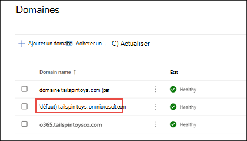

# Ajouter un domaine à Microsoft 365

 **[Consultez les Forums aux questions sur les domaines](domains-faq.yml)** si vous ne trouvez pas ce que vous recherchez.

Consultez l'[aide de Microsoft 365 petite entreprise](https://go.microsoft.com/fwlink/?linkid=2197659) sur YouTube.
  
## Avant de commencer

Pour ajouter, modifier ou supprimer des domaines, vous **devez** être **administrateur de domaine** ou **administrateur général** d’un [plan d'affaires ou d'entreprise](https://products.office.com/business/office). Ces modifications affectent l’ensemble du locataire ; *les administrateurs personnalisés* ou *utilisateurs réguliers* ne pourront pas apporter ces modifications.

> [!TIP]
> Si vous avez besoin d’aide pour suivre les étapes de cette rubrique, envisagez de [collaborer avec un spécialiste des petites entreprises Microsoft](https://go.microsoft.com/fwlink/?linkid=2186871). Avec Aide aux entreprises, vos employés et vous avez accès 24 heures sur 24 aux spécialistes des petites entreprises à mesure que vous développez votre entreprise, de l’intégration à l’utilisation quotidienne.

## Regarder : Ajouter un domaine

Regardez cette vidéo ainsi que d’autres sur notre [chaîne YouTube](https://go.microsoft.com/fwlink/?linkid=2198213).

> [!VIDEO https://www.microsoft.com/videoplayer/embed/RE4dN8c?autoplay=false]

Votre entreprise peut avoir besoin de plusieurs noms de domaine à des fins différentes. Par exemple, vous pouvez ajouter une orthographe différente du nom de votre entreprise, car les clients l’utilisent déjà et leurs communications n’ont pas pu vous joindre.

1. Dans le Centre d’administration Microsoft 365, choisissez <a href="https://go.microsoft.com/fwlink/p/?linkid=2171997" target="_blank">**Configuration**</a>.
1. Sous **Configurer votre domaine personnalisé**, sélectionnez **Afficher** > **Gérer** > **Ajouter un domaine.**
1. Entrez le nouveau nom de domaine à ajouter, puis sélectionnez **Suivant**.
1. Connectez-vous à votre bureau d’enregistrement de domaines, puis sélectionnez **Suivant**.
1. Choisissez les services de votre nouveau domaine.
1. Sélectionnez **Suivant** > **Autoriser** > **Suivant**, puis **Terminer**. Votre nouveau domaine a été ajouté.

## Ajouter un domaine

Suivez ces étapes pour ajouter, configurer ou poursuivre la configuration d’un domaine. 

::: moniker range="o365-worldwide"

1. Accédez au Centre d’administration à l’adresse <a href="https://go.microsoft.com/fwlink/p/?linkid=2024339" target="_blank">https://admin.microsoft.com</a>.

::: moniker-end

::: moniker range="o365-21vianet"

1. Accédez au Centre d’administration à l’adresse <a href="https://go.microsoft.com/fwlink/p/?linkid=850627" target="_blank">https://portal.partner.microsoftonline.cn</a>.

::: moniker-end
    
2. Accédez à la page **Paramètres** > **domaines**. 

3. Sélectionnez **Ajouter un domaine**.
    
4. Entrez le nom du domaine à ajouter, puis sélectionnez **Suivant**.
    
5. Choisissez comment vous voulez vérifier que vous êtes propriétaire du domaine.
    
    1. Si votre bureau d’enregistrement de domaines utilise [Domain Connect](#domain-connect-registrars-integrating-with-microsoft-365), Microsoft [configure automatiquement vos enregistrements](../get-help-with-domains/domain-connect.md) en vous demandant de vous connecter à votre bureau d’enregistrement et de confirmer la connexion à Microsoft 365. Vous serez renvoyé au Centre d’administration et Microsoft vérifiera ensuite automatiquement votre domaine.
    2. Vous pouvez utiliser un enregistrement TXT pour vérifier votre domaine. Sélectionnez cette option et sélectionnez **Suivant** pour voir les instructions permettant d’ajouter cet enregistrement DNS au site web de votre bureau d’enregistrement. La vérification peut prendre jusqu’à 30 minutes après l’ajout de l’enregistrement. 
    3. Vous pouvez ajouter un fichier texte au site web de votre domaine. Sélectionnez et téléchargez le fichier .txt à partir de l’Assistant Installation, puis chargez le fichier dans le dossier de niveau supérieur de votre site web. Le chemin d’accès au fichier doit ressembler à : `http://mydomain.com/ms39978200.txt`. Nous confirmerons que vous êtes le propriétaire du domaine en recherchant le fichier sur votre site web.
    
6. Choisissez la façon dont vous souhaitez apporter les modifications DNS requises pour que Microsoft utilise votre domaine.
    
    1. Choisissez **Ajouter les enregistrements DNS pour moi** si votre bureau d’enregistrement prend en charge [Domain Connect](#domain-connect-registrars-integrating-with-microsoft-365) et que Microsoft [configurera automatiquement vos enregistrements](../get-help-with-domains/domain-connect.md) en vous connectant à votre bureau d’enregistrement et en confirmant la connexion à Microsoft 365.
    2. Choisissez **J’ajouterai moi-même les enregistrements DNS** si vous souhaitez joindre uniquement des services Microsoft 365 spécifiques à votre domaine ou si vous souhaitez ignorer cette option pour le moment et le faire ultérieurement. **Choisissez cette option si vous savez exactement ce que vous faites.**

7. Si vous avez choisi d'*ajouter des enregistrements DNS vous-même*, sélectionnez **Suivant** et vous verrez une page contenant tous les enregistrements que vous devez ajouter à votre site web de bureaux d’enregistrement pour configurer votre domaine. 

    Si le portail ne reconnaît pas votre bureau d'enregistrement, vous pouvez [suivre ces instructions générales](../get-help-with-domains/create-dns-records-at-any-dns-hosting-provider.md).
    
    Si vous ne connaissez pas le fournisseur d'hébergement DNS ou le bureau d'enregistrement pour votre domaine, voir [Rechercher mon bureau d'enregistrement de domaines ou mon fournisseur d'hébergement DNS](../get-help-with-domains/find-your-domain-registrar.md).
    
    Si vous souhaitez attendre plus tard, désélectionnez tous les services et cliquez sur **Continuer** ou, à l’étape de connexion de domaine précédente, choisissez **Autres options** et sélectionnez **Ignorer pour l’instant**.
    
8. Sélectionnez **Terminer**. Vous avez terminé !

## Ajouter ou modifier des enregistrements DNS personnalisés

Suivez les étapes ci-dessous pour ajouter un enregistrement personnalisé pour un site web ou un service tiers.

1. Connectez-vous au Centre d’administration Microsoft à <a href="https://go.microsoft.com/fwlink/p/?linkid=2024339" target="_blank">https://admin.microsoft.com</a>.

2. Accédez à la page **Paramètres**  > **Domaines**.

3. Dans la page **Domaines**, sélectionnez un domaine. 
    
4. Sous **Paramètres DNS**, sélectionnez **Enregistrements personnalisés**; puis sélectionnez **Nouvel enregistrement personnalisé**.

5. Sélectionnez le type d’enregistrement DNS que vous souhaitez ajouter et tapez les informations du nouvel enregistrement.
    
6. Sélectionnez **Enregistrer**.

## Bureaux d’enregistrement avec Domain Connect

[Domain Connect](https://www.domainconnect.org/) permet aux bureaux d’enregistrement activés d’ajouter votre domaine à Microsoft 365 dans un processus en trois étapes qui prend quelques minutes. 
  
Dans l’Assistant, nous allons simplement confirmer que vous êtes le propriétaire du domaine, puis configurer automatiquement les enregistrements de votre domaine. Par conséquent, le courrier électronique est envoyé à Microsoft 365 et à d’autres services Microsoft 365, tels que Teams, qui utilisent votre domaine.
  
> [!NOTE]
> Veillez à désactiver les bloqueurs de fenêtres contextuelles dans votre navigateur avant de démarrer l'Assistant de configuration.
  
### Bureaux d’enregistrement Domain Connect s’intégrant à Microsoft 365

- [11&amp; IONOS](https://www.1and1.com/)
- [EuroDNS](https://www.eurodns.com/)
- [Cloudflare](https://www.cloudflare.com/)
- [GoDaddy](https://www.godaddy.com/)
- [WordPress.com](https://wordpress.com/)
- [Plesk](https://www.plesk.com/)
- [MediaTemple](https://mediatemple.net/)
- SecureServer ou WildGbDomains (revendeurs GoDaddy utilisant l’hébergement DNS SecureServer)
    - Exemples :
        - [DomainsPricedRight](https://www.domainspricedright.com/products/domain-registration)
        - [DomainRightNow](https://www.domainrightnow.com/)

### Qu’advient-il de mon courrier et de mon site web ?

Une fois l’installation terminée, l’enregistrement MX de votre domaine est mis à jour pour pointer vers Microsoft 365 et tous les e-mails de votre domaine commenceront à arriver à Microsoft 365. Assurez-vous que vous avez ajouté des utilisateurs et configuré des boîtes aux lettres dans Microsoft 365 pour toutes les personnes qui obtiennent des e-mails sur votre domaine !
  
Si vous disposez d’un site web que vous utilisez avec votre entreprise, il continuera à fonctionner où il se trouve. Les étapes d’installation de Domain Connect n’affectent pas votre site web.

### Ajouter un domaine onmicrosoft.com

Chaque organisation Microsoft 365 peut avoir jusqu’à cinq domaines onmicrosoft.com.

> [!NOTE]
> Vous devez être administrateur général ou administrateur de nom de domaine pour ajouter un domaine.
> La création d’un domaine .onmicrosoft supplémentaire et son utilisation par défaut n’entraînent pas de changement de nom pour SharePoint Online. Pour apporter des modifications à votre domaine SharePoint .onmicrosoft, vous devez utiliser l’[ aperçu du changement de nom de domaine SharePoint](/sharepoint/change-your-sharepoint-domain-name) (actuellement disponible pour tout locataire disposant de moins de 1 000 sites).
> Si vous utilisez les services de messagerie Microsoft 365, la suppression de votre domaine .onmicrosoft initial n’est pas prise en charge.

Pour ajouter un domaine onmicrosoft.com :

1. Dans le Centre d'administration Microsoft 365, sélectionnez **Paramètres**, puis **Domaines**.

2. Sélectionnez un domaine *.onmicrosoft.com* existant.

    
  

3. Sous l’onglet **Vue d’ensemble** , sélectionnez **Ajouter le domaine onmicrosoft.com**.

    

4. Dans la page **Ajouter un domaine onmicrosoft** , dans la zone **Nom de domaine** , entrez le nom de votre nouveau domaine onmicrosoft.com. 

    

    > [!NOTE]
    > Veillez à vérifier l’orthographe et la précision du nom de domaine que vous avez entré. Vous êtes limité à cinq domaines onmicrosoft.com et ne peuvent pas être supprimés une fois créés.     

5. Sélectionnez **Ajouter un domaine**. Une fois l’ajout réussi, vous verrez un message indiquant cela. 
    
    

Vous pouvez définir n’importe quel domaine que vous possédez comme domaine par défaut. 

Pour plus d’informations sur l’ajout d’un domaine onmicrosoft.com, consultez [Ajouter ou remplacer votre domaine onmicrosoft.com](add-or-replace-your-onmicrosoftcom-domain.md).

## Contenu associé

[FAQ sur les domaines](domains-faq.yml) (article) 
[Qu’est-ce qu’un domaine ?](../get-help-with-domains/what-is-a-domain.md) (article) 
[Acheter un nom de domaine dans Microsoft 365](../get-help-with-domains/buy-a-domain-name.md) (article) 
[Ajouter des enregistrements DNS pour connecter votre domaine](../get-help-with-domains/create-dns-records-at-any-dns-hosting-provider.md) (article) 
[Modifier les serveurs de noms de manière à configurer Microsoft 365 avec n'importe quel bureau d'enregistrement de domaines](../get-help-with-domains/change-nameservers-at-any-domain-registrar.md) (article)
