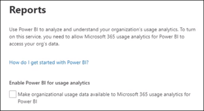

# Se connecter aux données Microsoft 365 Government Community Cloud (GCC) avec Usage Analytics

Utilisez les procédures suivantes pour vous connecter à vos données avec le rapport Analyse de l’utilisation de Microsoft 365 dans un locataire Microsoft 365 Government Community Cloud (GCC). 

> [!NOTE]
> Ces instructions s’adressent spécifiquement aux locataires Microsoft 365 GCC. 

## Avant de commencer

Pour configurer initialement Microsoft 365 Usage Analytics : 

- Vous devez être un administrateur général Microsoft 365 pour activer la collecte de données. 
- Vous avez besoin de [l’application Power BI Desktop](https://powerbi.microsoft.com/en-us/desktop/) pour utiliser le fichier de modèle. 
- Vous avez besoin d’une [licence Power BI Pro](https://go.microsoft.com/fwlink/p/?linkid=845347) ou d’une capacité Premium pour publier et afficher le rapport. 

## Étape 1 : Rendre les données de votre organisation disponibles pour le rapport Analyse de l’utilisation de Microsoft 365

1. Dans le Centre d'administration Microsoft 365, développez le menu de navigation, sélectionnez **Rapports**, puis **Utilisation**. 
2. Dans la page **Rapports d’utilisation** , dans la section Microsoft 365 Usage Analytics, sélectionnez **Prise en main**. 
3. Sous **Activer Power BI pour l’analyse de l’utilisation**, sélectionnez **Rendre les données d’utilisation organisationnelles disponibles pour l’analyse de l’utilisation de Microsoft pour Power BI**, puis **sélectionnez Enregistrer**.

     

    Cela démarre un processus pour rendre les données de votre organisation accessibles pour ce rapport, et vous verrez un message indiquant que **nous préparons vos données pour l’analytique de l’utilisation de Microsoft 365**. Notez que ce processus peut prendre 24 heures. 

4. Lorsque les données de votre organisation sont prêtes, l’actualisation de la page affiche un message indiquant que vos données sont désormais disponibles et indique également votre numéro **d’ID de locataire** . Vous devrez utiliser l’ID de locataire dans une étape ultérieure lorsque vous tenterez de vous connecter à vos données de locataire. 
 
     
 
    > [!IMPORTANT]
    > Lorsque vos données sont disponibles, ne sélectionnez pas **Accéder à Power BI**, ce qui vous amènera à la Place de marché Power BI.  L’application modèle pour ce rapport requise par les locataires GCC n’est pas disponible sur la Place de marché Power BI.  

## Étape 2 : Télécharger le modèle Power BI, se connecter à vos données et publier le rapport

Les utilisateurs de Microsoft 365 GCC peuvent télécharger et utiliser le fichier de modèle de rapport Microsoft 365 Usage Analytics pour se connecter à leurs données. Vous aurez besoin Power BI Desktop pour ouvrir et utiliser le fichier de modèle. 

 > [!NOTE]
 > Actuellement, une application modèle pour le rapport Microsoft 365 Usage Analytics n’est pas disponible pour les locataires GCC dans la Place de marché Power BI.  

1. Après avoir téléchargé le [modèle Power BI](https://download.microsoft.com/download/7/8/2/782ba8a7-8d89-4958-a315-dab04c3b620c/Microsoft%20365%20Usage%20Analytics.pbit), ouvrez-le à l’aide de Power BI Desktop. 
2. Lorsque vous êtes invité à entrer un **TenantID**, entrez l’ID de locataire que vous avez reçu lorsque vous avez préparé les données de votre organisation pour ce rapport à l’étape 1. Sélectionnez ensuite **Charger**. Le chargement de vos données prend plusieurs minutes. 

     

3. Une fois le chargement terminé, votre rapport s’affiche et vous verrez un résumé de vos données. 

     
 

4. Enregistrez vos modifications dans le rapport. 
5. Sélectionnez **Publier** dans le menu Power BI Desktop pour publier le rapport sur le service Power BI Online où il peut être consulté. Cela nécessite une licence Power BI Pro ou une capacité Power BI Premium. Dans le cadre du [processus de publication](/power-bi/create-reports/desktop-upload-desktop-files#to-publish-a-power-bi-desktop-dataset-and-reports), vous devez sélectionner une destination à publier dans un espace de travail disponible dans le service en ligne Power BI.

## Contenu associé

[À propos de l’Analyse de l’utilisation](usage-analytics.md)  
[Obtenir la dernière version d’analyse d’utilisation](get-the-latest-version-of-usage-analytics.md)  
[Naviguer et utiliser les rapports dans Microsoft 365 analyse de l’utilisation](navigate-and-utilize-reports.md)  