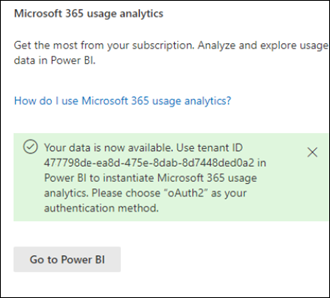

# Connecter données Microsoft 365 Cloud de la communauté du secteur public (Cloud de la communauté du secteur public) avec l’analyse de l’utilisation

Utilisez les procédures suivantes pour vous connecter à vos données à l’Microsoft 365 De l’analyse de l’utilisation dans un client Microsoft 365 Cloud de la communauté du secteur public (Cloud de la communauté du secteur public). 

> [!NOTE]
> Ces instructions sont spécifiquement pour Microsoft 365 Cloud de la communauté du secteur public client. 

## Avant de commencer

Pour configurer initialement Microsoft 365 l’analyse de l’utilisation : 

- Vous devez être un administrateur Microsoft 365 pour activer la collecte de données. 
- L’application [Power BI Desktop](https://powerbi.microsoft.com/en-us/desktop/) utiliser le fichier modèle. 
- Vous avez besoin [d Power BI Pro licence ou](https://go.microsoft.com/fwlink/p/?linkid=845347) d Premium capacité maximale pour publier et afficher le rapport. 

## Étape 1 : rendre les données de votre organisation disponibles pour le rapport d’analyse Microsoft 365'utilisation

1. Dans la Centre d’administration Microsoft 365, développez le menu de navigation, sélectionnez **Rapports,** puis **Sélectionnez Utilisation.** 
2. Dans la page **Rapports d’utilisation,** dans la section Analyse Microsoft 365'utilisation, sélectionnez **Prise en main**. 
3. Sous **Activer Power BI’analyse** de l’utilisation, sélectionnez Rendre les données d’utilisation organisationnelles disponibles pour l’analyse de l’utilisation **de Microsoft Power BI,** puis sélectionnez **Enregistrer.**

     

    Cela lance un processus pour rendre les données de votre organisation accessibles pour ce rapport, et vous verrez un message indiquant que vos données sont prêtes pour **l’analyse de l Microsoft 365'utilisation.** Notez que ce processus peut prendre 24 heures. 

4. Lorsque les données de votre organisation sont prêtes, l’actualisation de la page affiche un message indiquant que vos données sont désormais disponibles et indique également votre **numéro d’ID** de client. Vous devrez utiliser l’ID de client dans une étape ultérieure lorsque vous tenterez de vous connecter à vos données client. 
 
     
 
    > [!IMPORTANT]
    > Lorsque vos données sont disponibles, ne sélectionnez pas **Power BI,** qui vous permet d’Power BI Marketplace.  L’application de modèle pour ce rapport requise par Cloud de la communauté du secteur public client n’est pas disponible sur Power BI Marketplace.  

## Étape 2 : Télécharger le modèle Power BI, vous connecter à vos données et publier le rapport

Microsoft 365 Cloud de la communauté du secteur public utilisateurs peuvent télécharger et utiliser le Microsoft 365 de rapport Analyse de l’utilisation pour se connecter à leurs données. Vous devrez Power BI Desktop ouvrir et utiliser le fichier modèle. 

 > [!NOTE]
 > Actuellement, une application de modèle pour le rapport Microsoft 365 l’analyse de l’utilisation n’est pas disponible pour Cloud de la communauté du secteur public clients dans Power BI Marketplace.  

1. Après avoir téléchargé le [modèle Power BI,](https://download.microsoft.com/download/7/8/2/782ba8a7-8d89-4958-a315-dab04c3b620c/Microsoft%20365%20Usage%20Analytics.pbit)ouvrez-le à l’aide Power BI Desktop. 
2. Lorsque vous êtes invité à entrer un **TenantID,** entrez l’ID de locataire que vous avez reçu lorsque vous avez préparé les données de votre organisation pour ce rapport à l’étape 1. Ensuite, **sélectionnez Charger**. Le chargement de vos données prendra plusieurs minutes. 

     

3. Une fois le chargement terminé, votre rapport s’affiche et un résumé de vos données s’affiche. 

     
 

4. Enregistrez vos modifications dans le rapport. 
5. **Sélectionnez** Publier dans le menu Power BI Desktop pour publier le rapport dans le service Power BI Online où il peut être vu. Cela nécessite une licence Power BI Pro ou une Power BI Premium capacité maximale. Dans le cadre [du](/power-bi/create-reports/desktop-upload-desktop-files#to-publish-a-power-bi-desktop-dataset-and-reports)processus de publication, vous devez sélectionner une destination à publier dans un espace de travail disponible dans le service Power BI Online.

## Contenu connexe

[À propos de l’Analyse de l’utilisation](usage-analytics.md)  
[Obtenir la dernière version d’analyse d’utilisation](get-the-latest-version-of-usage-analytics.md)  
[Naviguer et utiliser les rapports dans Microsoft 365 analyse de l’utilisation](navigate-and-utilize-reports.md)  