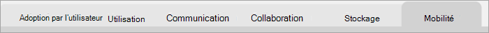

# Naviguer et utiliser les rapports dans Microsoft 365 analyse de l’utilisation

Le tableau de bord vous offre un aperçu rapide des principaux indicateurs d'utilisation et d'adoption. En sélectionnant les mesures de niveau supérieur, vous pouvez accéder à des rapports qui fournissent plus de détails et d’informations. Chaque onglet de rapport contient des visualisations de données spécifiques à un aspect de l’utilisation et de l’adoption pour votre organisation. Les données collectées sont expliquées dans le titre de chaque rapport et une vignette apparaît qui contient des informations supplémentaires sur les visualisations sous l’onglet du rapport que vous affichez.

Pour commencer à utiliser vos rapports, voici quelques conseils :

- Utilisez les onglets de navigation sur la gauche ou sur une mesure associée dans la **page** Résumé exécutif pour accéder à chaque rapport de niveau supérieur.

    

- Utilisez les onglets de navigation en haut de chaque rapport de niveau supérieur pour accéder à différents rapports au sein de ce niveau.

    

- De nombreux rapports contiennent un slicer dans lequel vous pouvez filtrer le produit, l’attribut AAD ou l’activité que vous souhaitez afficher. Il peut s’y trouver à sélection unique ou à sélection multiple.

    

    

- Placez le curseur sur des points de données pour afficher une légende contenant des détails.

    

L’utilisateur qui a insséré l’application de modèle aura la possibilité de personnaliser le rapport en réponse à ses besoins. Pour personnaliser l’application de modèle :

- Sélectionnez **Modifier le** rapport en haut du rapport.

    

- Créez vos propres éléments visuels à l'aide des [jeux de données](usage-analytics-data-model.md) sous-jacents.

- Utilisez Power BI Desktop pour apporter vos propres sources de données.

Pour partager vos rapports, sélectionnez simplement le bouton partager  en haut de la page.

Pour découvrir comment personnaliser les rapports, voir Personnalisation des rapports dans [Microsoft 365'analyse de l’utilisation.](customize-reports.md)

Pour plus d'informations, consultez la documentation d'aide de Power BI :

- [Power BI concepts de base](/power-bi/service-basic-concepts)

    En savoir plus sur le tableau de bord, les jeux de données, les rapports et d’autres Power BI concepts.

- [Prise en main de Power BI](/power-bi/service-get-started?wt.mc_id=O365_Reports_PBI_contentpack)

    Découvrez les fonctionnalités de base de Power BI. Recherchez les liens disponibles sur l'utilisation de Power BI Desktop.

- [Partager des tableaux de bord et des rapports](/power-bi/service-share-dashboards)

    Découvrez comment partager des rapports avec vos collègues ou des personnes extérieures à votre organisation. Vous pouvez également partager le rapport ou une version filtrée du rapport.