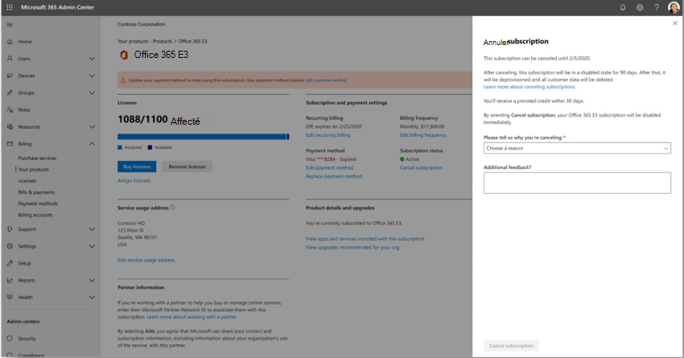
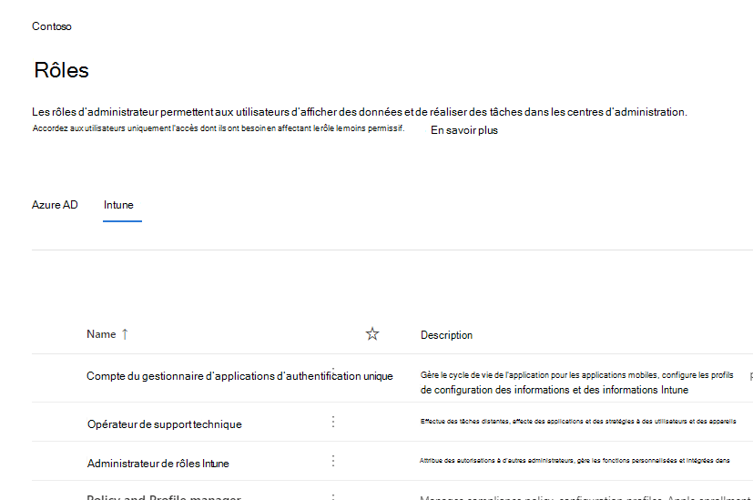

# Nouveautés du Centre d'administration Microsoft 365

::: moniker range="o365-21vianet"

> [!NOTE]
> Certaines des informations de cet article peuvent ne pas s'appliquer à Office 365 géré par 21Vianet.

::: moniker-end

Nous ajoutons en permanence de nouvelles fonctionnalités au Centre d'administration [Microsoft 365,](https://docs.microsoft.com/microsoft-365/business-video/admin-center-overview)corrigeons les problèmes que nous avons appris et apportant des modifications en fonction de vos commentaires. Consultez la vidéo ci-dessous pour voir ce qui est disponible pour vous aujourd'hui. Certaines fonctionnalités sont déployées à des vitesses différentes pour nos clients. Si vous ne voyez pas encore de fonctionnalité, essayez de vous [ajouter à la version ciblée.](manage/release-options-in-office-365.md)

Et si vous souhaitez savoir quelles sont les nouveautés des autres services cloud de Microsoft :

- [Nouveautés d'Azure Active Directory](/azure/active-directory/fundamentals/whats-new)
- [Nouveautés du Centre d'administration Exchange](/Exchange/whats-new)
- [Nouveautés de Microsoft Intune](/mem/intune/fundamentals/whats-new)
- [Nouveautés du Centre de conformité Microsoft 365](/Office365/SecurityCompliance/whats-new)
- [Nouveautés de Microsoft 365 Defender](../security/mtp/whats-new.md)
- [Nouveautés du Centre d'administration SharePoint](/sharepoint/what-s-new-in-admin-center)
- [Mises à jour Office](/OfficeUpdates/)
- [Comment vérifier l'état de publication de Windows](https://docs.microsoft.com/windows/deployment/update/check-release-health)

## Avril 2021

### Application mobile Admin

### Gérer les licences et les factures de l'application mobile Admin

- Vous pouvez désormais afficher toutes les licences disponibles et attribuées pour vos abonnements. Vous pouvez également attribuer ou supprimer des licences à des utilisateurs, et ajouter ou supprimer des licences.
- Vous pouvez désormais afficher des factures détaillées dans l'application.
- Ces mises à jour sont disponibles sur les appareils [Android](https://go.microsoft.com/fwlink/p/?linkid=2159786) [et iOS.](https://go.microsoft.com/fwlink/p/?linkid=2159787)

:::image type="content" source="../media/assign-license-mobile-app2.png" alt-text="Screenshot: Admin mobile app assign license page":::
:::image type="content" source="../media/license-screen-mobile-app2.png" alt-text="Screenshot: Admin mobile app screen with users and their licenses":::
:::image type="content" source="../media/invoice-summary-mobile-app.png" alt-text="Screenshot: Admin mobile app invoice summary page":::

### Flux du Centre de messages mis à jour dans l'application mobile Admin

- Vous avez désormais une expérience de lecture plus flexible du flux centre de messages. Vous avez désormais la possibilité de filtrer les messages en fonction du service ou des balises et de marquer les messages comme favoris. Des actions en bloc pour marquer les messages comme lus, non lus ou archivés ont également été ajoutées.
- Ces mises à jour sont disponibles sur les appareils [Android](https://go.microsoft.com/fwlink/p/?linkid=2159786) [et iOS.](https://go.microsoft.com/fwlink/p/?linkid=2159787)

:::image type="content" source="../media/mc-feed-mobile-app.png" alt-text="Screenshot: Admin mobile app Message center feed page":::

## Ignite 2021 (mars)

Bienvenue dans Microsoft Ignite. Nous espérons que vous avez pu participer à certaines de nos sessions : [Microsoft Ignite 2021](https://myignite.microsoft.com/sessions). Voici quelques-uns des éléments dont nous avons parlé à Ignite.
> [!NOTE]
> Toutes les fonctionnalités ne seront pas disponibles immédiatement pour tout le monde. Si vous ne voyez pas les nouvelles fonctionnalités, [rejoignez la version ciblée.](manage/release-options-in-office-365.md)

### Centre de messages

Nous avons repensé le centre de messages pour vous aider à découvrir les messages pertinents et ajouté une expérience de lecture plus flexible. Nous avons ajouté une nouvelle colonne **Service** pour vous aider à analyser le service auquel s'applique un message et à filtrer les messages par service et d'autres métadonnées. Vous pouvez mettre un message en favori pour le marquer pour le suivi, choisir les colonnes qui apparaissent dans la liste des messages et naviguer entre les messages avec les boutons Retour et Suivant. Nous avons également amélioré le processus pour faciliter les commentaires sur les billets du centre de messages.

:::image type="content" source="../media/message-center.png" alt-text="Capture d'écran : page d'accueil du centre de messages affichant la boîte de réception et les messages":::

Pour en savoir plus sur les nouvelles fonctionnalités, consultez le [Centre de messages.](manage/message-center.md)

### Nouveautés

Nous avons apporté des améliorations à la façon dont vous affichez les fonctionnalités « Nouveautés » pour les utilisateurs dans les applications Office. Vous pouvez maintenant voir le contenu enrichi dans le nouveau volet Whats que vos utilisateurs peuvent voir. Vous pouvez également en savoir plus sur la fonctionnalité avant de décider d'en faire savoir à vos utilisateurs. Pour plus d'informations, [consultez Gérer les fonctionnalités Office qui apparaissent dans Nouveautés.](manage/show-hide-new-features.md)

:::image type="content" source="../media/power-bi-whats-new2.png" alt-text="Screenshot: Office apps what's new page showing improvements to Power BI":::

## Ignite 2020 (août & septembre)

Bienvenue dans Microsoft Ignite , notre premier Ignite en ligne uniquement. Nous espérons vous voir dans l'une de nos sessions : [Microsoft Ignite 2020 Session Catalog](https://myignite.microsoft.com/sessions). Voici quelques-uns des éléments dont nous parlerons à Ignite.
> [!NOTE]
> Toutes les fonctionnalités ne seront pas disponibles immédiatement pour tout le monde. Si vous ne voyez pas les nouvelles fonctionnalités, [rejoignez la version ciblée.](manage/release-options-in-office-365.md)

### Gestion multi-locataires

Nous avons développé un ensemble de fonctionnalités pour les administrateurs multi-locataires comme vous pour que votre travail soit effectué plus rapidement et plus efficacement. Pour plus d'informations, [voir Gérer plusieurs locataires.](multi-tenant/manage.md)

- **Vos locataires :** basculez rapidement entre les locataires que vous gérez.
- **Tous** les clients : nouvelle page où vous pouvez voir rapidement l'état de tous les services de vos clients, les demandes de service ouvertes, vos produits et facturation, les tâches de configuration recommandées et le nombre d'utilisateurs dans ce client.
- **Programme d'installation**: la page d'installation multi-locataires vous donne un affichage liste de la page d'installation, mais organisée pour de nombreux locataires. Vous pouvez voir quelles fonctionnalités ne sont pas désactivées, quelles tâches sont terminées pour tous les locataires, tâches que les locataires doivent encore effectuer. Cette vue vous aidera à effectuer le suivi de l'adoption des fonctionnalités et à vous assurer que les tâches de configuration de sécurité recommandées sont toujours réalisées.
- **État du** service : l'affichage d'état du service vous indique si des incidents ou des avis affectent les clients. Il vous indiquera même combien de vos locataires gérés sont affectés. Sélectionnez simplement un incident pour obtenir plus d'informations sous l'onglet Vue d'ensemble, puis basculez vers l'onglet Locataires affectés pour descendre et prendre en charge ce client.
- **Les migrations** de boîtes aux lettres entre clients sont un nouveau service, désormais en prévisualisation publique, qui vous permet de déplacer des boîtes aux lettres entre des clients sans avoir à retenter les boîtes aux lettres, puis à les intégrer. 
- **Partage de domaine entre** locataires : bientôt, vous pouvez rejoindre un aperçu privé pour les fonctionnalités qui vous permettent de partager un domaine entre plusieurs locataires. Par exemple, si Contoso acquiert Wingtip Toys, Contoso peut partager le domaine avec Wingtip Toys afin que les personnes des deux locataires peuvent utiliser « contoso.com » comme adresses de messagerie.

### Surveiller vos comptes les plus importants

Vous pouvez surveiller et suivre les messages électroniques ayant échoué ou différés envoyés à vos utilisateurs ayant un impact important sur l'entreprise, comme votre PDG. Vous pouvez suivre les comptes prioritaires en ajoutant des utilisateurs à votre liste de comptes prioritaires dans le Centre d'administration Microsoft 365. Ajoutez des cadres, des responsables, des responsables ou d'autres utilisateurs ayant accès à des informations sensibles ou prioritaires.

Les comptes de priorité sont disponibles uniquement pour les organisations qui répondent aux deux exigences suivantes :

- Office 365 E3 ou Microsoft 365 E3, office 365 E5 ou Microsoft 365 E5.
- Au moins 10 000 licences et au moins 50 utilisateurs Exchange Online actifs mensuels.

Il existe deux façons de commencer :

- Go to **Users**, and then in the « more actions » menu select **Manage priority accounts** to add users to the list.
- Go to **Setup,** find the setup task **Monitor your most important accounts,** and then select Get **started**.

Pour plus d'informations sur les comptes prioritaires, consultez [La surveillance des comptes de priorité.](./setup/priority-accounts.md)

### Recherchez plus rapidement et obtenez de meilleurs résultats à partir de n'importe quelle page

Nous avons commencé à déployer une nouvelle expérience de recherche pour le Centre d'administration et nous ne pouvons pas attendre que vous l'essayiez. 

- La zone de recherche a été déplacée vers la zone d'en-tête dans laquelle il est indiqué « Centre d'administration Microsoft 365 » pour que vous recherchez maintenant à partir de n'importe quelle page, et pas seulement de la page d'accueil. Nous avons même un raccourci : **Alt+S**.
- La recherche est plus intelligente et vous donne de meilleurs résultats, encore plus rapidement. Essayez de taper « 2fa » pour commencer.
- Les résultats de la recherche sont organisés selon le type d'élément ou d'action que vous pouvez effectuer.
  - **Utilisateurs**: sélectionnez le nom de l'utilisateur et vous pouvez le modifier directement ici. Si vous sélectionnez le menu « Autres actions » en plus de leur nom, vous pouvez réinitialiser leur mot de passe. Vous pouvez effectuer une recherche par nom d'affichage, nom, prénom, nom d'utilisateur ou adresse de messagerie principale et alias de messagerie. Toutefois, pour obtenir une correspondance exacte, recherchez par adresse de messagerie principale ou nom d'utilisateur.
  - **Groupes**: modifiez le groupe à partir de n'importe quelle page, ajoutez des membres, attribuez des propriétaires.
  - **Actions**: comme vous pouvez rechercher un utilisateur, puis réinitialiser son mot de passe, vous pouvez également rechercher « réinitialiser le mot de passe » à partir de n'importe quelle page, puis réinitialiser un ou plusieurs mots de passe pour les utilisateurs.
  - **Navigation**: les résultats sous Navigation peuvent rapidement vous aider à obtenir rapidement une page dans le Centre d'administration. Par exemple, la recherche de « rôles » vous permettra d'accès à la page Rôles pour les rôles Azure AD.
  - **Paramètres :** recherchez tous les paramètres liés à votre organisation, les services à qui vous vous abonnez, ainsi que les paramètres de sécurité et de confidentialité. 
  - **Domaines :** vous pouvez trouver des liens rapides vers vos domaines, puis le lien vous permet d'obtenir la page vue d'ensemble et d'état de ce domaine.
  - **Documentation**: si nous ne pouvons pas trouver de résultat pour vous, nous allons essayer de trouver de la documentation pour vous aider. Il faut un peu plus de temps pour que la liste organisée d'articles trouve une correspondance, donc patientez une seconde pour que la recherche trouve les résultats. 
  - **Commentaires**: Vous n'avez pas trouvé ce que vous recherchiez ? Envoyez-nous des commentaires à partir de la recherche. Nous allons ajouter des fonctionnalités de recherche pour plus de pages et d'autres fonctionnalités dans le Centre d'administration.

### Application mobile d'administration Microsoft 365

L'application mobile d'administration [Microsoft 365,](https://www.microsoft.com/microsoft-365/business/manage-office-365-admin-app)incluse dans votre abonnement, vous permet de gérer Microsoft 365 à partir de votre appareil mobile afin de pouvoir vous absent de votre bureau pour effectuer des tâches quotidiennes. En fait, l'application comporte plus de 90 fonctionnalités et nous venons d'en ajouter quelques-unes :

- Prise en charge des stratégies de gestion des applications mobiles et d'accès conditionnel de **Microsoft Intune**: vous pouvez désormais utiliser votre appareil personnel pour gérer Microsoft 365, même si votre organisation a désactivé les stratégies de gestion des applications mobiles et d'accès conditionnel d'Intune.
- **Notifications du centre de messages**: activer les notifications du centre de messages sur les notifications de paramètres si vous souhaitez être averti des nouveaux **billets** du centre  >   de messages. Par le biais de notifications, nous voulons vous assurer que vous restez informé des informations et des événements importants au sein de votre client.
- **Alertes de facturation**: vous pouvez également activer les notifications de facturation à l'adresse **Settings** Notifications si vous souhaitez obtenir des notifications de facturation sur votre appareil si un abonnement est sur le point d'expirer.  >  
- **Mode sombre**: bienvenue sur le côté sombre de l'application mobile. Il s'agissait de l'une de nos fonctionnalités les plus demandées. Go to **Settings**  >  **Themes** to turn it on.
- **Signalez un problème**: vous pouvez maintenant signaler un problème dans l'application ou afficher les problèmes signalés par d'autres administrateurs. Visitez **l'état du** service pour l'consulter.

### Recommandations d'utilisation pour les petites et moyennes entreprises

Les petites et moyennes entreprises peuvent obtenir une recommandation sur la **page** d'accueil si certaines personnes de l'organisation n'utilisent pas activement teams, OneDrive ou les applications Office. Lorsque vous affichez la recommandation, vous pouvez rapidement envoyer un e-mail de formation Microsoft aux utilisateurs inactifs pour les aider à démarrer avec l'application et vous assurer que vous obtenez la valeur complète de vos abonnements.

### Collection de travail à distance

En octobre, nous allons ajouter une collection de travail à distance pour aider les propriétaires des petites entreprises et leurs employés à se mettre en ligne et à travailler à distance.  **La configuration des éléments essentiels** du travail à distance est une liste organisée de toutes les fonctionnalités recommandées par Microsoft pour activer le travail à distance en toute sécurité et collaborer efficacement. Dans quelques semaines, vous pouvez l'essayer dans **setup**  >  **Remote work essentials**.

Pour plus d'informations sur la façon d'autoriser en toute sécurité le travail à [distance](https://aka.ms/remote-business)et une adresse web pratique facile à mémoriser et à partager, aka.ms/remote-business .

### Vous avez besoin d'aide ? déplacement vers d'autres centres d'administration

Nous recherchons en permanence et mettons à jour le contenu et les outils pour suivre les modifications apportées au produit. Nous avons maintenant de nombreux autres outils de diagnostic en libre-service pour vous aider à résoudre les problèmes rapidement et efficacement. Voici quelques-unes qui ont été récemment ajoutées :

- Modifier votre stratégie de limitation du service web Exchange
- Vérification de l'état de l'approvisionnement et de la validation de Teams pour des utilisateurs spécifiques
- Résoudre les problèmes d'installation de DKIM
- Diagnostiquer les erreurs d'inscription des utilisateurs Intune

Nous allons également déployer l'expérience de support nouvelle et améliorée que vous voyez déjà dans le Centre d'administration Microsoft 365 dans certains autres centres d'administration. Le Centre d'administration Teams et les centres d'administration de sécurité et conformité ont déjà cette nouvelle expérience. Et bientôt, **le Centre d'administration Exchange,** le Centre d'administration **SharePoint** et **Office.com** seront mis à jour avec cette nouvelle expérience d'aide pour les administrateurs.

### Gérer les modifications avec le Planificateur Microsoft

En mai, nous avons annoncé que vous serez bientôt en mesure de synchroniser les publications du Centre de messages avec le Planificateur Microsoft et qu'elle est désormais disponible pour tout le monde.  Vous pouvez désormais créer des tâches à partir de messages, les affecter et les suivre jusqu'à leur achèvement. La première fois, vous sélectionnez **la synchronisation du** planificateur dont vous aurez besoin pour vous connecter au plan approprié.

Pour en savoir plus à ce sujet, consultez cet article et cette vidéo pour voir comment cela fonctionne : Suivre les billets de votre centre [de messages dans le Planificateur](/Office365/Planner/track-message-center-tasks-planner)

### Documentation, formation et vidéos

- Tout nouveau et juste à temps pour Microsoft Ignite :[le Hub virtuel.](https://adoption.microsoft.com/virtual-hub/) Une formation technique approfondie pour les professionnels de l'informatique et les développeurs. Recherchez rapidement environ 20 nouvelles vidéos dans #SIDETRACKED, le nom de la piste d'administration Ignite cette année.
- Nouveautés de la série de vidéos [Microsoft 365](https://www.youtube.com/watch?v=OVjb2lGJ4GU&t=2s) : ce mois-ci, nous allons vous parler des nouvelles fonctionnalités disponibles dans tableau blanc pour Teams et sur le web, de l'automatisation de l'approvisionnement des utilisateurs sur Azure AD, des nouveaux déclencheurs et actions Power Automate dans Teams, et bien plus encore. Et restez à l'écoute pour le mois prochain, où nous allons avoir un récapitulatif de tous les événements formidables qui se produisent à Ignite !
- Nous avons repensé la page de [documentation de Microsoft 365](/microsoft-365) qui se concentre d'abord sur les solutions. Nous mettrons en évidence les nouvelles solutions dès qu'elles seront disponibles sur cette page, donc gardez un œil à l'œil.

## Juillet 2020

### Préparation pour Ignite 2020

Dans la mesure où nous allons passer à la période Ignite chez Microsoft, nous ne publions pas autant de fonctionnalités que nous avons beaucoup de choses à parler au cours de nos sessions.

La prochaine mise à jour de cet article aura lieu le jour d'ouverture de notre premier ignite en ligne uniquement. Et cette année, il est gratuit ! Check it out, get signed up: [Microsoft Ignite 2020](https://www.microsoft.com/ignite).

### Vos produits

La gestion des abonnements a fait beaucoup de travail pour accélérer le chargement de la page, trouver plus rapidement ce que vous recherchez et respecter les normes d'accessibilité web (directives[WCAG 2.1).](http://www.w3.org/TR/WCAG21/)

- **Nouvelle conception du** tableau : le tableau a été repensé afin de pouvoir grouper des abonnements similaires. Go to **Billing**  >  **Your products**.
- **Détails du produit**: obtenez plus de détails que jamais sur vos abonnements en sélectionnant le produit dans la liste.
- **Faites tout à partir d'ici**: et vous n'avez pas besoin de vous déplacer sur plusieurs pages pour gérer un produit. Par exemple, si vous devez annuler un abonnement, le panneau s'ouvre pour y faire l'action.

### Domaines

La gestion de domaine peut être compliquée et nous avons publié une nouvelle fonctionnalité pour faciliter cette tâche. Go to Settings > Domains and then select a domain to get more information about your domain and the domain's health.

:::image type="content" source="../media/MAC-WN-DomainDNS.PNG" alt-text="Page de détails des domaines pour contoso.com":::

### Documentation, formation et vidéos (juillet 2020)

Nouveautés de la série de vidéos [Microsoft 365](https://youtu.be/m1Nu8WJgCDY) : ce mois-ci, nous abordons la nouvelle expérience Yammer pour le web et l'appareil mobile, l'intégration de l'application communautés Yammer pour Microsoft Teams, les nouveaux packages de stratégie pour prendre en charge les employés et responsables de première ligne, et bien plus encore.

## Juin 2020

### Prise en charge de la gestion des nouveautés d'Office

Il y a quelques mois, nous avons ajouté un paramètre qui vous permet de gérer les messages Nouveautés qui s'affiche dans les applications Office d'un utilisateur. Ce mois-ci, nous avons publié une nouvelle carte de page **d'accueil** qui vous aidera à agir rapidement et à suivre les messages nouveautés que vous souhaitez montrer aux utilisateurs de votre organisation.

### Documentation, formation et vidéos (juin)

- [Mise en place de Teams](../business-video/get-started-teams-small-business.md)

## Mai 2020

### Nouveau canal de mise à jour pour Office

Le 12 mai, nous avons annoncé la disponibilité d'un nouveau canal de mise à jour pour Office : canal d'entreprise mensuel. Ce canal de mise à jour fournit à vos utilisateurs de nouvelles fonctionnalités Office une fois par mois, le deuxième mardi du mois.

Si vous autorisez vos utilisateurs à installer eux-mêmes Office à partir du portail, vous pouvez sélectionner le canal d'entreprise mensuel pour eux. Pour ce faire, connectez-vous au Centre d'administration Microsoft 365 et allez à Afficher tous les paramètres d'organisation   > **paramètres**  >    >  **Paramètres Services**  >  **Paramètres Logiciels Office**. Si vous **sélectionnez Une fois** par mois (canal d'entreprise mensuel), toutes les nouvelles installation autonomes d'Office seront configurées pour utiliser le canal d'entreprise mensuel.

Conjointement avec la publication du canal d'entreprise mensuel, nous révise également les noms des canaux de mise à jour existants. Par exemple, le canal mensuel est renommé Canal actuel. Les nouveaux noms prennent effet le 9 juin 2020.

Si vous souhaitez en savoir plus, consultez [Modifications apportées aux canaux de mise à jour des applications Microsoft 365](/DeployOffice/update-channels-changes).

### Nouveaux rôles d'administrateur

Nous avons ajouté de nouveaux rôles d'administrateur Azure Active Directory au Centre d'administration Microsoft 365.

- Le rôle d'administrateur d'identité hybride donne aux utilisateurs l'autorisation de gérer les services d'approvisionnement et d'authentification cloud.
- Le rôle d'administrateur réseau permet aux utilisateurs de gérer les emplacements réseau et de passer en revue les informations réseau pour les applications microsoft 365 Software as a Service.
- Le rôle d'administrateur d'imprimante accorde l'autorisation de gérer tous les aspects des imprimantes et des connexions d'imprimante.
- Le technicien d'imprimante est un sous-ensemble du rôle d'administrateur imprimante dans lequel ces utilisateurs peuvent inscrire et désins inscrire des imprimantes, et mettre à jour l'état de l'imprimante.
Pour en savoir plus sur ces rôles, voir [à propos des rôles d'administrateur.](./add-users/about-admin-roles.md)

### Exporter la liste des groupes

De nombreux administrateurs nous ont dit qu'ils ont besoin de partager des informations sur les groupes et leur utilisation aux personnes qui n'ont pas accès aux centres d'administration. Vous pouvez maintenant exporter la liste groupes vers un fichier CSV à des fins d'audit, ce qui signifie que vous pouvez faire sortir cet ancien script PowerShell. Pour l'essayer, sélectionnez **Groupes** de groupes, puis sélectionnez  >  Exporter **des groupes** dans la barre de commandes.

### Centre de solutions et d'architecture Microsoft 365

Ce mois-ci, nous avons publié un nouveau site appelé Centre d'architecture et de [https://docs.microsoft.com]() [solution Microsoft 365,](../solutions/index.yml)qui regroupe les conseils techniques dont vous avez besoin pour comprendre, planifier et implémenter des solutions Microsoft 365 intégrées pour une collaboration sécurisée et conforme. Dans ce centre, vous trouverez :

- Recommandations sur les solutions de base
- Solutions de charge de travail et aide sur les scénarios
- Illustrations de solution et d'architecture (affiches!!!)
- Conseils spécifiques au secteur
- Principaux de conception d'architecture d'entreprise

### Documentation, formation et vidéos (mai)

- Nouveautés de la série de vidéos **Microsoft 365**: ce mois-ci, nous allons découvrir la nouvelle expérience de support dans les centres d'administration et de sécurité et de conformité Teams, l'intégration du Planificateur au Centre de messages et la nouvelle disposition vidéo 3x3 dans Microsoft Teams. 
- La page hub d'aide du Centre d'administration [Microsoft 365](./index.yml) a été mise à jour pour vous aider à trouver ce dont vous avez besoin plus rapidement. Et si vous regardez cette page maintenant, nous avons ajouté une carte pour vous informer des mises à jour et modifications importantes.

## Avril 2020

### Gestion des rôles Intune

[Avril 2020](#april-2020)

Nous l'avons fait ! Nous avons pris la deuxième étape vers une expérience de rôles unifiés et vous pouvez désormais gérer les rôles Intune dans le Centre d'administration Microsoft 365. Vous pouvez également tirer parti de fonctionnalités telles que la possibilité de rechercher des rôles et d'afficher les autorisations de rôle. Cela signifie que vous n'avez pas besoin de deux outils distincts pour gérer les rôles pour Microsoft 365 et Intune. Lorsque vous vous connectez au Centre d'administration Microsoft 365, vous voyez qu'il existe deux tableaux croisés dynamiques sur la page Rôles, un pour Azure AD et un pour Intune.

### Synchroniser les publications du Centre de messages avec le Planificateur

À partir du mois de mai, les administrateurs qui sont dans la version ciblée commenceront à voir le bouton « Synchronisation du planificateur » dans le centre de messages. Vous pouvez désormais effectuer le suivi des messages qui ont besoin d'une action, sélectionner le type de messages que vous souhaitez suivre, affecter des messages à suivre en tant que tâches et baliser les messages pour une attention ultérieure.

[Rejoignez la publication ciblée](manage/release-options-in-office-365.md) pour commencer !

### « Vous avez besoin d'aide ? » lancé dans le Centre d'administration Teams pour & sécurité et conformité

Le Centre d'administration Teams, le Centre de sécurité et le Centre de conformité utilisent désormais le même « Besoin d'aide ? » que le Centre d'administration Microsoft 365 utilise pour trouver de l'aide et contacter le support. Nous avons reçu de nombreux commentaires d'administrateurs qui vous ont fait part de votre souhait d'obtenir le même niveau d'aide et de support, et nous sommes heureux de vous en faire part. Essayez et faites-nous part de vos commentaires !

#### Vous avez besoin d'une conversation ?

Nos agents de support technique travaillent à domicile tout en prenant des cas clients et des limitations sur la bande passante Internet tout en travaillant à domicile peuvent avoir un impact sur la qualité des appels des clients. Pour continuer à vous aider, nous avons lancé l'option de support de conversation en direct pour les clients commerciaux dans le Centre d'administration Microsoft 365.

Lors de la création d'une demande de service, vous verrez désormais la conversation en tant qu'option, en plus du téléphone et de la messagerie. Sélectionnez la conversation comme canal de communication favori et créez la demande. Une fois que vous avez créé la demande, vous pouvez démarrer la conversation lorsque vous êtes prêt à discuter avec des agents Microsoft.

### Mises à jour teams

Avec l'utilisation accrue de Teams, nous avons ajouté quelques fonctionnalités pour vous aider à les gérer.

- Une nouvelle carte de recommandation sur la page d'accueil du Centre d'administration indique les utilisateurs qui n'ont pas activement utilisé Teams pendant 30 jours. Vous pouvez envoyer à ces utilisateurs un e-mail de formation pour les aider à commencer à utiliser Teams.
- Rassembler des personnes avec  des équipes : accédez au programme d'installation pour voir une nouvelle page pour vous aider à activer Teams pour les utilisateurs sous licence et autoriser l'accès invité, afin que vous pouvez travailler avec des clients externes dans Teams.
- Une carte Microsoft Teams est désormais épinglée par défaut à votre page d'accueil. Il indique si Teams est allumé et si l'accès invité est autorisé. Il vous permet également de vérifier l'état de configuration des utilisateurs de Teams nouvellement titulaires d'une licence et de vérifier si des problèmes réseau peuvent avoir un impact sur les utilisateurs de Teams.
- Enfin, Teams est désormais une étape du flux de mise en place initial si vous avez acheté une licence qui inclut Teams.

### Score de productivité

Le Score de productivité fournit des informations sur la façon dont les utilisateurs utilisent les services cloud de Microsoft et les expériences technologiques qui les supportent. Le score reflète les performances de votre organisation par rapport aux mesures de l'expérience des employés et des technologies et compare votre score avec les organisations comme les vôtres. Ce mois-ci, nous introduisons les nouveaux concepts suivants dans l'expérience de prévisualisation :

- Vue de tendance des informations principales sur la page d'accueil et les pages de détails de catégorie - Catégories d'analyse de point de terminaison et de connectivité réseau ajoutées à l'expérience technologique
- Informations pertinentes sur l'expérience technologique indiquées dans les catégories Expérience des employés
- Nouvelle catégorie communications dans le cadre de l'expérience des employés
- Détails utilisateur avec les métadonnées organisationnelles dans les catégories Expérience utilisateur

Si vous souhaitez en savoir plus, consultez le blog : Mesurer et améliorer l'expérience [Microsoft 365](https://techcommunity.microsoft.com/t5/microsoft-365-blog/measure-and-improve-the-microsoft-365-experience-with-microsoft/ba-p/1348618)avec le Score de productivité Microsoft. Le score de productivité est actuellement en prévisualisation privée. [Rejoignez la prévisualisation privée du score de](https://aka.ms/productivityscorepreview) productivité pour commencer.

### Mises à jour de groupes

Nous avons deux mises à jour pour les groupes ce mois-ci :

- Vous pouvez désormais modifier les adresses de messagerie pour les groupes Office 365 (également appelés groupes dans Outlook et bientôt appelés groupes Microsoft 365).
- Nous avons entendu vos commentaires et ajouté une messagerie d'erreur plus claire pour savoir pourquoi vous ne pouvez pas convertir un groupe en Équipe Microsoft.

### Documents, vidéos et formation (avril)

Nouveautés de la série de vidéos **Microsoft 365**: ce mois-ci, nous couvrent des conseils et des ressources pour aider les petites entreprises à passer au travail à distance, notamment la mise en place de Microsoft Teams, les ressources de formation professionnelle à distance pour rester en contact avec les clients et les partenaires, ainsi que la nouvelle offre Microsoft 365 Business Voice. [Nouveautés de Microsoft 365](https://go.microsoft.com/fwlink/p/?linkid=2118096)

#### Pour vos utilisateurs

- [Planifier une réunion](../business-video/schedule-guest-meeting.md)
- [Rejoindre une réunion Teams](https://support.microsoft.com/office/078e9868-f1aa-4414-8bb9-ee88e9236ee4)
- [Créer une équipe à l’échelle de l’organisation dans Teams](../business-video/org-wide-team.md)
- [Créer une équipe avec des invités](../business-video/team-with-guests.md)
- [Rejoindre une équipe en tant qu'invité](../business-video/join-team-guest.md)
- [Créer une adresse e-mail de groupe](../business-video/group-email.md)

#### Pour les administrateurs et les propriétaires d'entreprise

- [Permettre à votre petite entreprise de travailler à distance ](https://support.microsoft.com/office/9b91a85a-39b4-40a6-a590-0f9bea0ba8e6)
- [Gestion d'une petite entreprise distante](../business-video/sign-up.md)
- [S'inscrire à Microsoft Business Basic](../business-video/sign-up.md)
- [Configuration de la sign-in à deux facteurs](../business-video/sign-up.md)

## Mars 2020

### Correctif des commentaires : améliorer la fiabilité de l'« ajout d'utilisateur » pour la gestion des licences

Nous avons reçu de nombreux commentaires des administrateurs sur la difficulté d'attribuer des licences lors de l'ajout d'utilisateurs. Nous avons effectué la première mise à jour de ce correctif et nous avons migré vers un service en arrière-plan plus fiable pour traiter ces demandes. En cas de problème, vous recevrez maintenant un message d'erreur qui vous permet d'essayer à nouveau.

### Carte de page d'accueil Microsoft Teams

Avec la mise à jour de l'utilisation de Teams, certaines organisation obtiennent une carte de tableau de bord épinglée qui rend l'utilisation de Teams plus découvrable. La carte comprend également des liens vers des documents et des formations pour aider votre organisation à passer au travail à distance. Il vous suffit **d'aller sur la** page d'accueil pour voir la nouvelle carte.

### Personnaliser le thème de l'application mobile SharePoint de votre organisation

À l'aide du Centre d'administration Microsoft 365, vous pouvez désormais personnaliser le thème de votre organisation dans l'application mobile SharePoint pour iOS et l'application mobile SharePoint pour Android. Cette fonctionnalité offre une expérience d'application intranet mobile qui peut correspondre à votre SharePoint Online pour les employés qui sont en action. La personnalisation de thème inclut l'image de votre logo, la couleur de la barre de navigation, les couleurs de texte et d'icône, ainsi que les couleurs d'accentuation, ce qui vous aide à faciliter la reconnaissance.

### Améliorations apportées à l'Assistant « Ajouter un groupe »

Lorsque les administrateurs ont créé un nouveau groupe et en ont fait une équipe en même temps, ils peuvent affecter des propriétaires qui n'ont pas de licence qui inclut Teams. Et cela a créé des difficultés. Nous avons mis à jour le flux de l'Assistant pour vérifier que les propriétaires ont une licence Teams et s'ils n'ont pas la possibilité de transformer le groupe en équipe est désactivé.

### Offres Microsoft 365 pour les petites et moyennes entreprises

Nous savons qu'il s'agit d'une annonce pour le mois prochain, mais nous voulons nous assurer que vous êtes prêt.

À compter du 21 avril, nous a apporté des modifications relatives à nos abonnements Office 365 pour les petites et moyennes entreprises et à Office 365 ProPlus. Ces produits utiliseront désormais la marque Microsoft 365.

Les nouveaux noms de produits entrent en vigueur le 21 avril 2020. Il s'agit d'une modification apportée au nom du produit uniquement, et il n'existe aucune modification de tarification ou de fonctionnalité pour le moment.

|Nom actuel |Nouveau nom  |
|---------|---------|
|Office 365 Business Essentials     |   Microsoft 365 Business Basic      |
|Office 365 Business Premium     |    Microsoft 365 Business Standard     |
|Microsoft 365 Business     |    Microsoft 365 Business Premium     |
|Office 365 Business     |    Applications Microsoft 365 pour les entreprises       |
|Office 365 ProPlus    |   Applications Microsoft 365 pour les entreprises      |

### Vidéos, formation et documents

Nouveautés de la série [web Microsoft 365](https://go.microsoft.com/fwlink/p/?linkid=2118096): dans l'épisode de ce mois, nous mettons en évidence l'anniversaire de 3 ans de Microsoft Teams et abordons de nouvelles fonctionnalités, notamment l'amélioration de la qualité audio dans les réunions en ligne, les communications ciblées pour les responsables de première ligne avec l'application Shifts, Teams et l'interopérabilité client Skype, et bien plus encore.

## Février 2020

### Correctif des commentaires mis en avant : s'il s'est multi-organisation

Nous avons reçu de nombreux commentaires de partenaires et d'administrateurs sur les défis liés à la gestion de plusieurs organisation cloud Microsoft. L'une de nos premières fonctionnalités de gestion multi-organisation est le s **switcher Organization,** qui vous permet de basculer entre les organisations que vous gérez en seulement 2 clics.
> [!TIP]
> Vous n'avez rien à faire pour faire apparaître le commutateur d'organisation tant que vous êtes le partenaire de registre d'au moins une organisation.

1. Dans le Centre d'administration Microsoft 365, sélectionnez le nom de l'organisation.

2. Dans le sélecateur d'organisation, sélectionnez l'organisation que vous souhaitez gérer.

C'est littéralement cela!!!

### Groupes

Quelques modifications dans la zone des groupes ce mois-ci :

- **Trier par nom de groupe**: vous pouvez trier la liste des groupes par ordre alphabétique, en sélectionnant la colonne Nom **du** groupe.
- Restaurer les groupes **Microsoft 365** supprimés : vous n'avez plus besoin d'aller au Centre d'administration Exchange pour restaurer les groupes Microsoft 365 supprimés. Go to **Microsoft 365 admin center** \> **Groups** \> **Deleted groups** \> (select a group from the list) \> **Restore group**. Il rétablit le groupe  dans la liste Groupes et restaure le courrier électronique, les conversations, le bloc-notes, les fichiers et le calendrier du groupe.

### Vidéos, formation et documents (février)

- Nouveautés de la série de vidéos **Microsoft 365**: ce mois-ci, nous nous concentrons sur les fonctionnalités de recherche personnalisées pour SharePoint Online, la fonctionnalité de gestion « Nouveautés » d'Office qui vous permet d'afficher ou de masquer des fonctionnalités spécifiques aux utilisateurs finaux via le volet d'aide dans l'application, les dernières mises à jour de sécurité et de conformité dans Yammer, et bien plus encore. Voici le dernier épisode : [Nouveautés de Microsoft 365](https://go.microsoft.com/fwlink/p/?linkid=2118096)

- **Déplacement de documents**: nous avons combiné les articles web de l'administrateur Office 365 avec le contenu Microsoft 365 et vous avez peut-être remarqué la nouvelle URL. Par exemple, cet article était hébergé sur **: docs.microsoft.com/Office365/Admin/whats-new-in-preview**, mais l'URL est maintenant **: docs.microsoft.com/microsoft-365/admin/whats-new-in-preview**. Si vous avez des pages avec signet, vous devez mettre à jour vos liens . toutefois, les liens de contenu sont redirigés vers le nouveau repo de contenu.
