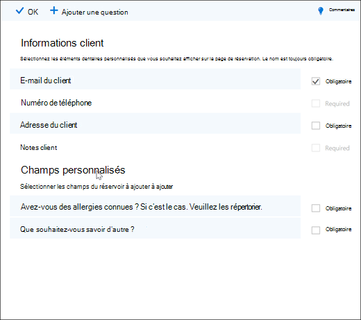
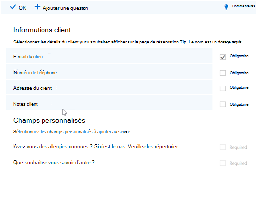
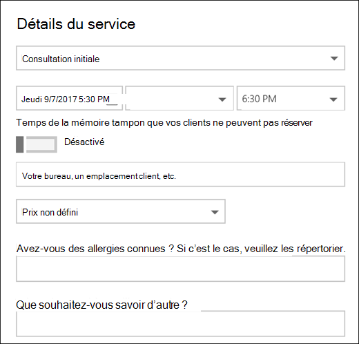

# Ajouter des questions personnalisées et requises à la page réservation

Bookings vous permet de créer des questions pour poser des questions à vos clients lorsqu’ils sont en rendez-vous. Il vous permet également de choisir les questions qui sont requises.

Vous associez les questions à un service, afin que chaque service puisse avoir un ensemble de questions différent. Par exemple, une stylistique peut demander aux clients qui réservent un rendez-vous de coloriage des couleurs de hair s’ils ont des lunettes connues pour des teintes ou des teintes. Cela vous permet, ainsi qu’à vos clients, de gagner du temps lorsqu’ils arrivent pour leur rendez-vous.

Les clients voient les questions personnalisées lorsqu’ils créent leur rendez-vous sur la page de réservation. Le personnel verra les questions personnalisées lorsqu’il crée une réservation à partir du calendrier Bookings ou lors de l’affichage d’un rendez-vous existant. Bookings enregistre toutes vos questions dans une liste principale afin de ne pas avoir à créer à nouveau les mêmes questions pour chaque service. Vous pouvez également choisir si les questions sont obligatoires ou facultatives.

> [!NOTE]
> Les réponses du client aux questions sont visibles lorsque vous regardez son rendez-vous dans le calendrier de réservation.

Pour plus d’informations sur la personnalisation et la personnalisation de votre page de réservation, voir [Personnaliser votre page de réservation.](customize-booking-page.md)

## Ajouter des questions personnalisées à vos services

1. Connectez-vous Microsoft 365 et **rendez-vous sur Bookings.**

1. Go to **Services** and either edit an existing service or **Add a service**.

1. Faites défiler vers le bas **jusqu’à** la section Champs personnalisés, puis sélectionnez **Modifier.**

   Nous avons déjà ajouté des questions de base sur les informations client : courrier électronique du client, numéro de téléphone, adresse du client et notes client. La première fois que vous faites cela, les questions d’informations client sont en gris. Cela signifie que l’utilisateur verra cette question. Si vous sélectionnez la question, la zone surligné autour de celle-ci disparaît et votre client n’est pas invité à répondre à cette question.

   Dans cet exemple, le numéro de téléphone et les notes client ont été désactivés et nous avons créé deux questions personnalisées à poser.

   

1. Pour que la question soit obligatoire, cochez **la case** Obligatoire. Votre client ne pourra pas terminer la réservation tant qu’il n’aura pas répondu aux questions requises.

1. Pour créer une question personnalisée, **sélectionnez Ajouter une question** en haut du panneau. Écrivez votre question, puis sélectionnez **Enregistrer.**

1. Cliquez sur la question pour l’activer. Une zone en surbrillant s’affiche autour d’elle et la question est activée.

1. Cliquez **sur OK** en haut de la page, puis **enregistrez le service.**

Bookings enregistre toutes vos questions personnalisées dans une liste principale afin que vous pouvez facilement ajouter des questions à chaque service sans avoir à taper à plusieurs reprises les mêmes questions. Par exemple, si vous ouvrez un autre service, la question que vous avez créée pour le premier service s’affiche dans la section Champs personnalisés, mais elle est désactivée. Cliquez sur la question pour qu’un rectangle en surbrille s’affiche et que la question soit activée.

Dans cet exemple, vous pouvez voir que les questions qui ont été ajoutées pour le premier service sont disponibles pour ce service. Toutes les questions que vous créez pour ce service seront disponibles pour tous les services.

   

Si votre page de réservation est déjà publiée, vous n’avez rien d’autre à faire. Les clients pourront voir les questions la prochaine fois qu’ils se livreront avec vous. Si votre page de réservation n’est pas encore publiée, rendez-vous sur la **page** de réservation à partir de Outlook sur le web, puis sélectionnez Enregistrer **et publier.**

> [!WARNING]
> Vous pouvez également supprimer des questions de la liste principale. Toutefois, si vous supprimez une question, elle sera supprimée de chaque service. Nous vous recommandons de désactiver la question en la sélectionnant pour vous assurer que vous n’avez aucun impact sur les autres services. Vous pouvez voir qu’une question est désactivée si elle n’est pas entourée d’un rectangle en surbrillant.

## Expérience client

Lorsque vos clients réservent un rendez-vous avec vous, les questions d’informations client de base s’afficheront dans la section Ajouter **vos détails.** Toutes les questions personnalisées que vous ajoutez se feront dans la section Fournir **des** informations supplémentaires.

## Expérience du personnel

Lorsque vos clients réservent un rendez-vous avec vous, vos employés voient les questions et les réponses du client dans le calendrier de réservation. Pour le voir, **rendez-vous dans le calendrier Bookings,** puis \>  ouvrez un rendez-vous.

