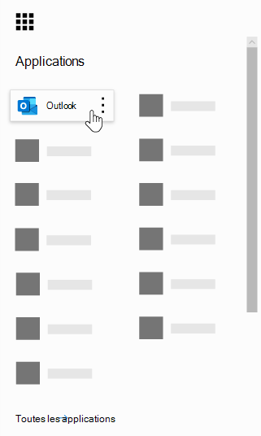
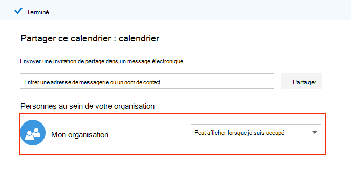
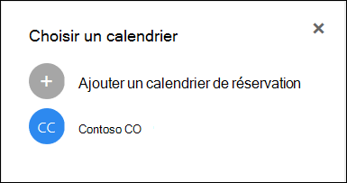

# Questions fréquemment posées sur Microsoft bookings

## Général

### Qu’est-ce que Microsoft bookings ?

Microsoft bookings est une application Microsoft 365 qui facilite la planification et la gestion des rendez-vous. Bookings inclut un calendrier de réservation basé sur le Web et s’intègre à Outlook pour optimiser le calendrier de votre personnel, ce qui permet à vos clients de réserver un temps qui leur convient le mieux. Les messages électroniques de notification automatisés réduisent les absences et les organisations économisent le temps avec une réduction des tâches de planification répétitives. Les réservations vous aident à effectuer des rendez-vous virtuels via Skype ou Microsoft Teams, et vous aident à gérer la planification quotidienne via l’application bookings dans Teams. Avec la possibilité de personnaliser, les réservations sont conçues pour répondre aux besoins de plusieurs parties d’une organisation.

### Comment utiliser Microsoft bookings ?

Bookings est un service en ligne, vous n’avez donc pas besoin de télécharger quoi que ce soit. Accédez simplement au sélecteur d’application dans l’expérience Web Microsoft 365. Les administrateurs peuvent également utiliser l’application du compagnon bookings pour tenir à jour les informations les plus récentes sur les clients et leurs rendez-vous.

### Qui a accès à Microsoft bookings ?

Bookings est disponible et actif par défaut pour les clients Microsoft 365 Business Premium, Microsoft 365 Business standard, a3, a5, E3 et E5 dans le monde entier. Bookings est également disponible dans Office 365 géré par 21Vianet.

### Mes clients verront-ils mon calendrier personnel ou professionnel ?

Vos clients voient uniquement le calendrier bookings que vous publiez en ligne pour les services, les heures et le personnel que vous choisissez d’enregistrer.

### Comment modifier un attribut réservables sous Manage staff ?

Lorsque les membres du personnel ont été ajoutés, ils auraient reçu un message électronique pour accepter ou rejeter la demande. Ils peuvent ouvrir le même message électronique et sélectionner « rejeter » pour les rendre non réservables. Nous ne disposons actuellement pas d’un moyen de le faire à partir de l’application.

### Comment les utilisateurs finaux accèdent-ils à l’application bookings ?

Toute personne disposant d’une licence pour Microsoft 365 Business Premium, Microsoft 365 Business standard, a3, a5, E3, E5 ou est ajoutée en tant que membre du personnel dans les rôles administrateur ou visionneuse peut accéder aux réservations dans le sélecteur d’application dans l’expérience Web Microsoft 365. Une application auxiliaire est également disponible pour iOS et Android.

### Puis-je utiliser bookings dans mon propre site Web ?

Oui. Nous vous proposons un moyen d’incorporer votre calendrier bookings dans votre site via un iFrame. Link Embedding code se trouve dans l’onglet **books page** de l’application bookings.

### Puis-je utiliser des réservations, même si je n’ai pas de page Web pour mon entreprise ?

Oui. Nous fournissons un lien vers votre page de réservation dans l’onglet **page de réservation** de l’application Web. Il vous suffit de fournir ce lien à vos clients ou clients, et ils verront les informations de disponibilité les plus récentes pour votre entreprise. Vous pouvez également partager la page de réservation dans les réseaux sociaux ou même utiliser la fonctionnalité embed pour l’héberger dans un iFrame. Vous avez également la possibilité de contrôler qui peut accéder à la page en désactivant l’indexation du moteur de recherche directe et en limitant l’accès à ces personnes au sein de votre organisation.

### Notre service informatique peut-il contrôler si les utilisateurs finaux peuvent accéder aux réservations ?

Bookings est disponible dans Microsoft 365 Business Premium, Microsoft 365 Business standard, M365 a3/a5 et E3/E5 locataires par défaut, mais les administrateurs peuvent le désactiver dans le centre d’administration de Microsoft 365 s’ils le choisissent. Pour ce faire, [suivez les instructions ci-dessous](turn-bookings-on-or-off.md).

Si un client souhaite désactiver l’accès aux réservations pour certaines licences éligibles dans son client, il peut utiliser une stratégie de groupe pour limiter les licences ou implémenter une stratégie de boîte aux lettres OWA qui limitera les personnes en mesure de créer des calendriers de réservations.

Si vous utilisez une stratégie de boîte aux lettres OWA pour désactiver l’accès aux réservations, tous les utilisateurs auront une licence de livres, cependant, lorsqu’ils tenteront d’accéder à l’application, ils ne fonctionneront que s’ils font partie de la stratégie ou s’ils ont été ajoutés à un calendrier bookings existant en tant que personnel. Détails [dans](turn-bookings-on-or-off.md) la section « autoriser uniquement les utilisateurs sélectionnés à créer des calendriers de livrets ».

### Les réservations sont-elles personnalisables ?

Oui, Bookings est personnalisable et peut être utilisé pour différents scénarios. Lors de la configuration d’un calendrier bookings, de nombreux aspects de la page de planification basée sur le Web, vos informations professionnelles, les détails du personnel, les types de service et les stratégies de planification peuvent être personnalisés.

### Toutes les fonctionnalités de l’application Web bookings d’origine sont-elles disponibles dans Microsoft teams ?

Une version allégée de bookings est désormais disponible en tant qu’application dans Teams. Veuillez trouver l’annonce initiale [ici](https://www.microsoft.com/microsoft-365/blog/2020/03/06/empowering-care-teams-with-new-tools-in-microsoft-365/). Il existe des fonctionnalités de liens approfondies à afficher dans l’application Web, et une fois le programme d’installation, l’utilisation quotidienne des réservations peut être effectuée sans jamais quitter Teams. Les informations circulent sur plusieurs plateformes.

### Est-ce qu’une offre de petite entreprise ou une offre d’entreprise ou les deux ?

Bookings est une solution idéale pour les clients d’entreprise et de petite entreprise, dans un grand nombre d’industries. Les cas d’utilisation sont les suivants :

- Services financiers
    - consultations
    - services bancaires et d’assurance
    - déclarations fiscales

- Ressources humaines (RH)
    - entretiens de candidats
    - intégration
    - assistance sur les avantages
    - formation et séminaires

- Santé
    - visites des patients
    - collaboration entre fournisseurs
    - consultation des assurances

- Secteur public & gouvernement
    - audiences judiciaires et tirages
    - services publics
    - rendez-vous de service

- Éducation--K-12
    - Conférences de l’enseignant
    - salle de ville scolaire
    - étudiant-visites du conseiller

- Éducation--plus grande Ed
    - heures d’ouverture
    - Tutor
    - services des étudiants
    - inscription à l’examen

- Commerce
    - achats assistés
    - planification de fournisseur
    - services de conception

- Besoins généraux des entreprises et des petites entreprises
    - réunions client et client
    - support technique
    - revues juridiques
    - Equipe

## Tarifs et licences

### Comment obtenir des livres Microsoft ?

Bookings est disponible dans Microsoft 365 pour les clients disposant des licences Microsoft 365 Business Premium, Microsoft 365 Business standard, a3, a5, E3 et E5, ainsi qu’une application de complément iOS et Android. Bookings n’est pas disponible en tant qu’application autonome. Outlook Web App ou Outlook sur le Web doit être activé pour utiliser les réservations, car il stocke les données dans Outlook.

Une licence de livres offre des fonctionnalités complètes pour le produit, notamment la création et la gestion de calendriers. Elle permet également aux utilisateurs d’afficher et de modifier des calendriers existants lorsque ces utilisateurs sont ajoutés en tant que personnel dans un rôle d’administrateur ou de visionneuse.

### Dois-je migrer mon compte de courrier de mon fournisseur actuel vers Microsoft 365 ?

Vous pouvez conserver votre fournisseur actuel, mais les réservations enverront toutes les notifications aux messages électroniques utilisés dans votre compte Microsoft 365.

### Mes employés peuvent-ils utiliser des livres sans compte Microsoft 365 ?

Oui. Vous pouvez ajouter votre personnel à n’importe quel courrier électronique, de sorte qu’il continue d’obtenir la confirmation de messagerie et l’invite de calendrier lorsqu’un utilisateur livre un rendez-vous avec lui.

### Puis-je créer plusieurs calendrier bookings sous le même compte Microsoft 365 et basculer entre eux ?

Oui. Vous pouvez créer et gérer plusieurs calendrier bookings avec un seul compte. Vous pouvez basculer entre elles en utilisant le signe insertion en regard du nom de l’entreprise dans l’application Web bookings.

### Que faire si mon organisation a des licences mixtes avec F1/F3, E1 et E3/E5 ?

Nous reconnaissons que de nombreuses organisations ont un mélange de licences Microsoft 365. Par exemple, un client peut avoir des licences M365 E3 pour les employés de son siège, mais des licences M365 E1 (ou F1 ou F3) pour leurs employés de magasin.

Dans cet exemple, les employés du siège avec une licence M365 E3 ont un accès total aux réservations, ce qui signifie qu’ils peuvent créer de nouveaux calendriers, modifier des paramètres, ajouter du personnel, publier une page de réservation, créer et gérer des rendez-vous dans le calendrier et extraire des rapports.

Les employés de cette boutique disposant de licences E1/F1/F3, ou sans licence, peuvent toujours être ajoutés en tant que personnel aux calendriers d’un rôle invité, puis être comptabilisés pour les rendez-vous et recevoir des messages de confirmation lorsqu’ils sont comptabilisés. Ils peuvent toujours être enregistrés pendant les heures disponibles/planifiées, comme mentionné dans l’onglet personnel. La disponibilité du calendrier bookings limite les temps réservables par les heures de service et les heures définies.

Les employés du magasin s’afficheront également comme indisponibles dans les réservations si un rendez-vous a déjà été planifié à ce moment via l’application Web bookings. Les rendez-vous enregistrés via des livres seront reflétés comme étant occupés sur le calendrier d’un membre du personnel dans les réservations. Le personnel disposant d’une licence activée pour les non-réservations peut toujours avoir son calendrier personnel sur la disponibilité des livres, à condition qu’ils se trouvent dans le même client.

Les membres du rôle invités peuvent afficher toutes les informations fournies par le client lors de la création initiale du rendez-vous. Par exemple, si le représentant du magasin qui est inscrit pour le rendez-vous est requis pour appeler le client avant le rendez-vous, il aura accès aux informations fournies par le client lors du processus de planification. Le membre du personnel qui est inscrit peut accéder à toutes les informations figurant dans le message électronique de confirmation, ainsi qu’à l’événement de calendrier. ICS (par exemple, le numéro de téléphone du client s’il a été entré).

Les personnes du rôle invité n’ont pas la possibilité d’accéder à l’application Web bookings pour modifier les paramètres ou pour afficher et gérer les rendez-vous (ajouter, annuler et Replanifier). Toutefois, ils peuvent créer des rendez-vous pour le compte de clients à l’aide de la page libre-service, de la même manière qu’un client rend un rendez-vous.

Nous vous recommandons de gérer les licences d’un responsable ou d’un administrateur d’entreprise de chaque magasin, avec une licence éligible pour la configuration et la gestion des pages et des rendez-vous. Le reste du personnel travaille ensuite avec l’employé sous licence avec des réservations afin de Replanifier ou d’annuler une réservation.

## Fonctionnalités du produit

### Où les calendriers de réservation apparaissent-ils dans mon client Microsoft 365 ? * *

Chaque nouveau calendrier bookings crée une boîte aux lettres correspondante dans Exchange, ainsi qu’une entrée connexe dans Azure Active Directory (AAD), où l’entrée est mentionnée en tant qu’utilisateur sans licence.

### Puis-je supprimer un calendrier bookings créé précédemment ?

Pour supprimer un calendrier bookings, vous devez supprimer la boîte aux lettres associée dans Exchange.

### Si je crée un calendrier et qu’un autre utilisateur a accès aux réservations, est-ce qu’il peut voir mon calendrier ?

Les seules personnes ayant accès à des calendriers de réservation que vous créez (via l’application Web) sont toutes les personnes qui ont été ajoutées en tant que personnel, dans un rôle administrateur ou visionneuse. Les administrateurs de clients pourront voir la liste de toutes les boîtes aux lettres de livres dans Exchange et AAD.

### Les réunions de conférence vidéo sont-elles intégrées dans l’application bookings ?

Les réunions en ligne sont disponibles dans les réservations lors de l’utilisation des clients Skype ou Microsoft Teams. Les réunions en ligne peuvent être activées au niveau du service, et le client de réunion que vous choisissez (Skype ou Teams) sera celui défini par défaut pour un membre du personnel. Pour rejoindre les réunions en ligne, chaque nouveau rendez-vous aura un lien de réunion unique joint au rendez-vous, et des options de participation faciles sont incluses dans l’événement et les messages de confirmation.

### Comment fonctionne la stratégie de planification ?

Un paramètre appelé **délai maximal** détermine le plus à l’avance (mesuré en jours) qu’une réservation peut être effectuée. Il doit y avoir au moins 24 heures entre le délai **minimal** (délai minimal, en heures, pour les réservations et les annulations) et le délai maximal. Le délai maximal peut être défini sur un jour si le délai minimal est défini sur 0 heure, ce qui signifie, dans ce cas, qu’un client peut annuler une réservation jusqu’à son démarrage et que les clients peuvent uniquement planifier des réservations si le rendez-vous se trouve dans le jour suivant.

:::image type="content" source="media/bookings-faq-scheduling.png" alt-text="Planification dans les réservations":::

### Comment les réservations fonctionnent-elles sur plusieurs fuseaux horaires ?

Toutes les heures se situent dans le fuseau horaire de l’entreprise (votre fuseau horaire local) par défaut. Cela signifie que tout paramètre que vous configurez pour un calendrier bookings, tel que les heures de travail, apparaît dans ce fuseau horaire. La page libre-service permet d’afficher toutes les heures de rendez-vous dans le fuseau horaire de l’utilisateur final, qui peut être désactivé si vous le souhaitez. Si l’option **toujours afficher les créneaux horaires dans le fuseau horaire de l’entreprise** reste désactivée sous l’onglet réservations, les personnes visitant cette page verront les créneaux horaires dans leurs fuseaux horaires locaux.

:::image type="content" source="media/bookings-faq-region.png" alt-text="Paramètres de région et de fuseau horaire des réservations":::

Il n’existe aucune provision pour définir le fuseau horaire du personnel dans bookings. Le fuseau horaire du personnel et, par conséquent, les heures d’ouverture, sera dans le fuseau horaire de l’entreprise.

### Les notifications par courrier électronique peuvent-elles être envoyées en tant que nom de domaine client ?

Les adresses de messagerie sont contrôlées et gérées au niveau des paramètres de Microsoft 365 et dépendent des paramètres de configuration de domaine. Vous trouverez plus d’informations [ici](https://docs.microsoft.com/powershell/module/exchange/get-accepteddomain).

### Est-il possible d’envoyer des messages SMS en fonction d’un autre service ou d’une configuration spécifique ?

Les messages SMS sont actuellement disponibles en Amérique du Nord, et un compte Skype ou Twilio sera utilisé pour la remise de SMS.

### Comment les rendez-vous peuvent-ils être affichés dans le calendrier d’une personne ?

La confirmation de la réservation est envoyée à la fois aux boîtes de réception du fournisseur de services et du client. Le message électronique de confirmation contient un fichier *. ICS joint, qui peut ensuite être ajouté au calendrier de l’utilisateur avec tous les détails de rendez-vous pertinents.

### Qu’est-ce qui déclenche le fournisseur de services ou le personnel et les e-mails client ?

Les messages électroniques sont déclenchés en fonction des paramètres définis sous l’onglet services de l’application Web bookings. Une réservation effectuée par le client dans la page libre-service, ou sous l’onglet Calendrier de l’application Web bookings, déclenchera une confirmation et/ou un courrier électronique de rappel. La même chose se produit lorsqu’une personne apporte une modification à la réservation via le bouton **gérer la réservation** dans le courrier électronique de confirmation ou dans l’application Web. Les courriels de rappel sont envoyés à une période spécifiée avant un rendez-vous, comme indiqué dans l’onglet services de l’application Web bookings.

### Puis-je répartir les rendez-vous de style classe 1 : nombre au lieu de 1:1 ?

Oui, nous disposons d’une fonctionnalité de livres de groupes qui permet à plusieurs personnes de réserver le même rendez-vous en même temps (par exemple pour une classe de pertinence). Cette fonctionnalité est décrite en détail [ici](https://techcommunity.microsoft.com/t5/microsoft-bookings-blog/microsoft-bookings-now-supports-online-meetings-and-group/ba-p/1214120).

### Les calendriers peuvent-ils rester non publiés (non publics) mais toujours accessibles aux utilisateurs désignés ?

Oui. Il existe une case à cocher sous l’onglet page de réservation dans l’application Web : **nécessite un compte Microsoft 365 ou Office 365 de la part de mon organisation pour livrer**. L’activation de cette case à cocher restreint l’accès à la page libre-service uniquement à ceux qui se trouvent dans votre client. Le calendrier bookings qui se trouve dans l’application Web pour la création et la gestion est accessible uniquement par les personnes ajoutées en tant que personnel à la page avec des rôles administrateur ou visionneuse.

:::image type="content" source="media/bookings-faq-access-ctrl.png" alt-text="Réservation du contrôle d’accès aux pages dans bookings":::

### Quelle est la fréquence de mise à jour de la page d’accueil ?

Les données les plus récentes liées à votre page d’accueil sont récupérées chaque fois que l’application Web est chargée. Pour plus d’informations sur le type d’informations suivies par les réservations, consultez cet [article de support technique](metrics-and-activity-tracking.md).

### Puis-je désactiver les notifications par courrier électronique pour les absences ?

La durée de l’enregistrement dans l’application Web bookings déclenchera toujours un courrier électronique de notification aux membres du personnel. Si des membres du personnel ne tiennent pas compte de la notification, nous vous recommandons d’ajouter des détails supplémentaires dans les notes ou le titre de la notification de congé, afin de mieux informer le personnel sur ce qui se passe côté administrateur.

### Les calendriers de réservation peuvent-ils être clonés ou dupliqués, et peuvent-ils être mis en classe pour une mise à l’échelle facile ?

Le processus consisterait à utiliser l’API Graph pour obtenir les détails de la boîte aux lettres, puis utiliser ces informations pour créer une nouvelle boîte aux lettres. La documentation de l’API est [ici](https://docs.microsoft.com/graph/api/resources/booking-api-overview?view=graph-rest-beta).

### Quels sont les rapports disponibles dans bookings ?

Toutes les personnes affectées au rôle d’administrateur peuvent télécharger des valeurs séparées par des tabulations (. TSV) avec toutes les réservations effectuées au cours des 120 derniers jours. Les rapports sur les livres peuvent être téléchargés dans. Formulaire TSV à partir de l’onglet Accueil de la page réservations. L’API bookings peut également être utilisée pour collecter ces données à des fins plus personnalisées et spécifiques.

### Est-il possible de partager un seul service sur la page libre-service à la fois ?

Oui, vous pouvez créer des calendriers de réservations distinctes pour chaque service, ou vous pouvez accéder à l’onglet services, modifier un service, et en haut de la page, vous verrez une option permettant de partager une URL uniquement pour ce service spécifique.

### Quelles sont les options disponibles pour l’incorporation d’un formulaire de consentement ou la divulgation de la réservation d’un rendez-vous ?

Nous vous recommandons d’activer la case à cocher **consentement de l’utilisation des données client** dans la page réservation et de personnaliser le texte afin de communiquer correctement les exigences en matière de divulgation ou de consentement de votre organisation. Une autre solution consiste à ajouter un champ personnalisé au service qui inclut un lien vers le formulaire de consentement, et à demander aux clients de confirmer qu’ils ont complété le formulaire avant de pouvoir effectuer un rendez-vous. Vous pouvez également ajouter l’URL du formulaire de consentement en tant que notes supplémentaires dans les e-mails de confirmation et de rappel, mais cela n’empêchera pas les utilisateurs de réserver un rendez-vous.

### Quelles modifications peuvent être apportées à la fonctionnalité de sélection de personnel dans la page réservation libre-service ?

La possibilité pour les clients de sélectionner des membres du personnel spécifiques lors de la réservation peut être entièrement supprimée en désélectionnant l’option **autoriser les clients à choisir une personne spécifique pour la réservation** dans la page réservation ou services. Les réservations affecteront automatiquement à la réservation un membre du personnel disponible au hasard, en fonction de la disponibilité du personnel.

### Les réservations peuvent-elles prendre en charge de nombreuses demandes de réservation simultanées et visites de page en libre-service ?

La réservation peut prendre en charge une grande quantité de visiteurs et de réservations en même temps. Si la page rencontre un très grand volume de trafic, les utilisateurs reçoivent une erreur « serveur occupé ». La disponibilité des rendez-vous est mise à jour lorsque la page est chargée, ainsi qu’en cas de réservation. Si plusieurs personnes essaient de réserver le même rendez-vous en même temps, les réservations n’autorisent qu’un seul livre de personnes à envoyer un message de notification aux autres clients potentiels et les invitent à rechercher une autre heure.

## Confidentialité

### Où les données de livre sont-elles stockées ?

Bookings est une application Microsoft 365, ce qui signifie que toutes les données sont stockées dans la plateforme Microsoft 365 et dans Exchange. Les réservations suivent toutes les stratégies de stockage de données définies par Microsoft, qui sont les mêmes que celles suivies par toutes les applications Office. Bookings utilise des boîtes aux lettres partagées dans Exchange pour stocker les détails des clients, des équipes, des services et des rendez-vous. Les stratégies de conformité pour les boîtes aux lettres partagées dans Exchange s’appliquent également aux boîtes aux lettres de livres. Toutes les données client (y compris les informations fournies par les clients lors de la réservation) sont capturées dans les réservations et stockées dans l’application, de sorte qu’elles sont stockées dans Exchange. Microsoft bookings utilise les mêmes stratégies que celles utilisées par Microsoft 365, que vous pouvez trouver [ici.](https://www.microsoft.com/online/legal/v2/?docid=22&langid=en-us)

### Existe-t-il un moyen de gérer de manière centralisée les calendriers de livres pour tous les utilisateurs ?

Chaque calendrier bookings est géré indépendamment. Il n’existe pas d’affichage consolidé, autre que la liste déroulante de recherche, après avoir cliqué sur le signe insertion de la page d’accueil.

### Comment les utilisateurs sont-ils authentifiés ?

L’accès à l’application Web bookings implique l’authentification via l’authentification AAD (Azure Active Directory) normale. La page réservation libre-service peut être mise à la disposition de tous les utilisateurs disposant du lien page Web. Toutefois, lorsque le paramètre **exiger un compte Microsoft 365 ou Office 365 du site mon organisation** à livre est sélectionné, l’utilisation de la page est restreinte uniquement dans le client Microsoft 365 (à l’aide de l’authentification AAD).

:::image type="content" source="media/bookings-faq-access-ctrl.png" alt-text="Réservation du contrôle d’accès aux pages dans bookings":::

### Les données client quittent-elles le système de production pour une raison quelconque ?

Oui, étant donné que les réservations font partie d’Exchange, nous autorisons les API Graph et les API des services Web Exchange (EWS) pour que les clients puissent télécharger leurs propres données auxquelles ils ont accès.

### Est-il possible de personnaliser les adresses de messagerie des réponses des clients ?

Il est possible de définir l’adresse de messagerie à laquelle les clients envoient leurs réponses. Ce paramètre est situé sous l’onglet **informations professionnelles** . Le nom de la boîte aux lettres Books peut également être modifié dans Exchange, via les processus de changement de nom de boîte aux lettres Exchange habituels.

### Nous souhaitons que le client accepte nos conditions générales lors du processus de réservation. Est-ce possible ?

Cette fonctionnalité existe déjà pour la conformité RGPD. La page réservation a un champ pour le consentement personnalisé, juste en dessous de la section Détails de publication. Vérifiez simplement cette zone et rédigez votre propre message de consentement personnalisé, qui s’affichera sous la forme d’un champ obligatoire dans la page libre-service. La date et l’heure auxquelles le consentement du client est accordé seront enregistrées.

Cette section ne prend pas en charge le texte enrichi, mais les liens peuvent être ajoutés sous la section informations professionnelles et affichés juste en dessous de la case de consentement.

### Comment identifier les boîtes aux lettres associées à des réservations dans Exchange ?

La commande suivante peut être utilisée pour récupérer des informations de toutes les boîtes aux lettres de livres et des utilisateurs qui y ont accès.

`Get-Mailbox -RecipientTypeDetails SchedulingMailbox -ResultSize:Unlimited | Get-MailboxPermission |Select-Object Identity,User,AccessRights | Where-Object {($\_.user -like '\*@\*')}`

## Questions techniques

### Si un utilisateur planifie un rendez-vous pour un service composé d’une réunion en ligne, comment puis-je recevoir le lien Microsoft teams vers la réunion s’il laisse le champ d’adresse de messagerie facultatif vide ?

Si le système ne dispose pas des informations de courrier électronique du client, il n’existe aucun moyen de remettre le courrier électronique au client ; par conséquent, ils ne reçoivent pas de lien vers les équipes. La solution consiste à définir l’adresse e-mail comme champ obligatoire, ce que vous pouvez faire sous l’onglet services des réservations. Notez que lorsque vous créez un nouveau service dans bookings, le champ e-mail du client est défini comme champ obligatoire par défaut.

### Comment les employés sont-ils affectés à des rendez-vous lorsque « tout le monde » est sélectionné ou quand les clients ne peuvent pas choisir un membre du personnel pour le rendez-vous ?

Le personnel est affecté de manière aléatoire dans ces scénarios, en dehors de tous les membres du personnel disponibles lors de la réservation du rendez-vous. Actuellement, il n’existe aucun moyen d’assurer une distribution égale de rendez-vous attribués de façon aléatoire à tous les membres du personnel, ou de limiter le nombre de rendez-vous affectés à chaque membre du personnel. Si l’équilibrage de charge doit être effectué au sein de votre équipe après un certain nombre d’affectations aléatoires, vous pouvez l’effectuer manuellement dans l’onglet Calendrier de la page réservations.

### Comment les utilisateurs peuvent-ils désactiver la réception de messages SMS s’ils l’ont déjà choisi ?

Lors de la réservation d’un rendez-vous avec des messages SMS activés, les clients seront invités à vérifier la zone d’acceptation chaque fois qu’ils le sont. Les clients peuvent également répondre directement au message SMS (le fournisseur SMS) indiquant qu’ils aimeraient que les messages cessent, puis aucun autre texte ne sera envoyé à ce numéro de téléphone. Si le client ne peut plus recevoir de messages texte provenant du fournisseur, et non des réservations lui-même, il ne recevra plus de messages SMS, même si vous optez pour la page réservations.

## Résolution des problèmes

### Le calendrier de ce membre du personnel ne peut pas être synchronisé

Si vous recevez le message d’erreur « le calendrier de ce membre du personnel ne peut pas être synchronisé », cette section contient plusieurs procédures de résolution des problèmes pour vous aider à résoudre l’erreur.

> [!NOTE]
> Bookings est activé par défaut pour les clients qui disposent des abonnements Microsoft 365 Business standard, Microsoft 365 a3 ou Microsoft 365 a5. Bookings est également disponible pour les clients disposant d’Office 365 entreprise E3 et d’Office 365 entreprise E5, mais il est désactivé par défaut. Pour commencer, consultez la rubrique [obtenir l’accès à Microsoft bookings](get-access.md). Pour activer ou désactiver les réservations, reportez-vous à [la rubrique activer ou désactiver des réservations pour votre organisation](turn-bookings-on-or-off.md).

Si vous recherchez des informations sur la synchronisation du calendrier de votre personnel, reportez-vous à la rubrique [Add staff to bookings](add-staff.md). Assurez-vous que la page informations sur le **personnel** a une **incidence sur la disponibilité des événements dans le calendrier** .

### Le membre du personnel doit modifier ses autorisations de calendrier

Pour que les réservations soient synchronisées correctement avec les calendriers des membres de votre équipe, chaque membre du personnel doit partager son calendrier. Chaque membre du personnel doit suivre ces instructions pour partager son propre calendrier.

1. Connectez-vous à Microsoft 365, puis sélectionnez **Outlook** à partir du lanceur d’applications.

   > [!div class="mx-imgBorder"]
   > 

1. En haut de la page, sélectionnez **partager** le \> **calendrier**.

   

1. Dans la section **personnes au sein de votre organisation** , sélectionnez la zone de liste déroulante en regard de **mon organisation**, puis sélectionnez l’option **afficher quand je suis occupé**.

   > [!NOTE]
   > Ce paramètre partage vos informations de disponibilité avec les réservations et avec d’autres utilisateurs au sein de votre organisation. Il n’inclut pas d’autres informations, telles que le type de rendez-vous planifié, l’utilisateur avec lequel vous avez planifié le rendez-vous ou son emplacement.

   > [!div class="mx-imgBorder"]
   > 

1. Sélectionnez **Terminé**.

### Il est impossible de trouver un membre du personnel dans notre organisation.

Si un employé a quitté votre entreprise et que vous l’avez supprimé de votre organisation Microsoft 365 ou Office 365, vous devez supprimer cet utilisateur des réservations pour qu’il ne s’affiche pas dans le calendrier et empêcher les clients de réserver leurs rendez-vous.

1. Connectez-vous à Microsoft 365, puis accédez au **personnel bookings** \> .

1. Placez le curseur de la souris sur le nom du membre du personnel. Les icônes **modifier** et **supprimer** apparaissent à droite de la colonne **téléphone** .

1. Sélectionnez l’icône **supprimer** .

1. Dans la boîte de dialogue de confirmation, sélectionnez **OK**.

> [!NOTE]
> Si vous avez plusieurs calendrier de réservation, vous devez supprimer l’utilisateur de tous les calendriers.

Pour vérifier si vous avez plusieurs calendriers, dans le menu de gauche, sélectionnez la flèche déroulante en regard du nom de votre société, puis sélectionnez **ouvrir**. Si vous n’avez qu’un seul calendrier, vous ne verrez que la possibilité d’ajouter un calendrier de réservation. Cet exemple montre qu’il existe un deuxième calendrier nommé « Contoso CO ».

### Il y a une erreur de synchronisation que nous ne pouvons pas identifier.

Il s’agit d’une erreur passagère qui se produit généralement en raison d’une connexion Internet instable. Ces problèmes se résolvent généralement après quelques minutes.

Si cette erreur se produit toujours après une période prolongée ou si vous la voyez souvent, veuillez contacter le support technique.

## Ressources supplémentaires

  - [Microsoft bookings augmente la disponibilité dans le blog de l’entreprise](https://techcommunity.microsoft.com/t5/microsoft-bookings-blog/microsoft-bookings-expands-availability-in-enterprises/ba-p/1214065)

  - [Vidéo sur la vidéo de Microsoft bookings](https://support.office.com/article/microsoft-bookings-69c45b78-6de4-4f28-9449-cdcc18b7ae45)

  - [Commencer à utiliser Microsoft bookings](get-access.md)

  - [Activer ou désactiver Microsoft bookings](turn-bookings-on-or-off.md)

  - [Ajouter des utilisateurs individuellement ou en bloc](https://docs.microsoft.com/microsoft-365/admin/add-users/add-users?view=o365-worldwide.)

  - [Ajouter du personnel aux réservations](add-staff.md)

  - [Composants de l’API à automatiser après que le modèle a été défini](https://docs.microsoft.com/graph/api/bookingbusiness-post-bookingbusinesses)

  - [URL du calendrier des réservations pour l’affichage](https://outlook.office.com/bookings/calendar)

  - [Stratégies de conformité des réservations](https://docs.microsoft.com/microsoft-365/compliance/gdpr-dsr-office365?view=o365-worldwide#bookings)

  - [Personnaliser et publier votre page de réservation](customize-booking-page.md)

  - [Configuration de la boîte aux lettres client](https://docs.microsoft.com/powershell/module/exchange/get-accepteddomain)

  - [Réservations de groupe](https://techcommunity.microsoft.com/t5/microsoft-bookings-blog/microsoft-bookings-now-supports-online-meetings-and-group/ba-p/1214120)

  - [Mesures bookings et suivi des activités](metrics-and-activity-tracking.md)

  - [Feuille de route publique M365](https://www.microsoft.com/microsoft-365/roadmap?filters=&searchterms=bookings)

  - Envoyer des commentaires via [UserVoice](https://outlook.uservoice.com/forums/314907-microsoft-bookings/suggestions/39505261-365-admins-should-have-full-access-to-all-bookings)
