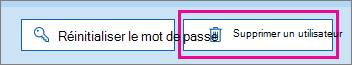

# <a name="delete-a-booking-calendar-in-bookings"></a>Supprimer un calendrier de réservation dans Bookings

> [!NOTE]
> Cet article vous aide à interagir avec la dernière version de Microsoft Bookings. Les versions précédentes seront mises hors service dans les prochains mois.

Cet article explique comment supprimer un calendrier de réservation indésirable. Vous pouvez supprimer le calendrier de réservation dans le Centre d'administration Microsoft 365 ou utiliser PowerShell. Le calendrier Bookings étant une boîte aux lettres dans Exchange Online, vous supprimez le compte d’utilisateur correspondant pour supprimer le calendrier de réservation.

> [!IMPORTANT]
> Tous les calendriers de réservation que vous avez créés en 2017 ou avant doivent être supprimés à l’aide des instructions PowerShell de cette rubrique. Tous les calendriers de réservation créés en 2018 ou après peuvent être supprimés dans le Centre d'administration Microsoft 365.

Le calendrier de réservation est l’endroit où toutes les informations pertinentes sur ce calendrier de réservation et les données sont stockées, notamment :

- Informations professionnelles, logo et heures de travail ajoutées lors de la création du calendrier de réservation
- Personnel et services pertinents ajoutés lors de la création du calendrier de réservation
- Toutes les réservations et les rendez-vous de congé ajoutés au calendrier de réservation une fois qu’il a été créé.

> [!WARNING]
> Une fois qu’un calendrier de réservation est supprimé, ces informations supplémentaires sont également supprimées définitivement et ne peuvent pas être récupérées.

## <a name="delete-a-booking-calendar-in-the-microsoft-365-admin-center"></a>Supprimer un calendrier de réservation dans le Centre d'administration Microsoft 365

1. Aller au Centre d’administration Microsoft 365.

1. Dans le centre d'administration, sélectionnez **Utilisateurs**.

   

1. Sur la page **Utilisateurs actifs**, sélectionnez les noms des utilisateurs à supprimer, puis **Supprimer l'utilisateur**.

   

## <a name="delete-a-booking-calendar-using-exchange-online-powershell"></a>Supprimer un calendrier de réservation à l’aide de Exchange Online PowerShell

Consultez [Connecter pour Exchange Online PowerShell](/powershell/exchange/exchange-online-powershell-v2) pour connaître les prérequis et des conseils pour la connexion à Exchange Online PowerShell.

Pour effectuer ces étapes, vous devez utiliser une fenêtre de commande Microsoft PowerShell active que vous avez exécutée en choisissant l’option « Exécuter en tant qu’administrateur ».

1. Dans une fenêtre PowerShell, chargez le module EXO V2 en exécutant la commande suivante :

   ```powershell
   Import-Module ExchangeOnlineManagement
   ```

   > [!NOTE]
   > Si vous avez déjà [installé le module EXO v2](/powershell/exchange/exchange-online-powershell-v2#install-and-maintain-the-exo-v2-module), la commande précédente fonctionnera comme écrite.
   
2. La commande à exécuter utilise la syntaxe suivante:

   ```powershell
   Connect-ExchangeOnline -UserPrincipalName <UPN> 
   ```

   - _\<UPN\>_ est votre compte au format du nom d’utilisateur principal (par exemple, `john@contoso.com`).

3. Lorsque vous y êtes invité, connectez-vous avec les informations d’identification de l’administrateur client au locataire Microsoft 365 qui héberge le calendrier de réservation que vous souhaitez supprimer définitivement.

4. Une fois cette commande terminée, entrez la commande suivante pour obtenir la liste des boîtes aux lettres de réservation dans votre locataire :

   ```powershell
   Get-EXOMailbox -RecipientTypeDetails SchedulingMailbox
   ```

5. Tapez la commande suivante :

   ```powershell
   remove-mailbox [BookingCalendarToDelete]
   ```

   > [!IMPORTANT]
   > Veillez à taper le nom exact de l’alias de boîte aux lettres de réservation que vous souhaitez supprimer définitivement.

6. Pour vérifier que le calendrier a été supprimé, entrez la commande suivante :

   ```powershell
    Get-EXOMailbox -RecipientTypeDetails SchedulingMailbox
   ```

   Le calendrier supprimé n’apparaît pas dans la sortie.
