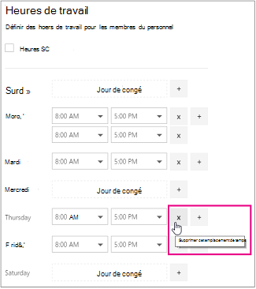

# Heures de travail des employés dans Microsoft bookings

La définition des heures de travail des employés garantit que leur disponibilité s’affiche correctement lorsque vos clients essaient de les réserver. Par défaut, les heures de travail de chacun de vos employés correspondent aux heures d’ouverture que vous avez établies dans l’application Microsoft bookings. Consultez la section « configurer les heures d’ouverture » de la section [entrer des informations professionnelles](enter-business-information.md#set-your-business-hours).

Sur la page **personnel** , vous pouvez personnaliser les heures de travail des employés pour répondre aux besoins de votre entreprise et de vos employés.

Si vous souhaitez réserver des congés aux membres du personnel afin que les clients ne puissent pas les réserver pendant qu’ils ne sont pas au bureau, consultez la rubrique [planifier les fermetures de bureaux, les congés et les vacances](schedule-closures-time-off-vacation.md) pour obtenir des instructions.

> [!NOTE]
> Bookings est activé par défaut pour les clients qui disposent des abonnements Microsoft 365 Business standard, Microsoft 365 a3 ou Microsoft 365 a5. Bookings est également disponible pour les clients disposant d’Office 365 entreprise E3 et d’Office 365 entreprise E5, mais il est désactivé par défaut. Pour commencer, consultez la rubrique [obtenir l’accès à Microsoft bookings](get-access.md). Pour activer ou désactiver les réservations, reportez-vous à [la rubrique activer ou désactiver des réservations pour votre organisation](turn-bookings-on-or-off.md).

## Personnaliser les heures de travail des employés

Regardez cette vidéo ou suivez les étapes ci-dessous pour définir les heures de travail d’un employé.

> [!VIDEO https://www.microsoft.com/videoplayer/embed/RWuXUq]

1. Dans Microsoft 365, sélectionnez le lanceur d’applications, puis **livres**.

1. Dans le volet de navigation, sélectionnez **personnel**, puis sélectionnez le membre du personnel dont vous souhaitez définir les heures.

   

1. Sous heures de travail, désactivez la case à cocher **utiliser les heures d’ouverture** .

1. Utilisez les listes déroulantes pour sélectionner les heures de début et de fin pour chaque jour. Les heures sont disponibles par incréments de 15 minutes.

   

1. Cliquez **+** pour ajouter des sélecteurs de début et de fin d’heure.

1. Sélectionnez Enregistrer.

## Définir les jours ouvrés d’un employé

Lorsque vous planifiez un jour de congé pour un employé, cet employé apparaîtra comme non disponible sur la page réservation. Les clients qui utilisent la page de réservation ne seront pas en mesure de le planifier pour le service à ce jour-là.

1. Dans l’écran heures de travail, sélectionnez le **x** en regard du jour où l’employé sera désactivé.

   

1. Si vous souhaitez planifier un jour précédemment marqué comme jour de congé, sélectionnez le **+** signe en regard du jour que vous souhaitez planifier.

> [!TIP]
> Si vous planifiez le temps de vacances d’un employé ou d’autres grands blocs de temps d’arrêt, consultez la section « planifier l’heure de l’employé » de [planification des fermetures de bureaux, de congés et de vacances](schedule-closures-time-off-vacation.md#schedule-employee-time-off).
