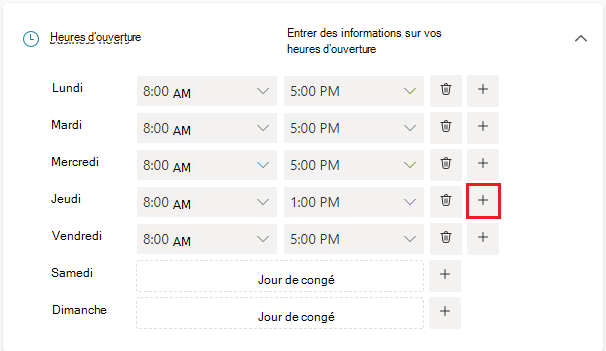
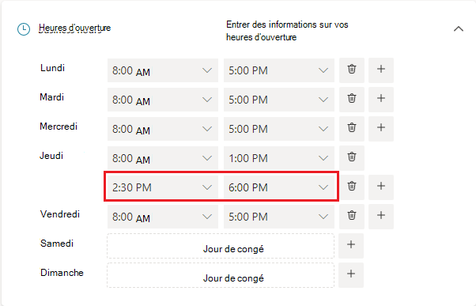

# Protégez vos informations

> [!NOTE]
> Cet article vous aide à interagir avec la dernière version de Microsoft Bookings. Les versions précédentes seront mises hors service dans les prochains mois.

Dans Microsoft Bookings, la page Informations professionnelles de l’application web contient tous les détails que vous trouverez généralement sur la page « À propos de nous » d’une entreprise. Ces détails incluent un nom, une adresse, un numéro de téléphone, une URL de site web, une URL de stratégie de confidentialité, un logo et des heures d’ouverture.

Les informations que vous fournissez ici s’affichent sur la page que les clients et les clients utilisent pour réserver des rendez-vous (la page de réservation) et dans les messages et rappels qui leur sont envoyés par Bookings. Vous trouverez ci-dessous un exemple de ces informations sur la page de réservation.

   

> [!NOTE]
> Pour commencer, consultez [Obtenir l’accès à Microsoft Bookings](get-access.md). Pour activer ou désactiver Bookings, consultez [Activer ou désactiver Bookings pour votre organisation](turn-bookings-on-or-off.md).

## Fournir un nom d’entreprise et des informations de contact

1. Dans Microsoft 365, sélectionnez le lanceur d’applications, puis sélectionnez **Bookings**.

1. Dans le volet de navigation, sélectionnez **Vos** **informations calendarBusiness** >  dans le volet gauche.

1. Dans la section **Informations de base**, entrez le nom, l’adresse et le numéro de téléphone de votre entreprise que vous souhaitez utiliser pour votre calendrier Bookings.

:::image type="content" source="../media/bookings-business-basic-details.png" alt-text="Capture d’écran : Page permettant d’entrer vos informations métier de base":::

Dans **Envoyer les réponses du client,** tapez l’adresse e-mail par défaut où les réponses par e-mail aux confirmations de réservation et aux rappels doivent être transférées.

Dans le champ **URL du site web** , entrez l’URL de la page d’accueil de votre entreprise.

Entrez la **stratégie de confidentialité** et **les termes & conditions** URL.

1. Dans la section **Logo d’entreprise**, si vous n’avez pas encore téléchargé votre logo professionnel dans l’application Bookings, ajoutez le logo de votre entreprise.

1. Dans la section **Définir vos heures d’ouverture** , définissez les heures d’ouverture sur vos heures opérationnelles. Il s’agit des heures auxquelles toutes les réservations sont limitées. Des restrictions de temps supplémentaires sur le moment où les rendez-vous peuvent être réservés peuvent être définies pour chaque service et pour chaque membre du personnel dans les pages **Services** et **Personnel** .

Dans la page Informations professionnelles, sous Heures d’ouverture, utilisez les listes déroulantes pour sélectionner les heures de début et de fin pour chaque jour. Cliquez pour **+** ajouter des sélecteurs de début et de fin.

Par défaut, les heures d’ouverture dans l’application Bookings sont définies sur 8 h. à 17 h, du lundi au vendredi. Les heures sont fournies par incréments de 15 minutes. L’application Bookings utilise l’horloge de 12 heures.

1. Sélectionnez **Enregistrer**.

### Comment définir les heures d’un quart de travail fractionné

Vous devrez peut-être bloquer une partie de chaque jour ou semaine pour tenir des réunions du personnel, mettre à jour l’inventaire ou prendre soin d’autres détails sur le rythme de l’entreprise. L’application Bookings vous permet de limiter les rendez-vous client à vos créneaux horaires spécifiés.

Par exemple, vous avez des réunions du personnel tous les jeudis de 13h à 14h30 et vous souhaitez bloquer cette heure afin que tous les membres de votre personnel puissent y assister. Pour cela :

1. Dans la page Informations professionnelles, sous Heures d’ouverture, sélectionnez une heure de début et de fin pour les jeudis. Dans cet exemple, nous allons définir 8h00. à 13 h

1. Sélectionnez **+** cette option pour créer une ligne pour jeudi.

   

1. Dans la nouvelle ligne, sélectionnez 14 h 30. pour l’heure de début et 18 h pour l’heure de fin.

   

1. Sélectionnez Enregistrer.

    Lorsqu’un client accède à votre page de réservation, il voit que votre entreprise est fermée de 1 à 2h30 le jeudi.

## Télécharger votre logo

Si vous n’avez pas encore téléchargé votre logo professionnel dans l’application Bookings, vous pouvez le faire à partir de la page Informations professionnelles.

1. Dans la page Informations professionnelles, sous Télécharger logo, **sélectionnez Modifier**.

1. Sélectionnez **Télécharger photo**.

   

1. Sélectionnez **Enregistrer**.
