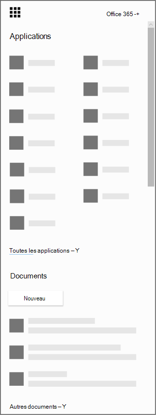

# Obtenir l’application Microsoft bookings pour iOS et Android

Nous vous remercions de télécharger l’application Microsoft bookings ! Microsoft bookings est disponible en tant qu’application mobile pour iOS et Android. L’application bookings for iOS est disponible dans toutes les régions et tous les pays pris en charge par Apple. Vous pouvez télécharger l’application à partir du [magasin d’applications iTunes](https://apps.apple.com/app/microsoft-bookings/id1065657468). L’application bookings pour Android peut être téléchargée à partir du [Google Play Store](https://play.google.com/store/apps/details?id=com.microsoft.exchange.bookings) aux États-Unis et au Canada.

Avant de commencer, vous devez configurer les réservations sur le Web.

1. Vous ne trouvez pas l'application que vous cherchez ? Dans le lanceur d’applications, sélectionnez toutes les applications pour afficher une liste alphabétique des applications Microsoft 365 disponibles. À partir de là, vous pouvez rechercher une application spécifique.

   

2. Vous accédez à [la page d’accueil Office](https://office.com) et, dans le lanceur d’applications, sélectionnez **bookings**.

3. Sélectionnez **obtenir maintenant**.

4. Indiquez le nom et le type d’entreprise que vous exécutez, comme coiffure ou pratique dentaire, puis sélectionnez **réservations**.

5. Vous êtes maintenant prêt à configurer les réservations de votre organisation. Suivez les étapes indiquées dans la rubrique [Microsoft bookings](bookings-overview.md) pour terminer la configuration des réservations. Revenez à votre appareil mobile et déconnectez-vous de l’application mobile. Reconnectez-vous pour accéder à votre nouveau calendrier de réservation.

## Mode affichage seul

Tout utilisateur ne disposant pas d’un accès en lecture/écriture dans les réservations peut toujours utiliser l’application mobile en mode affichage seul. Toute personne disposant d’une licence de livres qui est ajoutée à un calendrier de réservation peut voir ses propres plannings, ses détails de rendez-vous et ses informations professionnelles. Un utilisateur disposant d’un accès en lecture seule ne peut pas apporter de modification ou de modification et ne peut pas accéder à la liste des clients.
